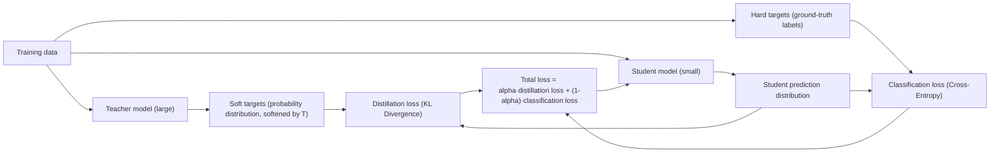
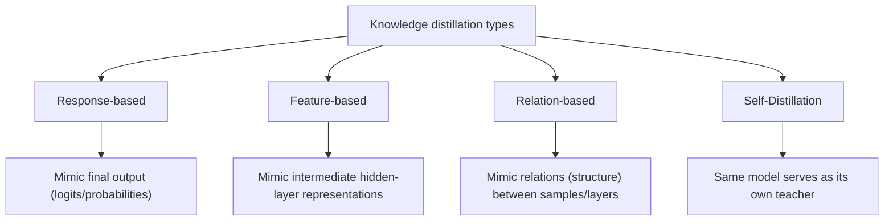

# Knowledge Distillation

## 1. Overview

> **Knowledge Distillation** is a **model compression** technique in which a large, high-performing teacher model transfers what it has learned to a relatively small, lightweight student model by having the student mimic the teacher, so that the student retains accuracy close to the original while drastically reducing the number of parameters, computation, and memory.

The performance of deep learning models has generally improved in proportion to their parameter scale. However, huge models with billions to hundreds of billions of parameters incur large inference latency, consume excessive GPU memory and power, and are difficult to deploy as-is on edge environments such as smartphones, IoT devices, and automotive ECUs. In practice, reducing parameters tenfold on the same task improves inference cost and response time several-fold, but simply training a small model from scratch causes accuracy to plummet due to insufficient representational power. Knowledge distillation emerged to resolve this dilemma. In other words, the core idea is not "training a small model well" but "having it inherit the judgment tendencies of an already well-trained large model."

The fundamental reason distillation is effective is that the teacher model's output contains far richer information than the mere correctness (0/1) of an answer. For example, when classifying the handwritten digit '7', the teacher model expresses inter-class similarity (dark knowledge, tacit knowledge) as a probability distribution, such as "probability of being 7 is 0.92, probability of being 1 is 0.05, probability of being 9 is 0.02." When the student model learns these **soft targets** together rather than just a single ground-truth label, it also learns the relational structure between classes, improving generalization performance. Since Hinton et al. proposed it in 2015, distillation has become a standard compression method for sLLMs (lightweight language models), on-device AI, and real-time inference services.

## 2. Basic Structure and Principles of Knowledge Distillation

Distillation training proceeds by combining two losses. The first is the **distillation loss**, which minimizes the difference between the teacher's soft targets and the student's output distribution using KL divergence (Kullback-Leibler Divergence). The second is the ordinary **classification loss**, which minimizes the cross-entropy between the actual answer (hard target) and the student's output. The final loss balances the two terms with the weight alpha, typically placing greater weight on the distillation loss to prioritize learning the teacher's judgment tendencies while correcting bias with the ground-truth signal.

The key hyperparameter in this process is the **Temperature (T)**. Dividing the softmax function by T softens the probability distribution, revealing the subtle probability differences among non-answer classes that were originally suppressed close to zero. When T=1 it equals ordinary softmax, and raising T to around 2-5 amplifies relative inter-class similarity information so the student absorbs richer knowledge. However, if T is too large the distribution becomes uniform and the signal actually weakens, so the optimal value must be searched using a validation set. During training, the same T is applied to both teacher and student, and at deployment (inference) it is reset to T=1.

For example, on an image classification benchmark, distilling the knowledge of a teacher (ResNet-50, about 25.6 million parameters) into a student (ResNet-18, about 11.7 million parameters) reportedly recovers accuracy by about 1-3%p compared to training the student alone, while more than doubling inference speed. A representative case in natural language processing is **DistilBERT**, distilled from BERT-base (about 110 million parameters), which reduced parameters by about 40% and accelerated inference by about 60% while retaining about 97% of the original performance.

## 3. Types of Distillation Methods

Distillation is divided into types according to 'what' of the teacher the student mimics. **Response-based distillation** is the most classical and simple approach, mimicking only the teacher's final output (logits/probabilities); since it does not require knowing the teacher's internal structure, it is easy to apply even between different architectures. However, because it only looks at the final output, it cannot exploit the information contained in the teacher's internal reasoning process.

**Feature-based distillation** guides the student to also resemble the teacher's intermediate hidden-layer representations (feature maps). Since the student absorbs the teacher's layer-by-layer representations step by step, more precise knowledge transfer is possible, but because the layer structures and dimensions of the teacher and student differ, an additional projection layer is needed to align them, and training becomes more complex. **Relation-based distillation** transfers 'relational knowledge', such as the relationships among data samples or the correlation structure between layers, rather than individual outputs, thereby preserving the geometric structure of the embedding space the teacher has learned.

Meanwhile, **Self-Distillation** is a variant in which the same model (or its deeper layers) learns by treating its shallower layers or its earlier-epoch self as the teacher, without a separate large teacher; it eliminates the cost of teacher training while boosting performance through a regularization effect. Recently, in large language models, **sequence-level distillation**, which turns the answers and reasoning processes generated by a strong model into data to train a small model, and **Chain-of-Thought distillation**, which even transfers the rationale, are actively used.

| Category | Transfer target | Advantages | Disadvantages / caveats |
|------|-----------|------|-------------|
| Response-based | Final output (logits/probabilities) | Simple to implement, easy to apply across heterogeneous structures | Does not use internal knowledge |
| Feature-based | Intermediate-layer representations | Precise knowledge transfer | Requires layer alignment/projection, complex |
| Relation-based | Relations between samples/layers | Preserves structural knowledge | Difficulty in designing relation definitions |
| Self-distillation | Itself | No teacher needed, regularization effect | Limited performance gains |

## 4. Comparison with Similar Compression Techniques

Knowledge distillation is one of several axes of model compression, and in practice it is used complementarily alongside **pruning and quantization**. The three techniques differ fundamentally in approach. Pruning removes weights and neurons with low contribution to make the model 'thinner', and quantization represents 32-bit floating-point numbers as 8-bit integers and the like to lower storage and computation precision. In contrast, distillation is different in character in that it 'teaches a small model better' to boost performance rather than changing the structure itself.

Because the three techniques target different points on the performance-efficiency trade-off, sequential combination is common in actual deployment pipelines. For example, one might obtain a small student from a large teacher via distillation, then prune that student to remove unnecessary connections, and finally quantize it to run on an integer-computation accelerator (NPU). This secures a level of compression ratio and inference speed difficult to reach with any single technique.

| Technique | Core principle | Impact on accuracy | Representative effect |
|------|-----------|-------------|-----------|
| Knowledge distillation | Small model mimics the knowledge of a large model | Recovered with low loss | Cases retaining 95-97% of original performance |
| Pruning | Removes unnecessary weights/neurons | Sharp drop if excessive | Reduces size/computation via sparsification |
| Quantization | Reduces representation bit-width (FP32→INT8) | Slight loss | Memory 4x↓, NPU acceleration |

## 5. Considerations and Implications

From a professional engineer's perspective, adopting knowledge distillation should be approached not as a mere algorithm choice but as a **comprehensive trade-off design of service cost, responsiveness, accuracy, and maintainability**.

- **Application strategy (managing the teacher-student gap):** If the capacity gap between the teacher and the student is too large, a 'capacity gap' problem arises in which the student cannot keep up with the teacher. In this case, a strategy of multi-stage distillation, placing intermediate-sized Teacher Assistant models in stages, is effective for easing the gap.

- **Quality trade-offs and a validation system:** Even if a distilled student model preserves average accuracy, its behavior on long-tail (rare) cases, bias, and hallucination characteristics may diverge from the teacher's. Therefore, before deployment, a separate regression validation system must be in place for vulnerable scenarios, fairness, and safety, not just representative metrics.

- **Data, licensing, and governance:** In particular for LLMs, using the outputs of commercial closed models as distillation data may be restricted by the service's terms of use, so prior review of data provenance and licensing is essential. Since the teacher model's bias can be transferred and even amplified in the student, management from a data governance perspective is required.

- **Outlook (spread of on-device and sLLM):** As demand for on-device AI and sLLMs grows, distillation is becoming a key conduit for bringing the capabilities of foundation models down to the edge. Going forward, integrated compression pipelines combined with pruning, quantization, and low-rank adaptation (LoRA), as well as distillation that even transfers reasoning ability (the thinking process), are expected to become standardized.

---

> **In one line**: Knowledge distillation is a representative model-compression technique that transfers the soft targets (tacit knowledge) of a large teacher model to a small student model via temperature scaling and KL loss, preserving accuracy as much as possible while reducing size, computation, and latency; combined with pruning and quantization, it becomes a key deployment strategy for the on-device and sLLM era.
