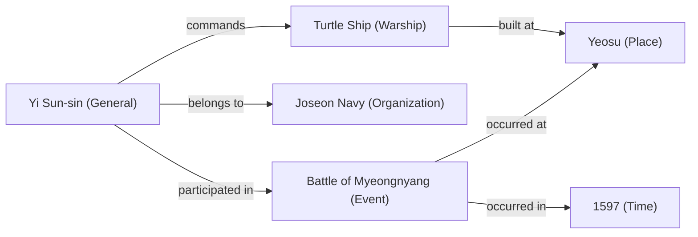
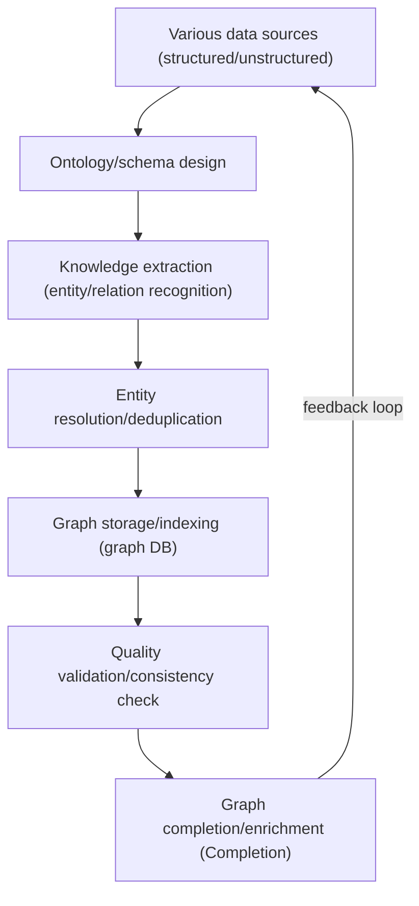
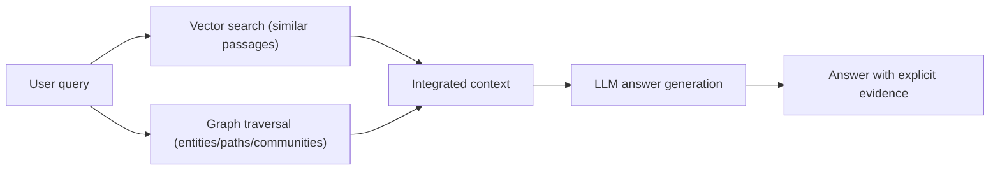

# Knowledge Graph

## 1. Overview

> A **Knowledge Graph** is a knowledge representation and storage system that organizes knowledge into a graph structure, representing real-world entities as nodes and the semantic relationships between entities as edges. It generally describes facts in units of **triples** in the form of `Subject–Predicate–Object`, and connecting these at scale creates a form that machines can reason over and query.

Relational databases store data in structured tables and are strong at retrieving exact values, but for **connection-centric** queries such as "in what relationship and how many hops apart are A and B connected," they require many joins and are inefficient; their schemas are rigid, making it difficult to flexibly accommodate new relationship types. In contrast, real-world knowledge takes the form of a web in which people, organizations, places, and events are intricately intertwined, and problems where "the relationship itself is the value," such as search, recommendation, question answering, and fraud detection, have increased. The knowledge graph emerged from the need for such a gap to be filled, that is, for a **knowledge base that treats Semantics and Connectivity as first-class citizens**.

The direct catalyst that drew attention to knowledge graphs was Google's "Knowledge Graph," introduced into search in 2012, which symbolized a shift toward search that "understands things" beyond string matching. Recently, as it has been revisited as the foundational knowledge source for **GraphRAG**, which suppresses the hallucinations of large language models (LLMs) and provides factual grounding, the knowledge graph is establishing itself as a key infrastructure connecting data integration, semantic search, and explainable AI.

## 2. Overall Structure and Components

A knowledge graph consists broadly of **entities (nodes)**, **relationships (edges)**, **properties**, and the **ontology/schema** they follow. An entity is an object that exists in the world, such as 'Yi Sun-sin' or 'Turtle Ship'; a relationship is a semantic connection linking entities, such as 'builds' or 'commands'. A property is additional information attached to an entity or relationship (birth/death years, location, etc.), and an ontology is a higher-level schema that defines the kinds of concepts and the rules of relationships, such as "a general is a person" or "a person can belong to an organization," serving as the basis for inference.

As in the figure above, a single fact is expressed as a triple (e.g., `Yi Sun-sin–commands–Turtle Ship`), and as triples accumulate, a **Multi-hop Path** forms between entities. This path-traversal capability is the intrinsic strength of the knowledge graph, allowing queries such as "Where did the event Yi Sun-sin participated in take place?" to be answered by graph traversal without join explosion.

### A. Entities, Relationships, and Identifiers

To handle entities reliably, it is important to uniquely refer to entities via **global unique identifiers (URI/IRI)**. If **Entity Resolution**, which merges namesakes or notational variants ('IBM' and 'International Business Machines') into a single entity, is inadequate, the same object splits into multiple nodes and the factuality of the graph collapses. Therefore, entity identification and normalization are the starting point of data quality in knowledge graph construction, and linking to a standard identifier system, such as Wikidata's Q-identifiers, greatly enhances interoperability with external knowledge.

### B. Ontology and Reasoning

An ontology imparts "rules of meaning" to a knowledge graph. For example, if there is a rule such as "a parent's parent is a grandparent" (relation composition) or a hierarchy (subClassOf) definition such as "every general is a person," even facts not explicitly stored can be derived through **logical reasoning**. This saves storage space and serves as a means to verify data consistency, and it is the key device that elevates mere data storage into "knowledge." Ontology representation spans a spectrum, from RDFS, which has low expressiveness but is lightweight, to OWL (Web Ontology Language), which supports complex constraints and reasoning.

## 3. Representation Models: RDF and Property Graph (LPG)

The data models that actually implement knowledge graphs divide broadly into two families. One is the **RDF (Resource Description Framework)** family, which follows W3C Semantic Web standards, and the other is the **Property Graph (LPG, Labeled Property Graph)** family, widely used in industry. The two models represent the same knowledge but differ in philosophy and strengths, so choosing according to the situation is important.

RDF reduces all facts to triples and identifies entities via global URIs, so it is strong at **data integration and standards-based interoperability**. It uses SPARQL as its query language and allows formal reasoning through OWL, making it suitable for domains where standards and consistency matter, such as academia, the public sector, and healthcare. On the other hand, it is somewhat cumbersome in representation because it is difficult to attach properties to relationships themselves (e.g., a 'duration' property on a 'works at' relationship).

The property graph (LPG) can freely assign key-value properties to both nodes and edges, so **modeling is intuitive and flexible**. Query languages such as Neo4j's Cypher can express path traversal concisely, so it is preferred in practical systems that actively apply graph algorithms, such as recommendation, fraud detection, and network analysis. However, because global identifiers and formal ontology standards are weak, it is difficult to achieve the same interoperability as RDF in integration across different organizations.

| Category | RDF (Triples) | Property Graph (LPG) |
|---|---|---|
| Basic unit | Subject–Predicate–Object triple | Nodes/edges with properties |
| Identification | Global URI/IRI | Internal node/edge IDs |
| Query language | SPARQL | Cypher, Gremlin, GQL |
| Reasoning/standards | Strong formal reasoning via OWL·RDFS | Weak standard reasoning, strong algorithms |
| Strength | Data integration/interoperability | Flexible modeling/path traversal |
| Representative cases | Wikidata, DBpedia | Neo4j, TigerGraph |

The difference between the two models stems from a difference in objectives: "Is open integration through standards compliance the priority, or are application performance and development productivity the priority?" Recently, ISO's graph query standard **GQL (established as an international standard in 2024)** and RDF-star, which allows relationship properties in RDF, have appeared, and the gap between the two camps is trending narrower.

## 4. Construction Process and Core Technologies

Knowledge graph construction is operated not as a one-time task but as a pipeline that continuously collects, refines, and expands knowledge. The typical process is a cycle of identifying data sources → designing the ontology → knowledge extraction → entity resolution/reconciliation → storage/indexing → quality validation/expansion.

In this pipeline, the technically most difficult stages are **knowledge extraction** and **entity resolution**. Triples must be extracted from unstructured text through named entity recognition (NER) and relation extraction (RE), but errors easily occur due to sentence ambiguity and diversity of expression. Recently, the approach of automatically extracting entities and relations from documents using LLMs has spread, greatly lowering construction costs, but it leaves the new challenge of verifying the factuality of the triples the LLM produces.

Also, since real knowledge graphs are inevitably incomplete (missing relationships exist), **knowledge graph embedding (TransE, RotatE, etc.)**, which learns the existing structure to predict missing links, and **link prediction/graph completion** techniques based on graph neural networks (GNNs) are used together. For example, learning the 'customer–purchase–product' pattern in an e-commerce graph allows inferring not-yet-connected customer-product preferences for use in recommendation.

## 5. Use Cases and GraphRAG (Advanced)

Knowledge graphs are already used across industries. Search engines use knowledge graphs to compose the information panel beside search results; e-commerce performs personalized recommendation with product-customer-behavior graphs; and the financial sector traces multi-hop money flows in account-transaction-ownership graphs to detect anomalous transactions and money laundering. In healthcare and pharma, gene-disease-drug relationship graphs are used to discover new drug candidates. Their common feature is that **"revealing hidden connections" is itself business value**.

The most notable advanced application is **GraphRAG**. Traditional RAG embeds documents as vectors and retrieves similar passages, but it is weak at multi-hop reasoning that requires synthesizing facts scattered across multiple documents. GraphRAG builds a knowledge graph from source documents and, along with the query, retrieves the neighbors, paths, and community summaries of the relevant entities and provides them to the LLM. This makes the source of the evidence explicit on the graph, improving **explainability** and **factuality**, and enabling responses to global queries that are difficult with vector search alone, such as "Who is the person appearing in common across multiple events?"

Thus, **hybrid knowledge retrieval**, in which a vector database handles "semantic similarity" and a knowledge graph handles "explicit relationships and facts," is the latest trend. However, since the cost of building and maintaining the graph and the graph's quality determine answer quality, adoption should be preceded by judgment that screens whether the target domain actually requires relationship-centric queries.

## 6. Considerations and Implications

First, **quality governance** is key. Since the value of a knowledge graph is proportional to its factuality and completeness, a data governance system encompassing entity resolution, deduplication, provenance management, and periodic validation must be designed together. When adopting LLM-based automatic extraction, a Human-in-the-loop procedure combining human review and confidence scoring is necessary.

Second, the **trade-offs of model/platform choice** must be made clear. If standards-based open integration and formal reasoning matter, choose RDF/OWL; if application performance, development productivity, and graph algorithms matter, choose the property graph—while keeping an eye on converging standards such as GQL and RDF-star and guarding against lock-in. At ultra-large scale, graph partitioning and distributed-processing performance are also included in the selection criteria.

Third, a strategy of **complementary integration with LLMs** is effective. LLMs provide flexible natural-language understanding and generation, while knowledge graphs provide verifiable facts and relationships; designing a virtuous cycle in which the knowledge graph suppresses the LLM's hallucinations and the LLM in turn expands the knowledge graph can achieve reliability and scalability simultaneously.

Fourth, an **incremental adoption and ROI perspective** is needed. Attempting to build an enterprise-wide knowledge graph all at once carries a high risk of failure in terms of cost and time. It is preferable to start narrowly in a specific domain with clear relationship-centric queries (fraud detection, recommendation, etc.), verify value, and then expand; and clarifying the maintenance organization and ontology-management responsibility through operational governance is the key to success.

## References

- Google, "Introducing the Knowledge Graph: things, not strings" — https://blog.google/products/search/introducing-knowledge-graph-things-not/
- W3C RDF 1.1 Primer — https://www.w3.org/TR/rdf11-primer/
- Microsoft Research, "GraphRAG" — https://microsoft.github.io/graphrag/
- ISO/IEC 39075:2024 GQL (Graph Query Language) — https://www.iso.org/standard/76120.html

---
> **In one line**: A knowledge graph is a knowledge base that represents entities and relationships as triples/graphs to treat meaning and connectivity as first-class; centered on RDF and property-graph models, ontology reasoning, and graph embedding, it is used for search, recommendation, and fraud detection, and has recently re-emerged as an explainable knowledge source that suppresses LLM hallucinations via GraphRAG.
