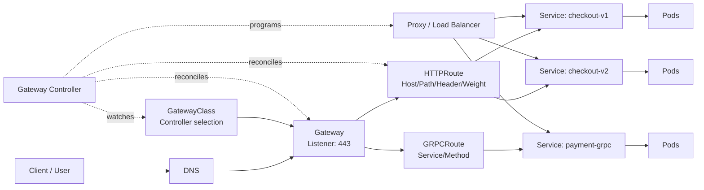
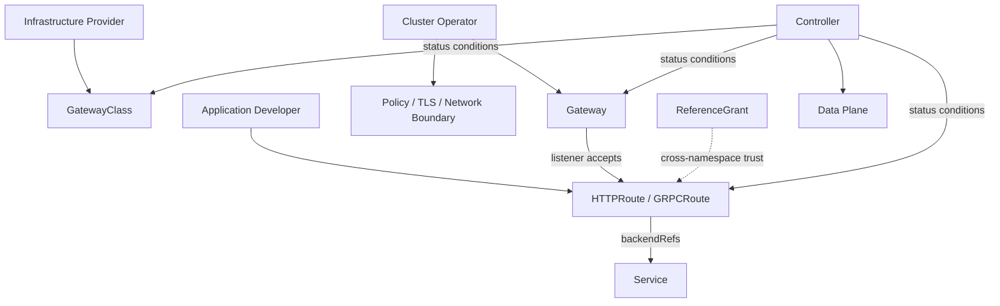

# Cloud-Native Traffic Management with the Kubernetes Gateway API

## 1. Overview

> **Definition**: The Kubernetes Gateway API is an extensible, protocol-aware service-networking API that connects traffic from outside or inside the cluster via declarative Gateway and Route resources, and separates the responsibilities of infrastructure providers, cluster operators, and application developers.

Kubernetes' early standard for external traffic was Ingress. Ingress provided a simple HTTP entry model that maps hosts and paths to Services, but the moment it relied on implementation-specific annotations, portability and operational consistency dropped. To express traffic splitting, header-based routing, multiple protocols, and per-organization permission separation, one had to learn each Ingress Controller's proprietary configuration.

The Gateway API does not solve this problem simply as "an Ingress with more fields." By separating the objects that create or select infrastructure from the objects that write application traffic rules, it lets the organization's actual operational boundaries be reflected in the Kubernetes resource model. Thus, collaboration becomes possible in which the platform team manages the GatewayClass and Gateway while the service team manages the HTTPRoute or GRPCRoute.

The Gateway API itself is not a data-plane proxy. Nor is it a single load balancer built into Kubernetes; a controller that implements the Gateway API reads the resources and translates them into the actual configuration of Envoy, NGINX, cloud load balancers, hardware appliances, and so on. Missing this distinction leads to the misconception that the mere fact that YAML was applied guarantees traffic handling.

As of September 25, 2026, the official documentation describes GatewayClass, Gateway, HTTPRoute, and GRPCRoute as stable API kinds, and the official project release page shows v1.6.2 as the latest release. In actual adoption, the Gateway API version supported by the controller and the support level of each field must be verified separately.

### 1.1 Background and Necessity

First, the platform and the application change on different cycles. Platform personnel must stably operate the foundation, such as public external IPs, TLS certificates, firewalls, and L4/L7 proxies. Application personnel, on the other hand, make frequent changes such as sending only 10% of `/checkout` to a new version or routing only requests with a specific header to an experimental service. If the two concerns are mixed in a single Ingress object, permissions are over-granted or change conflicts arise.

Second, as microservices proliferated, traffic other than HTTP also became important. gRPC performs inter-service communication based on HTTP/2, and TLS passthrough or TCP-based appliance integration is difficult to express with simple HTTP path rules alone. The Gateway API takes the direction of maintaining common resource relationships while extending per-protocol Routes.

Third, declarative operation becomes more effective when it separates "what you want" from "how it is implemented." An HTTPRoute declares which Service `/v1` requests go to, but the controller translates the same intent to match the data plane's implementation. Portability does not mean that all implementation details are the same, but that the common intent expressible in the standard can move between implementations.

### 1.2 Core Perspective for an Exam Answer

In a professional engineer's answer, it is more important to explain the flow of "responsibility separation → trust boundary → controller reconciliation → data-plane reflection → state observation" than to list resource names. In particular, one must distinguish that the Gateway API's `spec` is the desired state, while the conditions in `status` and controller events indicate the actual converged state.

Also, describing the Gateway API as immediately deprecating Ingress is inaccurate. The Kubernetes official documentation explains that the Ingress API remains stable with no plan for removal, but the API is frozen and the Gateway API is recommended for new feature development. Therefore, the realistic strategy is to preserve the existing Ingress while applying the Gateway API starting from new services, and to transition gradually after confirming functional, performance, and operational metrics.

## 2. Conceptual Diagram and Overall Architecture

In the structure above, `GatewayClass` represents the kind of Gateway provided by a specific implementation controller. For example, separating a class for the public internet from a class for a private network in the same cluster can prevent application teams from arbitrarily creating a public load balancer. The key point is that `GatewayClass` is not itself a running instance but a basis for common policies and controller selection.

`Gateway` is the logical entry point that will actually receive traffic. It declares, per listener, the address, port, protocol, certificate references, and the scope of Routes it accepts. Since it could be a single cloud load balancer or a proxy instance inside the cluster, one should not fix "one Gateway object = one proxy of a specific product."

`HTTPRoute` expresses the HTTP rules going from a Gateway listener to a Service. Because it represents conditions such as host, path, header matching, and backend weights as resource fields, it is easier to validate and review than implementation-specific annotations. However, since a specific controller does not support every optional field to the same degree, one must check both conformance and the implementation's documentation.

`GRPCRoute` models intent at the granularity of gRPC services and methods. Since gRPC uses HTTP/2 streams, status codes, and long-lived connections, merely copying simple HTTP proxy settings is insufficient. One must verify whether the Gateway implementation actually supports HTTP/2 and gRPC-related features, and whether timeout and retry policies do not break stream semantics.

### 2.1 Resource Relationships and Responsibility Boundaries

The Gateway API's role-oriented model should be designed together with RBAC. The infrastructure provider defines GatewayClasses to be used by multiple tenants, and the cluster operator manages the Gateway's addresses, listeners, certificates, and acceptance policies. Application developers can be restricted to changing only the Routes in the namespaces they are responsible for.

This separation is not automatically safe. Giving developers permission to even modify the Gateway erases the advantage of the role model, while requiring the operator to hold permission over all Routes slows down deployment. In accordance with the organization's change-approval system, one must granularize per-resource `get`, `list`, `watch`, `create`, and `update` permissions, and align GitOps repository directory ownership with Kubernetes RBAC.

When a Route references a Service in another namespace or attaches to a Gateway in another namespace, the trust boundary must be made explicit. Set the default to the same namespace, and where necessary use explicit allowances such as `allowedRoutes` and `ReferenceGrant`. Leaving cross-namespace open as a convenient default increases the risk that one team hijacks another team's traffic path or connects to a sensitive backend.

### 2.2 Control Plane and Data Plane

The controller watches Gateway API objects, computes dependencies, and then reconciles the data-plane configuration. Since this process is asynchronous, even if `kubectl apply` succeeds, it does not mean that DNS propagation, certificate provisioning, load-balancer provisioning, and proxy reconfiguration have finished. The operator must check the resource's `status.parents`, `Accepted`, `Programmed`, and `ResolvedRefs` conditions together with the controller logs.

The data plane processes the actual packets. Implementations vary: L4 load balancers, L7 reverse proxies, service mesh sidecars, kernel-based forwarding layers, and so on. Since even the same HTTPRoute can have different latency and failure characteristics depending on the data plane's TLS-termination point, connection reuse, buffering, and retry method, performance testing must always be conducted against the actual implementation.

The controller has a reconciliation loop that reduces the difference between the declared state and the observed state. When a Route is deleted, the proxy's stale path must be removed, and when the backend Service's EndpointSlice changes, the target endpoints must be updated as well. On failure, to be able to trace the difference between the last successfully reflected configuration and the current desired state, events, configuration versions, the change author, and the Git commit must be linked.

## 3. Key Resources and the Traffic-Handling Process

### 3.1 GatewayClass

`GatewayClass` is the class that selects the controller that will manage a Gateway. Like StorageClass, it abstracts the kinds of implementation the platform provides, but the actual supported features, cost, network location, and TLS-handling method differ per controller. Do not assume that features are identical just from the name; record the implementation's conformance results and operational constraints in a service catalog.

The `parametersRef` of a GatewayClass can be used as an extension point that connects implementation-specific additional settings. If all teams are allowed to specify arbitrary parameters here, platform policy can be bypassed, so the allowed kinds of parameters and the range of their values must be restricted by policy. The platform team should document standard fields and implementation extensions separately.

### 3.2 Gateway and Listener

A `Gateway` declares receiving conditions with one or more listeners. A listener combines port and protocol, hostname, certificate references, and Route-acceptance rules. When operating multiple hosts on the same port, verify that the hostname and certificate selection match, and compare security and performance requirements together in deciding whether to terminate TLS at the Gateway or pass it through to the backend.

The Gateway address may be reported in `status.addresses` as an external IP or DNS name provisioned by the controller. A DNS record should be connected after confirming this address's readiness, and cloud load-balancer cost, IP exhaustion, and reserved-address policy should also be included in the design. Splitting internal-only Gateways and externally public Gateways into separate classes can reduce the blast radius of incidents.

### 3.3 HTTPRoute

An `HTTPRoute` points to a parent Gateway via `parentRefs` and declares routing intent via `hostnames` and `rules`. A single rule combines matching conditions such as path, headers, and query with backend references, filters, and weights. As match priority grows more complex, overlaps between rules must be tested, and the expectation that "a more specific path applies first" must be confirmed with the implementation's official behavior and test results.

Traffic splitting is useful for canary deployments. For example, giving the v1 Service a weight of 90 and the v2 Service a weight of 10 sends some traffic to the new version. However, the weight is a logical ratio by request count, not an automatic guarantee of per-user session affinity or per-amount distribution. Requests where retries and state consistency matter, such as payments, require separate design of user-identifier-based consistency, application-level duplicate handling, and observability metrics.

Filters provide behaviors supported by the implementation, such as request/response header modification, redirects, URL rewriting, and request mirroring. Since the order and interaction of filters may differ per protocol and proxy, one must test whether authentication headers are removed before forwarding to the backend, and in what order the original host and forwarded host are changed.

### 3.4 GRPCRoute and Extension Routes

`GRPCRoute` provides matching at the granularity of services and methods, allowing policies to be written to fit the boundaries of a gRPC API. However, streaming RPCs have different lifetime and retry semantics from ordinary short HTTP requests. Automatically retrying when a connection drops can duplicate server-side side effects, so idempotency, deadlines, and client reconnection policy must be examined together.

Resources handling additional protocols, such as TCPRoute, TLSRoute, and UDPRoute, may have different maturity per channel and version. Resources not included in the stable channel, however feature-rich, may still have API changes, so before production adoption one must check whether the experimental channel is installed and the upgrade/rollback path. Also beware of CRD version conflicts when mixing the standard channel and the experimental channel in the same cluster.

### 3.5 Route Attachment and the Trust Model

A Route specifies a Gateway or listener via `parentRefs`, and the Gateway listener judges which kinds and namespace scopes of Routes it will accept. This two-way condition is a safeguard that reduces the problem of an application attaching a Route to an arbitrary public Gateway. Do not consider a Route reflected in the data plane merely because it exists; check the `Accepted` and `Programmed` states.

Same-namespace attachment is simple to operate, but when multiple service namespaces share a Gateway in a common platform namespace, cross-namespace attachment becomes necessary. In this case, allowed-namespace labels, ReferenceGrant approval, service-account permissions, and change review must be used together. Combining labels and policies that represent team, environment, and data classification is safer than trusting the namespace name alone.

## 4. Operational Architecture and Security Design

### 4.1 TLS and Certificates

Performing external TLS termination at the Gateway makes it easy to apply centralized certificate management and common security policies. Conversely, if end-to-end encryption to the backend is needed, one can choose TLS passthrough or re-encryption from the Gateway to the backend. The two approaches differ in visibility, certificate-management point, encryption overhead, and how the application receives original client information.

Since certificate references can cross namespace boundaries, reference permission must be made explicit. Monitor certificate expiration dates, and verify that a listener does not lose its `Programmed` state during renewal. TLS 1.2 or higher, allowed cipher suites, SNI-hostname matching, and emergency-replacement procedures for revocation/leakage must be defined as operational standards.

### 4.2 Authentication/Authorization and Policy Enforcement

The Gateway API models traffic paths and resource relationships but does not standardize all of user authentication, authorization, and fine-grained API policy. Place JWT validation, OAuth2 integration, WAF, rate limiting, mTLS, and request-size limits in the appropriate layer among controllers, policy extensions, service mesh, or external security appliances. If standard Routes and implementation extensions are not distinguished within a single document, security controls may disappear when moving to a different controller.

Set policy defaults close to deny. Explicitly specify the hosts and paths to expose, allowed methods, backend ports, CORS origins, and maximum request size, and terminate unspecified requests with the intended status such as 404, 403, or 429. In particular, when placing administrative paths on the same Gateway, first consider separating the management plane with a dedicated listener, a dedicated Gateway, or network policies.

### 4.3 Observability and Incident Response

The minimum observed items are request volume, success rate, 4xx/5xx ratio, p50/p95/p99 latency, TLS handshake errors, active connections, and backend Endpoint status. In weight-based canaries, one must look at the per-version request ratio together with errors and latency; looking only at the overall average can miss a failure in low-volume traffic.

In distributed tracing, connect the trace context generated and propagated at the Gateway and the original request ID to the service logs. In logs, record the host, path template, Route name, Gateway name, backend Service, response code, and policy-decision result, but mask tokens, personal data, and sensitive query values. Time synchronization between controller logs and data-plane logs is also essential for root-cause analysis of incidents.

Before a change, run `kubectl diff`, static schema validation, conformance tests, policy tests, and synthetic traffic in sequence. After a change, check the Route's `status`, the actual proxy configuration, and DNS/certificate/backend connectivity. Since a rollback may not be sufficient by merely reverting a Git commit, verify in advance the compatibility of the previous CRD, controller, and data-plane versions.

## 5. Comparative Analysis

### 5.1 Ingress and the Gateway API

Ingress is still valid for simple HTTP/HTTPS external exposure. It is a stable API with a broad existing controller ecosystem, and small services can operate it with few resources. However, when advanced features are extended via annotations, the annotation names and meanings differ per controller, degrading configuration portability and policy verifiability.

The Gateway API takes the direction of providing role separation, multiple protocols, structured Routes, status reporting, and extension points as standard resources. In return, there are more resources and one must manage controller installation, CRD lifecycle, and per-implementation feature differences. Therefore, rather than converting all Ingresses at once, transitioning starting from services that need complex routing or organizational boundaries is more cost-effective.

| Category | Ingress | Gateway API |
|---|---|---|
| Primary target | Simple HTTP/HTTPS external exposure | Role-based service networking and advanced traffic management |
| Configuration method | Ingress rules + implementation annotations | GatewayClass, Gateway, Route hierarchy |
| Responsibility separation | Easily mixed in a single object | Separates infra/operations/application roles |
| Protocols | Mainly HTTP/HTTPS | HTTP, gRPC, and per-implementation/channel extensions |
| Traffic split/header matching | Depends on per-controller extensions | Provides a scope expressible with standard fields |
| Migration difficulty | Low in existing environments | Requires CRD/controller/permission/test systems |
| Current strategy | Kept stable, API frozen | Recommended for new advanced features and new designs |

### 5.2 API Gateway and Service Mesh

An API Gateway is strong at controlling north-south traffic between external consumers and the cluster or service boundary. It makes it easy to manage public DNS, TLS, WAF, consumer authentication, and quotas at one boundary. The Gateway API is a standardized Kubernetes resource model that declares this boundary; it is not a product that automatically provides API product management, developer portals, or billing features.

A Service Mesh focuses on east-west traffic between services, service identity, internal mTLS, retries, circuit breaking, and fine-grained observability. Using the Gateway API together with a mesh lets you set the boundary so the Gateway handles external entry and the mesh handles internal service calls. However, if retries, timeouts, and rate limits are configured redundantly on both sides, request storms and latency can be amplified, so a single owner of the policy must be designated.

| Comparison axis | Gateway-API-based entry layer | Service Mesh |
|---|---|---|
| Primary direction | External→cluster/service north-south | Service↔service east-west |
| Core objects | GatewayClass, Gateway, Route | Service identity, proxy, policy |
| Representative concerns | DNS, TLS, host/path/protocol | mTLS, service discovery, retries/circuit breaking |
| Operational risk | Public path/certificate/external attack surface | Proxy overhead/policy explosion/loops |
| Coupling mode | External entry and common routing | Internal communication and workload trust |

## 6. Application Cases

### 6.1 E-commerce Canary Deployment

Assume an e-commerce platform operates `checkout-v1` and `checkout-v2` simultaneously. The platform team creates a Gateway with port 443 and a public certificate, and the application team sets the HTTPRoute weights to 95:5. If, in the 5% traffic, the error rate and p99 latency exceed the criteria, they revert only the Route to the previous weights, mitigating the issue without re-provisioning the entire data plane.

However, if payment requests are split by a simple random ratio, the same user's inquiry and payment requests may go to different versions. The cart and the payment session must share the application's session store, and retryable and non-retryable requests must be distinguished. Also, per-canary-version payment success rate, duplicate approvals, and refund ratio must be tracked as separate metrics.

### 6.2 Multi-tenant Platform

Suppose that in a shared Kubernetes cluster, Team A and Team B each use their own namespace. The platform team provides an internal-only GatewayClass, and the operations team allows only the Routes of the `team-a` and `team-b` namespaces on a specific listener. Each team can change the HTTPRoutes it owns, but cannot change the Gateway's external address, TLS policy, or allowed namespaces.

This structure reduces resource permissions but does not automatically guarantee data boundaries. The sensitivity of the Service that a Route connects to, network policies, backend authentication, and log access permissions must be set separately. Adding hostname-ownership verification and an approval workflow so that tenants do not competitively claim the same hostname is also necessary.

### 6.3 gRPC Internal-External Integration

When a mobile backend receives gRPC requests at an external Gateway and forwards them to an internal `payment-grpc` Service, the GRPCRoute can divide paths by service and method. When `Login` and `Authorize` have different timeouts, maximum message sizes, and authentication requirements, per-method policies are useful.

On the other hand, long-lived streaming RPCs keep connections open longer than ordinary HTTP requests, so the load balancer idle timeout and connection draining on deployment must be managed together. Since forcibly terminating existing streams when switching to a new version degrades user experience, graceful shutdown, client reconnection, and the server's handling of duplicate events must be verified.

## 7. Advanced: Adoption/Transition Strategy and Expected Exam Points

Adopting the Gateway API is not a YAML-replacement project but a transition of the platform operating model. First, classify current Ingress annotations into standard features, controller extensions, and application logic. Decide whether non-standardizable features should be placed as Gateway API policy extensions or moved to a service or a separate security layer, then estimate the migration cost.

In the second stage, install the same GatewayClass and controller on development and staging clusters, and configure representative paths in parallel on both Ingress and the Gateway API. Compare request ratios, response headers, the TLS chain, source IP, timeouts, redirects, and WebSocket/gRPC behavior. Merely checking whether HTTP 200 is returned fails to reveal differences in proxy semantics.

In the third stage, apply the Gateway API first to new services and services with high change frequency. Clarify the owners of the common Gateway and the per-team Routes, and put GitOps approval, policy checks, and conformance tests into the deployment pipeline. Do not delete existing Ingress immediately; transition per service while maintaining DNS and rollback procedures.

In an expected answer, it is good to connect "the GatewayClass–Gateway–Route hierarchy," "role-oriented design and cross-namespace trust," "standard fields and portability compared to Ingress," "control-plane/data-plane separation," and "status-condition-based operation" into a single chain of cause and effect. At the end, one should present implementation dependency, the changeability of the experimental channel, performance/security verification, and incremental transition as trade-offs.

## 8. Considerations and Implications

1. **The boundary between the standard and the implementation must be managed.** Even with the Gateway API's standard resources, the support scope of actual TLS, WAF, rate limiting, redirects, and observability features differs per controller. Manage standard fields and implementation extensions as separate lists, and for services where portability matters, use only features whose conformance has been confirmed.

2. **Permissions and network boundaries must be designed together.** The permission to create a Route is equivalent to the permission to change traffic. Apply RBAC, `allowedRoutes`, `ReferenceGrant`, hostname ownership, NetworkPolicy, and backend authentication together to separate "connectable" from "data-accessible."

3. **Change safety must be verified with status and metrics.** `Accepted` indicates that attachment was allowed, and `Programmed` indicates that the implementation reflected it; these are operational clues, not final evidence of application health. Check the actual success rate, latency, backend errors, and per-version traffic, and establish automatic rollback criteria.

4. **Performance must be measured including the proxy layer.** TLS termination/re-encryption, HTTP/2 and gRPC streams, header manipulation, observability collection, and multi-hop proxies can increase CPU, memory, and latency. Load-test the target RPS and p99 latency, connection count, and drain time on failure against the actual data plane.

5. **The CRD and controller lifecycle must be managed like a product.** Since experimental-channel resources may change or be removed in the future, set separate production-adoption criteria and upgrade windows. Include CRD backup, controller rollback, existing Ingress fallback, and cloud load-balancer cost/address-reclamation procedures in the operations runbook.

6. **Policy duplication must be avoided.** If retries and timeouts are put into the Gateway, Service Mesh, WAF, and application each, a single failure can be amplified multiple times. Determine the owning layer of a request, and document external authentication, common routing, internal trust, and business permissions as distinct responsibilities.

7. **Platform standards should be strategically catalogued as a service.** Rather than letting each team interpret the Gateway on its own, providing a common class, recommended Route templates, security defaults, an observability dashboard, and an exception-approval procedure secures both development autonomy and controllability. The Gateway API is the foundation for expressing that standard as code, but it does not substitute for the organization's operational governance.

## References

- Kubernetes official Gateway documentation: https://kubernetes.io/docs/concepts/services-networking/gateway/
- Kubernetes official Ingress documentation: https://kubernetes.io/docs/concepts/services-networking/ingress/
- Gateway API official API overview: https://gateway-api.sigs.k8s.io/concepts/api-overview/
- Gateway API official security model: https://gateway-api.sigs.k8s.io/concepts/security-model/
- Gateway API official guides and installation channels: https://gateway-api.sigs.k8s.io/guides/
- Gateway API official releases: https://github.com/kubernetes-sigs/gateway-api/releases

---

> **In one line**: The Kubernetes Gateway API is a cloud-native service-networking API that separates infrastructure and application responsibilities via GatewayClass, Gateway, and Route, and enables standardized multi-protocol traffic management and status-based operation.
