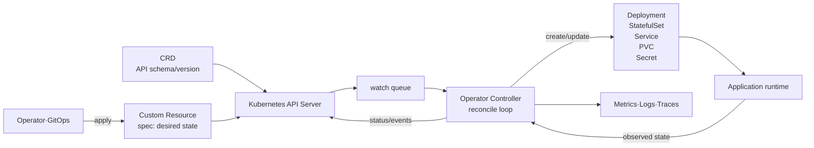
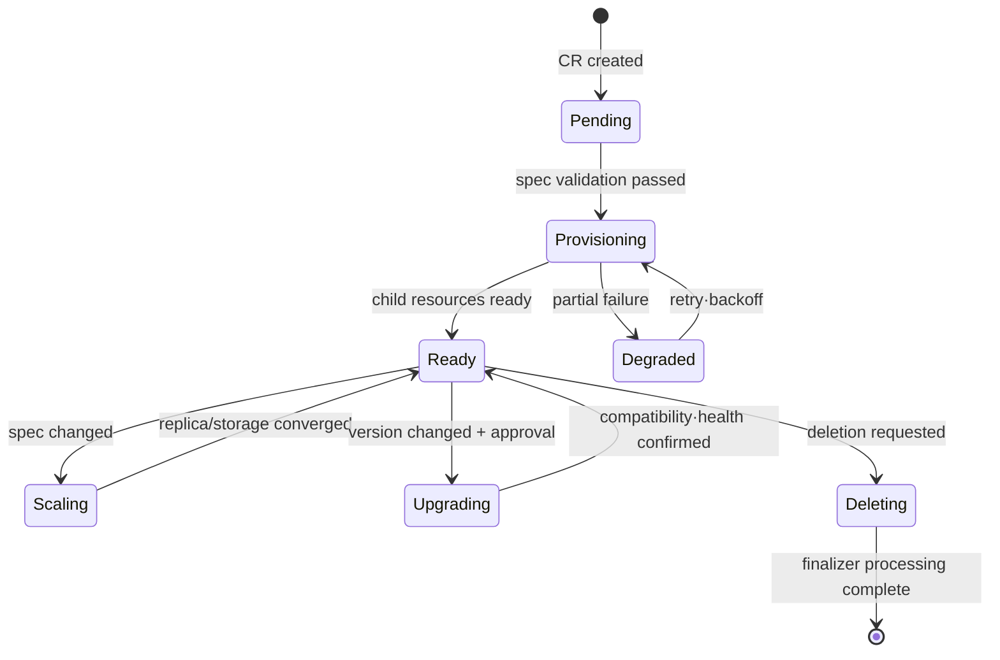

# Kubernetes Operator Pattern

## 1. Overview

> **Definition**: A Kubernetes Operator is extension software that codifies the application install, configure, scale, recover, upgrade, and backup knowledge previously performed by human operators into Custom Resources and a controller's reconciliation loop, and provides it through the declarative management model of the Kubernetes API.

Even with Kubernetes' built-in resources alone, stateless applications such as Pod, Service, and Deployment can be deployed declaratively.
However, systems with complex state and operational procedures, such as databases, message brokers, and distributed caches, are not safely operated merely by matching the number of Pods.
This is because domain knowledge is needed, spanning initialization order, leader election, replica synchronization, failover, schema changes, backup verification, and version compatibility.

Traditionally, such knowledge remained in operators' documents and manual commands.
Document-based operation depends on skilled personnel, execution order wavers during nighttime incidents or repeated deployments, and it is difficult to apply the same procedure consistently across multiple clusters.
An operator turns this knowledge into an API object's desired state and the controller's automatic actions, separating 'what you want' from 'how it is achieved'.

The core of an operator is that it differs from a Helm chart that packages a specific product onto Kubernetes.
A chart mainly generates manifests from templates and injects values at install time.
An operator, on the other hand, continues to watch API resources even after install, computes the difference between the current state and the desired state, creates or changes the necessary child resources, and records the result in status.
Thus, an operator is deployment automation and simultaneously continuous operations automation.

In a professional engineer's answer, rather than listing CRD, Custom Resource, and Controller, one must explain that declarative API, event-driven watching, idempotent reconciliation, state observability, and least privilege connect into a single operational system.
One must also evaluate that an operator is not an all-purpose automation but an extension that adds complexity and a failure surface, to produce a balanced answer.

### A. Background and Necessity

First, the operational difficulty of stateful applications has increased.
Containers are strong at packaging processes, but they do not automatically guarantee data durability, replication, consistency, or recovery point.
For example, a PostgreSQL cluster must manage the roles of the primary and standby instances, WAL retention, failover, connection endpoints, and backup policy together.

Second, as the number of clusters and tenants grows, the variance of manual work increases.
If there are three each of development, verification, and production clusters and five teams, the same application operating procedure is replicated across up to 15 environments.
An operator reduces configuration variance by leaving only per-environment policy as variables and reusing common reconciliation logic even when applying the same CR.

Third, GitOps and declarative infrastructure operation have spread.
Git stores YAML expressing the desired state, and a synchronization tool applies it to the cluster.
When an operator models even the application's domain state as API objects, GitOps' management scope expands from the Deployment level to the level of backup, recovery, and upgrade policy.

### B. Core Objectives

The goal of an operator is not to fully exclude humans.
It is to automate repetitive tasks with clear decision rules, and to leave decisions that humans must be accountable for, such as data-loss risk or business approval, as policies and approval procedures.
Clearly dividing the automation scope can reduce the risk of an operator performing unexpectedly destructive actions during a failure.

An operator has the following five objectives.
First, the user must be able to declare the desired state in the CR's spec.
Second, the controller must run a reconciliation loop that observes the current state and reduces the difference.
Third, it must explain the reconciliation result and the cause of failure via status and events.
Fourth, it must have idempotency such that processing the same input multiple times yields a stable result.
Fifth, it must make explicit the upgrade/deletion/recovery boundaries and limit permissions and resources.

## 2. The Overall Structure of an Operator

An operator is the combination of a Custom Resource stored in the Kubernetes API and a Custom Controller that processes it.
A CRD (CustomResourceDefinition) defines the group, version, Kind, schema, and scope of a new resource kind, and a Custom Resource (CR) holds the actual desired state according to that definition.
The controller receives watch events from the API server or periodically reads the state to reconcile child resources.

The user declares only a high-level resource such as `PostgresCluster`.
The controller translates that declaration into child resources such as StatefulSet, Service, ConfigMap, Secret, PodDisruptionBudget, and backup jobs.
At this point, attaching an owner reference that marks the operator as the entity directly managing the child resources allows control of the dependency relationship and garbage collection when the parent CR is deleted.

The API server serves as the operator's single source of truth.
The controller must not trust only local memory but re-read the current state from the API server.
This is because even if the controller restarts, reconciliation must continue as long as the spec and child resources remain.
This property is the premise for horizontal scaling and failure recovery, but it also requires a design that considers API-server load and watch reconnection.

### A. The Difference Between a Declarative Model and Imperative Scripts

An imperative script dictates the execution order, such as 'change the Deployment to 3 replicas now, then run the migration command next'.
A declarative model, on the other hand, expresses the goal, saying 'this database cluster must have 3 replicas and a specific backup retention period'.
The reconciler chooses the next safe action from the current state toward the goal state, regardless of what stage has already been executed.

Because of this difference, in reconciliation, repeatable stability is more important than a single successful execution.
Even if a request result is not received due to a network timeout and the same request is sent again, no duplicate resources or duplicate backups should be created.
Making resource names deterministic, checking existence before creation, and patching only the desired fields on updates are common approaches.

| Category | Imperative operations script | Operator's declarative operation |
|---|---|---|
| Expression | Execution commands and order | Desired state and policy |
| Execution timing | Centered on one-time deployment/task | Events and periodic re-reconciliation |
| Failure recovery | Requires interruption point and manual re-run | Re-observe current state, then resume |
| Location of knowledge | Documents and operator experience | Controller code and CR schema |
| Change control | Script execution permission | API·RBAC·GitOps policy |
| Risk | Unclear intermediate state | Automatic repetition of faulty reconciliation logic |

The fact that an operator is declarative does not mean that all steps are order-independent.
A database version upgrade has a sequential procedure such as backup verification, switching to read-only, upgrading replicas, and primary-instance failover.
In this case, place `upgradePolicy` and approval conditions in the spec, record the stage and observation results in status, and implement it as an explicit state machine inside the reconciliation loop.

### B. Custom Resource Design

The CR's `spec` holds the goals the user requires and the selectable policies.
The `status` holds the actual state observed by the controller, conditions, the readiness of child resources, and the last error.
If the input the user manages and the output the controller computes are mixed, problems arise where GitOps reverts the status or the user arbitrarily overwrites observation results, so the two areas are separated.

A good CR schema uses domain terms but does not overly expose internal implementation details.
For example, let the user declare `replicas`, `storage`, `backup.retentionDays`, and `version`, while the controller determines the internal StatefulSet name or the list of sidecar containers.
Only in this way can the CR contract be maintained even if the implementation is changed.

The schema specifies types, requiredness, defaults, allowed ranges, descriptions, and version-conversion rules.
Policies such as whether to allow 0 for the replica count, whether the retention period can be set to 0 days, and whether to forbid storage shrinkage must exist simultaneously in the documentation and the code.
A structural schema and server-side validation reject invalid input early, but conditions that can only be judged at runtime, such as the database's actual capacity or the state of an external backup store, remain for controller validation.

Conditions are managed as a machine-readable structure of `type`, `status`, `reason`, `message`, and `lastTransitionTime` rather than a simple string message.
Distinguishing `Ready=False` from `Degraded=True` allows dashboards and alerts to express meaningful states.
Whether to retry or whether user correction is needed by distinguishing transient errors from permanent configuration errors must also be surfaced in status.

### C. Controller and Reconciliation

The controller enqueues events for specific resources, dequeues a key, reads the latest state of that object, and then reconciles.
The reason for re-reading the latest object rather than executing a stale event payload as-is is that multiple changes can be merged in a short time.
The reconcile function compares the desired state with the observed state, performs the minimum necessary changes, and returns the time for the next reconciliation.

The reconciliation logic usually follows this order.
First, check whether the target CR is being deleted.
Second, if it is being deleted, perform the backup/external-resource cleanup procedures required by the finalizer.
Third, if it is a normal object, validate the input and compute defaults.
Fourth, check the existence/difference of child resources by owner reference and deterministic name.
Fifth, perform create/patch/delete and observe the application's readiness.
Sixth, update status conditions and events, and determine the next reconciliation time.

Idempotency is not 'doing nothing' but the property that, if the same goal has already been reached, it returns success without additional side effects.
If a child Deployment exists but only the image differs, adjust only that field rather than deleting the whole thing and recreating it, to preserve availability.
When requesting a backup from an external API, use a request idempotency key, a job identifier, and completion-status polling so that network retries do not create duplicate work.

Retries must use exponential backoff and a maximum delay.
If every operator immediately and infinitely retries when the API server transiently fails, the failure is amplified.
Conversely, if errors that the user must fix, such as an expired certificate or a wrong version, are continuously retried, only logs and API load increase.
Set error classification, retry limits, rate limits, and queue depth as operational criteria.

## 3. Operator Implementation Elements and Development Process

An operator can be implemented with Go-based controller-runtime/Kubebuilder, Python-based Kopf, and so on.
More important than the language is making explicit the Kubernetes API's cache consistency, event duplication, leader election, RBAC, version compatibility, and test strategy.
A framework assists with watch, retry, and scheme registration, but it does not automatically guarantee the safety of domain state transitions.

### A. Development Process

1. Interview the tasks and decision rules operators repeat, and define the scope to automate.
2. Document the domain API the user will declare, its consumers, and the supported lifecycle.
3. Decide the API group/version/kind and the namespaced vs. cluster-scoped scope.
4. Design the CRD schema and validation, defaulting, and conversion policies.
5. Define status conditions that represent normal, abnormal, and partial-success states.
6. Design the child resources to reconcile, and the owner reference and finalizer relationships.
7. Implement in code: normal convergence, deletion, failover, upgrade, and external-dependency failure.
8. Perform unit tests, fake-API tests, envtest, and integration tests on a real cluster, stage by stage.
9. Set minimal RBAC and resource requests/limits, and supply-chain-verify the image and dependencies.
10. Prepare dashboards, alerts, and a runbook, then deploy to production clusters incrementally.

In early development, it is good to start with a single resource and a single operational flow.
For example, putting database creation, scaling, backup, recovery, and upgrade in all at once causes an explosion of state machines and failure combinations.
First stabilize creation and readiness observation, then add backup and upgrade as separate feature flags or explicit policies.

### B. Child Resources and Ownership

If the user directly modifies a Deployment, Service, Secret, or PVC created by the operator, the two reconciling entities conflict.
Clearly mark the fields the controller manages, and provide user-extension points as a limited contract, such as allowed fields of `podTemplate` or a patch policy.
Documenting the management boundary can reduce conflicts between automatic recovery and manual operator actions.

An owner reference informs Kubernetes object relationships, but external cloud resources or SaaS accounts are outside the cluster.
For such resources, store the external identifier in status and perform the deletion policy in the finalizer.
If it is not made explicit whether to delete an external resource immediately upon deletion, preserve it, or delete it after approval, CR deletion can lead to data loss.

A finalizer provides an opportunity to clean up before the deletion event.
If the controller cannot remove the finalizer, the CR remains long in the Terminating state.
Therefore, provide retry states, timeouts, and a forced-preservation procedure so that the operator can recover manually even if an external system is down for a long time.

### C. Security and Operational Controls

Since operators often have broad permissions on the API server, a compromise can endanger the entire cluster.
RBAC allows only the necessary API groups, resources, and verbs, and narrows the namespace scope as much as possible.
Isolate the feature of reading a Secret and sending it to an external backup with a separate ServiceAccount and network policy, and do not leave credentials or raw data in logs.

Verify the operator's image and Helm chart with signatures, hashes, and SBOMs, and record vulnerability patches and permission changes in release notes.
Apply a security context, seccomp, read-only filesystem, and non-privileged execution to the Pods the operator creates as well.
Manage not only the controller's own supply chain but also the security defaults of the workloads it creates.

Observability is insufficient if one only watches whether reconciliation succeeded.
Measure reconcile count and latency, queue backlog, API-call errors, the Degraded ratio per condition, external-work latency, and finalizer residency time.
For example, if `Ready=False` persists for 5 minutes or the same error repeats 10 times, an alert can be sent to the service operator.

| Operational area | Key metrics | Alert/check examples |
|---|---|---|
| Reconciliation | reconcile latency, error count | p95 latency and 5-minute error rate |
| Convergence | Ready condition, generation observation | Convergence within 10 minutes after spec change |
| Stability | queue depth, API throttling | Queue backlog and rise in 429 |
| Data | backup success, recovery verification | Time of most recent recovery test |
| Security | RBAC changes, image vulnerabilities | Permission expansion and signature verification |
| Deletion | finalizer residency time | Terminating exceeding 30 minutes |

## 4. Types and Application Scenarios

Operators can be divided into several types according to the complexity of their management targets and state.
Add-on operators manage cluster features such as monitoring, certificates, and storage; application operators manage the install and operation of a specific product.
Cloud-resource operators connect CRs to resources of external APIs such as AWS, Azure, and GCP.

Stateful operators know the order of replication, backup, recovery, and upgrade, so they provide the greatest value but also carry the greatest risk.
Stateless operators can manage relatively simple resources such as configuration bundles, policies, and routing.
The operator must choose the automation level based on the destructibility of the target state and external side effects.

### A. Database Operation Case

Suppose a hypothetical ordering service operates PostgreSQL replicas across three availability zones.
If the `PostgresCluster` CR declares `replicas: 3`, `storage: 500Gi`, and `backup.retentionDays: 14`, the operator creates a StatefulSet and PVC and observes the replication state and backup jobs.
When a primary-instance failure occurs, it promotes one of the synchronized standby instances and updates the Service endpoint, but it must record the possibility of data loss and the recovery point in status.

Increasing storage from 500Gi to 800Gi is generally an expansion direction and can be automated, but reducing from 500Gi to 200Gi is safer to reject due to data-loss risk.
When changing the version from 14 to 15, it can require a prior compatibility check and confirmation of backup success, and place a separate approval field so that a Git change alone does not immediately trigger the upgrade.
This case shows that the operator is not a simple resource generator but an enforcer of domain safety rules.

### B. Messaging/Cache Case

A message-broker operator can manage the number of brokers, topic/queue definitions, replication factor, retention period, and partition reassignment.
For example, when expanding an order-event topic with 6 partitions to 12, the controller checks existing consumer compatibility and throughput metrics and adds partitions incrementally.
A request to delete a topic can be designed so that it does not execute without approval after checking consumer offsets and the retention policy.

A cache operator must distinguish whether data is regenerable and whether persistence is needed.
Automatically recreating cache Pods helps availability, but in systems that treat the cache like the source data, stale values and write loss during failover must be controlled separately.
Express business characteristics as CR policies so that the operator's defaults are not applied identically to all products.

### C. Cloud-Resource Case

Using a cloud operator, one can connect the region, engine, size, and network policy of a `DatabaseInstance` CR to the cloud API's RDS, Cloud SQL, or Azure Database.
Since automatically creating 5 instances in a development environment and then deleting the CR in Git can also delete the external resources, one must distinguish `deletionPolicy: Retain` from `Delete`.
Design request limits, asynchronous job IDs, and a status-polling interval so that an external-API failure does not clog the Kubernetes reconciliation queue.

This structure also helps with multi-cloud abstraction, but leveling all clouds' features into a single common CR loses important differences.
Separate common fields from provider-specific extension fields, and for features that are not actually provided, do not silently ignore them but explicitly return an `Unsupported` state.

## 5. Comparison and Related Technologies

### A. Operator vs. Helm/GitOps

Helm is strong at templating and package management, and initial install is fast.
However, interpreting the replication state of a database after install or performing failover procedures is not Helm's role.
GitOps synchronizes Git's declared state with the cluster and records change history.
An operator receives the CR that GitOps applies and converges even the application's domain state.

The three technologies are more accurately viewed as a layered relationship than a substitution relationship.
One can install the operator itself with Helm, deploy CRs and policies with GitOps, and let the operator run child resources and external resources.
At this point, separate the owned fields so that GitOps does not overwrite the status or the child manifests the operator owns.

| Category | Helm | GitOps | Operator |
|---|---|---|---|
| Primary concern | Packaging/templating | desired-state synchronization | Domain operations automation |
| Continuity | At install/update time | Continuously compares/synchronizes | Continuously observes/reconciles |
| Complex failure judgment | Limited | Limited | Possible via domain logic |
| Input | values and manifests | Git repository | CR and policy |
| Representative risk | Template complexity | drift/permission misuse | Faulty automatic actions |

### B. Operator vs. General Controller

Every operator is an extension pattern of a controller, but not every controller is an operator.
There are also controllers that reconcile the general state of Kubernetes' built-in resources, like the Deployment controller.
An operator specifically refers to a case that combines a specific application's operational knowledge previously performed by humans with a Custom Resource API.
Therefore, in an answer one must distinguish the higher-level concept, the controller pattern, from the applied concept, the operator pattern.

### C. Event-Driven Reconciliation vs. Batch Jobs

A batch script easily inspects the whole environment in a fixed order, but incurs the cost of repeated execution even in an unchanged environment.
Event-driven reconciliation responds quickly to changes in the relevant CR or related child resources, but must assume event loss, duplication, and reordering.
Adding periodic re-reconciliation as well allows recovery to eventual consistency even if events are missed.

## 6. Advanced: Design Trade-offs and Recent Operational Directions

The first trade-off of adopting an operator is the exchange of automation gain for control-plane complexity.
If one operator manages 10 CRDs and hundreds of child resources, the operator gains many features from a single sheet of YAML, but the path to tracing the cause of a failure also lengthens.
Early on, one must provide an explainable operational experience by linking the CR's status and events, the created child resources' owner references, and the controller logs.

The second trade-off is the exchange of abstraction for provider-feature preservation.
A common CR lowers the team's learning cost and platform standardization, but hiding the unique features of a cloud or database product may fail to meet performance and recovery requirements.
Limiting the common model to a stable core lifecycle and isolating extensions as explicit provider profiles is a realistic approach.

The third trade-off is the exchange of automatic recovery for data safety.
Stateless services are mostly safe to recreate immediately, but stored data and external billable resources must not be deleted or replaced by the same rule.
Include recovery point, approval, retention, dry-run, and change windows in the CR policy, and design the operator to reject dangerous commands.

In recent platform engineering, the approach of treating operators as products of an internal developer platform is important.
The platform team must provide not only the CRD but also examples, validation rules, version policies, SLOs, alerts, cost visibility, and support channels.
Developers request in business language such as `DatabaseCluster`, while the platform team can consistently enforce the security, network, and backup guardrails behind it.

The versions of operator SDKs and frameworks affect Kubernetes API compatibility, webhook authentication, leader election, and cache behavior.
Rather than memorizing a fixed specific version number, managing the supported Kubernetes version range, CRD conversion, API deprecation, and rollback method as a release policy is valid for both a professional engineer's answer and practice.

## 7. Considerations and Implications

### A. API and Lifecycle

Since a CRD is an API exposed to users, do not easily change field names and meanings.
When promoting from `v1alpha1` to `v1beta1` and `v1`, define compatibility, conversion, defaults, and deprecation timing, and test the backup and recovery paths of existing CRs.
Place the deletion policy and upgrade policy in separate fields to make the intent of destructive actions explicit.

### B. Idempotency, Convergence, and Failure Isolation

The reconcile function must treat duplicate events and restarts as a normal path.
External APIs use timeouts, circuit breakers, rate limits, and job-status polling, and isolate queues and workers so that a large change by one tenant does not starve the reconciliation of another namespace.
Distinguish errors to retry from errors requiring human correction via the status reason.

### C. Security, Permissions, and Supply Chain

Apply minimal RBAC to the operator's ServiceAccount, and separately audit Secret access and external network calls.
Apply container-image signing/SBOM/vulnerability checks, runtime security context, and network policy to both the operator and the created workloads.
Where there are webhook or external-API tokens, include rotation, revocation, and exposure response in the operational procedures.

### D. Data Protection and Recovery

A stateful-application operator must distinguish 'the Pod is Running' from 'the data is recoverable'.
Observe not only the backup success rate but also recovery-rehearsal time, recovery point, replication lag, and data-integrity verification results.
In situations where an automatic failover could violate the RPO, it must be able to choose conservative halting and operator approval.

### E. Observability and Operator Experience

Consistently link the Ready/Progressing/Degraded conditions, Kubernetes Events, structured logs, and metrics via the resource name.
The operator should be able to tell why it is not converging with just `kubectl describe`, and the dashboard should display the desired generation, the observed generation, and the last reconciliation time.
Also provide a runbook and manual recovery commands for exceptions the operator could not handle automatically.

### F. Adoption Strategy and Outcome Measurement

Measure deployment time, the number of manual tasks, failure-recovery time, configuration variance, and the change-failure rate before and after adoption.
For example, even if a manual procedure that took an average of 40 minutes for database deployment across 15 clusters is reduced to CR application within 10 minutes, it should not be evaluated as a success if the recovery-test success rate drops.
Both the automation rate and operational safety must be used as metrics.

## 8. Expected Exam Direction and Answer-Composition Strategy

An exam question can be composed in the form of 'explain the operator pattern and discuss the roles of the CRD/controller/reconciliation loop, its pros and cons, and adoption approaches'.
At the head of the answer, present the definition of codifying human operational knowledge and the declarative API, and in an overall structure diagram show the relationship of CRD, CR, API server, controller, and child resources.

In the body, explain spec/status separation, watch and reconciliation, idempotency, finalizer, owner reference, RBAC, and observability along with their principles.
Compare the difference from Helm/GitOps by the criteria of install timing, continuous synchronization, and domain operations automation, and present the benefits of automation and the risks of deletion together using database and cloud-resource cases.

In the conclusion, propose managing the CRD as a public API, incremental adoption and least privilege, backup/recovery verification, and SLO and cost measurement.
Concluding with the implication of 'codify repetitive tasks and control high-risk decisions with approval and guardrails' rather than 'automation makes operators unnecessary' provides the balance of a professional engineer's perspective.

## References

- [Kubernetes official documentation: Operator pattern](https://kubernetes.io/docs/concepts/extend-kubernetes/operator/)
- [Kubernetes official documentation: Custom resources](https://kubernetes.io/docs/concepts/extend-kubernetes/api-extension/custom-resources/)
- [Kubernetes official documentation: Controllers](https://kubernetes.io/docs/concepts/architecture/controller/)
- [Kubernetes official documentation: Extending with CustomResourceDefinitions](https://kubernetes.io/docs/tasks/extend-kubernetes/custom-resources/custom-resource-definitions/)
- [Kubernetes official documentation: API extension concepts](https://kubernetes.io/docs/concepts/extend-kubernetes/)

---

> **In one line**: An operator is a Kubernetes-native operations-automation pattern that continuously converges the application's desired goal state, declared via a CRD, through the reconciliation loop of an idempotent controller imbued with domain knowledge.
