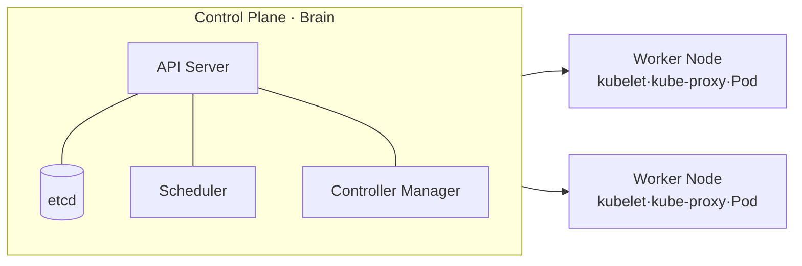

# Kubernetes (K8s)

## 1. Overview

### A. Definition
> An open-source **container orchestration** platform that **declaratively automates the deployment, scaling, and operation** of containerized applications; it originated from Google's internal system (Borg) and is currently a graduated project of the CNCF.

### B. Background and Necessity
Docker standardized containers, but in operational settings one must handle not a single container but **hundreds to thousands**. It is impossible for people to manually manage which container runs on which server, who restarts it when it dies, and how to scale out when traffic surges. This complexity exploded as MSA and cloud-native spread. Kubernetes emerged to solve this problem of "**automating large-scale container operations**," so that once administrators declare only the "Desired State," the system maintains that state on its own.

### C. Characteristics
Its core philosophy is **declarative configuration**. Rather than "do it this way (imperative)," you describe "it should be in this state (declarative)" in YAML, and Kubernetes compares it with the current state and reconciles it itself. Thanks to this, **auto-recovery, autoscaling, and zero-downtime deployment** are possible, and because it is independent of the infrastructure, **portability** across on-premises and multi-cloud is high.

## 2. Architecture

Kubernetes is divided into the **Control Plane (master)**, which handles commands and decision-making, and the **Worker Nodes**, which actually run the containers. This separation "**separates decision (control) from execution (work)**," providing robustness such that even if a node dies the control part stays alive, and even if the control part restarts the node's workloads keep running.

- **API Server**: The single gateway through which all requests pass (REST). After authentication and validation, it records state in etcd, and all components communicate only through this API Server.
- **etcd**: A distributed key-value store that holds all cluster state (desired state and current state). It is effectively the cluster's "**single source of truth (SSOT)**," so if corrupted the entire cluster is at risk, making backups essential.
- **Scheduler**: Decides which node to place a new Pod on, considering resources and constraints (CPU, memory, affinity).
- **Controller Manager**: A collection of various controllers that run the reconciliation loop described below.
- **kubelet**: On each node, receives instructions from the API Server and actually runs and monitors Pods.
- **kube-proxy**: Manages the node's network rules to route and load-balance traffic bound for a Service to the appropriate Pod.

| Component | Role |
|---|---|
| API Server | Gateway for all requests (REST) |
| etcd | Stores cluster state (distributed KV, SSOT) |
| Scheduler | Places Pods on suitable nodes |
| Controller Manager | State reconciliation (Reconcile Loop) |
| kubelet | Runs/manages Pods on the node |
| kube-proxy | Network routing/load balancing |

## 3. Core Objects

Everything handled in Kubernetes is declared as an "object." The smallest unit is not the container but the **Pod**, which bundles tightly coupled containers (e.g., app + logging sidecar) into one to share the same network and storage. Since Pods are ephemeral (they can die and be recreated at any time) and their IPs change, a **Service** is needed to provide a stable access point.

| Object | Description |
|---|---|
| **Pod** | Smallest deployment unit (a bundle of containers, ephemeral) |
| **ReplicaSet/Deployment** | Maintains replica count, rollout, rollback |
| **Service** | Stable access point and load balancing for a set of Pods |
| **Ingress** | External HTTP(S) routing, path-based distribution |
| **ConfigMap/Secret** | Separates configuration/secret information from code |
| **Namespace** | Logical isolation (multi-tenancy/environment separation) |

For example, when you deploy a web app, a **Deployment** declaratively manages "3 replicas," a **Service** in front of it distributes traffic to the 3 Pods, and an **Ingress** connects an external domain to this Service.

## 4. Core Mechanism — Reconciliation Loop

The fundamental principle by which Kubernetes automation works is the **reconciliation loop**. Each controller **continuously compares the "declared state" (e.g., 3 replicas) with the "current state" (actually 2), and if there is a difference, converges the current toward the desired state**. When a node dies and a Pod disappears, the controller detects this and spins up a new Pod on another node. Because of this loop, "auto-recovery" becomes not magic but inevitability.

- **Autoscaling**: Elastically responds to demand with HPA (horizontally scaling Pod count by load), VPA (vertically adjusting resource requests), and Cluster Autoscaler (scaling nodes themselves).
- **Rolling update/rollback**: Replaces new-version Pods bit by bit for **zero-downtime deployment**, and immediately rolls back to the previous revision if a problem occurs.

## 5. Considerations and Implications
- **Operational complexity**: As powerful as it is, its learning curve is steep. Hence, rather than building it themselves, many use **managed services (EKS, GKE, AKS)** to offload the burden of operating the Control Plane.
- **Security**: Since default settings are permissive, **RBAC (least privilege), network policies, and image vulnerability scanning** must be applied without fail.
- **Observability**: Since Pods are created and destroyed frequently, monitoring such as Prometheus, Grafana, and log collection is essential for operations.
- **Standard infrastructure and outlook**: Kubernetes is the de facto standard foundation for MSA, DevOps, and CI/CD, and deployment automation is expanding with **GitOps (ArgoCD, etc.)**, which treats a Git repository as the source of the desired state.

---

> **In one line**: Kubernetes is an orchestration platform that *declaratively automates container deployment, scaling, and operation*, where the Control Plane and Nodes continuously converge Pods to the desired state via the reconciliation loop, and along with managed services and GitOps it has become the standard infrastructure of cloud-native.
