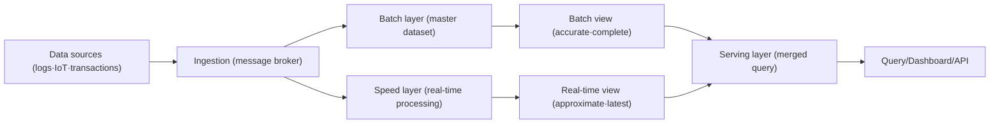
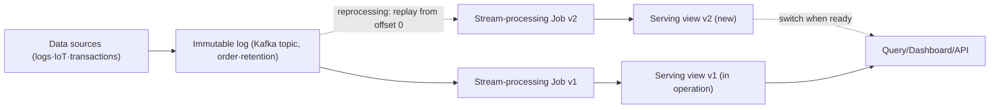

# Lambda Architecture and Kappa Architecture

## 1. Overview

### A. Definition

> **Lambda Architecture** is a big-data processing architecture that runs in parallel a Batch Layer, which processes large volumes of data accurately and completely, and a Speed Layer, which processes data with low latency, and merges the two results in the Serving Layer to secure both query latency and result accuracy.

> **Kappa Architecture** is an architecture that removes the batch layer and unifies all data into an event stream of an order-guaranteed Immutable Log, performing both real-time processing and past Reprocessing with only a single stream-processing pipeline.

Both architectures are different responses to the same problem: "How should large volumes of data be processed within the trade-off between latency and accuracy?" Lambda places **two paths of truth**, batch and stream, to take the advantages of each (the completeness of batch, the immediacy of stream), while Kappa **unifies the paths into a single log** to eliminate the complexity of maintaining two codebases. From a professional engineer's perspective, this topic should be understood not as a mere tool choice but as a data-pipeline governance problem that jointly designs the data-consistency-guarantee model, reprocessing strategy, operational complexity, and cost.

### B. Background and Necessity

First, the processing requirements for large volumes of data diverged into "accurate aggregation" and "immediacy." Traditional batch (e.g., nightly ETL) processing produces accurate statistics on a daily basis, but events occurring in between are reflected only the next day. Conversely, pure real-time processing has good immediacy but cannot fully correct for late-arriving data or omissions/duplications during failures. From the experience of combining early Hadoop-based batch and Storm-based stream, the Lambda Architecture was established (Nathan Marz, around 2011).

Second, there are constraints of CAP and reproducibility. In a distributed environment, if a processing node dies or the network is delayed, stream-processing results tend to become approximations. Lambda takes as its core principle a **recompute-based eventual consistency**, in which "the speed layer's result is a temporary value, and the batch layer will someday overwrite it with the accurate value." That is, it is a self-correcting structure in which batch periodically heals the stream's errors.

Third, the maturation of stream-processing engines made it possible to eliminate batch. As Apache Kafka's log retention and replay capabilities, Apache Flink's exactly-once stateful processing, and event-time/watermark-based windows matured, the view that "batch is really a finite stream" (Jay Kreps, Kappa proposal in 2014) became feasible. This created a movement to reduce the burden of Lambda maintaining two codebases.

### C. Common Goals and Characteristics

What the two architectures commonly pursue is **immutable preservation of source data and reprocessability**. If original events are stored append-only without modification, then even when a logic error is discovered, one can fix the code and re-stream the past data to regenerate results. This is the principle that "storage is the original, views are derived," which is also advantageous for data lineage and audit. The difference lies in whether that reprocessing is done as a **separate batch job** (Lambda) or as a **replay by the same stream engine** (Kappa).

Also, both architectures design the serving store on the premise of the **regenerability of derived views**. Because a serving view is not the original but closer to a cache that can be recreated at any time, even if the schema, index, or aggregation axis changes, one can rebuild only the view without touching the original. This mindset naturally connects with CQRS and event sourcing, where one "precomputes and stores at write time and only queries at read time," providing the flexibility to layer various consumption forms such as dashboards, search, and recommendation on top of a single source.

## 2. Structure and Operation of Lambda Architecture

### A. Three-Layer Composition

Lambda consists of the three layers: batch, speed, and serving. The master dataset (the immutable original) flows into the batch layer and the speed layer simultaneously, and the serving layer merges the views produced by each layer to respond to queries.

The **batch layer** periodically (e.g., hourly or daily) recomputes the entire master dataset to produce an accurate batch view. Since it re-reads all the data, some logic errors and late-arriving data are naturally corrected in the next batch. Hadoop MapReduce and Spark are representative engines. The downside is the latency until completion; a just-arrived event is not reflected until the next batch.

The **speed layer** processes only the recent window the batch has not yet processed in real time to produce a real-time view. Storm, Flink, and Spark Streaming are used. Because it is incremental processing it is fast, but since it maintains state approximately, errors can accumulate. The key point is that this view is **temporary**.

The **serving layer** merges the batch view and the real-time view to respond to queries. Up to the point the batch covers, it uses the batch view; for the latest window beyond that, it uses the real-time view, and sums them. When the batch view is updated, the correspondingly old portion of the real-time view is discarded (expired). For the serving store, key-value/column stores strong at random reads and fast lookups (e.g., HBase, Cassandra, Redis) or search engines are commonly used, and the batch view is atomically swapped to prevent inconsistency during queries.

### B. Data-Consistency Principle (Recompute vs. Incremental)

Lambda's accuracy comes from the recompute principle that "someday batch will recompute the whole and finalize the truth." For example, even if real-time visitor counting misses some events for 5 minutes due to a node failure, the next batch re-counts the entire original log and overwrites the serving view with the accurate value. Expressed as a formula, `query result = merge(batch_view(all data - recent), realtime_view(recent))`, and as time passes and the "recent" window is absorbed into batch, the real-time error vanishes.

As a concrete case, consider processing 2 billion ad-click logs per day (about 23,000 TPS on average, peak 50,000 TPS). An advertiser dashboard must show "total clicks so far," where settlement must be accurate and the dashboard must be real-time. If the batch layer precisely aggregates cumulative clicks every hour and the speed layer incrementally aggregates only the last hour, the advertiser gains both immediacy and accuracy. Since settlement trusts only the batch view, the stream's approximation error does not affect billing.

### C. Advantages and Limitations

Lambda's greatest advantage is **fault isolation and self-correction**. Even if the speed layer misbehaves, its impact is limited to "temporary errors in the recent window," and since the next batch overwrites it with the authoritative version, the error does not become permanent. Also, since the batch view can be regenerated from the original at any time, it is flexible for retroactively applying new metrics or changing past analysis axes. This property is especially valuable in finance, telecom, and public statistics, where data trust is critical.

Conversely, the limitation is the **operational burden from logic duplication**. The same aggregation rule must be written and maintained in two versions, one for batch (e.g., Spark) and one for stream (e.g., Flink), and if the two codes diverge when rules change, the batch view and the real-time view become inconsistent, causing values to jump during serving merge. To reduce this, discipline is needed, such as extracting the aggregation logic into a common library or forcing the two engines to share the same UDFs and schema. The serving layer's merge/expiration logic itself must also precisely handle boundary conditions (duplication/omission at the batch-coverage boundary).

## 3. Structure and Operation of Kappa Architecture

### A. Single Stream Pipeline

Kappa removes the batch layer and appends everything to a log (a Kafka topic, etc.), producing views with a single stream-processing job. When reprocessing is needed, it spins up a new job to re-consume from the beginning of the log (or a specific offset) to build a new view, and switches traffic once it is ready.

The key is the view that **"batch is a special case of a finite stream."** Recomputing the entire past (= the role of batch) is replaced by a stream job that replays the log from offset 0. Therefore, only one version of the processing logic exists, and the burden of synchronizing two codebases for batch and stream disappears.

### B. Reprocessing Strategy and State Management

In Kappa, when changing logic or fixing a bug, one uses "blue-green reprocessing." While the existing job (v1) serves, the modified job (v2) runs from the beginning of the log to fill a new output table. When v2 catches up to the current point (head), consumers switch to v2 and v1 and the old table are discarded. The premise of this approach is that **the log-retention period must be long enough to hold the entire history needed for reprocessing**. If infinite retention is expensive, tier old events to object storage (tiered storage) or combine with periodic snapshots.

Accuracy depends on the stream engine's state and time-handling capabilities. Flink's checkpoint-based exactly-once, event-time-based windows and watermarks, and allowed lateness for late-arriving data substitute for much of batch's completeness. For example, in payment anomaly detection, even a transaction that arrives 3 minutes late due to network delay is aggregated into the correct window if the watermark allows a 30-minute delay. However, very late data or large-scale backfills must still be handled with a reprocessing job, and this point determines the operational difficulty of Kappa.

The success or failure of Kappa reprocessing depends on the prior design of the following elements. Each item is not an independent option but an interlocked variable that jointly determines the retention period, cost, and recovery time (RTO), so the balance point must be set based on the SLA.

| Element | Role | Design consideration |
|---|---|---|
| Log retention period | Determines the reprocessable past range | Longer → reproducibility↑, storage cost/privacy burden↑ |
| Partitions/parallelism | Determines reprocessing throughput | Balance of catch-up speed and resource cost |
| State backend | Stores window/aggregation state | Tuning of size and checkpoint interval, e.g., RocksDB |
| Snapshot/time travel | Replay from a specific point | Ease infinite-retention cost by combining with a lakehouse |
| Idempotent sink | Prevents duplicate output | Complete exactly-once with idempotency keys/transactions |

### C. Advantages and Limitations

Kappa's advantage is **simplicity and consistency from a single code and single system**. Since there is only one version of logic, rule mismatches between batch and stream fundamentally do not occur, and because real-time and past reprocessing pass through the same code path, the subtle bug that "real-time values and past values are computed differently" disappears. Development and deployment are fast, and it naturally integrates with event-driven microservices and streaming platforms.

The limitation is that **the accuracy/reprocessing burden concentrates in the stream engine and log design**. Exactly-once guarantees, event-time and watermarks, and state-backend operation are harder to understand and operate than batch, and a large-scale backfill puts a momentary load on the operational cluster. When near-infinite history retention is expensive or impossible for regulatory reasons, pure Kappa alone struggles to handle "full recomputation of very old data," eventually requiring batch-like supplements such as a lakehouse or snapshots.

## 4. Comparison and Cases (Causes of Difference and Practical Implications)

The difference between the two architectures stems not from the mere number of layers but from the trade-off of "where accuracy is guaranteed" and "how much the code and operations are simplified." Lambda places batch as an **independent path of truth** to fundamentally heal stream errors, but must maintain two versions of logic. Kappa unifies the logic to simplify maintenance, but must handle accuracy and the large-scale-reprocessing burden through the stream engine and log-retention design.

| Category | Lambda Architecture | Kappa Architecture |
|---|---|---|
| Processing paths | Batch + Speed (2 paths) | Single stream (1 path) |
| Codebase | 2 versions for batch/stream (logic duplication) | 1 version |
| Reprocessing method | Full recompute by batch job | Stream replay from log offset |
| Accuracy guarantee | Batch's periodic full recompute | Stream's exactly-once·event-time·watermark |
| Latency | Batch is minutes-hours, speed is seconds | Seconds (load during reprocessing) |
| Operational complexity | Complex two-system synchronization/merge logic | Log-retention·stream-state management burden |
| Suitable situations | Accuracy-critical, e.g., settlement + real-time in parallel | Event-centric, frequent logic changes, streaming |

The practical implications are as follows. First, in **areas where errors lead to monetary or legal liability, such as settlement and regulatory reporting**, Lambda's batch path is safe because it provides an "auditable authoritative version." For example, a telecom carrier's charge settlement takes the batch view as authoritative and exposes the real-time view only for reference. Second, in **areas where logic changes frequently and events are effectively an infinite stream** (recommendation, anomaly detection, IoT telemetry), Kappa is advantageous in development and deployment speed. Netflix, LinkedIn, and others have disclosed cases of processing hundreds of thousands of TPS with Kafka-log-centric Kappa-style pipelines.

Third, many real-world systems are **hybrid**. They produce real-time views with a stream engine, but load the log into a data lakehouse (e.g., Delta, Iceberg, Hudi) to perform large-scale backfill and consistency verification via batch when needed. That is, "theoretical Kappa + safety-net batch," which carries lower operational risk than the pure form.

As a concrete comparison, consider equipment-sensor telemetry (tens of thousands of points per second) in a smart factory. In pure Lambda, the speed layer handles real-time anomaly alerts while the batch layer handles the daily Overall Equipment Effectiveness (OEE) report, but each time the OEE formula is revised, the code of both layers must be fixed together. In Kappa, when the formula is revised, one can replay the modified stream job from the beginning of the log to consistently recompute even past OEE, simplifying maintenance, but one must endure months of source-log-retention cost and a surge in cluster load during reprocessing. Which side is right is determined by the product of the business variables "formula-change frequency × history-reproduction requirement × retention-cost ceiling," and presenting this judgment logic is the key differentiator of a professional engineer's answer.

## 5. Advanced: The Streaming Standardization Trend and Recent Developments

The recent trend is converging on "Unified Batch/Stream." Apache Flink provides unified execution that processes bounded and unbounded data with the same API, and Apache Beam abstracts batch and stream into a single programming model, requiring only a change of runner. This supports Kappa's ideology (one logic) at the language and engine level.

The second trend is the **combination with lakehouse table formats**. As Iceberg, Delta Lake, and Hudi provide ACID, time travel, and incremental reads, the log (Kafka)–stream processing (Flink/Spark)–table (lakehouse) chain into a single pipeline. Time-travel capability simplifies Kappa's reprocessing to "replay from a specific snapshot" and eases the infinite-log-retention cost problem. As a result, the boundary between pure Lambda/Kappa blurs, and a form called the "streaming lakehouse" is emerging.

The third is the **standardization of exactly-once semantics and event-time processing**. As Kafka transactions, Flink's two-phase-commit sinks, and watermark-based late-data handling matured, the past premise that "only batch is accurate" has weakened. However, "exactly-once" holds only on the premise of the idempotency of stateful storage and sinks, so idempotency-key design remains essential when integrating with external systems.

For expected exam directions, likely candidates are: ▲ describing the structure and difference of Lambda/Kappa ▲ the roles of the batch/speed/serving layers and the consistency principle ▲ Kappa's reprocessing strategy and log-retention issues ▲ integration with lakehouse/Flink ▲ presenting a rationale for architecture choice suited to a specific business (settlement vs. anomaly detection). For an answer-composition strategy, developing in the order "conceptual diagram → per-layer role → consistency principle → comparison table → business-characteristic-based choice logic → recent integration trend" satisfies the advanced/essay requirements.

## 6. Considerations and Implications (Professional Engineer's Perspective)

- **Aligning accuracy requirements with architecture choice**: For settlement/disclosure areas where errors lead to monetary/regulatory liability, Lambda with a batch authoritative version (or a hybrid with a safety-net batch) is suitable, while recommendation/anomaly detection, where immediacy and logic agility are the priority, favors Kappa. One must design with a clear distinction that "real-time does not equal accurate."
- **Prior design of reprocessing/backfill strategy**: Since logic changes and bug fixes are inevitable, the immutable preservation of source logs, retention period, replay procedure, and blue-green switching must be defined from the very start of the architecture. Log-retention cost is optimized with tiered storage, snapshots, and lakehouse time travel.
- **Trade-off between operational complexity and organizational capability**: Lambda's cost is two-codebase synchronization, merge logic, and duplicate verification, while Kappa's difficulty is operating stream state, watermarks, and exactly-once guarantees. Choose a realistic form (pure vs. hybrid) considering the team's streaming maturity, SRE capability, and monitoring system.
- **Linkage with data governance/lineage**: The immutable-original/derived-view structure is directly connected to lineage, audit, and responses to personal-data deletion requests (GDPR, personal information protection laws). Since indefinitely retaining personal data in the log conflicts with deletion obligations, pseudonymization, tokenization, retention periods, and crypto-shredding (key destruction) strategies must be designed together.
- **Quantitative management of cost/performance**: The batch-recompute interval, stream parallelism, log partitions/retention, and state-backend (e.g., RocksDB) size must be quantitatively tuned to the SLA (latency/accuracy) and budget. Indiscriminate infinite retention and an excessive batch interval spike costs.
- **Outlook**: With the combination of Flink/Beam unified processing and lakehouse table formats, the pure Lambda/Kappa distinction will gradually be absorbed into a unified form called the "streaming lakehouse." However, since the safety net of batch verification will remain for a long time in accuracy-critical business, professional engineers are required to have the capability to design a practical compromise suited to business characteristics rather than transplanting an ideal-type architecture as-is.

## References

- Nathan Marz, "How to beat the CAP theorem" / Big Data (Lambda Architecture), http://nathanmarz.com/blog/how-to-beat-the-cap-theorem.html
- Jay Kreps, "Questioning the Lambda Architecture" (Kappa), https://www.oreilly.com/radar/questioning-the-lambda-architecture/
- Apache Flink, Unified Batch and Stream Processing, https://flink.apache.org/
- Apache Beam Programming Model, https://beam.apache.org/documentation/basics/
- Apache Iceberg / Delta Lake table format, https://iceberg.apache.org/ , https://delta.io/

---

> **In one line**: Lambda is an architecture that merges the two paths of batch (accurate) and speed (immediate) in the serving layer to gain accuracy and real-timeness simultaneously, while Kappa is an architecture that unifies real-time processing and reprocessing with a single stream pipeline over an immutable log to simplify code and operations; recently they are converging into a 'streaming lakehouse' combined with Flink and lakehouses.
