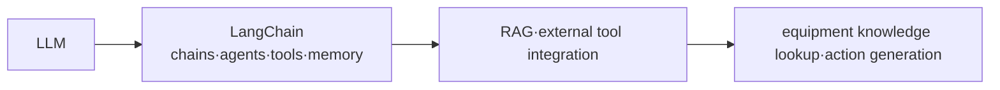

# Equipment Predictive Maintenance Using LangChain

## 1. Overview

### A. Definition and Necessity of Predictive Maintenance
> **Predictive Maintenance (PdM)** is an approach that analyzes sensor data and status information attached to equipment to **predict failures in advance and perform maintenance only when actually needed**. It is a concept that combines predictive models with Condition-Based Maintenance (CBM).

Maintenance methods have historically evolved through three stages. The early **Breakdown Maintenance (BM)**, which fixes equipment after it fails, caused unexpected production stoppages and large losses. The improved **Preventive Maintenance (PM)** replaces parts at fixed intervals, but it could not prevent **over-maintenance**, discarding parts that were still usable, nor sudden failures occurring between intervals. **Predictive Maintenance** analyzes the actual state of equipment (vibration, temperature, current, etc.) in real time and performs maintenance "at the moment failure is imminent," thereby simultaneously reducing over-maintenance waste and sudden failures, and raising uptime and safety.

### B. Background
As equipment IoT sensors and machine-learning anomaly-detection technology matured, the prediction accuracy of predictive maintenance rose significantly. However, while anomaly-detection models catch the signal of "when and where there is an anomaly" well, they cannot explain **what its cause is and what action to take** in human language. It is also difficult for on-site workers to immediately interpret vast equipment manuals and past maintenance history. Here, the LLM and LangChain are combined in the role of "translating detected anomalies into understandable diagnoses and actions."

## 2. LangChain and LLM

An **LLM (large language model)** is trained on vast text to understand and generate natural language, but by itself it cannot access in-house equipment data or real-time sensors. **LangChain** is a framework that connects this LLM with external data and tools and orchestrates them into a single application. It provides as components **chains**, which stitch multiple steps together; **agents**, which decide on tool use themselves; **tools**, which call external functions; **memory**, which maintains conversational context; and **RAG**, which injects grounding via document retrieval. In other words, LangChain acts as the glue that connects the LLM to the "sensor DB, anomaly-detection model, and manual repository."

| Concept | Content |
|---|---|
| **LLM** | Large language model — natural-language understanding/generation |
| **LangChain** | LLM app-development framework — chains·agents·tools·memory·RAG |
| **Role** | Connecting and orchestrating the LLM with external resources such as sensor DBs, APIs, and manuals |

## 3. Applying LangChain to Predictive Maintenance

The core is a division of roles in which **ML handles the numerical prediction, and the LLM handles the linguistic interpretation and action guidance**. In a predictive-maintenance workflow, when an anomaly-detection model detects a "bearing vibration anomaly," a LangChain agent receives this signal, retrieves the relevant equipment manual and similar past cases via RAG, and generates the cause and action plan in natural language based on that grounding. An on-site worker can ask the chatbot "Why is Unit 3's vibration high?" and immediately receive a diagnosis.

| Application | Content |
|---|---|
| **RAG-based knowledge lookup** | Searches equipment manuals/maintenance history via a vector DB to provide grounded answers |
| **Agent/tool integration** | Calls the sensor DB/anomaly-detection model to interpret diagnostic results |
| **Natural-language diagnosis/action** | Generates anomaly cause analysis and maintenance guidance in natural language |
| **Conversational interface** | Supports on-site workers' Q&A via a chatbot |

A concrete flow example is as follows. **① The anomaly-detection model raises an alert** → **② The LangChain agent performs manual RAG + maintenance-history lookup by equipment ID** → **③ Combines the retrieved grounding into the prompt to generate a cause estimate and action plan** → **④ Presents it to the worker along with the source**. This shortens the time from detection to action and standardizes diagnostic knowledge that used to depend on skilled personnel.

## 4. Considerations and Implications

The greatest risk is the LLM's **hallucination**. Since wrong maintenance guidance directly leads to equipment damage and safety accidents, one must always **present actual manual grounding via RAG** and place a Human-in-the-loop structure in which the final judgment is verified by a person. Also, since equipment operational data (OT data) is highly confidential, sending it as-is to an external commercial LLM risks leakage, so an **on-premises/private LLM** or an air-gapped deployment is a prerequisite. On the real-time front, a role separation is needed in which lightweight ML handles millisecond-level anomaly detection while the relatively slow LLM is placed in the interpretation/reporting stage.

| Consideration | Content |
|---|---|
| **Hallucination/accuracy** | RAG grounding + human verification (Human-in-the-loop) |
| **Data security** | Prevent OT data leakage — on-premises/private LLM |
| **Real-timeness** | Role/layer separation of anomaly detection (ML) and LLM interpretation |

In summary, the success or failure of predictive maintenance depends on **the combination of accurate anomaly detection (ML) and reliable interpretation (LLM)**. On top of securing the prerequisites of OT/IT converged security and data quality, linking it with industrial-site AI agents and digital twins can expand it into autonomous equipment management.

---

> **In one line**: Predictive maintenance is an approach that *predicts and maintains failures in advance using sensor data*, and LangChain connects the LLM with sensors, manuals (RAG), and tools to support anomaly cause analysis, maintenance-guidance generation, and conversational diagnosis, with hallucination prevention (RAG·human verification) and OT-data security as prerequisites.
