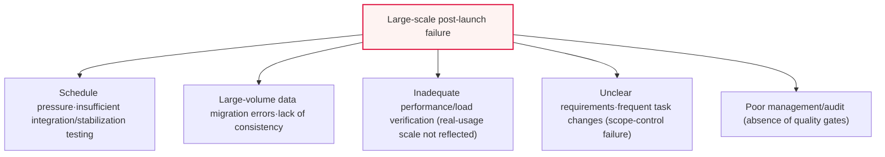
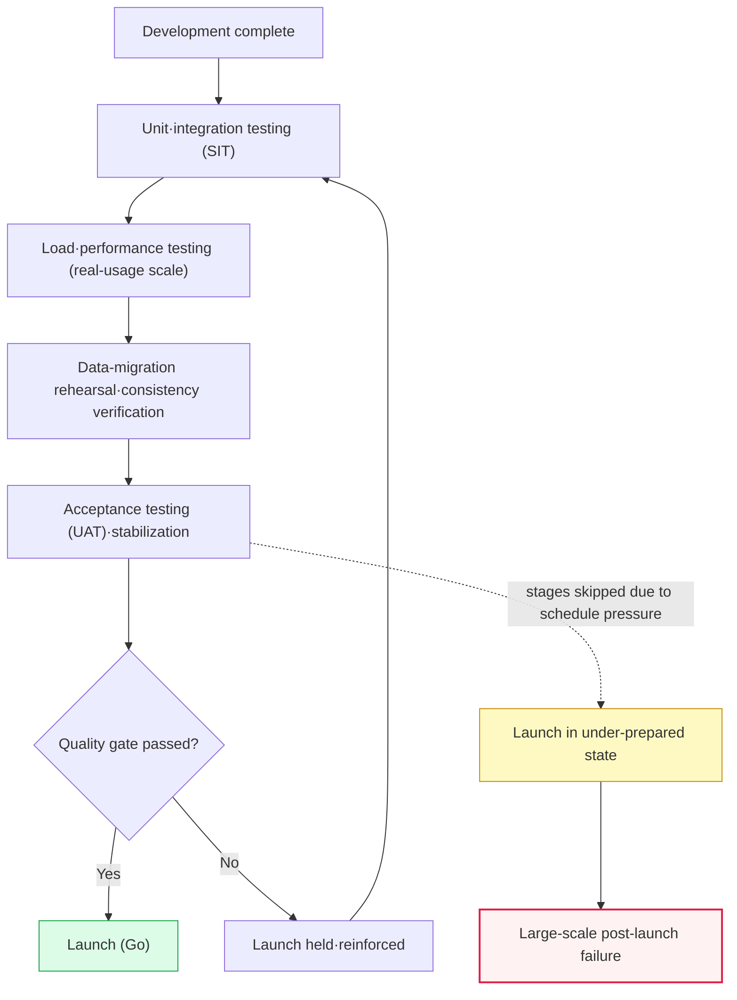

# Post-Launch Problems of Large-Scale Public Next-Generation Systems and Countermeasures

## 1. Overview

### A. Background and Problem Statement

> As cases repeatedly occur in which large-scale public next-generation systems (education, welfare, administration, taxation, etc.) cause social confusion with access failures, processing errors, and data inconsistencies immediately after launch, the need for a **fundamental re-examination of the entire development, quality, and launch-decision system** has emerged.

The fundamental cause of this recurring problem lies in a structure where "**the characteristics of ultra-large, high-complexity systems and tight political/administrative schedules constantly pressure quality**." A next-generation system is an ultra-large project that replaces legacy systems accumulated and dispersed over years to decades all at once, requiring migration of vast data and integration of complex functions across ministries and agencies. Added to this is the characteristic of being a public service used simultaneously by millions to tens of millions of people, so even a small defect is immediately amplified into a large-scale failure.

Yet if launch is forced without sufficient integration testing and stabilization, **rushed by schedules** such as the budget fiscal year, policy announcements, or opening ceremonies, latent defects burst out all at once in the real operating environment where load concentrates. A failure experienced simultaneously by millions of users immediately leads to social inconvenience, a surge in complaints, damage to administrative trust, and a blame game between the ordering agency and the contractor. In fact, the grade-processing and access failures immediately after the launch of the education administration information system (4th-generation NEIS, 2023) and the delayed benefit payments after the launch of the welfare/administration system (next-generation social security information system, 2022) have been reported as cases that symbolically show this structural problem (specific figures and developments may differ depending on audit/investigation results, so they are generalized here).

Therefore, this problem must be approached not as a mere "coding defect" but as a problem of overall project management: **ordering, task management, quality assurance, and launch decision-making**. The core recognition is that recurrence cannot be prevented by technical responses alone, and that objectification of the launch decision and legal/institutional enforcement must proceed in parallel.

### B. Structural Characteristics of Large-Scale Next-Generation Projects

The reason next-generation projects are riskier than ordinary SI is three characteristics. First, **Big-bang transitions** are frequent. Since the legacy system is discarded en masse at a specific point and switched to the new one, there is little room to roll back on failure. Second, the **scale and complexity of data migration** are large. Consistency errors inevitably arise in the process of moving data accumulated over decades under different rules into a new schema. Third, there is **the complexity of stakeholders and requirements**. Many ministries, agencies, and business units are entangled, requirements change frequently, and there is constant pressure for political schedules to take precedence over technical readiness. These three characteristics combine to create the worst combination of "launching in an under-prepared, irreversible manner."

## 2. Post-Launch Problems and Causes

The causes of post-launch failure accumulate not at a single point but across multiple layers. Unpacking the five causes in the structure diagram above into prose is as follows.

First, there is **insufficient testing/stabilization due to schedule pressure**. In trying to align the launch with the end of the budget fiscal year or a policy-announcement date, the period needed for integration testing, load testing, and stabilization is the first to be cut. Testing is easily treated as a "buffer zone" that gets compressed when the schedule slips, and as a result the last line of defense for screening out latent defects before launch collapses. In particular, when **System Integration Testing (SIT)**, which integrates multiple agencies and modules, and **User Acceptance Testing (UAT)**, which verifies actual business flows, are poor, failures of the type where unit functions are fine but the connection points blow up concentrate after launch.

Second, there are **errors and lack of consistency in large-volume data migration**. Legacy-system data has accumulated over decades under different rules and exceptions, so in the ETL process of moving it into a new schema, omissions, duplications, type-conversion errors, and referential-integrity violations occur. If migration rehearsals (dry runs) and consistency verification (source-target count/sum/sample comparison) are not done sufficiently, complaints of the type "my record has disappeared/is wrong" surge after launch. Data problems are especially fatal in that, unlike screen errors, they are difficult to recover after the fact and cause great damage to trust.

Third, there is **inadequate performance/load verification**. Development and test environments often cannot reproduce the concurrent-access and transaction volume of real-usage scale. When users nationwide crowd in simultaneously on the actual launch day, connection-pool exhaustion, lock contention, cache misses, and batch delays that did not surface in testing all come to the surface at once. The cause is not verifying the target response time, concurrent access, and throughput (TPS) at a scale comparable to the real environment.

Fourth, there are **unclear requirements and frequent task changes**. If a project starts without requirements being detailed at the outset, tasks keep changing during development, shaking design and testing. If scope is not controlled, the schedule and quality collapse together. Fifth, the fundamental background is that the **management/audit** that should filter this out early was poor, so stage-by-stage quality gates did not function.

| Cause | Specific content | Representative symptom |
|---|---|---|
| **Schedule pressure** | Cutting stabilization/integration/load-test periods, forcing launch | Concentration of integration errors at connection points |
| **Data migration** | Large-volume ETL errors·insufficient consistency verification | Complaints of record omission·amount errors |
| **Inadequate performance verification** | Insufficient real-usage-scale load testing | Access delays·service downtime |
| **Unclear requirements** | Scope-control failure, frequent task changes | Design·test rework |
| **Poor management/audit** | Quality gates·stage verification not functioning | Late-stage explosion of risks |

These causes are not independent but **amplify each other in a chain**. Schedule pressure reduces testing, the reduced testing pushes data/performance problems to after launch, and unclear requirements breed rework that again pressures the schedule—a vicious cycle. Therefore, rather than a symptomatic treatment that fixes only one cause, the entire loop must be broken with the principle that "readiness, not schedule, decides the launch." The detailed process diagram below shows the ideal launch-decision flow together with the failure points (red branches).

In the detailed process diagram, the normal path (A→…→G→H) is a flow that sequentially passes each test stage and makes the final confirmation at the quality gate. In contrast, the dashed path (E-.->J→K) is a failure path that skips load testing, consistency verification, and stabilization due to schedule pressure and forces the launch. The branch point of the two paths ultimately lies in the decision of "whether to enforce the gate or bypass it," and fixing this decision by institution rather than human discretion is the core of the countermeasures.

## 3. Recurrence-Prevention Countermeasures and Legal/Institutional Supplements

The fundamental countermeasure is "**enforcing by institution that one does not rush to launch while under-prepared**." Since individual technical measures alone will reproduce the same pressure in the next project, one must approach it along the four axes of quality, data, management, and institution together.

First, on the **quality management** side, specify integration, load, and stabilization testing as contractually mandatory periods, and cross-check results with **Parallel Run**, running the old and new systems together for a certain period. Parallel run is a safeguard that catches anomalies early by comparing the new system's output with the existing system.

Second, on the **data** side, rehearse migration multiple times, and make consistency verification—comparing counts, sums, and key-item samples between source and target—a pass criterion. Also define a rollback plan in advance in case of migration failure.

Third, on the **management/audit** side, perform an **ISMP (Information System Master Plan)** that details requirements before project commencement, and place audits and a **Quality Gate** at each stage so that a stage cannot proceed to the next if criteria are not met.

Fourth, on the **legal/institutional** side, **institutionalize launch-decision criteria** so that launch is judged by objective readiness, guarantee adequate project duration and compensation to prevent unreasonable schedules and low-price ordering, and clarify defect liability by contract.

| Category | Countermeasure | Expected effect |
|---|---|---|
| **Quality management** | Mandate integration/load/stabilization testing, parallel run | Defect removal before launch, safe transition |
| **Data** | Migration rehearsal, consistency verification, rollback procedure | Secure data integrity/trust |
| **Management/audit** | ISMP requirement detailing, stage-by-stage audit/quality gate | Early risk interception |
| **Legal/institutional** | Legislate launch-decision criteria, adequate duration/compensation, clear liability | Improve the schedule-pressure structure |

The common logic of these countermeasures is to "move risk **from the late stage to the early stage, and from human judgment to institutions/metrics**." That is, it is a preventive approach that secures quality from the project-design stage and quantifies the launch decision, rather than a stopgap right before launch.

In particular, **parallel run and phased transition** are the most effective devices for mitigating the irreversibility of the big-bang approach. Not discarding the old system immediately but operating it together for a certain period allows anomalies to be caught early by comparing the new system's output with the existing one, and secures a safety valve to immediately roll back in case of a serious failure. Phased transition, which opens functions/regions/agencies sequentially, reduces the initial opening scale to limit the ripple range of a failure, and lets lessons gained in earlier stages be reflected in the next stage. A big-bang that opens the entire nation and all functions at once is flashy, but must be approached cautiously in that the cost of failure grows to the scale of the entire project.

Also, institutional supplements must target the **ordering practices themselves**. Since low-price winning bids and tight project durations structurally create quality pressure, unless adequate compensation estimation, realistic project schedules, and fair payment for task changes proceed in parallel, the contractor will again sacrifice testing and stabilization. That is, creating a contract structure in which "keeping quality does not become a loss" is as important as technical countermeasures.

## 4. Metric Management for Launch-Feasibility Decisions (Quality Gate)

Whether to launch must be judged not by the person-in-charge's intuition or a political schedule but by **pre-defined quantitative metrics**. The key is to agree on Go/No-go criteria at the start of the project, and to operate a **quality gate** that objectively confirms whether these are met right before launch.

The decision metrics are composed of four axes. On the **Defect** axis, one looks at whether critical/blocker defects are 0 and whether defect density is below target. On the **Test** axis, one confirms whether test coverage and pass rate against requirements achieve the target. On the **Performance** axis, one verifies whether the target response time, concurrent access, and TPS pass in real-usage-scale load testing. On the **Data** axis, one confirms whether the migration consistency rate meets the criterion (e.g., close to 100%). Only when all four axes pass is it judged "launch-feasible (Go)."

| Metric axis | Decision criterion (example) | Action if not met |
|---|---|---|
| **Defect** | Critical/blocker defects 0, defect density below target | Hold launch·hotfix |
| **Test** | Coverage/pass rate against requirements meets target | Reinforce testing |
| **Performance** | Target response time·concurrent access·TPS load passed | Tuning·scaling |
| **Data** | Migration consistency rate meets criterion | Re-migrate·correct |

What is important is applying the metrics with enforcement **before launch, not after**. Unless the principle stands that "if the gate is not passed, we do not launch even if we delay the schedule," the metrics degenerate into a formality. Also, even after launch, one must monitor the access success rate, error rate, and response time on a real-time dashboard, and have a **rollback/emergency-response system** that reverts to the old system running in parallel if a pre-defined threshold is exceeded.

## 5. Advanced: Linkage with Similar Past Exam Questions and Expected Exam Directions

This topic is a comprehensive theme where project, quality, audit, and risk management intersect, and it connects to several past exam questions. ① On the **quality management** side, it links to quality metrics such as defect density and test coverage and to SQA (Software Quality Assurance); ② on the **risk management** side, to risk distribution of big-bang transitions (phased transition/parallel run); ③ on the **ordering/audit** side, to ISMP, informatization-project audit, and EVM (Earned Value Management); ④ on the **data management** side, to data migration/data quality and migration strategy. Recently, in tandem with cloud-native transitions, the **Strangler Fig pattern**, which gradually moves functions instead of a big-bang, and distributing transition risk with canary or blue-green deployment are discussed as alternatives.

In a professional engineer's answer, developing in the flow "why does it recur (structural cause) → what to fix (quality/data/management/institution) → how to judge the launch (quantitative gate)," and emphasizing in the conclusion the **objectification/institutionalization of the launch decision and the distribution of big-bang risk**, is persuasive. Rather than concluding the cause of a specific project, it is safer to generalize the common structure and countermeasures.

## 6. Considerations and Implications

1. **Objectification/institutionalization of the launch decision is key.** Breaking free from the pressure of political/administrative schedules, the principle that one launches only when quantitative metrics (quality gate) are met must be nailed down by contract and institution. Only when the authority to postpone the launch if the gate is not passed is clearly granted does it become effective.
2. **Distribute risk with phased transition/parallel run instead of big-bang.** Reduce the explosion risk of "changing everything at once" through old-new system parallelism, sequential opening by function/region, and strangler/canary deployment.
3. **Improving the ordering/task-management system is fundamental.** Securing quality from the outset through requirement detailing via ISMP, guaranteeing adequate project duration/compensation, improving low-price/tight ordering practices, and stage-by-stage audit is far more effective than after-the-fact responses.
4. **Manage data migration as an independent risk.** Migration must have a dedicated verification system (rehearsal/consistency verification/rollback procedure) separate from feature development, and given that damage to data trust is hard to recover, it is a top-priority management target.
5. **Include post-launch stabilization/emergency response in the project scope.** Since launch is not the end but the beginning, real-time monitoring, a hotfix system, a rollback plan, and stabilization staffing must be specified in the contract scope and budget to prevent "post-launch neglect."

## References

- Software Promotion Act·Information System Audit Standards (Ministry of Science and ICT), https://www.msit.go.kr/
- National Information Society Agency (NIA) informatization-project management/audit guidance, https://www.nia.or.kr/
- Martin Fowler, StranglerFigApplication, https://martinfowler.com/bliki/StranglerFigApplication.html

---

> **In one line**: Post-launch failures of large-scale public next-generation systems stem from structural causes such as *schedule pressure, data-migration errors, inadequate performance verification, unclear requirements, and poor audit*, and recurrence must be prevented through sufficient integration/load testing, parallel run, quantitative-metric-based launch decisions (quality gate), big-bang risk distribution, and legal/institutional supplements.
