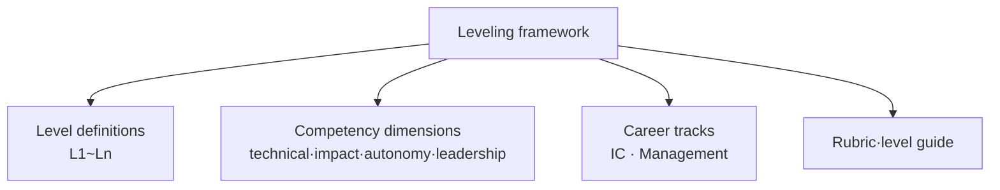

# Leveling Framework (Job Level System)

## 1. Overview

### A. Definition
> An HR/organizational management system that **systematically defines the level of responsibility, competency, and impact of jobs within an organization and structures them into grades (levels)**, providing consistent criteria for hiring, evaluation, compensation, and growth paths. Especially in IT/engineering organizations, it defines "what makes a senior a senior" not by years of service but by the **scope of impact**.

The essence of a leveling framework is **creating a 'common language' for growth and compensation**. Without levels, there is no basis other than a manager's subjectivity to answer the questions "Why is that person a senior?" and "Why did I not get promoted?" A leveling framework aligns evaluation, compensation, and promotion with **observable criteria** rather than an individual's impression, by presenting a **rubric** that codifies the behaviors, competencies, and impact required at each level.

### B. Background and Necessity
When an organization is small, leaders can directly observe members' contributions, so no separate system is needed. However, once the headcount grows to tens or hundreds, **equity problems (why is compensation different at the same rank?)**, **opacity of growth paths (what must I do to reach the next stage?)**, and **subjective evaluation** begin to erode organizational trust. In particular, IT personnel become trapped in a structure where, the deeper their expertise, growth and compensation rise only by becoming managers; the **Peter Principle**, in which a great engineer is promoted to manager and both are lost, illustrates this well. The leveling framework emerged to respond to such problems by simultaneously providing **objective criteria and an expert growth path**.

## 2. Components

A leveling framework works with four interlocking elements. If there are only levels and no competency dimensions, it is ambiguous what to judge a level by, and without a rubric even the same level is interpreted differently by each evaluator.

| Component | Content | Role |
|---|---|---|
| **Level definitions** | Stages from L1 (junior) to Ln (fellow/executive level) | The skeleton of the growth staircase |
| **Competency dimensions** | Technical expertise, scope of impact, autonomy, collaboration/leadership, business impact | What levels are judged by |
| **Career tracks** | Dual paths of IC (individual contributor) and Management (manager) | Options for the direction of growth |
| **Rubric/level guide** | A matrix describing the expected behaviors of each level × dimension | The objective basis for judgment |

The most central axis is the **scope of impact**. Lower levels focus on completing a given task, and as the level rises, that impact widens to **project → team → organization → whole company**. For example, a mid-level engineer independently implements a well-defined feature, while a staff-level engineer defines cross-team architecture problems and sets direction. Thus, the core principle is that **autonomy (how much one defines and solves problems without instruction) and the ability to handle ambiguity** grow together with the level.

## 3. Dual Ladder

The most important design idea of a leveling framework is the dual ladder, which **places the Individual Contributor (IC) track and the Manager (M) track in parallel at equal levels**. The reason for putting the two tracks at the same height is clear. If, to grow an engineer with deep expertise, you promote them to manager, the organization loses a great engineer and instead gains an unprepared manager—a double loss.

| Track | Direction of growth | Example higher levels |
|---|---|---|
| **IC (individual contributor)** | Expanding technical depth·impact | Staff → Principal → Fellow Engineer |
| **Management** | Expanding scope of organization/people management | Team Lead → Group Lead → Director → VP |

The key is that above a certain level the two tracks have the **same compensation and status**. For example, if a Principal Engineer and a Director are treated at the same level, engineers can grow to the highest level "without becoming managers." This becomes a powerful incentive to retain technical leadership in the organization. However, the two tracks must be **mutually convertible**, and the management track must be designed so as not to lose its technical understanding.

## 4. Operation: Calibration and Linkage with Skill Frameworks

Even with a rubric, if each evaluator applies a different yardstick, equity collapses. Hence a **calibration** meeting, where multiple managers gather to compare each other's evaluation rationales and adjust criteria deviations, is essential. By cross-verifying whether Team A's 'senior' and Team B's 'senior' are actually at the same level, the level is corrected to have a consistent meaning across the whole organization.

Also, a leveling framework gains more objectivity when **linked with standard skill frameworks**. Representatively, **SFIA (Skills Framework for the Information Age)**, an international IT-competency standard, defines IT job competencies at 7 levels of responsibility (autonomy, influence, complexity, etc.); mapping this to in-house levels provides a basis grounded in an external benchmark. Domestically, the competency-unit/level system of the **NCS (National Competency Standards)** plays a similar role.

| Operational element | Purpose |
|---|---|
| **Calibration** | Adjust criteria deviation among evaluators → equity across the whole organization |
| **Skill-framework (SFIA·NCS) linkage** | Secure objectivity based on external standards |
| **Regular reviews·level-inflation management** | Prevent criteria from collapsing due to over-issuance of levels |

## 5. Comparison with Traditional Seniority

Why a leveling framework is needed becomes clear when contrasted with **seniority (a pay-step system)**. Seniority raises grade and compensation in proportion to years of service, so it is simple to operate and predictable, but it has the problem that **contribution and compensation are misaligned**. If someone who has served long but whose impact has stagnated and someone with a short tenure but a large impact on the organization receive reversed treatment, excellent talent departs. A leveling framework resolves this misalignment by **moving the basis of compensation from years of service to impact and competency**. The fundamental reason the difference arises is that the two systems measure different objects—one is 'how long,' the other is 'how broadly.'

| Category | Seniority (pay-step system) | Leveling framework |
|---|---|---|
| **Basis** | Years of service | Competency·scope of impact |
| **Advantages** | Simple·predictable·stable | Contribution-compensation alignment, clear growth path |
| **Disadvantages** | Contribution-compensation mismatch, talent departure | Design/operation cost, risk of level inflation |

## 6. Considerations and Implications (Professional Engineer's Perspective)
- **Balance of objectivity and flexibility**: If a rubric is too detailed, it drifts into formalism, checking off a checklist; if too abstract, subjectivity intervenes. A balance is needed that describes observable behaviors but leaves room for contextual judgment.
- **Guarding against level inflation**: If levels are over-issued under turnover/retention pressure, the criteria themselves collapse and the framework becomes meaningless. It must be controlled with calibration and a high bar for promotion to higher levels.
- **Adoption suited to organizational maturity**: Transplanting a large-enterprise-style multi-tier level scheme into a small startup only invites bureaucratization. It is desirable to refine it gradually from a simple skeleton in accordance with headcount and growth stage.
- **Alignment with culture/compensation system**: A level is effective only when linked with evaluation, compensation, and promotion. If you only create level definitions without linking them to compensation bands, they remain a mere document.
- **Redefining competencies in the AI era**: As generative AI assists coding and documentation, the weight of higher-level competencies such as **problem definition, verification, and judgment** grows over the 'execution speed' that was demanded at lower levels. The competency dimensions of the level rubric must also be periodically updated accordingly.

---

> **In one line**: A leveling framework is a system that grades jobs by *scope of impact and competency* to provide a common language for hiring, evaluation, compensation, and growth; it opens an expert growth path via the *IC/management dual ladder* and secures equity and objectivity through *calibration and SFIA/NCS linkage*, while guarding against level inflation.
