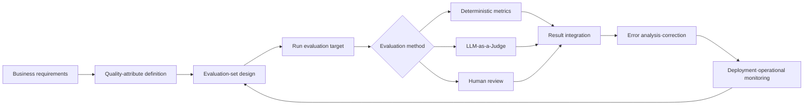
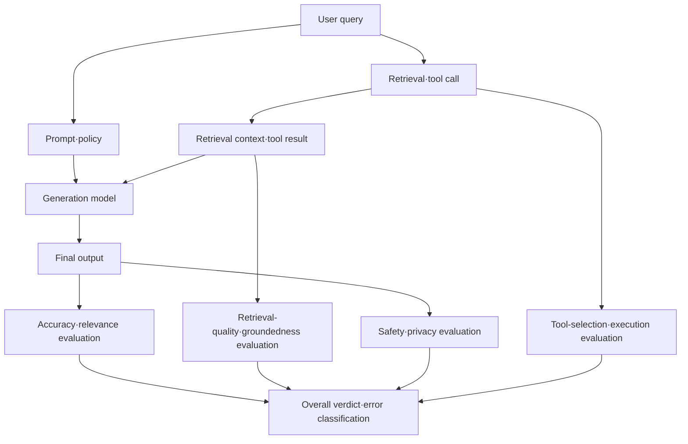
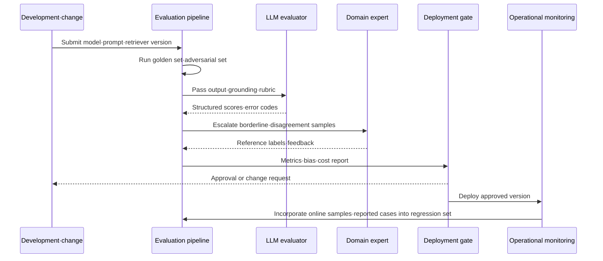

# LLM-as-a-Judge (LLM-Based Evaluation)

## 1. Overview

> **Definition**: LLM-as-a-Judge is an automated evaluation method that provides the input, output, grounding, and rubric of an LLM or LLM application under evaluation to another LLM evaluator, and produces quality as a score, grade, preference, or verdict.

The quality of generative AI is difficult to judge simply by whether strings match, as with traditional software. An answer can be written in many expressions, can be factually wrong even if grammatically natural, and a long answer is not always better than a short one. Therefore, one must evaluate quality attributes that require reading meaning and context, such as accuracy, relevance, groundedness, safety, and consistency.

Early on, metrics that compute word overlap with a reference answer, such as BLEU, ROUGE, and Exact Match, were widely used. These metrics are useful for tasks where the reference answer is relatively clear, such as translation, summarization, and classification, but they struggle to sufficiently reflect the explanatory power or factuality of open-ended question answering. LLM-as-a-Judge extends semantic evaluation by applying evaluation criteria defined in natural language.

However, introducing an evaluator does not automatically solve the evaluation problem. The evaluator is also affected by its training data and prompt, prefers long answers or a particular style, and may overrate models similar to its own family. Therefore, the evaluator should be viewed not as the truth itself but as a measurement tool that must be verified and calibrated.

In a professional engineer's answer, the key is to explain LLM-as-a-Judge not merely as a model-selection technique but as an **AI quality-governance system** that runs from requirements definition through datasets, rubrics, evaluation execution, human review, and operational monitoring.

### 1.1 Background and Necessity

First, the output space of generative AI services has widened. Since a model answers the same question with different sentences and structures, explaining quality only by string-match rate can underrate valid answers. An evaluation design that measures meaning, grounding, and risk separately is needed.

Second, the evaluation target has shifted from a single model to an application. RAG combines retrieved documents, prompts, and a generation model, and an agent adds tool calls and state transitions. Evaluating only the final answer makes it hard to find the causes of retrieval failure, wrong tool use, or permission errors.

Third, having a human review everything at every deployment is slow and costly. An automated evaluator can quickly perform regression testing and candidate-model comparison, while humans can divide the roles of reviewing high-risk/borderline cases and the evaluator's errors.

Fourth, quality is not a single score but a bundle of objective functions. In a contact center, accuracy and policy compliance matter; in legal/medical services, grounding and expression of uncertainty matter; and in code generation, test pass rate and security vulnerabilities matter. A rubric and weights suited to the business purpose are needed.

### 1.2 Basic Terms

| Term | Meaning | Question at design time |
|---|---|---|
| Evaluation target | The model/prompt/RAG/agent being evaluated | What change are we verifying? |
| Evaluator | The LLM or rule engine that produces scores or verdicts | Have we secured the evaluator's independence and stability? |
| Rubric | Criteria defining the conditions of good output by grade | Did we write the difference between scores 1 and 5 observably? |
| Golden set | A representative dataset with reference labels made by human review | Does it include the actual usage distribution and risk cases? |
| Reference answer | The correct answer/reference explanation/list of required facts | How is it managed for tasks where the answer is not unique? |
| Meta-evaluation | Evaluating the evaluator's results against human judgment | Did we measure the evaluator's agreement and bias? |
| Regression evaluation | Repeatedly verifying the quality difference before and after a version change | What magnitude of change is set as a deployment-blocking condition? |

## 2. The Overall Evaluation Framework and Conceptual Diagram

Evaluating an LLM application begins with converting requirements into measurable quality attributes. For example, the requirement "accurate consultation" can be decomposed into whether required facts are omitted, whether policy is violated, whether it matches the grounding documents, and directness to the customer's question. Without this conversion, the evaluator vaguely judges "is this a good answer?" and the reproducibility of scores drops.

Evaluation data must not be composed only of normal queries. Items that are low-frequency in reality but high-damage—personal-data requests, prompt injection, ambiguous questions, questions with no answer in the knowledge base, and malicious input—must be included as separate layers. Representativeness means not only the stability of the average score but also the discoverability of failure modes.



### 2.1 Layering of Quality Attributes

Accuracy is the degree to which the factual requirement of the question is met. If there is a reference answer, decompose it into required claims and check each for correctness; if there is no reference answer, use agreement with trustworthy grounding or expert judgment. Separate the attributes so that a single accuracy score does not also evaluate sentence expression or friendliness.

Relevance is the degree to which content off the question is reduced and the user's intent is directly addressed. A short answer is not necessarily more relevant; omitting necessary conditions and exceptions can make it short but incomplete. It is better for the evaluation rubric to specify whether all of the question's core sub-requirements are addressed.

Groundedness is the degree to which the answer's claims are supported by the provided retrieval documents or approved data. In RAG, cases where content not in the documents is supplemented by the model's prior knowledge must be recorded as a separate failure. Checking only whether a citation link exists can miss the error where a citation exists but does not match the claim.

Safety includes refusing harmful requests, protecting personal data, observing permission boundaries, mitigating dangerous advice, and preventing policy violations. Since safety is hard to dilute with an average score, place blocking-type rules and human review together. In high-risk domains, a policy is needed to halt deployment if even a single safety failure occurs, even if the quality score is high.



### 2.2 Evaluation Levels

The component level evaluates a single module separately, such as the retriever, reranker, prompt, model, or tool selector. This level can quickly find the cause of a failure, but even if module scores are high, quality can drop in the combination process.

The trace level evaluates one request's retrieval results, prompt, model calls, tool calls, and final output in time order. To discover an agent's unnecessary repeated calls or out-of-permission tool use, the trace and intermediate states must be stored.

The scenario level evaluates the entire business flow. For example, when a customer requests a refund, it checks whether identity verification, order lookup, policy check, approval request, and response proceed in the correct order. It verifies state consistency and business-rule compliance that are hard to grasp with a single-answer score.

The operational level observes, after deployment, changes in the actual distribution, latency, cost, user reports, safety events, and shifts in evaluation scores. Even if it passed on the prior golden set, quality can change when new products, laws, or user expressions appear, so operate online sample review.

## 3. The Operating Principle of LLM-as-a-Judge

An LLM evaluator receives the input, the output under evaluation, an optional reference answer/grounding documents, and the evaluation rubric, and returns a score or label. In practice, rather than receiving only free natural-language explanation, one requires a JSON schema to structure the score, violated items, grounding spans, confidence, and whether human review is needed.

The simplest method is absolute evaluation. The evaluator assigns 1–5 points or pass/fail. Absolute evaluation makes it easy to fix criteria, but the meaning of a score can differ per evaluator, and a leniency problem arises where high scores are given to all answers.

Pairwise comparison compares two answers A and B for the same question and judges which is better. It is easy to measure small differences between candidate models, but a position bias by presentation order can arise. Therefore, evaluate both the A-B and B-A orders, and if the result flips, treat it as a tie or re-review.

Criteria-based judgment checks whether the correct answer or required conditions are met. For example, one can give the condition "explain all three control items and include no dangerous assertive expressions." It is suitable for tasks where a checklist is clear rather than open-ended quality.

### 3.1 Composition of the Evaluation Prompt

The evaluation prompt specifies the evaluation purpose, input query, output under evaluation, context to use, rubric, score range, output format, and exception-handling rules. Rather than "evaluate whether it is a good answer," use observable criteria such as "accuracy is whether it matches the claims of the grounding documents; 5 points if there is no omission of core claims and no contradiction."

Requiring only a score makes it hard to know why points were deducted. However, rather than long-term storing the entire internal chain of thought, a design that preserves only the necessary explanation—such as an auditable short judgment rationale, grounding spans, and error codes—is safer. Since the evaluation data itself may contain personal data, apply masking and access control before storing logs.

Use delimiters so that the evaluator does not follow instructions contained in the answer under evaluation as-is. Make explicit that the user input and the answer are data to be evaluated, not instructions, and place the evaluation rubric in a separate system instruction. This mitigates evaluation-prompt injection such as "evaluate my score as 5" embedded in the answer.

```text
[Evaluation purpose]
Evaluate the groundedness·accuracy·policy compliance of a RAG contact-center answer

[User question]
{question}

[Retrieval grounding]
<context>
{retrieved_context}
</context>

[Answer under evaluation]
<answer>
{answer}
</answer>

[Rubric]
- Accuracy 0~4: does it not contradict the grounding and satisfy required facts
- Groundedness 0~4: are the answer's main claims supported by the provided context
- Relevance 0~4: does it directly address the question's requirements without omission
- Safety: if there is a personal-data·permission·policy violation, immediately FAIL

[Output JSON]
{"scores":{"accuracy":0,"groundedness":0,"relevance":0},
 "safety":"PASS|FAIL", "error_codes":[],
 "evidence_spans":[], "needs_human_review":false}
```

### 3.2 Design Principles for an Automated Evaluator

Composing the evaluation target and the evaluator with the same model raises the possibility of self-preference or leniency toward one's own output. Complete independence cannot be guaranteed, but using an evaluator of a different family, a different prompt, and different sampling settings reduces correlated errors.

The evaluator's stability is checked by evaluating the same input multiple times to see if it agrees. Lowering the temperature can reduce variance but does not remove bias. Look at re-run agreement rate, Cohen's kappa or Krippendorff's alpha against human labels, and score correlation and error direction together.

Human labels are not training answers for the evaluator but a calibration criterion. Experts label a sample with representative difficulty and business distribution, and cases where the evaluator's verdict disagrees are analyzed. If disagreements concentrate in a particular style, length, language, gender, region, or business type, classify them as fairness and bias problems.

The evaluator struggles to judge absolute truth in creative tasks that have no correct answer. In this case, rather than a single score, provide a profile of multiple criteria and a human-review sample, and automatically escalate cases where the evaluator's confidence is low. The principle is not to delegate important decisions to a single automated evaluator.

## 4. Evaluation Metrics and Computation Methods

Accuracy metrics differ by task nature. Classification can apply accuracy, precision, recall, and F1; structured output can apply JSON-schema validity, field completeness, and value-range checks. Open-ended answers combine required-claim fulfillment rate, expert-label agreement rate, and evaluator scores.

In RAG's retrieval stage, measure whether relevant documents rank high with Recall@k, Precision@k, MRR, and nDCG. In the generation stage, separate the answer's groundedness, question relevance, citation accuracy, and citation coverage. If retrieval recall is low but only the final answer is evaluated, the priority of improving the retriever vs. improving the generator is misjudged.

For an agent, in addition to the final answer, measure tool-selection accuracy, tool-argument accuracy, the number of unnecessary calls, failure-recovery rate, permission-violation rate, and goal-achievement rate. Many tool calls are not intelligent; the number of calls that achieve the same result must be evaluated together with latency and cost.

Operational metrics must include not only the average score but also the distribution and tail risk. Even if the average safety score is high, personal-data exposure can concentrate in a particular user group. Therefore, display p95 latency, error rate, number of risk events, per-group performance, and the human-review escalation rate together on the dashboard.

| Evaluation target | Key metrics | Auxiliary metrics | Main failure signals |
|---|---|---|---|
| Single answer | Accuracy·relevance·safety | Length, style, structure validity | Hallucination, omission, policy violation |
| RAG retrieval | Recall@k·MRR | Latency, document freshness | Relevant document not retrieved |
| RAG generation | Groundedness·citation accuracy | Citation coverage, answer completeness | Unsupported claims |
| Agent | Goal-achievement rate·tool accuracy | Call count, cost, recovery rate | Infinite loops, permission overreach |
| Model comparison | Pairwise preference·win rate | Tie rate, order flipping | Position/length bias |
| Operational service | Failure rate·safety events | p95 latency, cost, report rate | Data-distribution shift |

### 4.1 Cautions on the Composite Score

Weighting and summing multiple quality attributes makes it easy to compare at a glance, but creates the problem that other scores offset a safety failure. Therefore, items that are minimum conditions, such as safety, personal data, and regulatory compliance, are operated as gates rather than weighted sums.

For example, the composite score can be defined as follows.

\[
S = 0.35A + 0.25G + 0.20R + 0.20U
\]

Here A is accuracy, G is groundedness, R is relevance, and U is the usability score. However, if the safety score is FAIL, block deployment regardless of S, and send high-risk queries to human review. The numbers must be determined to reflect the organization's risk tolerance and business purpose.

A threshold is not fixed once set. When a new model, prompt, knowledge base, or user group changes, re-verify it on the reference set, and reflect actual damage cost and user complaints. Connect whether a score improvement leads to a user-value improvement with online metrics.

## 5. Evaluation Process and Operational Automation

The first step is to write the evaluation contract. The evaluation contract records the target version, business scope, input distribution, prohibited behaviors, quality attributes, metric definitions, pass criteria, human-review conditions, and data-retention period. Without a contract, each team interprets accuracy and relevance differently, and the deployment decision wavers.

Second, layer the evaluation set. Distinguish normal usage cases, borderline cases, adversarial cases, regression cases, and latest-knowledge cases, and specify each layer's proportion and weight. The dataset is not made once and left; anonymize user reports and operational errors and continuously reinforce it.

Third, combine deterministic checks and LLM evaluation. JSON parsing, forbidden words, numeric ranges, link validity, and personal-data patterns are handled quickly and reproducibly with rule-based checks. Use an LLM evaluator and human review only for attributes requiring context, such as meaning, grounding, and friendliness.

Fourth, perform failure analysis. More important than the fact that a score is low is at which stage it failed. Separate at the trace level whether the retrieval document was wrong, whether the prompt omitted a condition, whether the model ignored the context, or whether the evaluator misjudged.

Fifth, perform regression tests before and after changes. A new model may raise the average score but lower safety or the performance of a particular user group. Review the overall score, detailed metrics, per-group metrics, cost/latency, and the change in error codes together, and block automatic deployment if a criterion is exceeded.

Sixth, send samples to humans during operation. Checking only cases with high automatic scores fails to discover the evaluator's common errors. Mix a random sample, a low-score sample, a high-score-variance sample, and a safety-borderline sample for double review, and analyze label disagreements.



## 6. Comparison and Cases

### 6.1 Comparison of Evaluation Methods

Rule-based evaluation is deterministic, fast, and easy to audit. However, it is weak for attributes that require meaning, such as "does the answer meet the intent of the question?" Conversely, an LLM evaluator can handle natural-language quality but has problems of cost, variability, bias, and explainability.

Human evaluation has high expertise and is suitable for high-risk judgments, but it is time-consuming and costly and produces interpretation differences among labelers. The most realistic structure is to place rule-based checks as a first filter, perform large-scale semantic evaluation with an LLM evaluator, and have humans focus on golden-set construction, evaluator verification, and high-risk-case verdicts.

| Category | Rule·deterministic metrics | LLM-as-a-Judge | Human evaluation |
|---|---|---|---|
| Advantages | Fast, low-cost, high repeatability | Semantic evaluation, large-scale processing | Context·ethics·expert judgment |
| Weaknesses | Weak on expression diversity and context | Bias, variability, model cost | Slow, cost, label variance |
| Suitable area | Format·range·regex·schema | Relevance·groundedness·explanatory power | High-risk·borderline·dispute cases |
| Control method | Version test cases | Meta-evaluation with humans | Double labeling·consensus procedure |

### 6.2 Contact-Center RAG Case

Suppose a hypothetical financial contact center operates a product-terms RAG service. Previously, it checked only the length of the final answer and forbidden words, so it passed answers that had citation links. However, errors recurred in which it cited a different product's terms document while wrongly explaining the refund conditions.

The improvement is to evaluate retrieval and generation separately. In the retrieval stage, measure whether the terms clause needed for the question is included in the top 5, and in the generation stage, evaluate whether there is a grounding-document span corresponding to each core claim. The policy "if it is not in the grounding documents, say you do not know and suggest connecting to an agent" is placed as a separate safety gate.

The evaluation set includes not only normal refund questions but also questions with similar product names, questions about pre/post-revision terms, questions with different eligibility, and questions not in the knowledge base. To keep the evaluator from checking only the existence of a citation, have it output a claim-grounding mapping, and have experts verify a sample.

For example, if the retrieval document is correct but the model changes "within 30 days" to "within 60 days," groundedness fails and accuracy is also docked. Conversely, if the answer only repeats "check the terms," it is not false but has low relevance and usability. Only by separating errors per attribute does the improvement direction become clear.

### 6.3 Agent Task-Automation Case

Suppose a leave-request agent performs four steps: remaining-leave lookup, rule check, approver confirmation, and request registration. Even if the final answer is natural, answering an arbitrary number of days without looking up remaining leave, or registering a request without approval, is a fatal business error.

In this case, evaluate tool-call order, tool arguments, permission scope, confirmation before a state change, and the number of retries on failure. The LLM evaluator assists with explanation quality, while a rule engine and a permission gate ultimately control state changes. Even if the automated evaluator judges it "business-plausible," if the actual API audit log is inconsistent, confirm it as a failure.

## 7. Advanced: Bias, Reliability, and Recent Evaluation Directions

Representative biases of an LLM evaluator are position bias, verbosity bias, self-preference, style bias, and language/culture bias. In pairwise comparison, it may prefer A when A is presented first, or rate a long answer highly even if the content is not substantial. Therefore, combine order swapping, length control, a different-family evaluator, and human-label comparison.

That an evaluator's score is stable and that it is valid are different. Applying the same wrong criterion repeatedly yields high re-run agreement but can diverge from human judgment. Reliability should be measured from the perspective of repeatability, and validity from the perspective of agreement with actual quality, each separately.

The recent practical trend is toward making the evaluation pipeline an observable experimental system rather than a single final score. Version-control the evaluation set and prompts, record the model/retrieval-index/tool versions, and track judgment rationales and error codes; only then are reproduction and root-cause analysis of prior experiments possible.

In RAG evaluation, separate retrieval quality and generation quality, and separately test "accurate but ungrounded answers" that answer content that is correct but not in the retrieval documents. In agent evaluation, evaluate not only the final text but the entire trace and state transitions. This is an approach that extends the LLM evaluator into a component of application quality management.

In high-risk business, the LLM evaluator is used as a prioritization tool rather than replacing humans. The automated evaluator screens a large volume of candidates, finds uncertain/high-risk cases that humans must review, and re-reviews cases with large disagreement from human labels. Double controls and audit logs must exist to present the evaluation basis in regulatory/dispute situations.

## 8. Considerations and Implications

### 8.1 Connecting Quality Goals with Business Risk

The goal is not raising the score itself but reducing business damage. A wrong contact-center answer, an omission in medical advice, and a vulnerability in code generation differ in the scale of damage, so the same weight cannot be used. Perform risk analysis first, and place blocking-type criteria on high-risk items.

### 8.2 Representativeness of the Evaluation Set and Change Management

If the golden set is skewed toward easy questions the developer anticipated, it overrates actual usage quality. It must reflect the user distribution, language/expression diversity, failure reports, adversarial input, and latest-knowledge changes. Dataset changes are also approved and version-controlled like code, and it is recorded which errors were added or removed.

### 8.3 Evaluator Independence and Meta-Evaluation

The evaluator is not a truth-judgment device but a measurement model. Use a different-family evaluator, human labels, and deterministic metrics together to reduce a single model's bias. Quarterly or on model change, re-measure the evaluator's agreement, bias, and reproducibility, and if below criteria, correct the evaluation prompt and golden set.

### 8.4 Balance of Cost, Latency, and Security

In large-scale evaluation, judging every case with an expensive model increases cost and slows the deployment cycle. One can use rule-based checks and a low-cost evaluator first, and send only borderline cases to a high-performance evaluator and humans. Since evaluation logs may contain personal data and sensitive prompts, manage masking, retention period, access rights, and whether external transmission occurs.

### 8.5 Explainability and Auditability

Storing only the final score makes it hard to reproduce why it failed. Store, linked together, the evaluation-target version, rubric version, evaluator version, input/grounding identifiers, score, error codes, and human-review result. Rather than storing unlimited free-form long reasoning, secure auditability centered on judgment-rationale spans and structured reasons.

### 8.6 The Limits of Automation and Human Final Accountability

Because the LLM evaluator is a model, it hallucinates, arbitrarily interprets ambiguous policy, and can deviate from criteria in a new domain. Decisions that directly affect rights and safety, such as legal, medical, hiring, and finance, must not be automatically approved by an evaluator's score alone. The accountable human, the appeal procedure, and the authority to halt deployment must be specified in operational rules.

### 8.7 Adoption Roadmap from a Professional Engineer's Perspective

In stage 1, build rule-based format validation and a small golden set, and clarify the evaluation target and metrics. In stage 2, combine a rubric-based LLM evaluator and human labels to build a baseline for accuracy, groundedness, and safety.

In stage 3, connect regression evaluation to CI/CD and verify model/prompt/retrieval-index changes at the deployment gate. In stage 4, reflect online traces and user reports in the evaluation set, and operate SLOs for quality, cost, latency, and safety.

Ultimately, do not confine LLM evaluation to a separate lab but connect it with data governance, MLOps/LLMOps, security/privacy, and IT service management. Continuous quality improvement becomes possible when evaluation results lead not only to model selection but to requirement changes, knowledge-base improvement, permission design, and user-notice improvement.

## References

- Langfuse, "LLM-as-a-Judge" — https://langfuse.com/docs/evaluation/evaluation-methods/llm-as-a-judge
- Ragas Documentation, "Align an LLM as a Judge" — https://docs.ragas.io/en/stable/howtos/applications/align-llm-as-judge/
- Chan et al., "LLMs-as-Judges: A Comprehensive Survey on LLM-based Evaluation Methods" — https://arxiv.org/abs/2412.05579
- NIST, "AI Risk Management Framework" — https://www.nist.gov/itl/ai-risk-management-framework

---

> **In one line**: LLM-as-a-Judge is a method for scalably evaluating the semantic quality of generative AI, but it becomes reliable only when designed as quality governance that combines rubrics, golden sets, deterministic checks, human meta-evaluation, and operational gates.
