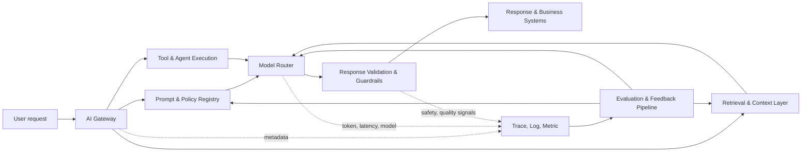
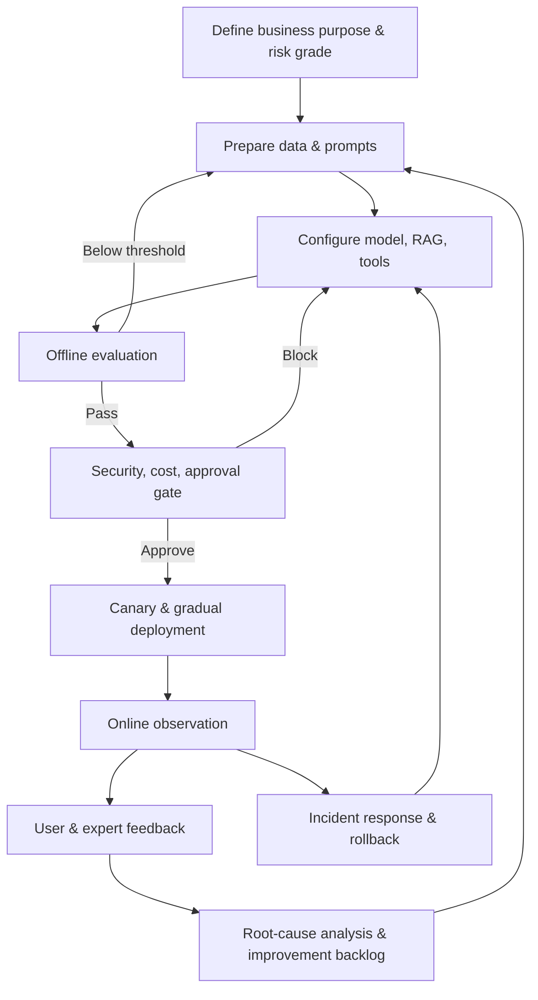

# LLMOps (Large Language Model Operations) and Generative AI Service Lifecycle Management

## 1. Overview

> **Definition**: LLMOps (Large Language Model Operations) is a practice methodology that manages prompts, models, data, retrieval, tool invocation, evaluation, observability, security, and cost as a single repeatable operational system in order to develop, deploy, operate, audit, and improve large language models and the applications built on them.

Large language model services, unlike traditional software, do not always produce the same output for the same input.
The model's own probabilistic generation, changes to the provider's model, small edits to a prompt, changes in retrieved documents, and the results of tool invocations together alter output quality.
Deploying application code alone therefore cannot guarantee service quality.

Early generative AI projects often stored prompts temporarily in notes or code, checked quality against a handful of example questions, and put them straight into production.
This approach can produce a demo quickly, but it makes it hard to reproduce which prompt and model used which evidence.
It is also hard to trace the cause when incorrect answers, hallucinations, prompt injection, or personal-data exposure occur.

LLMOps is an approach that does not eliminate this uncertainty but turns it into controllable change.
It makes the elements that can change into units of version and approval, and connects pre-release evaluation with runtime observation.
It measures quality, safety, latency, and cost simultaneously to reduce the side effects of optimizing a single metric alone.

This answer discusses the composition principles and reference architecture of LLMOps, its differences from MLOps, the process from development to retirement, controls for evaluation, observability, and security, case studies, and adoption strategies from an information-management engineer's perspective.

## 2. Goals and Composition Principles of LLMOps

The first goal of LLMOps is reproducibility.
The user request, system prompt, retrieval query, retrieved-document identifiers, model identifier, parameters, tool invocations, output, and evaluation results must be linked so that the same event can be analyzed again.
Rather than forcing complete determinism, a realistic goal is to leave evidence from which the same conditions can be reconstructed.

The second goal is sustained quality.
LLM responses are hard to evaluate on accuracy alone; groundedness, relevance, consistency, safety, and format compliance appropriate to the business purpose must be considered together.
Therefore an evaluation dataset composed of representative questions is combined with automated, expert, and user evaluation to compare the difference before and after a change.

The third goal is operational efficiency.
Model-call cost and token count, cache hit rate, retrieval depth, number of tool invocations, and GPU or external-API usage must be managed.
Choosing only large models to raise performance increases cost and latency, so routing, caching, prompt compression, and substitution with smaller models must be reviewed together.

The fourth goal is accountability and controllability.
It must be possible to confirm who approved the system for what purpose and with what data, which policy was violated, and what action was taken after an incident.
This includes not only technical logs but also governance information such as owner, risk grade, purpose of use, retention period, and change approval.

The following diagram shows the overall structure in which a user request passes through multiple operational assets to be transformed into a response and evidence.

The AI Gateway is a boundary layer that abstracts multiple model providers and applies authentication, rate limiting, routing, and cost policies.
Unlike a simple proxy, it must be able to manage model versions, input/output policies, fallback paths on failure, and per-tenant usage together.

The prompt and policy registry version-controls system prompts and templates in source code or a dedicated repository.
Because changing only the prompt changes the result, review, approval, and rollback procedures equivalent to those for code are needed.

The retrieval and context layer collects, cleanses, splits, embeds, and indexes documents to be used in RAG, and retrieves evidence matching the request.
If the index version and document permissions are not managed together when documents change, stale or unauthorized information can be mixed into responses.

The model router selects a model based on task type and risk level.
A representative approach processes simple classification with a small model and routes complex reasoning or high-risk tasks through a higher-tier model and human review.
Routing rules must include not only quality but also cost, latency, region/data sovereignty, and the possibility of substitution on failure.

Response validation and guardrails inspect both input and output.
On input they check for prompt injection, excessive personal data, and out-of-policy questions; on output they check for forbidden terms, sensitive information, structured format, evidence links, and business rules.
When a guardrail fails, branching by risk level to re-query, masking, guidance messages, or human approval fits the service purpose better than unconditionally blocking.

## 3. Operational Lifecycle and Reference Process

The LLMOps lifecycle consists of a cycle of ideation, data/purpose definition, prompt and chain design, offline evaluation, deployment, online operation, feedback and improvement, and retirement.
The output of each stage must flow into the next so that operational quality does not depend on an individual's experience.

### 3.1 Purpose Definition and Risk Classification

In the first stage, the objective is not to adopt a model but to define the business outcome to be solved.
For example, a call center's goal may be not "generate an answer" but "reduce agent handling time with a draft answer grounded in internal policy, while the agent retains final responsibility."
A concrete goal makes it possible to set measurements such as accuracy, handling time, agent edit rate, and personal-data incident rate.

Risk grades are classified based on business impact and error tolerance.
Simple document summarization may allow automatic posting, but tasks that affect rights or property—such as loan approval, medical judgment, or HR actions—are restricted to assistive tools and require human approval.
A risk grade is not automatically lowered just because model performance improved; legal liability, scale of harm, and recoverability are reflected together.

### 3.2 Managing Prompt, Model, and Data Assets

A prompt is not a string but an executable policy asset.
The template ID, version, author, reason for change, input variables, allowed models, expected output schema, prohibited cases, and approval status are recorded together.
In production, the model identifier and change date guaranteed by the provider are recorded instead of a floating model alias, to reduce unexpected model replacement.

The model registry links the base model, fine-tuning adapters, quantization method, license, sources of training/validation data, evaluation results, and deployment status.
If only the model file is kept without leaving the data and evaluation conditions, it is hard to explain performance degradation or licensing issues.

For RAG data, permissions and freshness matter as much as document content.
At ingestion, the source system, owning department, validity period, deletion/correction history, and access level are stored, and the relationship between chunks and embeddings is tracked.
When a document deletion request arrives, the retention policy of the caches, vector index, and retrieval-result logs must be checked as well as the source repository.

### 3.3 Evaluation Design and Quality Gates

LLM evaluation separates evaluation of whether an output matches a correct-answer string from evaluation of whether it fits the business purpose.
Summarization is evaluated on fact preservation and omission, question answering on groundedness and whether the question is answerable, and agents on tool selection and execution results.
A single composite score is convenient, but it can let high fluency mask a drop in safety, so raw metrics are kept as well.

Offline evaluation sets are not made from normal questions only.
They must include typos, multilingual input, long documents, contradictory material, unauthorized requests, adversarial input, and edge cases in order to predict real failures.
When reusing operational logs as an evaluation set, personal data is de-identified and it is separately controlled whether the evaluation data is used again for model training.

Automated evaluation is advantageous for quickly detecting regressions, while human evaluation is advantageous for discovering business context and subtle harmfulness.
LLM-as-a-Judge has the advantage of cost and speed, but because the judge model has bias and self-preference, expert cross-validation on a sample is needed.

Representative metrics are grouped by purpose as follows.

| Quality area | Example measurement | Caution in interpretation |
|---|---|---|
| Accuracy & groundedness | Accuracy rate, citation-evidence adequacy rate, "cannot answer" judgment | State per-task correctness criteria and document freshness |
| Generation quality | Relevance, consistency, instruction-following rate, format-error rate | Fluency does not guarantee factuality |
| RAG quality | Retrieval recall, retrieval precision, context faithfulness | Separate retrieval failure from generation failure |
| Safety | Policy-violation rate, personal-data exposure rate, injection success rate | Look at worst cases and high-risk groups, not the average |
| Operability | p50/p95 latency, error rate, availability | Decompose by model, retrieval, and tool segments |
| Economics | Tokens per request, cost per request, cache hit rate | Confirm it is cost reduction without quality loss |

Quality gates must declare pass/fail criteria in advance.
For example, connect metrics and actions like "convert an ungrounded answer to 'cannot answer,' target zero high-risk policy violations, and keep p95 latency within the service target."
Actual thresholds are set based on business risk and user expectations, and the example figures in a document must not be mistaken for an organization's universal standard.

### 3.4 Deployment, Rollback, and Online Operation

An LLM application deploys not only the model but also prompts, retrieval index, tool schemas, and guardrail rules together.
Therefore all component versions are recorded in a single release manifest, and only combinations that pass compatibility checks are promoted.

Canary deployment applies the new combination to part of the traffic and compares quality and operational metrics.
More important than the traffic ratio are the observation window, the comparison group, the abort conditions, and who is responsible for automatic or manual rollback.
Because model response quality varies greatly by request type, not only the overall average but also core business groups and risky-input groups are monitored separately.

Rollback is not merely reverting to the previous model.
The previous prompt, retrieval index, tool version, and policy settings must be restored as a compatible bundle.
If an old index cannot be restored, preparing a read-only mode or a safe response without retrieval is a more realistic recovery strategy.

## 4. Core Operational Controls

### 4.1 Observability and Traceability

Infrastructure logs alone cannot explain "why this answer came out."
Within a single request's trace, the source text or a protected reference value, the prompt version, model identifier, retrieval query and document IDs, tool invocations, token count, latency, response-validation results, and user feedback must be linked.
Sensitive source text is subject to minimal collection, masking, and access control, and the retention purposes of analysis logs and audit originals are distinguished.

Observability is not about storing many signals but about providing the context needed for decisions.
For example, when latency increases, it must be possible to decompose whether the cause lies in model inference, retrieval, external tools, or retries.
When quality degrades, its correlation with a specific prompt version, document collection, or model routing must be verifiable.

### 4.2 Security and Privacy Protection

Prompt injection can be contained not only in user input but also in retrieved documents and tool results.
Therefore external content is separated into instructions and data, and tool invocations are restricted with allow-lists, least privilege, argument validation, and re-approval.
A structure is needed in which the model is not given system privileges directly but an intermediary service re-verifies the user's privileges.

For personal data, the purpose and retention period are checked before input, and if necessary the data is masked, tokenized, or passed to the model after sensitive-data detection.
The output must also be checked for the possibility of source-text reconstruction or indirect identification, and logs, evaluation sets, caches, and vendor-transmission areas are managed as the same data flow.

The data-training usage terms, processing region, retention/deletion policy, incident notification, and subprocessors of the model provider and external APIs are confirmed by contract and technical configuration.
In particular, the data-handling terms of free or development endpoints must not be confused with those of production endpoints.

### 4.3 Cost and Performance Optimization

Cost per request can be thought of as a function of input tokens, output tokens, model unit price, number of calls, and retrieval and tool costs.
Decomposing it roughly as `request cost = input token cost + output token cost + auxiliary call cost` makes it easier to find the cause of a cost increase.

Cost reduction is not simply shortening prompts.
Repeated context is cached, duplication in retrieval results is removed, models are routed according to request difficulty, and retries from tool-call failures are limited.
However, excessively abbreviating context can lower groundedness, so it is optimized together with quality metrics.

For performance, tail latency matters more than average latency.
If p95 or p99 is high, users experience intermittent stalls, so timeouts and fallback paths are placed per retrieval, model, and tool segment.
Streaming responses can reduce time to first token, but total completion time and the safety of partial responses on interruption are also evaluated.

### 4.4 Governance and Auditing

The unit of approval in LLMOps is not a single model but the combination of business purpose and execution configuration.
The model risk assessment, data rights, prompt changes, evaluation results, security checks, operations owner, and emergency stop procedure are linked into a single decision record.

Change management records not only "what changed" but also "why it was changed and what risk was accepted."
Even if a prompt edit improved quality, it may increase disadvantageous output for a particular group, so representative evaluation and approval records are needed.

## 5. MLOps vs. LLMOps vs. GenAIOps

MLOps focuses on systematizing the experimentation and deployment of data, features, and trained models.
LLMOps additionally handles the runtime variability of application execution—prompts, retrieval context, tokens, generation quality, tool invocation—more than model retraining.
GenAIOps is an expression that broadens the scope to the operation of generative AI in general, including not only text but also images, audio, and video, and depending on the organization it is used as a higher-level concept that encompasses LLMOps.

| Category | MLOps | LLMOps | Practical implication |
|---|---|---|---|
| Main subject | Trained models & feature pipelines | LLM apps, prompts, RAG, tools | Application-execution traces are essential |
| Quality evaluation | Accuracy, F1, AUC, drift | Groundedness, fluency, safety, tool-success rate | Combine quantitative and qualitative evaluation |
| Unit of change | Data, code, model | Prompt, model, index, tools, policy | A release manifest is needed |
| Cost variables | Training & inference resources | Tokens, number of calls, model unit price | Observe cost per request |
| Failure modes | Predictive-performance degradation | Hallucination, injection, format violation, nondeterminism | Place input/output guardrails |
| Operational responsibility | Model & data engineers | App, platform, security, business owners | Shared responsibility and an approval system are needed |

This difference does not mean LLMOps replaces MLOps.
If you train or fine-tune a base model directly, you need MLOps's data, experiment, and model registries, and on top of that you must add prompt, retrieval, and agent operation.
Conversely, an enterprise using an external model API also needs LLMOps to monitor provider changes, quality regressions, and data-handling terms, because it cannot control the model internals.

## 6. Application Cases

### 6.1 Internal-Policy Retrieval Call Center

Suppose a financial institution adopts a RAG service that helps agents search internal policy.
Legacy search listed keyword-matching documents, but the LLMOps approach classifies the question intent and customer type, retrieves only authorized policies, and then generates a draft answer that includes evidence paragraphs.

Before operation, an evaluation set is composed of representative inquiries, exception policies, repealed policies, and malicious instructions.
It measures whether the answer accurately cites the evidence documents, whether it withholds an answer when there is no evidence, and what proportion of answers the agent edited.

During operation, the validity period and revision history of policy documents are reflected in the index metadata.
When a new policy is deployed, the index version and prompt version are promoted together, and canary validation is performed on core product groups.

Keeping an agent-approval step rather than sending automatically to the customer reduces the harm from generation errors.
However, since agents may copy model output uncritically, evidence display, uncertainty statements, edit history, and training must be provided together.

### 6.2 In-house Development Assistant Agent

A development assistant agent can perform code search, issue summarization, test execution, and even deployment requests.
In this case the tool-invocation privileges and change impact are greater than for a simple chatbot, so read operations and write operations are separated, and human approval is required for reflecting changes into operational branches.

Because prompts and repository documents can cross trust boundaries, a retrieved README or issue comment is not treated as an execution instruction.
Tool-invocation arguments and the target repository are validated, and execution commands are run within a sandbox and time/network limits.

Evaluation verifies not only code accuracy but also refusal of dangerous commands, detection of test failures, prevention of secret exposure, and the accuracy of change descriptions.
Operational metrics are viewed together with task-completion rate, human-rejection rate, test-pass rate, tool-failure rate, and cost per request.

The key point of this case is not that the agent does more work, but that the allowed scope of automation and the boundaries at which it can be halted are made clear.

## 7. Deep Dive: Recent Operational Directions of LLMOps and Exam Linkage

Recently LLMOps has been expanding from managing model servers to managing the quality, safety, and economics of the entire application.
The official LLMOps guidance explains prompt management, evaluation, tracing, deployment, monitoring, and continuous improvement as a single operational flow ([MLflow LLMOps Guide](https://mlflow.org/llmops)).

This direction changes the idea that operation ends once you build an API that calls a model.
Because prompts, retrieval, tools, guardrails, and evaluation data change independently, the combination of changes must be tracked and quality regressions detected automatically.

From an AI risk-management perspective, reliability, safety, security, transparency, explainability, and privacy protection must be woven into operational controls.
The NIST AI RMF provides a voluntary framework for managing the risks of AI systems, so LLMOps evaluation and audit items can be linked to an organization's risk-management system ([NIST AI Risk Management Framework](https://www.nist.gov/itl/ai-risk-management-framework)).

On the security side, prompt injection, sensitive-information disclosure, supply-chain vulnerabilities, and excessive agent privileges are repeatedly checked at the pre-, during-, and post-operation stages.
OWASP's list of risks for LLM applications can be used as a starting point for development and operations teams to organize threat scenarios and controls ([OWASP Top 10 for Large Language Model Applications](https://owasp.org/www-project-top-10-for-large-language-model-applications/)).

In an information-management engineer's answer, it is effective to present LLMOps not as a "list of tools" but as a management cycle of business goal → asset version control → evaluation gate → gradual deployment → observation & incident response → feedback improvement.
It is also important to describe not only accuracy but also the trade-offs of quality, safety, latency, and cost together with humans' final responsibility.

## 8. Considerations and Implications

### 8.1 Business Purpose and the Limits of Automation

Before adopting an LLM, judge whether the task is recoverable even if an error occurs, whether human review is possible, and whether correct-answer evidence can be secured.
For high-risk tasks, prioritize decision support and approval evidence over full automation.

### 8.2 Representativeness and Leakage of Evaluation Data

The evaluation set must represent actual users' language, task types, and exceptional situations.
Reusing operational questions directly for training/evaluation can overestimate performance through data leakage, so splitting and access rights are managed.

### 8.3 Vendor Lock-in and Switchability

Depending deeply on a specific model's proprietary features makes switching difficult when cost, policy, or quality changes.
Prepare a model abstraction layer, a prompt contract, a common evaluation set, and performance criteria for alternative models, while balancing so that the abstraction does not overly restrict a model's unique capabilities.

### 8.4 Privacy and Data Sovereignty

Drawing input, retrieval, cache, logs, evaluation sets, and external-model transmission as a single data flow makes it possible to find missing processing points.
Prevent use beyond purpose and long-term retention, and procedurally define how deletion/correction requests are reflected in embeddings and backups.

### 8.5 The Paradox of Observation Data

A detailed trace is useful for explaining a failure's cause, but it can itself become a repository of sensitive information.
Use tokenized reference values instead of source text, and separate the query scope, retention period, and audit log by operator role.

### 8.6 Joint Optimization of Cost and Quality

Setting cost reduction alone as the KPI can lower quality through reduced evidence documents or a switch to a smaller model.
View cost per request, business success rate, safety, and latency on one dashboard and decide from a Pareto perspective.

### 8.7 Organization and Responsibility

The platform team provides a common runtime and observation, the business owner defines correctness criteria and risk tolerance, and the security, legal, and privacy staff review controls and approval criteria.
Because the model provider does not assume business responsibility for answers, the final owner and the authority to halt in an incident must be made clear.

### 8.8 Continuous Improvement and Retirement

Models, prompts, and data are not permanent assets but subjects of re-evaluation for performance and risk.
Features with low usage or no value relative to risk are safely retired, and only when the related keys, caches, indexes, logs, and access rights are also cleaned up does true lifecycle management result.

## References

- MLflow, "What is LLMOps?": https://mlflow.org/llmops
- MLflow Documentation, "LLMs & Agents": https://mlflow.org/docs/latest/
- NIST, "AI Risk Management Framework": https://www.nist.gov/itl/ai-risk-management-framework
- OWASP, "Top 10 for Large Language Model Applications": https://owasp.org/www-project-top-10-for-large-language-model-applications/
- NVIDIA Developer Blog, "Mastering LLM Techniques: LLMOps": https://developer.nvidia.com/blog/mastering-llm-techniques-llmops/
- OpenTelemetry, "Generative AI semantic conventions": https://opentelemetry.io/docs/specs/semconv/gen-ai/

---

> **In one line**: LLMOps is a system that bundles prompts, models, retrieval, tools, evaluation, security, cost, and observability with versions and evidence to turn generative AI into a reproducible and accountable operational service.
