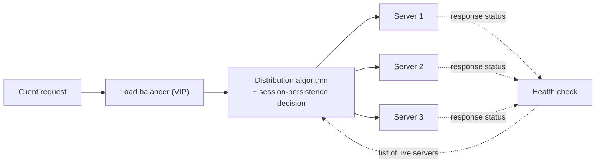
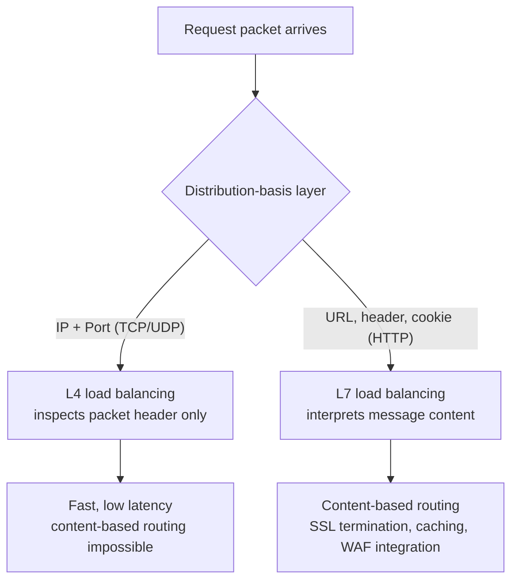

# Load Balancing and L4/L7 Traffic Distribution

## 1. Overview

> **Load balancing** is a technology and architectural principle that regularly distributes many client requests across multiple servers (or processing resources) to prevent load from concentrating on a particular resource and to secure availability, scalability, and responsiveness.

A structure that handles all requests with a single server runs into three limitations. First, its processing capacity has a clear ceiling, so as traffic increases, response delays and timeouts occur. Second, if that server fails, the entire service stops—it becomes a single point of failure (SPOF). Third, non-disruptive deployment and patching are difficult, so the service must be stopped during maintenance. Load balancing groups servers that perform the same role into a single logical service and places a layer in front of them that divides the traffic, mitigating these three problems simultaneously.

The background to the need for load balancing lies in changing traffic patterns. Situations where requests suddenly spike by tens of times—an e-commerce discount event, the opening time of a public reservation system, the release of new content on a streaming service—have become commonplace. For example, a large domestic ticketing site receives 30 to 50 times the normal traffic for several minutes right after tickets open, which a single server physically cannot handle. Moreover, as cloud and auto-scaling have become widespread, intelligent distribution that sends traffic "only to the servers alive right now" has become essential in environments where the number of servers changes in real time.

Load balancing is not simply "dividing requests evenly." It must be understood as a comprehensive traffic-management system that includes health checks to identify live servers, session persistence to route the same user's requests to the same server, selection of a distribution algorithm suited to the traffic characteristics, and even distribution across geographically dispersed data centers (GSLB).

### A. Core Value Provided by Load Balancing

The benefits of load balancing are summarized in three quality attributes. The first is **availability**. Because multiple servers provide the same service, even if some die the rest absorb the traffic, and health checks automatically isolate a failed server. This removes the single point of failure and enables non-disruptive deployment and rolling updates.

The second is **scalability**. When requests increase, you only need to scale out servers and add them to the pool, and the load balancer directs traffic to the new servers. Unlike vertical scaling (replacing with a larger server), there is no physical ceiling, and when combined with auto-scaling, capacity is adjusted automatically in proportion to traffic.

The third is **performance**. Distributing load lowers per-server throughput, reducing response delay and queue waiting, and region-based distribution (GSLB) assigns a server close to the user, even shortening network round-trip latency. These three values are complementary, so load balancing has effectively become an essential component of today's large-scale service architectures.

## 2. Overall Structure and Processing Flow of Load Balancing

A load-balancing system consists of clients, a load balancer, a server pool, a health-check module, and a session/policy store. The load balancer exposes a single virtual IP (VIP) and service port to clients, and internally relays requests to multiple real servers.

The key in the diagram above is that two control loops run simultaneously. One is the **distribution path** of request → algorithm → server, and the other is the **monitoring path** in which health checks periodically verify each server's liveness and reflect it in the algorithm. Without the monitoring path, requests would keep flowing even to an already-dead server, magnifying errors. In practice, the health-check interval (e.g., 5 seconds) and failure threshold (e.g., isolate after 3 consecutive failures) are tuned to remove a failed server quickly while balancing against false positives that pull a healthy server out due to a momentary delay.

### A. Principles and Layers of Health Checks

A health check is the basis for judging "may I send traffic to this server?" The simplest method is an L3-layer ICMP Ping that checks only the server's network connectivity, but this cannot filter out cases where the OS is alive but the application has stopped (for example, the web-server process is up but the DB connection pool is exhausted).

Therefore, in practice, the check is performed at a higher layer. An L4 check confirms that the TCP 3-way handshake completes normally, verifying that the port is open. An L7 check sends an actual HTTP request (e.g., `GET /healthz`) and confirms a 200 response and even a specific body string, so it can determine the logical health of the application. A mature service implements a deep health check in which the `/healthz` endpoint checks connections to the DB, cache, and external APIs and returns a composite result.

However, a deep health check is a double-edged sword. If the health check verifies down to the DB, then when the DB temporarily slows down, all servers are judged "unhealthy" simultaneously and the entire server pool drops out—a cascading failure. To prevent this, it is recommended to separate a shallow check (process liveness) from a deep check (dependency status), and to design the system so that during a dependency failure it keeps receiving traffic but operates in a degraded-performance mode.

### B. Session Persistence (Sticky Session)

HTTP is inherently stateless, but when user state such as login status or a shopping cart is kept in server memory, that state disappears if the same user's subsequent request goes to a different server. Session persistence prevents this.

Methods of session persistence include source-IP-based (Source IP Hash) and cookie-based (the load balancer inserts a server-identifying cookie). The IP-based method is simple to implement, but if many users are behind the same NAT/proxy, they pile onto one server. The cookie-based method can pin precisely per user, so it is widely used in web services.

But from an information-management engineer's perspective, the more important insight is that "session persistence conflicts with scalability." When a user is pinned to a particular server, only that server gets overloaded, and even if servers are added by auto-scaling, existing users are not migrated. Therefore the standard in modern architecture is to separate the session itself from server memory into an external session store like Redis or a stateless token like JWT (session externalization), and to design the load balancer to focus on pure distribution without session persistence.

### C. Load-Balancing Implementation Forms

Load balancing is divided by implementation method into hardware, software, and DNS types. The hardware type is a dedicated appliance (ASIC-based) that provides ultra-fast processing and stability but has a high acquisition cost and is scaling-bound to the physical device. The software type runs on general-purpose servers like NGINX, HAProxy, and Envoy; it is flexible, inexpensive, and configuration-manageable as code (IaC), and has become mainstream in the cloud era.

The DNS type is the simplest method, responding to a domain query with multiple IPs in turn. It enables wide-area distribution without separate equipment, but because of DNS caching by clients and resolvers, changes in server status are not reflected immediately and fine-grained load awareness is difficult. So the DNS type is used as the first gateway of GSLB, while the actual precise distribution is handled by the backend L4/L7 load balancer in a layered configuration, which is common.

## 3. Comparison of L4 and L7 Load Balancing

Load balancing is broadly divided into the L4 (transport layer) method and the L7 (application layer) method, depending on which OSI-layer information the traffic is divided on. This distinction is the core most frequently asked in exams.

**L4 load balancing** decides the server by looking only at the IP address and TCP/UDP port number. Because it does not interpret the packet payload (content), the processing burden is small and latency is low, and it can handle millions of connections per second. On the other hand, because it does not know the request content, content-based distribution such as "image requests to the image server, API requests to the API server" is impossible.

**L7 load balancing** interprets the HTTP message's URL path, host header, cookies, and even method. For example, path-based routing that sends `/api/*` to a backend server group and `/static/*` to a static-content server is possible, and it provides additional features such as SSL/TLS decryption (SSL termination), response caching, WAF (web application firewall) integration, and request rewriting. In exchange, because it parses and decrypts messages, it consumes more resources than L4 and latency increases somewhat.

This difference stands out especially in a microservices environment. When, under a single domain (`shop.example.com`), product lookup is split into a catalog service, payment into a payment service, and search into a search service, an L7 load balancer looks only at the URL path and routes each request precisely to the responsible service pool. Such service-level distribution is impossible with L4 alone, so in microservices and API-gateway architectures, L7 load balancing effectively becomes essential.

| Category | L4 load balancing | L7 load balancing |
|------|------------|------------|
| Distribution basis | IP, TCP/UDP port | URL, HTTP header, cookie |
| Processing performance | Very high (low latency) | Relatively low (parsing burden) |
| Content-based routing | Impossible | Possible (by path/domain) |
| SSL handling | Pass-through | Termination/re-encryption possible |
| Additional features | Limited | Caching, compression, WAF, auth integration |
| Representative use | Games, DB, high-volume streams | Web, API, microservices |

The fundamental reason the difference arises is "how deeply it looks." L4 delivers by looking only at the envelope (header), so it is fast but cannot judge based on content; L7 opens the envelope and reads the letter (message), so it is precise but slow. The practical implication is to combine the layers. A large-scale service commonly adopts a two-tier structure in which L4 at the very front spreads massive traffic across multiple L7 load balancers, and the L7 layer performs fine-grained routing and security handling. Placing a cloud L4 LB in front of Kubernetes Ingress (L7) is a representative example.

Another point to note is where SSL/TLS is handled. If the L7 load balancer terminates TLS (SSL termination), the server only needs to handle plaintext HTTP, so the server's encryption/decryption burden disappears, and because the load balancer manages certificates centrally, renewal and rotation are simplified. On the other hand, the load-balancer-to-server segment becomes plaintext, creating internal-eavesdropping risk, so in regulated industries (finance, healthcare) SSL bridging—decrypting at the load balancer and re-encrypting to the server—is applied to maintain end-to-end confidentiality. This is a case where layer selection is directly linked not to a simple performance issue but to security and regulatory requirements.

## 4. Load-Balancing Algorithms

The rule that decides which server to send to is the distribution algorithm, chosen by considering server performance differences and request characteristics. Algorithms are broadly divided into static methods that do not consider state and dynamic methods that reflect the server's current load and response. Static methods are predictable and computationally cheap, whereas dynamic methods reflect actual load for more even distribution but incur state-collection and computation overhead.

- **Round Robin**: Distributes to servers in turn. Simple to implement and effective when server performance is uniform, but if processing time varies greatly per request (e.g., some requests take 1 ms, others 5 seconds), the load becomes unbalanced.
- **Weighted Round Robin**: Assigns weights in proportion to server specifications, sending twice the requests to a server that is twice as powerful. Useful in heterogeneous server environments.
- **Least Connection**: Sends to the server with the fewest current active connections. In environments with large variance in request processing time (e.g., a web mixed with file uploads), it reflects actual load better than round robin.
- **Least Response Time**: Considers both the active connection count and recent response latency to choose the server that actually responds fastest.
- **Source IP Hash**: Hashes the source IP to always map to the same server. Used for session persistence; the problem of large-scale remapping when servers are added or removed is mitigated with **consistent hashing**.
- **Weighted Least Connection**: Compares the active connection count divided by the server weight, balancing load relatively evenly even among servers of different performance. Widely used in real environments where heterogeneous servers and high-variance requests coexist.
- **Random and P2C**: Random selection converges statistically to uniform in large-scale distribution, and P2C (Power of Two Choices)—picking two servers at random and choosing the less busy one—achieves an effect close to least-connection with little state information, so it is favored in service meshes.

Algorithm selection depends on traffic characteristics. Round robin is sufficient for a static API with uniform processing time, but when load variance per request is large, the least-connection family is advantageous. For example, in work that takes several seconds per request, such as video transcoding, using round robin overloads a server where heavy requests happen to pile up, so least-connection or distribution based on real-time load metrics is needed.

The actual effect of the algorithm is confirmed by numbers. Assume a situation where 100 ms requests and 3-second requests, mixed in a 9:1 ratio, flow into 4 servers: round robin fails to distribute the 3-second requests evenly, so a particular server's queue lengthens and p99 latency spikes. In contrast, least-connection naturally avoids servers processing heavy requests, so under the same conditions tail latency is greatly reduced. In other words, the more a service must manage "worst-case latency" rather than "average," the greater the value of an algorithm that reflects real-time state.

Separately from the algorithm, **techniques that optimize the response path** are also important. A representative one is Direct Server Return (DSR), in which requests pass through the load balancer but responses are sent directly from the server to the client. In services where response traffic is tens of times the request—such as high-volume downloads or streaming—if responses also pass through the load balancer, that bandwidth becomes the bottleneck. DSR bypasses responses so the load balancer's burden is limited to request handling, letting the same equipment handle far more traffic. However, it has the constraints of complex network configuration and difficulty using L7 features (such as content rewriting), so it is applied selectively to L4 scenarios where bandwidth is the key.

### A. GSLB (Global Server Load Balancing) and Wide-Area Distribution

Going beyond distribution within a single data center, GSLB divides traffic across multiple geographically separated data centers/regions. It mainly manipulates DNS responses or uses Anycast to steer users to the nearest or least-loaded data center.

GSLB has three values. First, latency minimization—connecting US users to the US region and Korean users to the Seoul region to reduce round-trip time (RTT). Second, disaster recovery—even if one region is entirely paralyzed, switching (failover) DNS responses to another region keeps the service running. Third, regulatory compliance—according to data-sovereignty requirements, users of a particular country can be pinned to that country's region. However, DNS-based GSLB has the limitation that failover is not immediate because of the DNS cache TTL, so it is complemented by short TTL settings or by running Anycast in parallel.

A global streaming/SaaS operator placing regions on multiple continents and steering users to the nearest region is a representative GSLB use. In this case, not only simple proximity but also each region's real-time load and health-check results are reflected together, applying an intelligent policy that hands over to a neighboring region when a particular region saturates. Because GSLB is directly linked to the RPO/RTO goals of a disaster-recovery (DR) strategy, load balancing must be treated not only as a performance technology but also as an infrastructure design element from a business-continuity (BCP) perspective.

## 5. Deep Dive: Evolution of Load Balancing in Cloud and Container Environments

Traditional load balancing placed a separate dedicated hardware appliance (e.g., F5 BIG-IP) in the network path. However, as cloud and microservices have spread, the form of load balancing has changed greatly.

First, **software and cloud-managed load balancing** has become standard. AWS's ELB (ALB is L7, NLB is L4) and the managed LBs of GCP/Azure scale up and down through API calls without hardware purchase and operation, and integrate automatically with auto-scaling groups so that newly launched servers are immediately incorporated into the pool. This naturally supports elastic environments where the number of servers changes by the minute.

Second, **the load-balancing point has moved closer to the service**. In Kubernetes, Service (ClusterIP, kube-proxy-based L4 distribution) and Ingress (L7 routing) handle intra-cluster distribution, and a cloud LB is attached to the external entry point. Furthermore, a **service mesh** places a sidecar proxy (e.g., Envoy) next to each service, handling load balancing, retries, and circuit breaking outside the application code. In other words, the center of gravity is shifting from centralized load balancing to distributed, client-side load balancing.

Third, the load balancer has expanded into a **gateway of security and observability**. Because an L7 load balancer is the TLS-termination point, it becomes a natural location for certificate management, WAF, DDoS mitigation, and collection of request logs and latency metrics (observability). Recently, attempts to surpass the performance limits of the iptables approach with eBPF-based kernel-level load balancing (e.g., Cilium) are also active.

Fourth, the coupling with deployment strategy has deepened. As the load-balancing layer became able to control traffic ratios, canary deployment—flowing only 5% of traffic to a new version, observing for problems, then gradually raising it to 100%—and blue-green deployment—preparing two environments and switching instantly—became possible with load-balancer configuration alone. This lowers deployment risk and enables immediate rollback when a problem occurs, establishing it as a core means of non-disruptive deployment and stable release. In fact, large SaaS companies use the load-balancing layer like an experimentation platform, exposing new features first only to a particular region or user group.

## 6. Considerations and Implications

**First (adoption strategy), combine layers and externalize sessions.** A two-tier structure that accepts massive traffic with front-line L4 and handles content routing and security at L7 is the standard for obtaining both scalability and flexibility. Here, rather than relying on session persistence, separate the session store and aim for a stateless design in which any server can process a request identically, so as to fully reap the benefits of auto-scaling.

**Second (trade-offs), tune health-check sensitivity carefully.** Shortening the check interval removes a failed server quickly but increases false positives and check load, and a deep check is accurate but risks a cascading failure in which the entire server pool drops out simultaneously during a dependency failure. A design is needed that separates shallow and deep checks and switches to a graceful-degradation mode during dependency degradation.

**Third (availability perspective), remove the single point of failure of the load balancer itself.** If the load balancer dies, the entire service stops, so high availability of the load-balancing layer itself must be secured by combining Active-Standby or Active-Active redundancy, automatic switchover via VRRP/Floating IP, and, in the wide area, GSLB/Anycast.

**Fourth (outlook and related technologies), load balancing converges into a traffic-management platform.** Beyond simple distribution, traffic-ratio adjustment for canary/blue-green deployment, circuit breaking and retries, observability collection, and enforcement of security policies (WAF, Zero Trust) are being integrated into the load-balancing layer. Only when designed together with service mesh, API gateway, auto-scaling, and CDN is an elastic and robust service architecture completed.

**Fifth (cost and operations perspective), restrain the number of layers and features to match service requirements.** L7 features and multi-tier structures are powerful but entail parsing/decryption cost, management complexity, and added latency. Rather than applying a top-spec load-balancing stack to every service, place lightweight L4 on paths where bandwidth is the key and L7 selectively on paths that need precise routing and security, optimizing cost-effectiveness. Because managed cloud load balancing is billed by throughput and number of rules, it is advisable to run cost monitoring from a FinOps perspective alongside traffic forecasting.

## References

- AWS, "Elastic Load Balancing Features" — https://aws.amazon.com/elasticloadbalancing/features/
- NGINX, "What Is Load Balancing?" — https://www.nginx.com/resources/glossary/load-balancing/
- Cloudflare, "What is load balancing?" — https://www.cloudflare.com/learning/performance/what-is-load-balancing/
- Kubernetes Documentation, "Service" — https://kubernetes.io/docs/concepts/services-networking/service/

---

> **In one line**: Load balancing is a technology that distributes requests across multiple servers to secure availability, scalability, and performance; an elastic and robust service architecture is completed when fast IP/port-based L4 and precise content-based L7 are combined and health checks, session externalization, GSLB, and redundancy are designed together.
