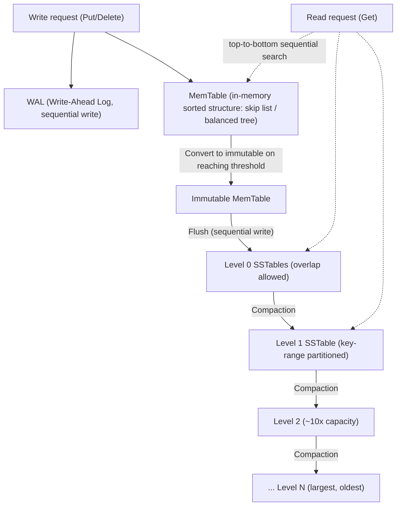
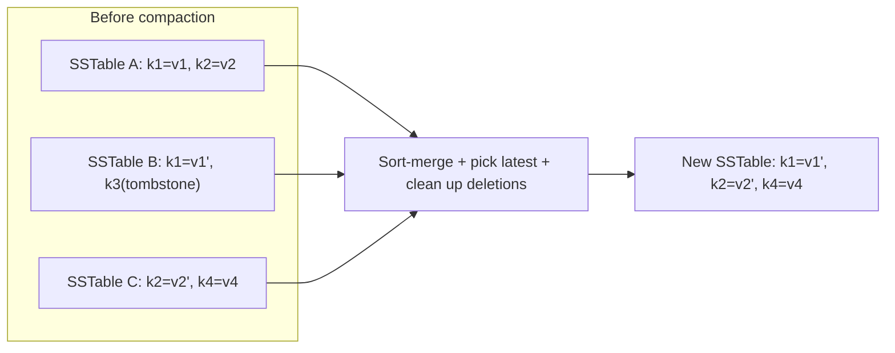

# LSM Tree (Log-Structured Merge-Tree)

## 1. Overview

> **Definition**: The LSM tree (Log-Structured Merge-Tree) is a **write-optimized** storage structure that first collects random writes into an in-memory sorted structure, writes them to disk **sequentially in an append-only batch**, and restores read efficiency by merging and cleaning up (compaction) many immutable sorted files in the background.

Traditional relational-database indexes are mostly based on B-trees/B+trees, which provide balanced logarithmic-time performance for both reads and writes. However, because a B+tree performs an **in-place update** on a specific disk page whenever an update occurs, if the target pages are scattered here and there, random writes to disk explode. Considering the seek latency of an HDD or the page-level writes and garbage collection of an SSD, random writes are tens of times slower than sequential writes and also wear out the storage medium. In workloads where large volumes of writes stream in continuously—log collection, time series, messaging, social feeds—this random-write cost becomes the bottleneck of the entire system.

The LSM tree emerged to target exactly this point head-on. The core idea is "**do not update in place; keep appending new values.**" Instead of overwriting a value, a new version is appended sequentially, and old values are cleaned up later during merging. This makes disk writes always sequential, maximizing throughput and enabling storage-friendly access. Proposed in 1996 by Patrick O'Neil et al., this structure later became the core storage engine of Google's Bigtable and its open-source implementation Apache HBase, Cassandra, and embedded key-value engines like LevelDB and RocksDB. Today, most large-scale NoSQL, time-series, and search systems run on top of LSM-family engines.

In reality, the power of LSM comes from the asymmetry of medium characteristics. On a typical NVMe SSD, sequential-write bandwidth reaches several GB per second, but 4 KB random writes are only a fraction of that, and latency variation (tail latency) also grows due to internal garbage collection. While a B+tree randomly hammers scattered pages on every update, LSM gathers the same writes in memory and converts them into a single large sequential stream. This idea of "converting random into sequential" is the origin of all of LSM's gains and the fundamental reason its effectiveness holds even as storage media evolve from HDD to SSD and then to ZNS and object storage.

From an information-management engineer's perspective, the LSM tree matters because it is not merely a data structure but the archetype of a **storage-engine design philosophy of "which access characteristics to sacrifice and which to gain."** Whereas a B+tree accepts write amplification for read and space efficiency, the LSM tree accepts read amplification and space amplification for write throughput. Understanding the trade-off among these three amplifications (the RUM conjecture: Read, Update, Memory) is the essence of studying LSM, which is treated quantitatively later.

- **Sequential-write oriented**: Converts all disk writes to append-only, eliminating random I/O.
- **Immutable files**: Once written, a sorted file (SSTable) is never modified, and even deletes and updates are expressed as new record additions.
- **Multi-level merging**: Background compaction cleans up duplicate and deleted records to restore read performance and space efficiency.

## 2. Overall Structure

The LSM tree consists of a **dual structure of a memory layer and a disk layer**. The latest writes are reflected in an in-memory sorted structure (MemTable), and when it reaches a certain size, it is flushed as a whole to disk as a sorted file (SSTable). The SSTables on disk are layered into multiple levels, with lower levels holding larger and older data. The structure diagram below shows the overall skeleton of a single write flowing in, passing through memory, and descending to the disk layers.

In this structure, each component has a distinct role. The **WAL (Write-Ahead Log)** handles durability. Because the MemTable is in volatile memory, it is lost on a failure; by appending the same content sequentially to the WAL just before reflecting a write to the MemTable, the WAL is replayed at restart after a failure to recover without loss. The WAL is also a sequential write, so it does not harm LSM's write performance.

The **MemTable** is an in-memory sorted structure that holds the latest data in key order, usually implemented as a skip list or balanced binary tree. A skip list is often used because it reduces lock contention while supporting concurrent inserts and lookups, and insert/lookup are a decent average O(log n). When the MemTable reaches its configured size (e.g., 64 MB), it is converted to an **immutable MemTable** and is no longer modified, while new writes are received by a new MemTable. Thanks to this separation, writes do not stop even while a flush is in progress.

The **SSTable (Sorted String Table)** is an immutable sorted file stored on disk. Key-value pairs are stored sorted by key, and inside the file there is a sparse index and block-level partitioning to quickly find a specific key. Because it is sorted it is advantageous for range scans, and because it is immutable it needs no locks for concurrent reads and simplifies caching, replication, and backup. Multiple SSTables are organized into levels, and depending on the compaction strategy discussed later, whether cross-level overlap is allowed and how merging is done differ. The physical components of a single SSTable are summarized as follows.

- **Data block**: The actual storage unit holding sorted key-value pairs (usually compressed in 4–64 KB units).
- **Index block**: Holds the first key and offset of each data block so the target block can be found by binary search.
- **Bloom-filter block**: Quickly determines that a specific key is not in this file, blocking unnecessary disk access.
- **Meta/Footer**: Metadata needed to interpret the file, such as file version, statistics, and index location.

The fact that this file format is immutable gives large operational advantages. Because an already-written file does not change, page-cache/block-cache invalidation is unnecessary, remote replication, snapshots, and checksum verification are simplified at the file level, and the file can be placed directly on immutability-friendly media like object storage (S3, etc.), fitting well with storage-compute-separated architectures.

## 3. Core Operations: Write, Read, and Delete Paths

### A. Write Path

An LSM write is surprisingly simple and fast, because there is no need at all to find on disk the location to overwrite a value. When a write request arrives, it ① appends sequentially to the WAL to secure durability, and ② inserts the key-value into the MemTable. Because neither operation involves random disk seeks, write latency is very short and throughput is high. Even an update does not find and fix the existing value but **simply adds a new version**, and which value is the latest is determined by a sequence number or timestamp.

When the MemTable fills, it is converted to immutable, and a background thread **writes it sequentially as a single SSTable** and then discards the corresponding WAL segment. This flush writes data already sorted in memory as a whole sequentially, so it maximally utilizes disk bandwidth. For example, in a time-series collector where hundreds of thousands of writes per second stream in, a B+tree index rapidly slows due to page splits and random updates, but LSM absorbs this with in-memory accumulation followed by large sequential flushes, maintaining stable throughput.

### B. Read Path

Reads pay the price for the simplicity of writes. Because the latest value of a specific key may be in the MemTable or somewhere in several SSTables, one must **search from the newest layer to the oldest in turn**. That is, descending in the order MemTable → Immutable MemTable → Level 0 → Level 1 → …, the value at the moment the desired key is first encountered (the most recent version) is returned. In the worst case, several files must be opened, which is called **read amplification**.

To reduce this cost, two auxiliary structures are essentially employed. The first is the **Bloom filter**, which probabilistically judges for each SSTable "is this key possibly here?" and skips files that certainly do not contain it without disk access. Typically, using about 10 bits per key can lower the false-positive rate to around 1%, dramatically reducing disk I/O for lookups of nonexistent keys (e.g., cache-miss checks). The second is each SSTable's **sparse index and block cache**, which quickly find the target block within a file that passed the filter and keep frequently read blocks in memory.

### C. Deletes and Updates: Tombstones

In an immutable file structure, data cannot be physically deleted immediately. Instead, a delete is done by **adding a deletion-marker record called a tombstone**. On read, if the latest record for a key is a tombstone, that key is regarded as deleted, and the actual physical removal happens later when compaction discards all previous versions of that key together with the tombstone. Because of this lazy-delete characteristic, right after a bulk delete data actually increases, and as tombstones accumulate, range scans must sweep through the deleted regions, slowing lookups. The "zombie data" and tombstone-explosion problems commonly experienced in Cassandra operations stem from this.

In particular, prematurely deleting tombstones in a distributed environment is dangerous. If a tombstone disappears while some node has already applied the delete but another missed it due to a failure, then during replication synchronization an already-dead value can revive—"data resurrection." This is why Cassandra physically deletes a tombstone only after a grace period called `gc_grace_seconds` (default 10 days) passes. In other words, a deletion marker is not merely an optimization device but also a **consistency device for maintaining eventual consistency**, and lowering this value incorrectly improves performance but can break data consistency.

### D. Concurrency Control and Snapshot Reads

The LSM structure is also advantageous for concurrency control. Because SSTables are immutable and updates are expressed as new-version additions, assigning a sequence number to each record naturally yields a consistent snapshot of a particular point in time. A read transaction only needs to see "the latest version with a sequence number at or below the point where it began," which aligns with **MVCC (Multi-Version Concurrency Control)**. Because writes and reads do not block each other (readers never block writers), high concurrency is achieved without read locks. RocksDB's snapshot feature and distributed SQL's snapshot isolation level are built on this characteristic. However, keeping an old snapshot for a long time can grow space amplification because compaction cannot reclaim the SSTables referenced by that version, so managing long-running snapshots becomes an operational point.

## 4. Compaction Strategies and the Amplification Trade-off

Compaction is the heart of the LSM tree. Over time, SSTables accumulate, multiple versions of the same key and tombstones become scattered, the number of files reads must examine grows (read amplification), and duplicate data wastes space (space amplification). Compaction reads several SSTables, sort-merges them while removing old versions and deleted keys, and creates new SSTables to recover from these problems. The diagram below shows the process by which compaction cleans up duplicates and deletions and moves data to lower levels.

Compaction methods are broadly divided into two families, and this choice determines per-workload performance characteristics. First, **leveled compaction**, the default of RocksDB/LevelDB, keeps the key ranges of SSTables within each level (L1 and above) from overlapping, and when an upper level fills, merges it with the overlapping files of the lower level. Each level is roughly 10 times the size of the previous. Because there is only one file per level that can hold a given key, **read amplification and space amplification are small**, but merging is frequent so **write amplification is large**. It suits read-heavy, space-tight workloads.

Second, **size-tiered compaction**, the default strategy of Cassandra, merges SSTables of similar size into one larger file once a certain number have accumulated. Because merge frequency is low, **write amplification is small**, but the same key can exist redundantly in several large files, so **read amplification and space amplification are large** (just before a merge, the originals and the result coexist, so momentarily up to 2x space is needed). It suits log/time-series ingestion with bursting writes. There are also specialized strategies like TWCS (Time-Window Compaction) for time series, which groups by time window and discards expired data as a whole.

The difference between these two families ultimately reduces to the **RUM trade-off**. It is impossible to minimize all three amplifications at once; to gain something, something must be given up.

| Category | Read amplification (RA) | Write amplification (WA) | Space amplification (SA) | Representative system / suitable workload |
|------|------------|------------|------------|----------------------|
| Leveled compaction | Low | High | Low | RocksDB/LevelDB / read-heavy OLTP, indexes |
| Size-tiered compaction | High | Low | High | Cassandra / bursting writes, log ingestion |
| B+tree (comparison) | Low | Medium (random) | Low | RDBMS / balanced workload |

Here we must note the practical implications of each amplification. High write amplification means that when a user writes 1, compaction rewrites the same data several times, commonly reaching 10–30x in the leveled method. This is directly tied to SSD wear and background-bandwidth consumption, so estimating the NVMe SSD's write endurance (TBW) and scheduling compaction become operational keys. Conversely, the space amplification of the size-tiered method increases storage cost and creates an operational constraint that requires always securing 2x free space at the moment of compaction.

When compaction is triggered also matters operationally. Representative triggers are as follows, and coordinating them is precisely managing the amplification budget.

- **Level capacity exceeded**: When a level's total size exceeds the target, upper/lower level merging begins (leveled).
- **SSTable count threshold**: When a designated number (e.g., 4) of similar-size files accumulate, they are merged (size-tiered).
- **Tombstone/expiry ratio**: When deletion markers or TTL-expired data exceed a certain ratio, a forced merge is done to reclaim space.
- **Manual/major compaction**: The operator merges all files into one to fully remove duplicates, but because it induces heavy I/O it is performed during low-load hours.

## 5. Comparison: LSM Tree vs. B+Tree

The LSM tree and the B+tree are the two axes of storage-engine design; it is a matter not of superiority but of **workload fit**. The fundamental cause of the difference lies in the update method. Because a B+tree keeps data always tidy in one place with in-place updates, reads are predictable and fast, but it accepts random writes and page splits to maintain that tidiness. LSM funnels writes into append-only to maximize sequential throughput, but it accepts read and background costs because scattered data must later be merged and looked up.

As a concrete example, consider a time-series pipeline ingesting 500,000 IoT sensor readings per second. A B+tree-based index has parts of the index tree updated everywhere over time, so random I/O dominates and throughput plummets. In contrast, an LSM-based engine (e.g., RocksDB, Cassandra) absorbs this with in-memory accumulation followed by sequential flushes, keeping write throughput several to tens of times higher. But if the workload is overwhelmingly point lookups that randomly fetch "the single latest value of a particular sensor," then even with a well-functioning Bloom filter, the multi-SSTable search and compaction burden may let a B+tree give more stable low latency.

Examining it quantitatively makes the trade-off clearer. When there are L levels and each level's size multiple is T (e.g., 10), leveled compaction's write amplification is roughly proportional to `T × L`, commonly reaching 10–30x, whereas the number of files to examine on read is held to at most about 1 per level. The size-tiered method conversely has write amplification as low as about `L`, but a single key is scattered across several files, so a read needs a worst-case `O(number of files)` search. A Bloom filter substantially lowers this read amplification, but for finding an existing key (a true positive) the filter cannot filter it out, so the fundamental difference remains. As shown, even for the same data, SSD wear and lookup latency differ by factors depending on which compaction is used, so storage-engine tuning is precisely the work of fitting these coefficients to the workload.

Another practical implication is **range scan and sorting**. Both structures keep data sorted so they support range queries, but in LSM a scan must merge-iterate several SSTables and the MemTable simultaneously and may sweep through tombstone regions, so in a table with frequent deletes, scan latency becomes unpredictable. For this reason, the general tendency is that a traditional OLTP RDBMS, where strong transactional consistency and predictable latency matter, still chooses a B+tree, while large-scale distributed stores, where write throughput and horizontal scaling are the top priority, choose LSM.

## 6. Deep Dive: Recent Trends and Practical Application

The LSM tree is still an actively evolving field. First, new designs to **mitigate write amplification** continue to be proposed. The **key-value separation** technique, represented by WiscKey, stores large values in a separate log and keeps only keys and pointers in the LSM, greatly reducing write amplification by not repeatedly rewriting large values during compaction. RocksDB's BlobDB, TerarkDB, and others commercialized this family, and it is highly effective in workloads with large values.

Second, **co-design with the storage medium** is a key theme. Early LSM targeted avoiding HDD random writes, but today it is redesigned assuming NVMe SSDs, ZNS (Zoned Namespace) SSDs, and even CXL-based memory expansion. In particular, since an SSD's internal GC and LSM's compaction both perform "garbage cleanup," ZNS-based LSM that cooperates these without duplication lowers write amplification and wear simultaneously. This is a real optimization that governs the TCO (total cost of ownership) of large data centers.

As a concrete industry case, the inbox/timeline stores of large social services are representative. Tens of thousands to hundreds of thousands of events per second are appended per user, and reads are mostly concentrated on recent ranges; in such write-heavy workloads Cassandra with size-tiered compaction has been widely adopted. Conversely, Facebook has publicized a case of replacing MySQL's InnoDB (B+tree) with LSM-based MyRocks, reducing the storage space for the same dataset to about half and greatly lowering the write load. This shows LSM can be advantageous on another axis—"compression ratio and space efficiency"—because an immutable SSTable is easy to compress strongly at the block level and does not need to leave page free space (fill-factor slack) required for in-place updates.

Third, from a practical-application standpoint, RocksDB has effectively become the **local storage-engine standard for distributed systems**. The state stores of Kafka Streams/Flink, the storage layer of distributed SQL like TiKV and CockroachDB, MySQL's MyRocks engine, and even the state DBs of blockchain nodes adopt RocksDB (LSM). That is, LSM is less a standalone product than an **embedded engine** built into higher-level systems, permeating the ecosystem as a whole. Therefore, from an information-management engineer's perspective, rather than a specific product, one must be able to explain "why this system chose LSM," and the **effect of operational parameters on performance**, such as compaction tuning, Bloom-filter bit count, and MemTable size.

## 7. Considerations and Implications

- **Workload-profile-based selection**: Quantitatively measure the write:read ratio, the proportion of point lookups vs. range scans, and delete frequency before deciding the storage engine and compaction strategy. Rather than "LSM no matter what because writes are heavy," also review that a B+tree may be advantageous if point reads dominate.
- **Amplification-budget management (RUM)**: Because read, write, and space amplification cannot be minimized simultaneously, set the SLA (latency, throughput), storage budget, and SSD endurance (TBW) as quantitative goals, decide explicitly which of the three to prioritize, and coordinate with compaction strategy, Bloom-filter bits, and level multiple.
- **Compaction operational risk**: Because compaction consumes background I/O and CPU and competes with front-line traffic for resources, control latency spikes with scheduling, rate limiting, and separating maintenance windows, and in the size-tiered method always secure the spare space (up to 2x) at the moment of merging.
- **Delete/expiry-data strategy**: Because tombstone accumulation causes lookup latency and zombie data, design expiry policies such as TTL, time-window compaction (TWCS), and gc_grace_seconds consistently with the compaction cycle, and monitor the timing of tombstone cleanup after a bulk delete.
- **Related technologies and extension**: Because LSM combines with distributed consensus (Raft), replication/sharding, and cache layers to build large-scale storage, consider together how the local engine's characteristics mesh with the higher distributed system's consistency, recovery, and hotspot-handling design.
- **Securing observability**: Continuously measure key metrics such as write/read/space amplification, compaction queue, Bloom-filter false-positive rate, and MemTable flush latency to use as tuning grounds; this is precisely the measure of operational maturity of an LSM-based system.

## References

- Patrick O'Neil et al., "The Log-Structured Merge-Tree (LSM-Tree)", 1996: https://www.cs.umb.edu/~poneil/lsmtree.pdf
- RocksDB Wiki, "Leveled Compaction": https://github.com/facebook/rocksdb/wiki/Leveled-Compaction
- Apache Cassandra Docs, "How is data maintained (Compaction)": https://cassandra.apache.org/doc/latest/cassandra/managing/operating/compaction/index.html
- WiscKey: Separating Keys from Values in SSD-conscious Storage (FAST '16): https://www.usenix.org/system/files/conference/fast16/fast16-papers-lu.pdf

---

> **In one line**: The LSM tree is a storage structure that maximizes write throughput by converting random writes into in-memory accumulation followed by sequential flushes and background compaction; the key to its design and operation is coordinating the trade-off of read/write/space amplification (RUM) to fit the workload.
