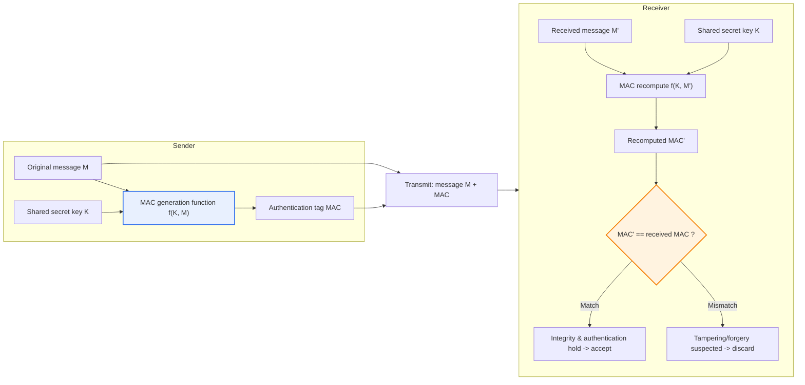
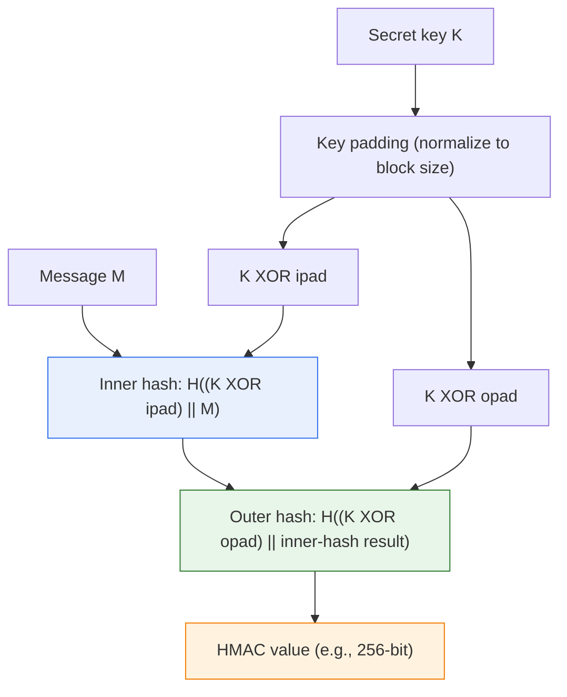

# Message Authentication Code (MAC)

## 1. Overview

### A. Definition
> A **MAC (Message Authentication Code)** is a fixed-length authentication tag **generated by taking as input both the message and a secret key shared only by the sender and receiver**, a symmetric-key cryptographic technique that simultaneously verifies that the message was **not tampered with during transmission (integrity)** and that it was **sent by a legitimate sender who knows the secret key (data-origin authentication)**.

To understand the background of the MAC's emergence, one must start from the question "why is a simple hash alone insufficient?" The most naive way to guarantee message integrity is to attach a hash value such as SHA-256 to the message and have the receiver recompute the hash and compare. However, a hash function is a public algorithm, so it has the fatal loophole that **anyone can compute it**. A man-in-the-middle (MITM) attacker only needs to forge the message at will and then attach a newly computed hash of that forged message, and the receiver has no way to detect the tampering. In other words, a simple hash catches **communication errors (accidental changes)** but cannot stop **malicious attacks (intentional forgery)**.

The MAC seals exactly this point with a secret key. A MAC generation function has the form `MAC = f(K, M)`, taking as input not only the message `M` but also **a secret key `K` known only to the sender and receiver**. Because the attacker does not know the key `K`, even if the message is tampered with, they cannot produce a correct MAC to match. The receiver recomputes the MAC using the received message and the same key they hold, and checks whether it matches the MAC that arrived alongside. If they match, one can be simultaneously certain of two facts: "① the message was not changed during transmission (integrity), and ② only a legitimate counterparty with the same key can make this MAC, so they sent it (origin authentication)." In short, the essence of a MAC is a **'keyed hash that can only be computed and verified with the key'**, and this keyed property bundles integrity and authentication into one.

### B. Background and Necessity
Modern communication presumes untrusted channels such as the Internet and wireless networks. If a financial transaction message is changed midway from "transfer 1 million won" to "10 million won," or if a control command sent by an Internet-of-Things (IoT) sensor is forged, enormous damage results. Here, **confidentiality (encryption)** alone is insufficient. Even ciphertext can be tampered with by flipping bits; in particular, with stream ciphers or CTR mode, a **bit-flipping attack** that predictably manipulates specific plaintext bits is possible. Therefore, apart from "hiding the content," a mechanism to guarantee "the content was not changed and a legitimate counterparty sent it" is indispensable, and the MAC provides this quickly and efficiently on a symmetric-key basis. In fact, MACs underlie almost all of today's security protocols, including TLS, IPSec, SSH, JWT (JSON Web Token), and OAuth signature verification.

## 2. Operating Principle and Overall Structure

### A. Overall Structure Diagram
The overall flow of MAC-based communication is done symmetrically, with the "generating side (sender)" and the "verifying side (receiver)" sharing the same secret key, as follows.

The core of this structure is the symmetry that **the sender and receiver perform exactly the same computation**. The secret key `K` must be distributed to both sides in advance over a secure channel (a key-exchange protocol or pre-sharing), and the moment this key's confidentiality is broken, the entire MAC scheme is nullified. That is, a MAC's security depends decisively not only on the algorithm's strength but on the **key-management system**.

### B. Details of the Generation and Verification Procedures
The sender-side procedure ends with ① inputting the message `M` and secret key `K` into the MAC function to compute the tag, and ② transmitting the message and tag together. Here the message itself may be sent in plaintext (if confidentiality is not needed), because the MAC's role is not "hiding" but "sealing."

The most important principle in the receiver-side procedure is **recompute and compare**. The receiver directly recomputes the MAC with the arrived message `M'`. If even a single bit was changed during transmission, by the hash function's **avalanche effect** the recomputed MAC becomes an entirely different value and the comparison fails. There is one practical principle that must be observed here: the MAC comparison must be done with a **constant-time comparison**. Ordinary string comparison, which compares byte by byte and returns immediately at the first mismatch, is vulnerable to a **timing attack** that learns the correct MAC one byte at a time from minute differences in response time. So in practice, constant-time functions such as `hmac.compare_digest` (Python) and `crypto.timingSafeEqual` (Node.js) are used.

### C. Internal Structure of a Representative Algorithm (HMAC)
The most widely used HMAC is designed with a structure that "nests a hash function twice to safely combine the key." Simply prepending the key like `H(K || M)` is exposed to the **length-extension attack** of Merkle-Damgård-structured hashes. To prevent this, HMAC takes a double-hash structure using an inner pad (ipad) and an outer pad (opad).

Thanks to this double structure, HMAC is immune to length-extension attacks under the premise that the hash function it uses (SHA-256, SHA-3, etc.) is secure, and it is trusted in that a security proof exists. In practice, `HMAC-SHA256` has effectively become the standard and is used extensively in JWT's `HS256` signature, AWS Signature Version 4 request authentication, and TLS integrity verification.

## 3. Types of MAC

MACs are broadly divided into three families depending on **which underlying primitive is used**. Since each differs in performance characteristics and usage environment, the important perspective is not that one is unconditionally superior but that one **chooses to fit the environment**.

| Type | Basis | Characteristics and usage context |
|---|---|---|
| **HMAC** | Hash function (SHA-256/512, SHA-3) | Most widely used. Simple software implementation, security proof exists. Standard in JWT, TLS, API signing |
| **CMAC** | Block cipher (AES) | Advantageous where block-cipher hardware acceleration (AES-NI) exists. Provides authentication with AES alone, no separate hash module |
| **GMAC** | The authentication part of GCM mode | Based on GF(2^128) finite-field multiplication. Fast due to parallelism. Used as the authentication tag of AES-GCM (AEAD) |

**HMAC** is implemented with just a hash function, so it is highly portable and has broad library support. **CMAC**, by contrast, chains a block cipher in a CBC-like manner and takes the last block as the tag, reducing code size in IoT/embedded environments that already use AES hardware acceleration. **GMAC** is only the authentication component of GCM (Galois/Counter Mode) split off, and its finite-field multiplication can be parallelized, so it is favored in 10 Gbps-class high-speed network equipment. For example, TLS 1.3 retained only AEAD schemes like `AES-128-GCM` and `ChaCha20-Poly1305` and discarded the old CBC+HMAC combination—a choice to obtain both performance and security.

## 4. Comparison with Digital Signatures and Hashes, and Cases

### A. Comparison with Digital Signatures — Presence of Non-repudiation
Both a MAC and a digital signature provide "integrity + origin authentication," but they diverge decisively on **non-repudiation**. The fundamental reason for this difference lies in the **symmetry/asymmetry of the key**.

| Category | MAC | Digital Signature |
|---|---|---|
| **Key scheme** | Symmetric key (one secret key shared by both sides) | Asymmetric key (sign with private key, verify with public key) |
| **Security properties provided** | Integrity + origin authentication | Integrity + origin authentication + **non-repudiation** |
| **Computation speed** | Very fast (symmetric operation) | Slow (public-key operation, tens to hundreds of times) |
| **Non-repudiation** | Impossible — key is shared, so third-party proof impossible | Possible — only the signer holds the private key |
| **Representative algorithms** | HMAC, CMAC, GMAC | RSA, ECDSA, EdDSA |

The reason non-repudiation is impossible with a MAC is clear. Because the sender and receiver share **the same secret key**, even if one tries to prove to a third party (judge, arbitrator) that "the sender made this MAC," the receiver can also make that MAC with the same key, so the **sender can deny it: "I didn't send it—didn't you make it?"** In contrast, a digital signature is signed with a private key held only by the signer and verified by anyone with the public key, so non-repudiation holds by the logic that "only the private-key owner could have made this signature." Therefore the practical principle is to use digital signatures where non-repudiation is required, such as **legal evidentiary force, contracts, and electronic documents**, and to use MACs for **fast in-session integrity verification**.

### B. Comparison with Simple Hash
A simple hash (SHA-256 alone) has no key, so it is valid only for **detecting accidental errors**. Comparing a checksum when downloading a file is an example. But as explained earlier, it is powerless once an attacker recomputes the hash too, so a keyed method, the MAC, is indispensable for **communication where malicious forgery is assumed**. It can be summarized as "a checksum stops mistakes, a MAC stops attacks."

### C. Concrete Application Cases
First, JWT (JSON Web Token)'s `HS256` attaches a tag signing the header and payload with `HMAC-SHA256`, verifying that a server-issued token was not forged on the client. But there is a famous vulnerability here: the **algorithm-confusion attack**, which changes the signing algorithm to `none` or induces misuse of the server's RSA public key as the HMAC key. This is not a flaw of the MAC itself but a problem of the verification-logic implementation, a representative case showing that the server must explicitly fix the allowed algorithms.

Second, **AWS Signature Version 4** chain-signs each element of an API request (HTTP method, URI, headers, timestamp) with `HMAC-SHA256`, verifying that the request was not tampered with during transmission and was sent by a legitimate credential holder. By including a timestamp, it also defends against **replay attacks**.

Third, **financial IC cards / EMV payments** use the CMAC family to guarantee the integrity of transaction messages between terminal and card. Because of the embedded environment, CMAC that reuses AES hardware is resource-efficient.

## 5. Deep Dive — Evolution into AEAD and Recent Standards Trends

Today, a MAC has evolved to be used less on its own and more in the form of **authenticated encryption combined with encryption (AEAD, Authenticated Encryption with Associated Data)**. In the past, developers had to choose the combination order themselves—"Encrypt-then-MAC," "MAC-then-Encrypt," etc.—and combining incorrectly revealed serious vulnerabilities such as the **Padding Oracle attack** and **Lucky 13**. In fact, as such attacks were reported one after another in TLS's CBC+HMAC combination, an integrated scheme that removed the room for ordering mistakes was demanded.

The result is AEAD. **AES-GCM** bundles encryption and GMAC authentication-tag generation into a single operation, providing confidentiality and integrity/authentication simultaneously. It can also include in the tag associated data that "is not encrypted but whose integrity must be guaranteed," such as headers. In mobile and low-power environments, **ChaCha20-Poly1305**, which is fast even without AES-NI hardware acceleration, is favored, where Poly1305 plays the MAC role. **TLS 1.3 (RFC 8446)** retained only such AEAD schemes as standard and entirely discarded old combinations like CBC+HMAC.

Meanwhile, in discussions of transition to **post-quantum cryptography (PQC)** in preparation for the quantum-computing era, the MAC's standing is stable. What Shor's algorithm threatens is public-key (asymmetric) schemes like RSA and ECC; symmetric-key-based MACs are affected only to the extent that Grover's algorithm halves their effective security strength. In other words, **doubling the key and tag length (e.g., HMAC-SHA512)** can maintain sufficient security even in the quantum era, so the fact that no fundamental replacement is needed as with public-key algorithms is being reappraised as a strength of the MAC.

## 6. Considerations and Implications (Information-Management Engineer's Perspective)

1. **Switch to digital signatures when non-repudiation is required** — A MAC is efficient for integrity and authentication, but by the symmetric structure of sharing a key, non-repudiation is fundamentally impossible. In areas requiring electronic contracts, audit trails, and legal evidence, always apply asymmetric digital signatures (ECDSA, EdDSA), and adopt a **layered combination strategy** that uses a MAC only for in-session verification where performance matters.

2. **Key management is the vital weak point of security** — A MAC's security depends entirely not on the algorithm but on **the confidentiality of the secret key**. Key distribution must be done via secure key exchange (e.g., ECDH) or a KMS/HSM, and it must have periodic key rotation, per-purpose key separation, and a system for immediate revocation upon exposure. Reusing a single key for a long time and for multiple purposes is the most common yet fatal practical mistake.

3. **Defending against implementation vulnerabilities — constant-time comparison and fixing the algorithm** — Even if the MAC algorithm is secure, sloppy verification code nullifies it. Implementation-level defenses—constant-time comparison to block timing attacks, explicit fixing of allowed algorithms to block JWT algorithm confusion, and inclusion of a timestamp/nonce to block replays—must be reflected from the design stage.

4. **Prioritize AEAD and eliminate ordering mistakes** — When confidentiality is also needed, developers should not combine the encryption/MAC order themselves but should adopt a proven AEAD (AES-GCM, ChaCha20-Poly1305) as standard. This is the safest choice that structurally removes combination-mistake vulnerabilities like the padding oracle and Lucky 13.

5. **Balance in preparation for the quantum era** — Because symmetric-key MACs are only limitedly affected by Grover's algorithm, they can be handled merely by increasing key/tag length (HMAC-SHA512, etc.). When drawing up a PQC transition roadmap, a **differentiated-priority strategy** of concentrating resources on public-key schemes (signatures, key exchange) and handling MACs by raising parameters is reasonable.

## References
- RFC 2104, HMAC: Keyed-Hashing for Message Authentication — https://datatracker.ietf.org/doc/html/rfc2104
- RFC 8446, The Transport Layer Security (TLS) Protocol Version 1.3 — https://datatracker.ietf.org/doc/html/rfc8446
- NIST SP 800-38B, Recommendation for Block Cipher Modes: CMAC — https://csrc.nist.gov/pubs/sp/800/38/b/final
- NIST SP 800-38D, Recommendation for GCM and GMAC — https://csrc.nist.gov/pubs/sp/800/38/d/final

---

> **In one line**: A MAC is a symmetric-key technique that simultaneously verifies integrity and origin authentication by *generating a keyed authentication tag from the message and a shared secret key and comparing it against a recomputation*; it has the HMAC, CMAC, and GMAC families, leaves non-repudiation to digital signatures because it shares a key, is today integrated with encryption as AEAD such as AES-GCM, and its security hinges on implementation defenses like key management and constant-time comparison.
