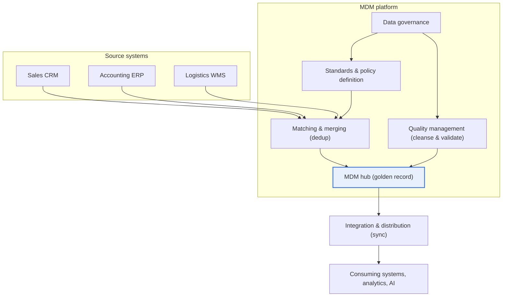
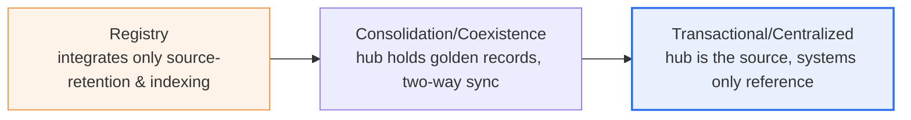

# Master Data Management (MDM)

## 1. Overview

### A. Definition
> **Master data** refers to the **core reference data commonly and repeatedly referenced across many business functions and systems**, such as customers, products, organizations, business partners, and accounts, and **MDM (Master Data Management)** collectively denotes the activities of **defining, integrating, cleansing, distributing, and managing** this master data uniformly and consistently across the entire organization, along with the systems and governance framework that support it.

The data an enterprise handles can be broadly divided into three kinds. **Transactional data** that occurs moment by moment—event records such as orders, sales, and inbound/outbound movements; **master data** needed to interpret these transactions—reference information such as customers, products, and partners; and **analytical data** that analyzes and aggregates these. Of these, master data does not change often but is the **backbone** referenced by almost every business process. For example, a single 'customer' record is reused across the enterprise—from sales contracts and accounting billing to logistics delivery, marketing campaigns, and data-analysis segments. Therefore, the quality of master data governs the quality of every business function that consumes that data.

The fundamental reason MDM is needed lies in "**the confusion of the same customer/product information existing differently in each system.**" As an organization grows, when the sales CRM, accounting ERP, logistics WMS, and call-center system are introduced at different times and in different ways, the same customer is registered separately in each system. Recorded as 'Hankuk Electronics Co., Ltd.' in one system, 'Hankuk Electronics (Inc.)' in another, and 'Korea Electronics' in yet another, effectively the same entity is treated as three different customers. Such inconsistency leads directly to wrong deliveries, duplicate billing, misjudged credit limits, inaccurate sales aggregation, and untrustworthy analysis results. In fact, it is not rare to hear cases where, when a telecom carrier reconciled customers scattered across several affiliated systems before integration, duplicate and erroneous records amounted to 20–30% of the total.

MDM solves this problem by building a **'trustworthy Single Source of Truth (SSOT).'** It collects, matches, merges, and cleanses scattered master data into a single reference to create a **golden record**—the most accurate and complete representative record among many source values—and has each business system reference or be synchronized to this reference data. Then the entire organization shares the same customer/product information, securing data consistency, and regulatory compliance (financial KYC customer verification, the personal-data accuracy principle, etc.) and the reliability of analysis and AI improve together.

### B. Necessity of Master Data and MDM
Because transactional data references master data, if the master is inaccurate, all transactions and analyses built on top of it are contaminated in a chain reaction. This is commonly called "**Garbage In, Garbage Out.**" The reliability of a data warehouse, data lake, and AI training data ultimately cannot exceed the quality of the reference data fed in. As the use of generative AI and machine learning has recently spread, the strategic importance of MDM as a means of securing master-data quality—the basis of training and inference—is again being highlighted. In summary, MDM has necessity along four axes: (1) securing data consistency, (2) business efficiency and cost reduction (removing duplicates, reducing rework), (3) regulatory and compliance response, and (4) securing the reliability of analysis and AI.

## 2. MDM Conceptual Structure and Components

MDM is not completed with a single repository alone. The **standards and policies** that define data, the **hub** that integrates and stores it, the **governance** that establishes an accountability system, the **quality management** that continuously cleanses it, and the **integration and distribution** that flow it to each system must mesh organically.

**Standards and policies** are the starting point of MDM. This is the stage of finalizing the definitions, standards, and business rules of master data—such as 'what is a customer,' 'what system do product codes follow,' and 'in what format are addresses written.' If these standards waver, any subsequent integration becomes a castle in the air. For example, if each business unit's definition of an 'active customer' differs (transacted within the last 6 months vs. within the last year), even after integration the same metric produces a different number for each department. So standardization is a task of business consensus before it is a technical task.

The **MDM hub** is the central repository holding integrated, cleansed master data; it keeps golden records and maintains cross-reference information to each source record. The hub is not a simple DB but manages, along with the data, the **lineage** of which value from which source was adopted as the golden record and when. Thanks to this, one can trace "why is this customer's representative address this value," enabling audit and dispute response.

**Governance** is the organizational and accountability system that guarantees MDM's sustainability. A **data owner** who bears business responsibility for the data, a **data steward** who practically cares for quality, and a council that deliberates policy are defined. Technical integration ends with a single project, but because data comes in anew every day, without governance inconsistency piles up again over time.

**Quality management** continuously cleanses data through deduplication (matching and merging), correction of missing values and errors, standardization, and application of validation rules. In particular, matching uses not exact matching but **probabilistic/fuzzy matching** that computes the similarity of names, addresses, and business registration numbers, judging 'Hankuk Electronics Co., Ltd.' and 'Hankuk Electronics (Inc.)' as the same entity.

**Integration and distribution** synchronizes cleansed golden records to each consuming system in real time (API/event) or in batch, so the whole organization uses the same reference data. If this channel's reliability is low, a gap arises in which only the hub is clean while the operational systems still use stale values.

| Component | Core role | Symptom on failure |
|---|---|---|
| **Standards & policies** | Master-data definitions, standards, business rules | Metric definitions differ per department |
| **MDM hub** | Golden-record storage, lineage management | Cannot trace the basis of a representative value |
| **Governance** | Owner, steward, accountability system | Re-inconsistency after time passes |
| **Quality management** | Deduplication, cleansing, validation | Duplicate/erroneous records remain |
| **Integration & distribution** | Syncing/providing to each system | Only the hub is clean, operations use stale values |

## 3. MDM Implementation Types (Architecture) and Build Procedure

MDM is divided into several implementation types (styles) depending on how far the center owns and manages the data. It is chosen to fit the organization's maturity, system complexity, and governance capability, and it is common to start at a low stage and evolve gradually to higher stages.

The **registry method** leaves source data as is, and MDM matches each system's records to manage only the index (reference links) of which ones are the same entity. Because it barely touches the source systems, adoption is light and fast, but the actual data is still distributed, so securing a 'single value' is limited. Large enterprises that already have many systems and cannot easily make big changes right away often choose this as the first stage.

The **consolidation/coexistence method** is a compromise that gathers source data into the hub to create golden records and then returns them to the sources (two-way). The hub holds the substantive reference while the operational systems retain some input autonomy, so the majority of real MDM projects settle on this method.

The **transactional/centralized method** makes the hub the source (system of record) of master data, and all systems only reference or request from the hub. Consistency is the strongest, but because all business processes must be redesigned around the hub, governance maturity and organizational resolve are needed.

The build procedure generally proceeds in the order of (1) selecting target master domains (starting with core ones like customer and product), (2) defining standards and the data model, (3) source profiling and quality diagnosis, (4) designing matching/merging rules and creating golden records, (5) establishing the governance system, and (6) integration, distribution, and rollout. **The key principle is 'gradual expansion,' not a 'big bang.'** Creating a success case in the single domain with the greatest ripple effect (usually customer) and then broadening to product and partner greatly lowers the risk of failure.

| Consideration | Content | Practical implication |
|---|---|---|
| **Implementation-type selection** | Registry, consolidation/coexistence, centralized | Step up gradually to fit maturity |
| **Data integration/cleansing** | Matching/merging, standardization, missing-value correction | Fuzzy-matching threshold tuning needed |
| **Securing governance** | Owner, steward, deliberation body | Becomes hollow without organization/KPI linkage |
| **Integration strategy** | Real-time (API/event), batch sync | Design to fit consuming-system SLAs |
| **Gradual expansion** | Apply in stages from core domains | Avoid big bang, spread success cases |

## 4. Comparison of Similar Concepts and Application Cases

MDM is easily confused with several concepts in the data-management family, so understanding the differences clearly lets one correctly position its role in practice.

| Category | MDM | Data Warehouse (DW) | Data Governance |
|---|---|---|---|
| **Main subject** | Master (reference) data | Integrated historical data for analysis | Policy/accountability for data in general |
| **Purpose** | Operating single reference data | Decision analysis, reporting | Management principles, control |
| **Nature** | Operational (current reference) | Analytical (history accumulation) | Higher-level management frame |
| **Relationship** | Provides accurate dimensions to DW | Consumes MDM references | Includes and governs MDM |

The reason for the difference is that each occupies a different position in the data lifecycle. A DW accumulates history to 'analyze the past,' while MDM supplies 'the accurate reference of the present' to operational systems. If a DW's customer dimension is inaccurate, analysis is distorted, so a well-built MDM plays an **upstream** role that makes the dimension data of DW/BI trustworthy. Data governance is a higher-level concept, and MDM can be understood as implementing 'reference-data management,' the core area among the several areas governance oversees.

As application cases, there is a case where a **global retailer** that had managed the names, specifications, classifications, and images of millions of products (SKUs) separately by country and channel adopted product MDM (often combined with PIM, Product Information Management) to provide consistent product information across online, offline, and mobile. A **financial institution** uses customer MDM to integrate the same customer scattered across several accounts and products, accurately calculating total credit exposure and risk and complying with KYC and anti-money-laundering (AML) regulations. A **manufacturer** integrates supplier and part masters to reduce duplicate ordering and specification errors, cutting procurement cost. In all three cases, it is commonly observed that after master-data integration, the duplicate/error rate decreases meaningfully and analysis reliability improves.

## 5. Deep Dive: Recent Trends and MDM in the AI/Cloud Era

Recent trends in MDM are summarized in three directions. First, the spread of **cloud/SaaS-type MDM**. Whereas large on-premises builds were once mainstream, recently there is a shift toward lowering adoption time and initial cost and securing scalability on a cloud basis. Second, **matching/cleansing automation incorporating AI/machine learning**. To complement the limits of rule-based matching, ML is applied to similarity learning and entity resolution, expanding the ability to automate and recommend a substantial portion of merge judgments that people used to review one by one.

The third and most important trend is the **reappraisal in generative-AI, data-centric organizations**. As the use of RAG (retrieval-augmented generation) and LLMs increases, the awareness has spread that the accuracy of the reference data a model references governs answer quality. An AI that trains and infers on contaminated master data confidently produces plausible but wrong answers. Because of this, MDM is being re-evaluated as an essential foundation of 'AI readiness,' and in modern data-architecture discussions like **data fabric and data mesh**, where to place the trust reference for master data is treated as a key issue. However, since these technology/product trends change rapidly, it is safer to understand them from the perspective of architectural principles rather than to assert a specific product or version.

## 6. Considerations and Implications (Information-Management Engineer's Perspective)

1. **Governance determines success more than technology.** MDM is not adopting a tool but an organizational-change task of establishing an 'owner' of the data. Clarifying the roles and responsibilities (R&R) of data owners and stewards and linking quality metrics to KPIs and performance evaluation keeps consistency maintained over time. MDM without governance deteriorates in quality again once the project ends.

2. **Data standardization is a prerequisite.** If terms, codes, and formats are not unified, integration itself is impossible. Enterprise-wide data standardization and metadata management must be pursued in parallel with MDM; attempting only integration without standardization produces data that 'looks clean but has mixed references.'

3. **Manage risk with a gradual, staged approach.** A big bang that integrates all master domains at once carries a high risk of failure. A realistic strategy is to create a success case in domains with large ripple effects and visible outcomes (customer, product) to secure organizational trust and budget, then expand. Step up the implementation type too from registry → consolidation → centralized to fit maturity.

4. **Re-evaluate its strategic value as the foundation of AI/analysis reliability.** MDM is not a cost department's cleanup activity but enterprise-wide infrastructure that underpins trust in data and AI use. It should be positioned as the central axis of a 'trustworthy data ecosystem' in linkage with data-quality management, data catalogs, and data-lineage management.

5. **Design the integrity and performance of integration/distribution together.** If only the hub is cleansed but it is not propagated to consuming systems in time, the operational gap persists. Mix real-time (event/API) and batch to fit the required level (SLA) of consuming systems, and always have monitoring and reprocessing for sync failures and delays.

## References
- Gartner, "Master Data Management (MDM)" Glossary — https://www.gartner.com/en/information-technology/glossary/master-data-management-mdm
- DAMA International, DMBOK2 — Reference & Master Data Management (Chapter 10) — https://www.dama.org/cpages/body-of-knowledge
- IBM, "What is master data management (MDM)?" — https://www.ibm.com/topics/master-data-management

---

> **In one line**: MDM is *the activity of integrating and distributing core reference (master) data such as customers and products into a Single Source of Truth (golden record) by matching, merging, and cleansing*; it consists of standards, hub, governance, quality, and integration, matures from registry → consolidation → centralized, has governance and standardization decide its success, and is being reappraised as an essential foundation of AI/analysis reliability.
