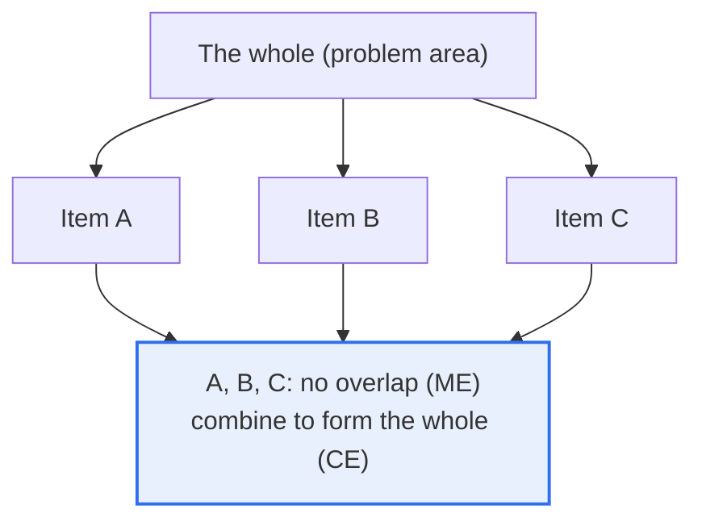
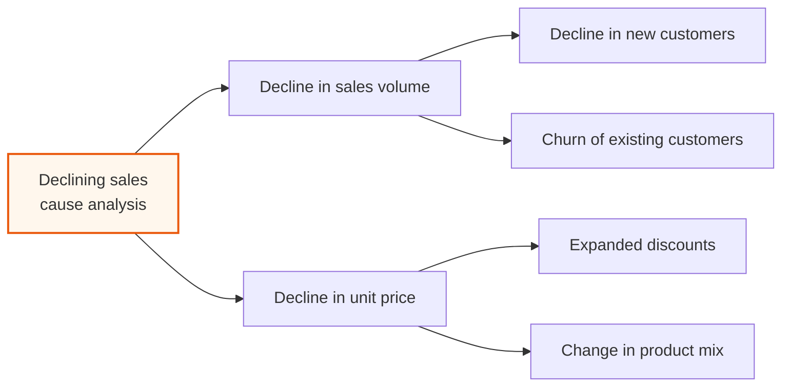

# MECE (Mutually Exclusive, Collectively Exhaustive)

## 1. Overview

### A. Definition
> **MECE** is a logical classification principle that, when categorizing or analyzing a subject, ensures the items are **not overlapping with one another (Mutually Exclusive)** and **completely cover the whole without omission (Collectively Exhaustive)**. It is a thinking technique formulated by Barbara Minto of McKinsey and has become a basic skill across consulting, strategy, planning, and decision-making today.

The reason MECE is chosen as a starting point for problem-solving and analysis is that "**you must remove overlap and omission to get accurate and trustworthy analysis.**" When you divide a problem for analysis, if items overlap (duplication), you count the same thing twice, responsibility becomes ambiguous, and resources are wasted; if there are missing parts (omission), you miss an important element and the conclusion itself is wrong. MECE is a device that prevents both errors **simultaneously**. Mutual exclusivity demands "do not overlap" (remove duplication), and collective exhaustiveness demands "do not omit" (prevent omission).

For example, dividing customers into 'new/existing' overlaps in nothing and omits nothing, so it is MECE, but dividing them into 'people in their 20s / office workers' has 20-something office workers overlapping in both (duplication) and non-office workers in their 30s belonging to neither (omission), so it is not MECE. As this simple example shows, whether something is MECE is determined by **the choice of classification criterion**. When logically structuring a problem (a logic tree) or segmenting a market in consulting, MECE becomes the starting point that guarantees the accuracy and persuasiveness of the analysis. In other words, MECE is a principle showing that '**dividing well**' is '**analyzing well**,' and from an information-management engineer's perspective it is a thinking tool that governs the quality of structural analysis activities such as requirements decomposition, risk identification, and alternative derivation.

### B. The Two Requirements and Their Relationship
MECE holds only when both requirements are satisfied **simultaneously**. Satisfying only one is merely half a classification. Keeping only mutual exclusivity while missing collective exhaustiveness yields a 'clean but incomplete' analysis, and keeping only collective exhaustiveness while missing mutual exclusivity yields an analysis 'with no omission but confusing due to overlap.'

| Requirement | Meaning | Problem when violated |
|---|---|---|
| **ME (Mutually Exclusive)** | No overlap between items | Double counting, ambiguous responsibility, wasted resources |
| **CE (Collectively Exhaustive)** | Includes the whole without omission | Omission of key elements, wrong conclusions |

### C. Common Misconceptions
A common misconception about MECE is the thought that 'the more items, the more complete.' But no matter how many items there are, if they overlap it violates ME, and no matter how few, if they cover the whole, CE is satisfied. The key is **not the number but the consistency and comprehensiveness of the criterion**. Another misconception is the compulsion to achieve MECE 'perfectly,' but as seen later, in practice a 'practical MECE' suited to the purpose is sufficient.

## 2. Conceptual Illustration and Principle

### A. MECE Seen Through a Puzzle Analogy
A MECE classification is like a **puzzle** that has cut up the whole. The pieces do not overlap one another (ME), and when combined they complete the original whole (CE). If they overlap, pieces are left over and it is confusing; if they are missing, holes appear in the picture. The illustration below shows the basic structure of a MECE decomposition dividing the whole (problem area) into three items.

### B. Repeated Application and the Logic Tree
The point where this structure shows its power is when it is **applied repeatedly over multiple levels**. After splitting a large problem MECE-ly, splitting each sub-problem MECE-ly again on the way down builds a 'logic tree (issue tree).' Because there is no overlap or omission at each layer, sweeping through the whole tree lets you derive causes and solutions without omission and without overlap. The illustration below is an example of decomposing the problem 'declining sales' into a MECE logic tree.

### C. Conditions for a Good Decomposition Criterion
Here, sales is decomposed by the identity `sales = volume x unit price`, so the two sub-items naturally become MECE. As this shows, **decomposition based on a formula or structure** (e.g., sales = quantity x unit price, profit = sales − cost) easily guarantees MECE, whereas an arbitrary listing of attributes (mixing age, occupation, region) easily invites overlap and omission. The principle that choosing a good decomposition criterion is half of MECE is revealed here.

## 3. Methods for Achieving MECE and Its Uses

### A. Three Decomposition Methods
There are three representative methods for achieving MECE in practice.

**First, the component-decomposition type (decomposition into constituent parts).** Divide the whole into physical or logical constituent parts (e.g., the body into head, torso, arms, legs; a system into frontend, backend, data, infrastructure). It is intuitive when the subject has clear constituent components and makes omissions easy to find. However, if the boundary of 'where one element ends' is ambiguous, overlap can seep in, so finalizing the boundary definition first is the key.

**Second, the formula-decomposition type (equation decomposition).** Divide by an identity so there is no mathematical overlap or omission (e.g., sales = number of customers x purchase frequency x average transaction value, profit = sales − cost). Because an identity by definition matches the left and right sides completely, MECE is structurally guaranteed. It is especially powerful for quantifiable performance problems (sales, cost, conversion rate), and each factor can be decomposed again to build a driver tree.

**Third, the proven-framework type.** Borrow frameworks already designed to be close to MECE, such as 3C (company, competitor, customer), 4P (product, price, place, promotion), value chain, and PEST. A framework lets you reuse a proven MECE structure 'without reinventing the wheel' and provides a common language among stakeholders, lowering communication costs. However, if the framework does not fit the subject it becomes a forced classification, so judgment in choosing a framework suited to the problem's nature is needed.

### B. Representative Areas of Use
In practice, MECE exerts its greatest power when combined with the **logic tree**. Continuing to split a large problem into MECE sub-problems lets you derive causes and solutions without omission, and because each branch is independent, teams can divide the work and analyze in parallel. It is also used to **structure the table of contents** of reports and presentations, raising logical flow and persuasiveness. The audience naturally lets go of the suspicion "did they perhaps omit something, or are they repeating the same thing?"

In information-management engineering practice, this principle is especially useful. For example, decomposing requirements MECE-ly into 'functional requirements / non-functional requirements,' and again decomposing non-functional into quality attributes such as 'performance, security, availability, maintainability,' can prevent requirement omissions. In risk management too, the risk breakdown structure (RBS) must be designed MECE-ly so that important risk categories are not omitted at the identification stage.

| Area of use | Content | Practical effect |
|---|---|---|
| **Logic tree** | Decompose a problem into MECE sub-elements | Prevent omission of causes/solutions, ease division of labor |
| **Market segmentation** | Classify customer groups without overlap/omission | Targeting accuracy, efficient resource allocation |
| **Cause analysis** | Derive problem causes without omission and without overlap | Identify root causes, prevent recurrence |
| **Report structuring** | Compose a logical, persuasive table of contents | Communication clarity |

## 4. Cases and Comparison: MECE and non-MECE

### A. Correcting a non-MECE Case
Let us see the difference with a concrete case. Suppose a company, analyzing 'causes of customer churn,' listed candidates as 'price dissatisfaction, quality dissatisfaction, moving to a competitor, customers in their 20s.' This classification is not MECE. 'Moving to a competitor' and 'price dissatisfaction' can overlap (moving to a competitor because of price), 'customers in their 20s' is not a cause but an attribute, so it is a different dimension (category confusion), and service dissatisfaction and the like are omitted.

To fix this MECE-ly, it must be reconstructed into **mutually exclusive categories of the same dimension**, such as 'product factors (price, quality) / service factors (support, after-sales) / relationship factors (competitor attraction, switching cost) / other.' The reason the difference arises is whether the classification's **criterion (dimension) was unified into one**. The practical implication is clear—before listing items, first define "on what criterion am I now dividing?" Setting the criterion first naturally secures mutual exclusivity, and checking whether that criterion covers the whole subject secures collective exhaustiveness.

### B. Comparison of Decomposition Methods and a Mixed Strategy
As another comparison, there is **qualitative decomposition vs. formula decomposition**. Qualitative decomposition (e.g., satisfied/dissatisfied) is intuitive but has ambiguous boundaries so overlap arises easily, while formula decomposition (sales = quantity x unit price) structurally guarantees MECE but does not apply to every problem. Therefore the practical standard is to divide quantifiable problems by formula and other problems by a proven framework or a clear dichotomy (present/absent, internal/external).

In the field of consulting, a **mixed strategy** is common: grab the 'big picture' MECE-ly with 3C, then split the inside of each C down again by detailed criteria. The upper layer uses a framework to prevent large omissions, and the lower layer divides precisely by formula or dichotomy. Choosing an appropriate decomposition method for each layer rather than sticking to a single all-purpose criterion is mature use of MECE in practice.

## 5. Deep Dive: Limits, Practical Balance, and Related Frameworks

MECE is powerful but not omnipotent, and one must understand its **limits and costs** so as not to misuse it in practice.

### A. The Impracticality of Perfect MECE and Practical MECE
**Perfect MECE is often impractical.** Real problems have factors complexly intertwined so that complete mutual exclusivity is hard, and overusing an 'ETC (other)' item for complete collective exhaustiveness blurs the analysis's focus. So in practice one aims for a **'practically MECE'** suited to the analysis purpose—if there is no overlap or omission on the important axes it is sufficient, and one does not delay analysis by obsessing over trivial overlaps. In other words, MECE is not a 'goal' but a 'means to raise analysis quality,' and one must beware of being consumed by the means and losing the purpose (problem-solving).

### B. MECE Is Only 'Dividing,' Not 'Insight'
Dividing well MECE-ly does not automatically yield a good conclusion. After dividing, prioritization is needed to judge 'which branch is most important (80:20).' That is, MECE (dividing without omission) and the Pareto principle (focusing on the essentials) are complementary. Surveying the whole with MECE and then concentrating resources on the few high-impact branches is the form of real-world problem-solving. Doing lots of MECE decomposition without being able to prioritize ends up as 'analysis for analysis's sake.'

### C. Related Frameworks and Application in Engineering
MECE is completed when used together with the logic tree, the pyramid structure (Minto's Pyramid Principle), hypothesis-driven thinking, and the So What?/Why So? logic. From an information-management engineer's perspective, MECE can be used as a **checklist for verifying omission and overlap** in structural-analysis deliverables such as system-requirements classification (functional/non-functional), risk decomposition (WBS, risk breakdown structure), and quality-attribute decomposition. Recently, its scope has broadened—for example, in data analysis and AI prompt design, structuring a problem MECE-ly and then handling each part (divide and conquer) is emphasized. This also resonates with software engineering's principles of modularization and separation of concerns: dividing a complex problem into independent and complete sub-problems makes it easier to handle each part in parallel and individually.

## 6. Considerations and Implications (Information-Management Engineer's Perspective)

1. **Choosing an appropriate classification criterion (dimension) is the key.** Whether something is MECE is decided by what you divide by (age, region, behavior, formula, etc.), so you must carefully choose a single-dimension criterion suited to the analysis purpose. The moment you mix different dimensions, overlap and omission occur.
2. **Beware of perfectionism and aim for practical MECE.** Real problems make complete mutual exclusivity and collective exhaustiveness hard. Remove overlap and omission on the important axes, but excessive perfectionism that delays analysis over trivial overlaps is actually inefficient.
3. **MECE must be combined with prioritization and insight.** Dividing without omission alone does not yield a conclusion, so it must be linked with follow-up thinking that identifies the vital few by the Pareto principle and derives implications with So What?.
4. **Use it as a quality-verification tool for structural analysis.** Applying MECE as a verification checklist that checks "are there overlapping items, are there omitted dimensions?" for engineering deliverables such as requirements decomposition, risk identification, and alternative derivation can raise the reliability and persuasiveness of the analysis.
5. **It is a basic skill of logical thinking and communication.** MECE is a foundation supporting clear and persuasive thinking not only in consulting but across planning, decision-making, and reporting, and it is the basis of various frameworks such as 3C, 4P, and SWOT. [[swot-3c-pest]]

## References
- Barbara Minto, "The Pyramid Principle: Logic in Writing and Thinking" — the original source of the pyramid structure and the MECE principle
- McKinsey & Company, "The McKinsey Way" (Ethan Rasiel) — practical application of MECE and the logic tree
- Wikipedia, "MECE principle" — https://en.wikipedia.org/wiki/MECE_principle
- Related topic: [[swot-3c-pest]] — strategy-analysis frameworks based on MECE

---

> **In one line**: MECE is a logical classification principle that divides so that *items do not overlap one another (ME) and cover the whole without omission (CE)*; choosing the right classification criterion is the key, and it is the basic skill of the logic tree, market segmentation, and cause analysis. However, it is completed as real-world problem-solving only as a 'practical MECE' that beware of perfectionism, combined with prioritization and insight thinking such as Pareto and So What?.
