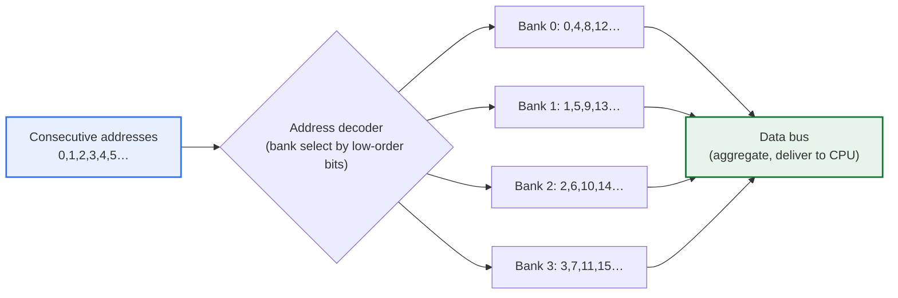
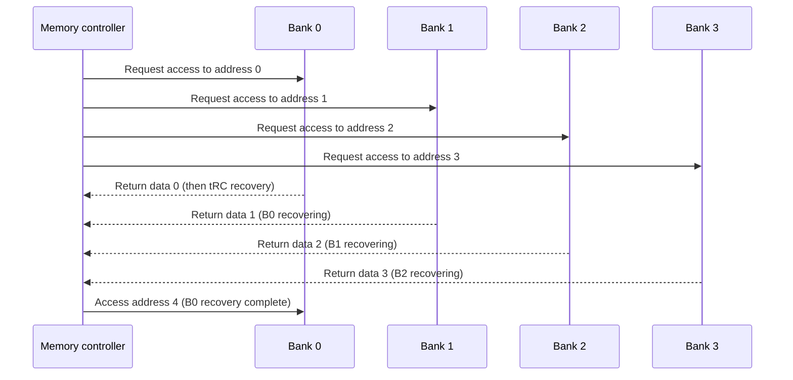

# Memory Interleaving

## 1. Overview

### A. Definition

> **Memory interleaving** is a technique that divides physical memory into multiple independent **banks** or **channels** and places consecutive addresses alternately across different banks, so that multiple banks can be accessed **simultaneously and overlapping (overlap)**, thereby raising the effective bandwidth of memory.

The core idea of memory interleaving is "do not wait for one thing at a time in order; process at several windows simultaneously." Once accessed, DRAM spends a certain time on cell-charge recharge (precharge), row activation, and so on before it can accept the next access, and this recovery time is commonly called the **bank cycle time** or tRC. If only one memory module is used, the CPU stalls, receiving no data during this recovery time. Interleaving divides memory into multiple banks and then places consecutive addresses (0, 1, 2, 3…) alternately in the banks (0 → bank 0, 1 → bank 1, 2 → bank 2, 3 → bank 3, 4 → bank 0 again…). Then, when reading consecutive data, the operations of multiple banks proceed overlapping (pipeline) on the time axis, so while one bank waits for recovery, another bank has already sent out the next data.

This structure can be likened to opening several bank teller windows simultaneously to disperse the waiting line. With one window, the person behind must unconditionally wait until the person ahead finishes their business, but with four windows, four people are served simultaneously and total throughput increases up to four times in theory. Importantly, however, latency—the absolute time it takes for one person to enter a window and finish their business—itself does not decrease. What interleaving improves is not the latency of an individual access but **the number of accesses that can be processed per unit time (bandwidth)**, and this must be clearly distinguished from the way a cache later handles latency.

### B. Background and Necessity

While the operating speed of CPUs has improved dramatically thanks to Moore's law, the access speed of DRAM has improved only relatively gently, so the gap has widened year by year. This accumulated performance gap is called the **memory wall**, and no matter how fast the CPU is, if it is not supplied data in time, a bottleneck occurs where the compute units idle. This bottleneck is especially fatal for tasks that sweep through large amounts of consecutive data, such as array/matrix operations, streaming-media processing, graphics rendering, and deep-learning tensor operations.

Memory interleaving is an approach that secures bandwidth through **parallelism** instead of making the device itself faster. Device speed (tRC) runs into physical limits, but increasing the number of banks to grow the number of accesses processed simultaneously is relatively cheap. For this reason, interleaving started in the memory design of early large computers and has become the basic principle of virtually all high-performance memory subsystems today—from multi-channel DIMMs and the internal bank groups of DDR to a GPU's HBM.

## 2. Operating Principle and Overall Structure

The overall structure can be understood as the flow 'address decomposition → bank selection → parallel access → result aggregation.' The memory controller receives the physical address the CPU requested and uses specific bits of that address to decide which bank to send it to. In low-order interleaving, the least significant bits of the address become the bank number, and the remaining upper bits become the offset within the bank.

As in the diagram above, consecutive addresses are distributed cyclically across the 4 banks, so during sequential access the four banks operate in parallel and overlapping, and each bank's recovery latency is hidden behind the operation of the other banks (latency hiding). That is, a single bank alone can emit data only once per tRC, but in 4-way interleaving a pipeline is formed in which data flows out sequentially every tRC/4 interval.

This pipeline effect is even clearer when viewed on the time axis. The sequence diagram below shows the process by which 4 banks emit consecutive data, overlapping their recovery times.

The key point is that while bank 0 recovers after emitting data 0, the controller does not idle but sequentially fetches data from banks 1, 2, and 3. By the time bank 0's recovery finishes, the request for address 4 can already be issued, so in ideal sequential access the bank recovery latency is completely hidden and the bus transfers data almost without rest.

## 3. Types of Interleaving Methods

Interleaving is broadly divided into low-order and high-order depending on which part of the address is used for bank selection. These two are not merely an implementation difference but reveal a design-philosophy difference between performance and reliability.

**Low-order interleaving** uses the least significant bits of the address as the bank number. As a result, consecutive addresses naturally spread across multiple banks, so bank parallelism is maximized in access patterns like sequentially sweeping an array. If the goal is to raise sequential-access bandwidth, low-order interleaving is close to the correct answer. Most performance-oriented memory systems adopt this method by default.

**High-order interleaving** uses the most significant bits of the address as the bank number. Then one bank takes charge of a large consecutive block of addresses as a whole. Performance parallelism is lower, but even if a particular bank fails, only the address region that bank handles is affected, so it is advantageous for **fault isolation** and for bank-level module expansion and replacement. For example, in scenarios of pulling out a memory module to increase capacity, or of deactivating a defective bank and operating with the rest, high-order interleaving is convenient for management.

| Method | Bank-select bits | Data placement | Strength | Weakness |
|---|---|---|---|---|
| **Low-order interleaving** | Low-order address bits | Consecutive addresses distributed across banks | Maximizes sequential-access bandwidth | Wide impact when a bank fails |
| **High-order interleaving** | High-order address bits | Consecutive block concentrated in one bank | Fault isolation, easy module expansion | Low sequential-access parallelism |

Real systems sometimes mix the two. Using a multi-level mapping that selects the channel with a few upper bits and the bank with a few lower bits to compromise between performance and manageability is the general design of modern memory controllers.

## 4. Performance Characteristics and Bank Conflicts

The effect of interleaving depends greatly on the access pattern. The most ideal case is sequential access that reads consecutive addresses in turn as seen earlier, and then N-way interleaving delivers bandwidth close to N times in theory. For example, if a single bank's recovery time is 60 ns and it is 4-way interleaving, in ideal sequential access one word flows out every 15 ns, greatly increasing effective throughput (in reality it falls short of the ideal due to bus width and transfer overhead).

The problem is random access or access with a particular address stride. If the access addresses happen to all map to the same bank, multiple accesses are processed serially in one bank and parallelism disappears. This is called a **bank conflict**. A representative case is power-of-two stride access. For example, in 4-way interleaving, access with a stride that is a multiple of 4 (addresses 0, 4, 8, 12…) all heads only to bank 0, so parallelism completely collapses and performance drops to the level of a single bank. This pathological pattern frequently occurs when sweeping a matrix in column-major order.

To mitigate this problem, in practice one sets the number of banks close to a prime number, or uses the **XOR/permutation interleaving** technique that mixes address bits with XOR or a hash to map to banks. On the software side, optimizations are also used together, such as adjusting so the stride is not a multiple of the number of banks via array padding, or tiling matrix operations to localize the access pattern. That is, the effective performance of interleaving is determined jointly by the hardware mapping and the software access pattern.

## 5. Comparison with the Cache and Memory Hierarchy

Frequently mentioned together with interleaving is the cache, but the problems the two techniques address are fundamentally different. A cache places frequently used data in fast storage close to the CPU to reduce **the latency of an individual access**. In contrast, interleaving runs multiple banks in parallel to increase **bandwidth per unit time**. These two are not substitutes but complements.

| Aspect | Cache | Memory interleaving |
|---|---|---|
| Bottleneck addressed | Access latency | Access bandwidth |
| Core principle | Reuse exploiting locality | Overlap exploiting bank parallelism |
| Situation with large effect | Repeated re-access (temporal locality) | Large sequential access (streaming) |
| Limit | Powerless on cache miss | Powerless on bank conflict |

The moment a cache misses in a real system, the cache-line fill that fills that miss from memory is a typical sequential access that fetches several words consecutively, so interleaving's bandwidth takes effect directly. That is, the cache handles when to go to memory, and interleaving handles how quickly to fill once it goes. Only when the two techniques cooperate is mitigation of the memory wall completed.

## 6. Deep Dive: Interleaving in Modern Memory

Today interleaving has expanded into multi-layer parallelism operating simultaneously at several levels. First, **DDR SDRAM** already places multiple banks inside a single chip (e.g., DDR4 has many banks per bank group) and hides recovery latency during consecutive access with bank interleaving. On top of that, the memory controller applies **channel interleaving (multi-channel)** that bundles multiple DIMMs/channels. The bandwidth improvement that dual/quad-channel configurations commonly advertise is exactly the result of channel-level interleaving. For example, dual channel distributes data across two channels to provide about twice the bandwidth of a single channel in theory (the actual application gain is smaller depending on the access pattern).

In the GPU and AI-accelerator field, **HBM (High Bandwidth Memory)** is a case that pushes the interleaving principle to the extreme. HBM stacks multiple DRAM dies vertically (connected by TSVs) and places a very wide, thousands-of-bits-class interface and many independent channels, securing hundreds of GB/s to TB/s-class bandwidth from a single stack. In workloads like deep-learning training that must read enormous tensors as a stream, without this channel/bank parallelism the compute units would fall into data starvation. In this context, interleaving is being re-illuminated not as a mere classical technique but as a core bandwidth strategy of AI-era hardware.

In NUMA (Non-Uniform Memory Access) multi-socket servers, interleaving creates a trade-off between performance and locality. Interleaving multiple sockets' memory to use bandwidth evenly reduces a particular node's bottleneck, but access is scattered to remote nodes, which can weaken the locality benefit. So the operating system/hypervisor lets you choose whether to interleave to fit the workload character, as with `numactl`'s interleave policy. Bandwidth-oriented batch/analytics workloads often favor interleaving, while latency-sensitive, high-locality workloads often favor node-local placement.

## 7. Considerations and Implications

From an information-management engineer's perspective, memory interleaving can be organized and used as follows.

1. **A design principle of access-pattern alignment**: Interleaving maximizes bandwidth in sequential access but is nullified by bank conflicts under things like power-of-two strides. Therefore the core of performance design is to align hardware parallelism and the software access pattern by applying together data-structure alignment/padding, matrix tiling, and XOR bank mapping.

2. **Hierarchical cooperation of bandwidth and latency**: Because interleaving (bandwidth) and cache (latency) are complements, system-performance tuning should not be one or the other but should approach after clarifying the bottleneck's nature by measuring both cache-miss rate and memory-bandwidth utilization together.

3. **Strategic importance in AI/HPC workloads**: HBM's multi-channel/bank parallelism governs the tensor-streaming bandwidth of deep learning and scientific computing. When selecting accelerators and designing systems, a roofline perspective that reviews memory bandwidth and arithmetic intensity together, not just theoretical throughput (FLOPS), is needed.

4. **Placement-policy trade-off in NUMA environments**: In multi-socket/multi-node, interleaving is a choice between bandwidth balance and locality loss, so decide the OS memory policy (interleave vs. local) after profiling whether the workload is bandwidth-oriented or latency/locality-oriented.

5. **Balance with reliability and scalability**: Pure performance favors low-order interleaving, but in mission-critical systems where fault isolation and module-level expansion/replacement matter, one should review high-order interleaving or a mixed mapping to compromise between availability and performance.

## References

- Hennessy & Patterson, *Computer Architecture: A Quantitative Approach* — chapters on the memory hierarchy and interleaving
- JEDEC DDR/HBM standards overview: https://www.jedec.org/standards-documents/technology-focus-areas/main-memory-ddr3-ddr4-sdram
- Linux `numactl`/`numa(7)` manual: https://man7.org/linux/man-pages/man8/numactl.8.html

---

> **In one line**: Memory interleaving is a technique that raises bandwidth through parallel, overlapping access by *dividing memory into multiple banks/channels and distributing consecutive addresses*; low-order interleaving, strong at sequential access, is the performance standard, but it has trade-offs such as bank conflicts and NUMA locality, and it cooperates with the cache (latency) to mitigate the memory wall and forms the bandwidth foundation of modern multi-channel memory, HBM, and AI accelerators.
