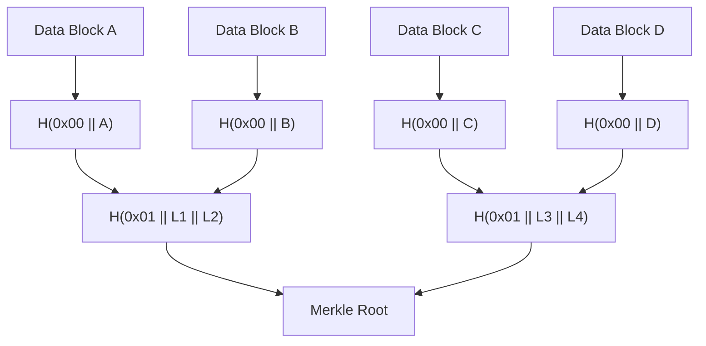
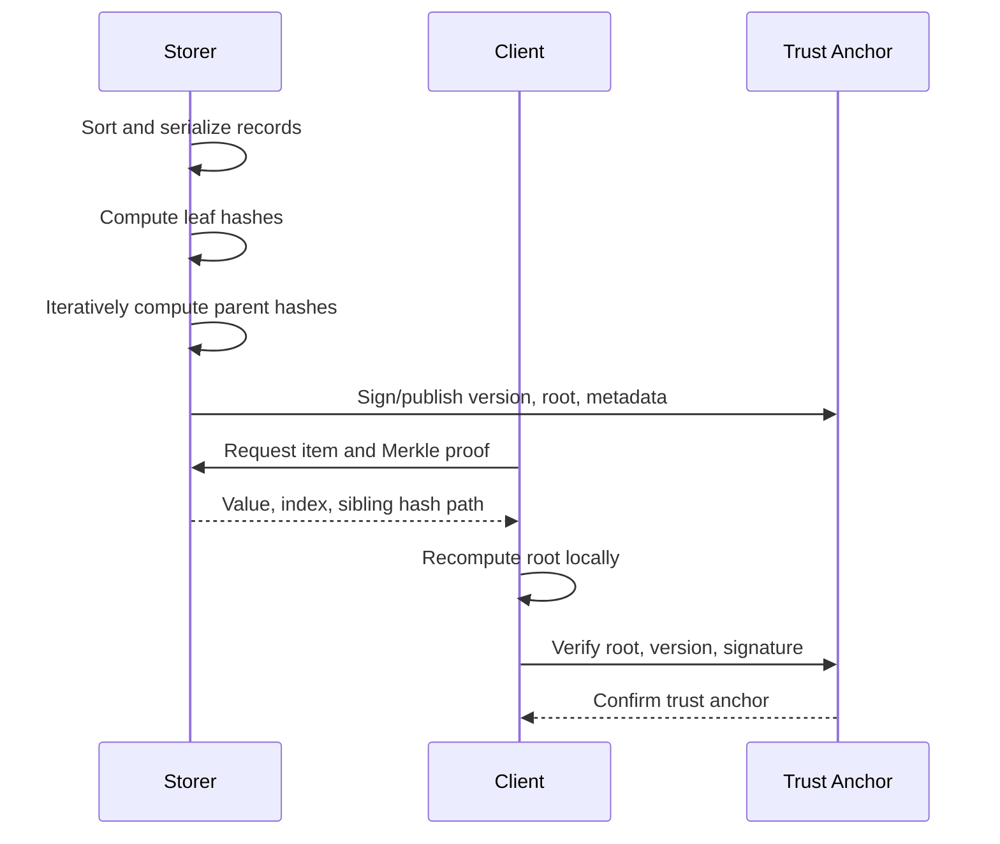

# Merkle Tree and Data Integrity Verification

## 1. Overview

> **Definition**: A Merkle Tree is a hash tree that repeatedly hashes pieces of data, combines them into parent hashes, and summarizes the state of the entire set with a single final root hash.

In distributed systems, the nodes that store data and the nodes that query it are often different, and data transmitted over the network can be tampered with in transit. In such cases, a verifier must be able to confirm whether a particular item is included in a set, or whether two parties refer to the same state, without re-downloading the entire original and every record.

Simply comparing the hash of a single file has the limitation that the entire file must be downloaded again. By contrast, a Merkle tree uses a Merkle proof that transmits only the sibling hashes along the path from a leaf to the root, so even as the total data grows, the proof size required for verification generally grows only logarithmically.

The essence of a Merkle tree is not the cryptographic hash itself but **the way summary values are organized hierarchically**. If the hash function provides sufficient collision resistance, preimage resistance, and avalanche effect, a single root hash acts as a commitment that sensitively reflects changes in a large amount of underlying data.

For example, if 1,048,576 records are paired two at a time into a binary tree, a proof showing whether a specific record is included ideally requires about 20 sibling hashes. Compared with transmitting all records, communication volume is greatly reduced, but the premise remains that the root hash must be distributed through a trusted channel.

### Background and Need

Distributed ledgers, content delivery networks, software repositories, and log transparency systems all share the problem that "the original data and the verification data are separated." The repository holds all the data, but clients want to query only part of it or perform only lightweight verification.

A Merkle tree solves this problem from a data structure perspective. The storer computes the entire tree and publishes the root hash, and the verifier receives the item of interest and the sibling node hashes and recomputes the root using the same combination rule.

However, a Merkle tree does not guarantee the truthfulness or semantic correctness of data. If untrustworthy data was input from the beginning, the tree only proves the consistency of that wrong data. Therefore, the entity that generates the root, the distribution channel, key management, temporal ordering, and freshness verification must all be designed together.

### Problem Definition from a Professional Engineer's Perspective

In an essay answer, it is important not to describe a Merkle tree merely as "a picture of linked hashes," but to describe it in terms of quality attributes: verification cost, trust boundary, change detection, and freshness.

First, confirm whether an inclusion proof can be produced without the verifier holding the entire data. Second, explain that even the same data can yield different roots if the serialization method and hash domain separation differ.

Third, distinguish the complementary means of securing trust in the root hash, such as key signatures, consensus, TLS, and transparency logs. Fourth, in environments where additions, deletions, and updates are frequent, compare the cost differences between static binary trees and dynamic data structures.

## 2. Basic Structure and Operating Principles

### A. Node Composition and Hash Hierarchy

A leaf node is a hash computed from an original data block or record. An internal node is the value obtained by concatenating the hashes of its left and right children in a defined order and hashing again. The root is the top-level summary value to which the influence of every leaf has propagated.

In real implementations, rather than simply using `H(left || right)`, it is safer to apply domain separation that distinguishes the meaning of leaves and internal nodes. For example, computing leaves as `H(0x00 || data)` and internal nodes as `H(0x01 || left || right)` reduces the risk of different kinds of input being mixed along the same interpretation path.

Serialization of input data must also follow an agreed rule. If the key order of a JSON object, numeric representation, character encoding, line breaks, or whitespace differ, data with the same meaning becomes different byte sequences. Therefore, canonical serialization or an explicit binary encoding must be used.

In the structure above, the root does not directly store any particular data block. Because the root is the combined result of all lower hashes, changing even a single byte of data changes the path from the modified leaf up to the root.

When the number of nodes is not a power of two, the protocol must specify a rule for handling odd levels. Duplicating the last node, promoting the last node, and handling incomplete nodes separately each produce different roots.

Therefore, Merkle trees are not interoperable by algorithm name alone. The hash function, leaf domain, internal node combination order, odd-node handling, index basis, and serialization rules are all part of the protocol.

### B. Meaning of the Root Hash

The root hash is a short commitment to the entire data set. By comparing the root with a proof, a verifier can confirm that a particular piece of data belongs to the set at that point in time.

However, publishing only the root hash does not automatically complete a verifiable system. If an attacker distributes a fake root, a client may receive proofs that match that fake root. Therefore, the root must be connected to a trusted external anchor such as a digital signature, block header, agreed checkpoint, or public log.

It is also important to bind time and version information to the root. Reusing the root of the same data set can enable replay attacks that present an old state as if it were the latest. In practice, epoch, block height, snapshot version, creation time, chain identifier, and so on are bound to the root.

### C. Separating Completeness, Integrity, and Freshness

A Merkle proof typically provides inclusion proof and integrity verification. It can confirm the fact that "the hash of this item is included in this root," but does not automatically guarantee that the item is unique or that no items are missing.

For example, in a key-value store, proving the existence of `user-100` is different from proving that `user-100` exists uniquely. The latter requires sorting rules, adjacent keys, non-existence proofs, or a separate index structure.

Freshness is an even more separate issue. The verifier must have a criterion to distinguish a correct past root from the current root. Signed checkpoints, monotonically increasing versions, agreed headers, and consistency proofs of transparency logs complement this.

## 3. Merkle Tree Construction and Merkle Proof Verification

### A. Construction Procedure

The first step is to deterministically sort and serialize the original records. If the input order differs from node to node, the same data set will produce different trees, so key sorting and encoding rules must be documented.

Second, attach a leaf domain tag to each record and hash it. At this point, distinguish empty data from an empty list, and decide whether to include context such as record identifiers and versions.

Third, combine two adjacent leaves into an internal node. Since swapping left and right changes the result, clarify whether it is a sorted Merkle tree or a position-based Merkle tree.

Fourth, repeat the same operation until a single top-level node remains. At levels with an odd node left over, apply duplication or promotion according to the specification, and reflect this rule in the verification code and test vectors.

Fifth, store the generated root together with the tree version, hash algorithm, and record range. Storing only the root makes it hard to reproduce later which rules were used to build it.

The construction pipeline must atomically link data processing and root publication. If the data file is a new version while the root remains the old version, verifiers will be confused. Therefore, fix the snapshot ID first and manage the snapshot, root, and signature as the same release unit.

### B. Inclusion Proof and Verification Procedure

An inclusion proof for a particular leaf consists of the target leaf's position and the list of sibling hashes along the path up to the root. The verifier computes the leaf hash from the target data and then, at each step, combines it depending on whether the sibling hash is on the left or right.

For example, when verifying the third of four leaves, one needs the hash of the fourth leaf and the parent hash combining the first and second leaves. If the result of these two steps equals the root, the item is judged to be included in the tree.

The verifier must also check whether the index in the proof is within range, whether the path length matches the expected height, and whether the hash algorithm and domain tag match the root metadata. Without length verification, abnormally long proofs or memory-exhausting inputs can lead to denial of service.

Verification cost is proportional to the number of hash computations and the proof size. In a balanced binary tree with n records, the path length is approximately \(\lceil log_2 n ceil\), and proof data is on the order of O(log n) compared with the total data size O(n).

### C. Non-existence Proofs and Range Proofs

A simple inclusion proof is insufficient to prove a key does not exist. In a sorted Merkle tree or Merkle Patricia tree, one presents the search path and the two adjacent keys to show that the target key cannot fit in that position.

Non-existence proofs can be used in services where "the fact of not being on the list" matters, such as personal data lookups or permission checks. However, the key sorting rule must be known to the verifier, and one must also evaluate whether disclosing adjacent keys causes information exposure.

A multi-proof that proves several items at once reduces redundancy by sharing common ancestor hashes. For example, instead of proving 100 items in the same subtree individually, the sibling hashes needed only once can be bundled and transmitted.

A range proof is a requirement to show that all items in a specific interval are included. Because its completeness requirement is stronger than a single-item inclusion proof, sorting, boundary, and omission checks must be specified, and the design must prevent the responding provider from arbitrarily omitting intermediate items.

## 4. Types and Comparison with Related Data Structures

### A. Position-Based Binary Merkle Tree

A position-based binary Merkle tree computes parents based on array order and index. It is suitable where data order is meaningful, such as transaction lists in a blockchain, file chunk verification, and version snapshots.

This structure is simple to implement and its verification cost is easy to predict. On the other hand, inserting an item in the middle changes the positions of subsequent items and many parent hashes, so it can be inefficient for frequent insertions.

If odd-node rules differ between implementations, different roots are produced. Therefore, test vectors must verify 1, 2, 3, and 5 nodes as well as empty input.

### B. Sorted Merkle Tree

A sorted Merkle tree sorts keys to determine the position of a given key. It is easy for multiple nodes to produce the same root even when independently building the same key set, and it is advantageous for non-existence and range proofs.

In exchange, it bears sorting and update costs. Services with heavy real-time event inflow should consider combining it with batch snapshots, incremental trees, or log-structured storage rather than performing a full sort every time.

Since publishing the keys themselves can expose personal or business information, key hashing or privacy-preserving tree structures may be necessary. However, even when keys are simply hashed, values that are easy to dictionary-attack can be guessed, so salting and access control must be considered separately.

### C. Merkle Patricia Tree and Trie

A Merkle Patricia tree uses key prefix paths together with compressed nodes to represent key-value state efficiently. When the state changes, only the nodes on the affected path need to be recomputed, making it suitable for dynamic state stores.

The trie family uses string or bit paths, so it has richer lookup semantics than a simple array-type Merkle tree. On the other hand, node encoding and branching rules are complex, so implementation compatibility, malicious inputs, and storage space must be carefully managed.

The following table summarizes the selection criteria for the structures. The table itself is not a conclusion but an aid for mapping requirements to structures; in actual design, update frequency and proof targets should also be considered together.

| Category | Position-Based Binary Tree | Sorted Merkle Tree | Merkle Patricia/Trie |
|---|---|---|---|
| Core basis | Array position | Sort order of keys | Key path/prefix |
| Strengths | Simplicity, predictable path | Determinism, non-existence proof | Dynamic key-value state updates |
| Weaknesses | Vulnerable to middle insertion | Sorting/rebuilding cost | Complex encoding and operation |
| Suitable cases | Blocks, file chunks | Snapshots, list completeness | State stores, account lookup |

### D. Differences from Plain Hashes, Digital Signatures, and Blockchain

A plain hash is efficient at detecting changes to a single message but does not provide inclusion paths for partial data. A Merkle tree layers multiple hashes to enable partial verification.

A digital signature proves that the signer approved a message or root, but does not by itself express partial inclusion relationships for large data. In practice, it is common to sign the Merkle root to create a "signed summary value" and to verify individual items with Merkle proofs.

A blockchain may use a Merkle tree as a component, but a Merkle tree and a blockchain are not the same concept. A Merkle tree is a data structure that summarizes a data set, whereas a blockchain is a system that includes block chaining, consensus, and ledger rules.

| Comparison Target | Primary Guarantee | Partial Verification | Trust Assumption |
|---|---|---|---|
| Single hash | Message change detection | Difficult | Hash algorithm and value delivery |
| Merkle tree | Inclusion/consistency within a set | Possible | Trusted root and rules |
| Digital signature | Approving entity, integrity | Combined with root signature | Private key and certificate |
| Blockchain | Agreed order, ledger state | Combined with Merkle structure | Consensus, economic security, etc. |

## 5. Application Cases and Threat Response

### A. Blockchain Lightweight Verification

Putting the transaction Merkle root in a blockchain block header allows a light client to confirm that a specific transaction is included in a block without storing all transactions in the entire block. The client verifies both the trustworthiness of the block header and the transaction's Merkle path.

This approach reduces storage and network costs, but inclusion does not mean finality or validity of the transaction. Sufficient block confirmations, consensus rules, and double-spending prevention policies must be checked separately.

Binding transaction order and block height to the proof reduces the risk of the same transaction being reused in a different context. It must also be defined which anchor to use as the basis for selection when nodes present conflicting headers.

### B. Git Object Model and Distributed Repositories

Git uses content addressing, using the hash of an object's content like an identifier, and has a structure where tree objects and commit objects point to lower-level content. When file content changes, the identifiers of related trees and commits change in cascade, allowing snapshot integrity to be tracked.

This case demonstrates the principle of "identifying data by content rather than location." However, Git's object graph is not identical to a classic complete binary Merkle tree; the answer should distinguish that it uses DAG-shaped references and commit metadata.

If the repository's remote server or tag signatures are not trusted, local hashes alone cannot fully guarantee supply chain provenance. A practical chain of trust is formed only by combining signed commits, protected branches, review policies, and reproducible builds.

### C. Certificate Transparency Logs

Public key certificate transparency logs record issued certificates in an append-only log and summarize the log's state with a Merkle tree-family structure. Monitors and auditors use inclusion proofs and log consistency proofs to confirm whether a specific certificate has been recorded and whether the log has been tampered with behind the scenes.

The important point here is that a simple inclusion proof and a consistency proof are different. An inclusion proof shows that one item entered a specific tree, while a consistency proof confirms that the previous tree has been preserved as a prefix of the new tree.

Log operators must provide the root or tree head through a trustworthy protocol. Audit systems must be able to detect and report equivocation, in which conflicting trees are shown to different clients.

### D. Backup, File Distribution, and Data Lakes

By splitting a large file into chunks and storing each chunk's hash and the root, only damaged chunks need to be retransmitted during parallel downloads. Immutable snapshots of a data lake can also improve batch reproducibility by summarizing file lists and partition metadata with a Merkle root.

However, if chunk boundaries change, the same file will have a different root. Choose among content-defined chunking, fixed-size chunking, and rolling-hash chunking according to requirements, and determine how chunk IDs are preserved in comparisons between versions.

To prepare for ransomware or insider attacks, periodically anchor the root in a repository separate from the operational server, and apply access control and change history to root metadata. If the root is tampered with together with the data in the same repository, the verification structure can be neutralized.

## 6. Advanced: Quality Criteria for Design, Implementation, and Operation

### A. Security Design

Select the hash function by evaluating the possibility of collision attacks and length-extension attacks. When using a Merkle–Damgård family hash for internal nodes, apply domain separation and length encoding so that different input contexts do not collide.

Indices and direction bits must be included in the proof. If only the list of sibling hashes is sent and direction is omitted, the verifier must guess left/right combination, or different implementations may interpret the same proof differently and produce different results.

The verification API must limit and check proof depth, node count, total byte length, version, and algorithm identifier. This prevents situations where an attacker sends abnormally large proofs to monopolize CPU or memory.

### B. Performance and Storage Strategy

For static batch data, building the whole tree once and caching the root is efficient. When updates are infrequent, the simplicity of proof generation is a greater advantage than computational cost.

For frequently changing data, log-structured storage, incremental Merkle trees, and subtree caches can be used. Only the path from the changed leaf to the root needs recomputation, but if random updates surge, the number of stored nodes and garbage collection costs increase.

Using multi-proofs and batch proofs can eliminate common sibling hashes. CDNs or RPC services can cache proofs for the same root, but must also verify the permissions of the authentication target and the freshness of responses.

### C. Testing and Operations

Test vectors should include an empty tree, a single leaf, odd leaves, a balanced tree, duplicate data, maximum-length data, and non-ASCII strings. In particular, the odd-node duplication rule is the most common point of interoperability errors.

In property-based testing, generate arbitrary data sets and confirm that proofs of all generated leaves verify against the same root. Data with one byte changed, proofs with flipped direction bits, and proofs using a root of a different version must fail.

Operational monitoring should collect verification failure rate, proof size, verification latency, root generation latency, inconsistencies between roots, and version regression. Do not treat verification failures as a simple 404; leave diagnostic information that allows classification into data corruption, attack, or implementation mismatch.

When signing the root with a key, design signing key rotation, revocation, HSM storage, multi-signature, and audit logs. If the signing key is stolen, an attacker can distribute consistent fake roots, so key trust alone cannot resolve all risks.

## 7. Considerations and Implications

### A. Trust Boundary and Anchor Design

A Merkle tree is valid from the moment the root is trusted. If the root's origin is unclear, even a perfectly correct proof can be a proof over an attacker's data.

Therefore, connect the root to one or more independent anchors such as signed metadata, block headers, recognized transparency logs, or separate WORM storage. Cross-signing of the root by different operating entities can reduce single points of failure.

### B. Standardization and Interoperability

Agreeing only on the hash function is not sufficient. Serialization, domain separation, byte order, odd-node handling, proof format, error codes, and version negotiation must all be included in the specification.

Recording the protocol version together with the root and proof reduces interpretation conflicts between old and new clients during algorithm transitions. Put implementations into operation only after confirming that different implementations pass the same public test vectors.

### C. Personal Data and Information Exposure

A Merkle root does not directly expose the original, but proof paths, keys, and metadata can expose indirect existence information. Rare values or guessable identifiers are not anonymized by hashing alone.

When putting personal data items in leaves, review data minimization, pseudonymization, access control, proof validity periods, and deletion request handling together. Even when a root is left on an immutable ledger, the legal and operational relationship between deleting the original and the inferability remaining in the root must be evaluated.

### D. Freshness, Availability, and Failure Response

A proof against a correct past root does not guarantee the latest state. The maximum root age a client can accept, version monotonicity, timestamp tolerance, and resynchronization procedures must be defined.

If the proof provider fails, verification itself may still be possible but the service cannot be used. Replicate roots and snapshots across multiple regions, allow the proof API to be queried from multiple providers, and set expiration policies for cached proofs.

### E. Adoption Priorities and Outlook

For small static lists, a single hash or signature may be sufficient, so do not adopt a Merkle tree unconditionally. First confirm whether partial verification, large-scale data, distributed storage, and independent auditing are actual requirements.

If adopted, first determine the verification targets and trust anchors at the data modeling stage, and then select the data structure and proof format. Reversing this order results in a storage structure that has become complex yet still fails to guarantee freshness and provenance.

In the future, transparency logs, distributed storage, zero-knowledge proofs, content addressing, and data supply chain tracking are likely to be combined with Merkle structures. However, even when zero-knowledge proofs or blockchain are applied, the fundamental problems of serialization, key management, and operational auditing do not disappear.

## References

- RFC 6962, Certificate Transparency: https://www.rfc-editor.org/rfc/rfc6962
- Git official documentation, Git Internals - Git Objects: https://git-scm.com/book/en/v2/Git-Internals-Git-Objects
- Bitcoin Developer Guide, Block Chain: https://developer.bitcoin.org/devguide/block_chain.html
- Ethereum Developers Documentation, Patricia Merkle Trie: https://ethereum.org/en/developers/docs/data-structures-and-encoding/patricia-merkle-trie/

---

> **In one line**: A Merkle tree enables partial integrity and inclusion verification of large-scale distributed data through a root that summarizes data in a hash hierarchy and logarithmic-size path proofs, but the root's trust anchor, freshness, serialization, and personal data exposure must be designed together.
