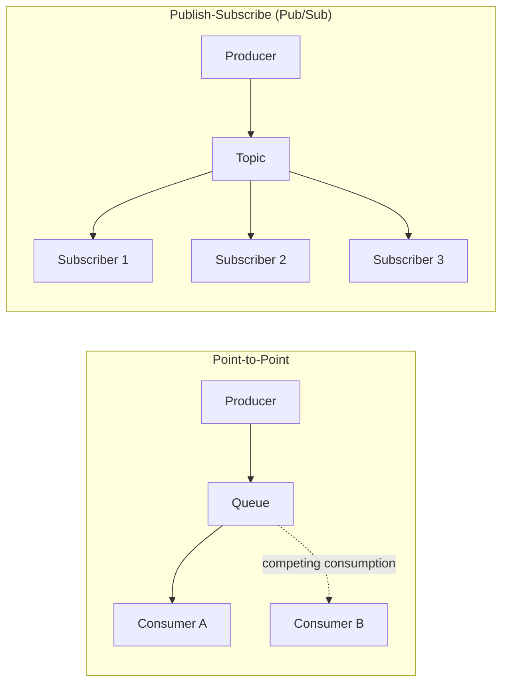
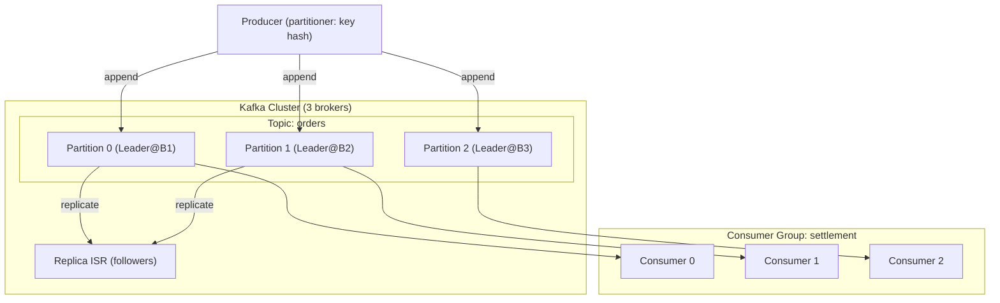

# Message Queue and Apache Kafka

## 1. Overview

> **Definition**: A Message Queue is message-oriented middleware (MOM, Message-Oriented Middleware) that places an **intermediate buffer that temporarily stores messages** between the sender (Producer) and the receiver (Consumer), so that both sides communicate **asynchronously and with loose coupling** without knowing each other's existence or processing speed. Apache Kafka reinterprets this concept on the basis of a **distributed commit log**, and is a **distributed event streaming platform** that durably stores large volumes of events while allowing many consumers to replay and reprocess them.

Modern systems involve many services operating at different speeds cooperating together—orders, payments, notifications, settlement, recommendations. If they are connected only by direct synchronous calls, the moment one downstream service slows down or fails, that delay and failure propagate through the entire call chain. For example, if the order service synchronously calls payment, inventory, and notification in sequence, then when the notification service's response is delayed by 3 seconds, the user sees the order completion screen 3 seconds late. In this way, **temporal coupling** and **failure propagation** become serious bottlenecks as microservices grow.

A message queue solves this problem by **"placing a buffer in between to separate the time axis."** The producer puts a message into the queue and immediately finishes its own work (fire-and-forget), and the consumer takes messages out and processes them at a pace it can handle. As a result, ① the queue absorbs the difference in production and consumption speed, **smoothing burst traffic (load leveling)**; ② even if a consumer dies temporarily, messages remain in the queue and are **processed later without loss**; and ③ since the producer and consumer do not reference each other directly, **replacing or scaling one side does not affect the other**. These three are the essential benefits of adopting a message queue.

The characteristics of a message queue can be summarized as follows. First, with **asynchronous** communication, the producer does not wait for consumption to complete, improving responsiveness. Second, **buffering** absorbs sudden traffic surges and protects downstream systems. Third, **loose coupling** means producers and consumers do not reference each other directly, enabling independent deployment and scaling. Fourth, **durability** preserves messages even when consumers fail, guaranteeing eventual processing. These four characteristics combine to simultaneously increase the resilience and scalability of the system.

However, asynchrony comes at a price. New problems arise: guaranteeing processing order, exactly-once processing without duplicates, preventing message loss, and the observability problem of eventual consistency where "you cannot know when processing has finished." Therefore, a message queue is not a "throw it and done" technology but one where **delivery semantics and ordering/duplication policies must be explicitly designed**, and from a professional engineer's perspective, how to balance these trade-offs is the key point of discussion.

## 2. Communication Models and Components of Message Queues

Message queue communication is broadly divided into two models: **Point-to-Point** and **Publish-Subscribe**. In the point-to-point model, multiple consumers compete to take a single message, but **exactly one consumer** consumes it (suitable for work distribution and load balancing). In the publish-subscribe model, a single message is **replicated and delivered to all subscribed consumers** (suitable for event broadcasting). The structural diagram below shows both models together with the position of the broker.

**A. Producer and Consumer** — The producer is the entity that serializes business events into messages and sends them to the broker, and the consumer is the entity that receives messages from the broker and performs the actual processing. The key design decision between the two is the choice between **push and pull**. Traditional queues (ActiveMQ, etc.) use a push model in which the broker pushes messages to consumers, but if messages flood in faster than the consumer can handle, the consumer collapses. Kafka instead adopts a **pull model** in which consumers pull from the broker at their own processing pace, designed so that consumers regulate backpressure themselves. This difference creates a decisive advantage in stability for high-volume processing.

**B. Broker and Queue/Topic** — The broker is the server that receives, stores, and delivers messages—the heart of the message queue. The broker keeps messages in memory or on disk and retains them until the consumer acknowledges them, preventing loss. There is an important philosophical difference here. **Traditional brokers** like RabbitMQ **"delete from the queue once consumed,"** whereas Kafka **keeps messages on disk** for the configured retention period regardless of whether they have been consumed, allowing multiple consumers to read repeatedly from their own positions. In other words, if a traditional queue is a "mailbox," Kafka is closer to a "recording tape you can rewind and replay." Retention policies are also divided into two: **time-based retention**, which deletes old messages based on time or size, and **log compaction**, which keeps only the latest value for each key and cleans up previous values. Log compaction is useful when the "final state per key" must be kept permanently (e.g., the current value of a user profile), and becomes a key feature when using Kafka for event sourcing or as a state store.

**C. Message and Acknowledgement** — A message consists of a header (metadata) and a payload (body), and may include a key or sequence number for ordering and duplicate control. The acknowledgement (ack) that a consumer sends to the broker after successfully processing a message is the core mechanism of delivery guarantees. If the ack is sent **before processing**, the message disappears if a failure occurs during processing (at-most-once); if the ack is sent **after processing completes**, a lost ack leads to retransmission and duplicates (at-least-once). This subtle timing is the origin of the delivery semantics discussed later.

The concept paired with acknowledgement is **retransmission and the Dead Letter Queue (DLQ)**. If a consumer repeatedly fails to process a particular message, the broker tries to retransmit it indefinitely, and a **poison message** phenomenon can occur in which a single corrupted message blocks processing of the entire queue. To prevent this, messages that fail more than a certain number of times are isolated in a separate DLQ to protect the normal processing flow, allowing operators to analyze and reprocess them later. In other words, if acknowledgement is "the signal of success," the DLQ is "the safety net for failure," and both must be designed together for a robust message pipeline.

A comparison of traditional message queue products follows. The table is merely a starting point for selection; the reason each product has such characteristics stems from the differences in storage and delivery philosophy described in the paragraphs above.

| Category | RabbitMQ | ActiveMQ | Amazon SQS | Apache Kafka |
|---|---|---|---|---|
| Model | Point-to-Point, Pub/Sub | Point-to-Point, Pub/Sub | Point-to-Point (managed) | Distributed log (Pub/Sub) |
| After consumption | Deleted (on ack) | Deleted | Deleted (visibility timeout) | Retained (replayable) |
| Delivery method | Push | Push | Pull (polling) | Pull |
| Strength | Flexible routing | Standard (JMS) | Zero operational burden | Ultra-high volume, reprocessing |
| Throughput | Medium | Medium | Medium | Ultra-high volume |

## 3. Apache Kafka Architecture and Processing Procedure

Kafka groups messages into logical channels called **Topics**, and splits each topic further into multiple **Partitions**. A partition is an append-only, unmodifiable **sequential commit log**, and each message is identified within a partition by a monotonically increasing **offset**. This partitioning is the source of Kafka's parallelism and scalability. Below is the detailed architecture showing the relationship among the broker cluster, partitions, and consumer groups.

**A. Partitions and Ordering Guarantees** — Kafka **guarantees order only per partition**. Messages in the same partition are consumed in offset order, but global order across different partitions is not guaranteed. This design stems from the fundamental trade-off between performance and ordering. If global order were enforced across the entire topic, only one partition could exist, eliminating parallelism and sharply reducing throughput. Therefore, in practice, **the unit where order matters (e.g., the same account or the same order number) is designated as the message key** so that it is routed to the same partition. For example, using an account number as the key ensures that deposit and withdrawal events for a given account always accumulate in order in the same partition, preserving the consistency of balance calculations.

**B. Consumer Groups and Scaling** — When multiple consumers are bound into one group, Kafka **exclusively assigns** partitions to the consumers within the group. Since one partition is handled by exactly one consumer within the group, the number of partitions becomes the group's maximum parallel consumption limit. Adding consumers triggers partition rebalancing for horizontal scaling, and when a consumer dies, the partitions it handled are reassigned to other consumers, securing high availability. However, since consumption pauses briefly during rebalancing, changing the number of partitions or consumers excessively can actually increase latency due to frequent rebalancing. In practice, **the number of partitions is usually set in advance with ample headroom above the expected maximum parallelism (e.g., 2–3 times future needs)** to avoid frequent readjustments.

**C. Replication and Durability** — Each partition is replicated across multiple brokers and consists of one leader and multiple followers. Producers write only to the leader and followers replicate it; the set of replicas synchronized with the leader is called the **ISR (In-Sync Replica)**. The producer's `acks` setting determines the durability level. `acks=0` does not wait for a response after sending, making it fastest but with high risk of loss; `acks=1` confirms only the leader's write; and `acks=all` considers the write successful only once all ISRs have recorded it, so there is no loss even when a broker fails. In domains where loss is not tolerated, such as finance, `acks=all` is set together with `min.insync.replicas=2` or higher so that at least one synchronous replica preserves the data even if the leader dies.

It should also be noted that choosing the number of partitions is an early design decision that is hard to reverse. In Kafka, partitions can be increased but not decreased, and when key-based routing is used, changing the number of partitions changes the key→partition mapping, which can break existing ordering guarantees. Therefore, the required parallelism should be calculated based on target throughput (messages per second ÷ processing rate of one consumer), and the number of partitions determined carefully with growth headroom added. For example, if 200,000 messages per second must be processed and one consumer handles 20,000 per second, at least 10 partitions are needed, and one might set 20–30 considering future growth.

**D. Delivery Semantics** — Message delivery guarantees are divided into three levels. **At-most-once** has no duplicates but may lose messages, and is used where some loss is acceptable, such as logs and metrics. **At-least-once** has no loss but may produce duplicates, so the consuming side must absorb duplicates through **idempotent processing**. **Exactly-once** is the ideal level with neither loss nor duplication; Kafka supports it by combining the idempotent producer with the transactional API. However, exactly-once reduces throughput due to transaction coordination costs, so the standard practice is to apply it selectively only to segments where consistency is absolute, such as payment and settlement, and to design the rest with the "at-least-once + idempotent consumer" combination. The characteristics and application guidelines of the three semantics are summarized below.

| Delivery Semantics | Loss | Duplication | Throughput | Consumer Requirement | Example Use |
|---|---|---|---|---|---|
| At-most-once | Possible | None | Highest | None | Log and metric collection |
| At-least-once | None | Possible | High | Idempotent processing required | General events, notifications |
| Exactly-once | None | None | Low | Transaction integration | Payment, settlement |

Here, **idempotent consumer** design is the most frequently required technique in practice. A representative approach is to record the message's unique key (e.g., order ID + event type) in a processing history table and skip it if the key has already been processed, so that even if the same message arrives twice, the result is identical to processing it once. This allows the consuming side to absorb at-least-once duplicates, securing practical correctness without the costly exactly-once. This division of roles—"the broker is at-least-once, the application is idempotent"—is the realistic solution for achieving both performance and consistency in high-volume systems.

## 4. Comparison and Application Cases

**A. Kafka vs. Traditional Message Queues — Why They Differ** — The difference between traditional brokers, represented by RabbitMQ, and Kafka stems not from simple performance superiority but from **a difference in design purpose**. RabbitMQ is a **"task queue"** optimized for complex routing (exchange, binding, routing key) and immediate consume-and-delete, strong at delivering commands and tasks that disappear after consumption. Kafka, on the other hand, is an **"event log"** that **persistently stores** events as a log so that multiple consumers can replay them from their own points in time, strong at high-volume stream processing and reprocessing. Therefore, a scenario like "one worker receives and executes an order processing command" is natural for RabbitMQ, while a scenario like "settlement, recommendation, and audit systems each consume all order events" is natural for Kafka. Neither fully replaces the other, and architectures that use both middleware products according to role are common. Selection criteria by requirement are summarized below.

| Requirement | Recommended | Reason |
|---|---|---|
| Event reprocessing/replay needed | Kafka | Retains log, allowing re-consumption from any point |
| High volume of hundreds of thousands per second or more | Kafka | High throughput via partition parallelism and sequential disk writes |
| Complex routing, priority queues | RabbitMQ | Flexible routing based on exchange and binding |
| Minimal operational burden (managed) | SQS/Cloud | Serverless managed service with zero operations |
| Per-message acknowledgement, short tasks | RabbitMQ | Consume-and-delete model suits task queues |

As the table shows, the choice is determined not by "performance superiority" but by a combination of requirements: **need for reprocessing, throughput, routing complexity, and operational capacity**. The key is the difference in perspective on whether events are viewed as "commands written once and discarded" or as "records of facts reused by multiple consumers," and this perspective governs both the middleware choice and the character of the overall architecture.

**B. Combination with Event-Driven Architecture (EDA) and CDC** — Kafka serves as the event backbone for microservices. In an EDA, where services publish state changes as events and other services subscribe and react to them, Kafka is responsible for reliable delivery and retention of events. It is especially powerful when combined with **CDC (Change Data Capture)**. When a connector like Debezium reads a database's transaction log (WAL/binlog) and streams the changes into Kafka topics, data warehouses, search engines, and caches can be synchronized in real time without burdening the source DB. This pattern is used as a key tool for **strangler migration**, which maintains data consistency during a gradual transition from a monolithic DB to microservices.

**C. Concrete Industry Application Cases** — Kafka was originally developed by LinkedIn to process trillions of activity logs per day and open-sourced in 2011, after which it became the de facto streaming standard. In practical figures, large e-commerce companies collect order, click, and inventory events in Kafka at scales of hundreds of thousands to millions per second and use them for real-time recommendations and anomaly detection. In Korea as well, major portals and financial companies widely adopt Kafka for log collection (a front-end buffer for ELK pipelines), real-time settlement, and as an MSA event bus. For example, a payment system publishes payment approval events with `acks=all` and transactions, and settlement, notification, and fraud detection services each consume the same topic, reusing a single event for multiple purposes while eliminating coupling between services.

Another representative case is **the buffer of a log/monitoring pipeline**. If logs pouring from thousands of servers are loaded directly into Elasticsearch, the indexing servers collapse under overload during sudden spikes; but placing Kafka in front lets logs be safely loaded into topics first, and Logstash and indexers pull them at a manageable pace, smoothing the load. In this structure, Kafka simultaneously serves as a safety buffer preventing data loss and as a shared pipeline in which multiple consumers—indexing, search, anomaly detection, and so on—reuse the same log stream for different purposes.

**D. Backpressure and Consumer Lag Management** — In high-volume pipelines, when the production rate continuously exceeds the consumption rate, unprocessed messages keep piling up. This unprocessed backlog is called **consumer lag**, measured as the difference between the latest offset and the offset acknowledged by the consumer. Growing lag is a signal that real-time responsiveness is collapsing, making it the top observability metric for Kafka operations. Countermeasures include increasing the number of consumers (partitions) to raise parallelism, or batching and asynchronizing consumption logic to boost throughput. For example, one Korean commerce company, when order event lag surged during a sale event, scaled out consumers via autoscaling and resolved the lag within minutes. In this way, because Kafka uses a pull model where consumers regulate their own pace (backpressure), the broker does not collapse and the buffer absorbs the load; but if lag itself is neglected, eventual consistency delays harm user experience, so continuous monitoring is essential.

## 5. Advanced — Latest Trends and Expected Exam Directions

The Kafka ecosystem has evolved rapidly in recent years toward reducing operational complexity. The biggest change is **removing the dependency on ZooKeeper**, which had long handled cluster metadata and leader election, and consolidating into Kafka's own consensus protocol, **KRaft (Kafka Raft)**. KRaft eliminates the burden of operating and tuning a separate ZooKeeper cluster and manages metadata as an internal log, greatly shortening controller failure recovery time in large-scale partition environments. If a professional engineer exam asks about "improving Kafka operational complexity," the ZooKeeper→KRaft transition becomes the key argument.

Another trend is **Tiered Storage**. Only recent data is kept on the broker's local disk, while older logs are offloaded to object storage (S3, etc.), lowering storage costs while enabling long-term retention and reprocessing. This is an application of the cloud-native principle of "separating storage and compute" to streaming, and it naturally meshes with data lakehouse and data mesh architectures. In addition, as stream processing layers such as **Kafka Streams and ksqlDB** have matured, there are increasing cases of performing real-time joins, aggregations, and windowing operations directly on Kafka, going beyond simple message delivery.

The emergence of competing and alternative technologies is also noteworthy. **Apache Pulsar** touts strengths in multi-tenancy and geo-replication with a tiered architecture that separates storage and serving, while cloud providers compete by offering fully managed streaming (Amazon MSK/Kinesis, Confluent Cloud, GCP Pub/Sub) that eliminates the burden of broker operations altogether. This creates a new decision axis: "Do we operate Kafka ourselves, or delegate it to a managed service?" At the same time, as Kafka protocol compatibility is demanded as the de facto standard streaming interface, many new products advertise Kafka API compatibility, which illustrates the tension between ecosystem lock-in and standardization.

Furthermore, as streaming replaces much of batch processing, the center of gravity of data pipelines is shifting from "ETL that runs once a night" to "real-time streams that flow without interruption." In this trend, Kafka is establishing itself as the ingestion layer that carries data to data lakes and warehouses, and as a common backbone for real-time analytics and ML feature supply, which also fits well with the distributed ownership model emphasized by data mesh of "treating data as a product."

Expected exam directions frequently include ① delivery semantics (at-least/exactly-once) and idempotent consumer design, ② the trade-offs of partitions, keys, and ordering guarantees, ③ selection criteria for Kafka vs. RabbitMQ, ④ linkage with CDC, EDA, and MSA, and ⑤ backpressure and reprocessing strategies in high-volume log pipelines. When composing an answer, a persuasive flow starts from the background of "why asynchrony and loose coupling are needed," adds depth with specific semantics, figures, and cases, and concludes with trade-offs and the latest trends (KRaft, Tiered Storage).

## 6. Considerations and Implications

From a professional engineer's perspective, adopting message queues and Kafka requires the following strategic judgments.

- **Application strategy (fitness of the tool for purpose)**: RabbitMQ/SQS and Kafka must be chosen distinctly depending on whether the need is "command delivery and work distribution" or "event streams and reprocessing." Unifying all communication under Kafka unconditionally imposes excessive operational burden for simple task queues, while conversely using traditional queues for a high-volume event backbone runs into limits in scaling and reprocessing. Purpose-tool alignment is the first consideration.
- **Consistency trade-off (balance of semantics and cost)**: Exactly-once is attractive but sacrifices throughput and latency due to transaction coordination. Therefore, it is cost-effective to divide consistency grades by domain—applying exactly-once only to finance and payment segments, at-most-once to logs and metrics, and "at-least-once + idempotent consumer" to general events—in a differentiated design.
- **Operations and observability (managing the shadow of asynchrony)**: Asynchrony creates the eventual consistency problem where "it is hard to know when processing has finished." Without securing observability of message flow through consumer lag monitoring, failed message isolation via a Dead Letter Queue (DLQ), and integration with distributed tracing (OpenTelemetry), tracing the cause of failures becomes extremely difficult.
- **Data governance and schema evolution**: Since multiple services consume the same topic, if a producer carelessly changes the message structure, downstream consumers break all at once. Schema evolution must be controlled through Schema Registry, compatibility rules (backward/forward compatibility), and Data Contracts to remain safe in the long term.
- **Outlook and related technologies**: With KRaft and Tiered Storage lowering operational complexity and cost, and combining with stream processing such as Kafka Streams and Flink, Kafka is expected to become the backbone of real-time data architectures together with CDC, data mesh, and event sourcing. Message queues should be understood not as a single technology but as a **connection fabric** that runs through EDA, MSA, and data pipelines.

## References
- Apache Kafka official documentation, https://kafka.apache.org/documentation/
- Apache Software Foundation, "KRaft: Apache Kafka Without ZooKeeper", https://developer.confluent.io/learn/kraft/
- AWS, "What is a Message Queue?", https://aws.amazon.com/message-queue/
- RabbitMQ official documentation, https://www.rabbitmq.com/documentation.html

---

> **In one line**: A message queue is middleware that separates producers and consumers with a buffer to realize asynchronous, loosely coupled communication, and Apache Kafka is a streaming platform that reinterprets this as a distributed commit log to enable durable storage, reprocessing, and horizontal scaling of high-volume events; explicitly designing the trade-offs among delivery semantics, partition ordering, replication, and consistency is the key to success.
