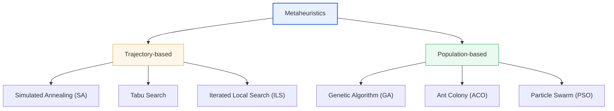
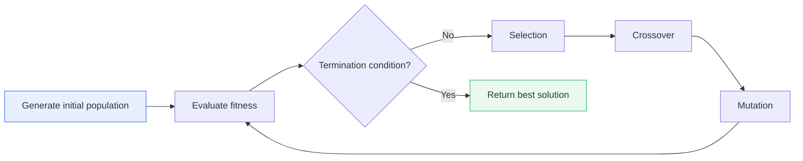

# Metaheuristics

## 1. Overview

### A. Definition
> **Metaheuristics** are **higher-level (meta) empirical (heuristic) search strategies that find excellent solutions close to the optimum within realistic time** for complex optimization problems; they are general-purpose (problem-independent) optimization frameworks that intelligently explore the solution space without being bound to the structure of a specific problem.

The fundamental reason metaheuristics are needed is that "**real-world optimization problems are too large for exhaustive search**." A representative example is the Traveling Salesman Problem (TSP). With *n* cities, the number of possible routes is (*n*−1)!/2; with only 30 cities, the number of routes reaches about 4.4×10³¹. Even a computer checking one billion routes per second would take longer than the age of the universe to examine them all. For such **NP-hard** problems, where the number of cases explodes combinatorially, no algorithm is known that guarantees the global optimum in polynomial time. Yet optimization cannot be abandoned, so a practical approach is required that finds "a good-enough solution, fast enough, even if not perfect." Metaheuristics are exactly that answer.

The idea behind metaheuristics begins with **imitating natural and physical phenomena**. They translate into computational procedures "the ways nature has found good solutions over long periods of time," such as biological evolution, the annealing of metals, ant colonies foraging for food, and flocks of birds moving together. Unlike simple greedy rules, they sometimes probabilistically accept solutions that look worse for now while surveying wide areas, and dig intensively around good solutions. They are called "meta"heuristics because this **meta (higher) level of control logic** directs problem-specific heuristics.

The core principle is **the balance between Exploration and Exploitation**. Exploration is the activity of broadly searching new, unvisited areas to secure diversity, while exploitation is the activity of intensively improving the area around the good solutions found so far to achieve convergence. Too much exploration approaches random search and slows convergence; too much exploitation gets trapped early in a **local optimum** and misses the global optimum. A good metaheuristic finely tunes the tension between these two forces through an adaptive schedule that sweeps the solution space broadly with an exploration focus at the start and narrows down with an exploitation focus toward the end.

### B. Background and Need
Traditional optimization was dominated by **approaches that obtain exact solutions assuming the mathematical structure of the problem (differentiability, convexity, etc.)**, such as linear programming (LP) and integer programming (IP). However, many real-world problems—logistics routing, production scheduling, neural network architecture design—have discontinuous, nonlinear, or non-differentiable objective functions, complex constraints, and astronomical search spaces. Exact methods are hard to apply directly to such problems. Metaheuristics work even when the objective function can only be evaluated as a "black box" (input a solution, get a score), so they require almost no assumptions about problem structure. This very **generality and flexibility** is the background for the wide spread of annealing, genetic algorithms, tabu search, and others since the 1980s–1990s.

## 2. Overall Classification and Structure

Metaheuristics are broadly divided into two families based on **the number of solutions maintained** during the search: **trajectory-based**, which gradually improves a single solution, and **population-based**, which evolves a set of multiple solutions simultaneously. The former traces a trajectory of one point moving through the solution space and is strong at refining local search, while the latter has multiple solutions sweep the space in parallel and exchange information, making it advantageous for global search and securing diversity.



Trajectory-based methods are simple to implement with a small memory burden, but because they depend on a single trajectory, their exploration ability must be reinforced with separate devices (probabilistic acceptance in annealing, the forbidden list in tabu search) to escape local optima. Population-based methods naturally explore widely because multiple candidates search different regions simultaneously and spread information about good solutions throughout the population, but since the objective function must be evaluated for every solution, **evaluation cost is high and the burden of tuning parameters (population size, crossover rate, etc.)** is large. In practice, one or a combination of the two is chosen based on the nature of the problem and the cost of evaluating the objective function.

| Family | Representative Techniques | Advantages | Limitations |
|---|---|---|---|
| **Trajectory-based** | Simulated Annealing (SA), Tabu Search, ILS | Simple, lightweight, refined local search | Weak global exploration, requires separate escape mechanisms |
| **Population-based** | Genetic (GA), Ant (ACO), Particle Swarm (PSO) | Parallel search, diversity, advantageous for global search | Evaluation cost, parameter tuning burden |

## 3. Details of Major Techniques

### A. Genetic Algorithm (GA)
A genetic algorithm imitates **biological evolution**. Each solution is encoded as a chromosome, a population of multiple solutions is created, and individuals with high fitness are **selected**; the next generation is produced through **crossover**, which mixes the genes of two parents, and **mutation**, which randomly changes some genes. Over successive generations, solutions with high fitness survive and the quality of the entire population gradually improves.

Here, crossover mainly plays the role of **exploitation**, and mutation plays the role of **exploration**. If the mutation rate is too low, the population converges prematurely to one point and gets trapped in a local optimum; if too high, it behaves like random search and fails to converge. Therefore, the mutation rate usually starts with a small value around 0.1–1% and is adjusted according to the situation. Because GA allows solutions to be encoded freely, it is particularly widely used for combinatorial optimization (scheduling, placement, routing).



As a real application example, in satellite antenna design NASA used a genetic algorithm to find a high-performance antenna with an asymmetric shape that humans would find hard to conceive intuitively. In problems like this, where the design space is wide and intuition does not work, GA shows the strength of discovering solutions that human designers have not seen.

### B. Simulated Annealing (SA)
Simulated annealing takes its name from the physical process of **slowly cooling metal from a high temperature to stabilize its crystal structure**. When moving from the current solution to a neighboring solution, better solutions are always accepted and worse solutions are also **accepted probabilistically**. This acceptance probability increases as the temperature (T) is higher and as the degree of worsening is smaller (based on the Boltzmann distribution), and as iterations progress, the temperature is lowered (cooling schedule) so that worse solutions are gradually accepted less.

This mechanism of "occasionally accepting worse solutions" is the core of annealing. In the early high-temperature phase, it explores broadly by crossing the valleys of local optima, and in the later low-temperature phase, it converges by concentrating on and exploiting good regions. If the temperature is lowered too quickly, exploration is insufficient and it gets trapped in local optima; if lowered too slowly, convergence is slow and computation takes long. This is why the cooling schedule (initial temperature, decay rate) determines performance. VLSI semiconductor placement and routing optimization is a classic success story of annealing. The pseudocode below summarizes the flow of this probabilistic acceptance and cooling.

```text
T ← T_initial          # Start at a high temperature
s ← generate initial solution
repeat:
    s' ← generate neighbor solution of s
    Δ ← cost(s') - cost(s)
    if Δ < 0:          # Always accept if better
        s ← s'
    else if rand() < exp(-Δ / T):   # Probabilistically accept worse solutions
        s ← s'
    T ← T × α          # Cooling (0<α<1), temperature gradually decreases
until termination condition (T sufficiently low)
return s
```

### C. Ant Colony (ACO), Particle Swarm (PSO), and Tabu Search
Ant Colony Optimization (ACO) imitates the collective intelligence in which ants leave **pheromones** on paths as they carry food, and shorter paths accumulate pheromones faster, attracting other ants. As pheromones left by multiple ants (solutions) accumulate on good paths, the colony gradually converges to excellent solutions. It is suitable for path and network routing problems.

Particle Swarm Optimization (PSO) imitates the collective movement of flocks of birds and schools of fish. Each particle (solution) moves by updating its velocity with reference to both the best position it has found (pbest) and the best position of the whole swarm (gbest). It is widely used in continuous-space optimization because it is simple to implement and converges quickly. Tabu search **places recently visited solutions on a forbidden list (tabu list) to prevent revisiting**, thereby preventing cycling in the same place and forcing escape from local optima. In this way, each technique answers the same question—"how to escape local optima"—with a different mechanism.

## 4. Comparison and Selection Criteria

Technique selection should be judged not by "which algorithm is absolutely superior" but by **which technique's search method fits the structure of the problem**. This is also the practical implication of the **No Free Lunch Theorem**, which states that "there is no single algorithm that is optimal for all problems." PSO and annealing tend to be advantageous for continuous-variable optimization (function minimization, parameter tuning), while GA, ACO, and tabu search tend to be advantageous for combinatorial optimization where order and placement matter (TSP, scheduling).

| Technique | Inspiration/Principle | Exploration/Exploitation Mechanism | Suitable Problems |
|---|---|---|---|
| **Genetic (GA)** | Evolution (selection, crossover, mutation) | Mutation (exploration) + crossover (exploitation) | Combinatorial, design optimization |
| **Annealing (SA)** | Metal annealing, probabilistic acceptance | Temperature-dependent probabilistic acceptance | Continuous, placement (VLSI) |
| **Ant (ACO)** | Pheromone path search | Pheromone evaporation and accumulation | Paths, routing |
| **Particle Swarm (PSO)** | Flocking movement of birds | pbest/gbest weighting | Continuous function optimization |
| **Tabu** | Forbidding recent solutions | Forbidden list prevents cycling | Combinatorial optimization |

What matters in the comparison is "why the differences arise." For example, PSO is strong in continuous spaces because particle position and velocity are represented as real-valued vectors, enabling smooth movement without gradients; ACO is strong in path problems because the accumulated information called pheromone naturally remembers and reuses "good partial paths." In practice, rather than relying on a single technique, the strengths of each technique are combined in a **hybrid**, for example, exploring broadly with GA and then locally refining with annealing or tabu search.

## 5. Advanced — Latest Trends and Practical Application

Today, metaheuristics have re-emerged as **core components of AI/ML pipelines**. Representative examples are **Hyperparameter Optimization (HPO)** and **Neural Architecture Search (NAS)**. Hyperparameters such as learning rate, number of layers, and batch size, or the neural network architecture itself, form non-differentiable discrete or mixed search spaces, making metaheuristics such as evolutionary algorithms and PSO natural tools. Google's AmoebaNet and others are known as cases where evolution-based search found architectures that match or surpass human-designed models.

In addition, **hybrid/Memetic algorithms** and **Multi-objective optimization** are mainstream research directions. Memetic algorithms combine population-based global search (GA) with local search (annealing, etc.) to improve convergence quality, and multi-objective evolutionary algorithms such as NSGA-II consider multiple conflicting objectives—such as cost, performance, and power—simultaneously to present a **set of Pareto-optimal solutions (Pareto front)**. In practice, these techniques are applied to problems with complex constraints and multiple objectives, such as the vehicle routing problem (VRP) at logistics companies, production scheduling in semiconductor processes, telecommunications network design, and financial portfolio optimization. However, since metaheuristics provide only approximate solutions, in areas where solution quality assurance is important, it is desirable to verify in parallel with exact methods (mathematical programming) or bounding techniques.

## 6. Considerations and Implications (Professional Engineer's Perspective)

1. **Technique and parameter selection based on problem characteristics**: As the No Free Lunch theorem says, there is no universal technique. Performance comes only after first analyzing whether the problem is continuous or discrete, its constraint structure, and the cost of evaluating the objective function (e.g., whether a single evaluation requires a simulation), and then selecting and tuning the technique and parameters (population size, temperature, mutation rate). Self-adaptive parameter techniques should also be considered.
2. **Adaptive control of the exploration-exploitation balance**: A dynamic schedule that shifts from exploration early on to exploitation later determines success or failure. Monitoring signs of premature convergence (a sharp drop in diversity) and raising the mutation rate or restarting are effective strategies.
3. **Trade-off between evaluation cost and computing resources**: Population-based methods evaluate the objective function for every solution, so they can be accelerated with parallelization (evaluating multiple solutions simultaneously), but this requires resources. For problems with high evaluation cost, apply a strategy of approximating the objective function with a surrogate model to reduce the number of evaluations.
4. **Quality assurance of approximate solutions and parallel use of exact methods**: Since metaheuristics do not guarantee optimal solutions, in decisions involving safety or money, a confidence interval for the solution must be secured by computing lower/upper bounds or cross-validating with mathematical programming.
5. **Outlook for integrated use in the AI era**: The combination of metaheuristics and machine learning—HPO, NAS, reinforcement learning policy search—is expanding, and conversely, learning-optimization fusion (learn-to-optimize), which uses learned models as surrogate evaluators, is emerging as a new trend.

## References
- Wikipedia, "Metaheuristic" — https://en.wikipedia.org/wiki/Metaheuristic
- Wikipedia, "No free lunch theorem" — https://en.wikipedia.org/wiki/No_free_lunch_theorem
- Wikipedia, "Neural architecture search" — https://en.wikipedia.org/wiki/Neural_architecture_search

---

> **In one line**: Metaheuristics are *general-purpose search strategies that find excellent approximate solutions in practical time for large-scale NP-hard optimization where exhaustive search is impossible*; imitating natural and physical phenomena, they escape local optima through **a balance of exploration and exploitation**, and today they are re-emerging as core tools of AI pipelines such as HPO and NAS.
