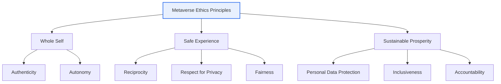

# Metaverse Ethics Principles

## 1. Overview

### A. Definition

> The **Metaverse Ethics Principles** are guidelines announced by the Ministry of Science and ICT—a voluntary code of conduct for **proactively responding to ethical problems that the spread of the metaverse may cause, such as identity confusion, privacy infringement, addiction, and virtual crime**. Rather than mandatory regulation, they present values and practical principles that users, businesses, and developers should pursue together.

The key to understanding the character of the Metaverse Ethics Principles is that they are a "**voluntary code (soft law)**." They are not a regulation with legal binding force, but a soft norm that presents a direction for stakeholders to voluntarily pursue while the industry is still forming. This is an approach that leaves room for new technology to develop while drawing a rough sketch of social consensus before problems become serious.

### B. Background

The reason metaverse ethics is needed separately from internet and AI ethics lies in the fact that the metaverse is a **new social space** where reality and the virtual are fused. People interact as another self called an avatar, have immersive experiences through headsets, and conduct economic activity with virtual assets and virtual currency. In this process, new problems arise that cannot be fully captured by existing online ethics.

The first is the **identity problem**. One can hold multiple selves behind an avatar, and as anonymity combines with immersion, confusion or detachment can arise between the real self and the virtual self. The second is the **shock stemming from presence**. Harassment, violence, and sexual harassment in virtual space are experienced as real because of immersion, so the psychological shock can be greater than text-based online violence. In fact, as cases of avatar sexual harassment and bullying on social VR platforms were reported, the new issue of "bodily violation in virtual space" emerged. The third is the **data problem**. Data collected by immersive devices—eye tracking, motion recognition, biometric responses, and so on—is far more sensitive and reveals the individual far more deeply than existing internet services.

### C. Necessity

Because the metaverse is still a forming space, regulating after a problem has erupted is already too late. A proactive approach was required—to present values and practical principles to pursue in the early stages of development, thereby balancing technological progress and user protection. Rather than dampening a new industry with mandatory regulation, the intent of these principles is to present shared norms first among stakeholders to induce a healthy ecosystem. This also has a preventive character, considering the reality that vulnerable users such as youth and children rapidly flow in.

## 2. Overall Structure — 3 Core Values and 8 Practical Principles

First, we survey the overall structure of the ethics principles with a conceptual diagram, then explain the process of how the practical principles are actually applied through a detailed flow.

The Metaverse Ethics Principles are anchored on three core values, with eight practical principles beneath them. **Whole Self** is about realizing an authentic self even through an avatar and maintaining a healthy identity, supported by the principles of authenticity and autonomy. **Safe Experience** is about users acting in a trustworthy environment without the risk of violence, crime, or addiction, which corresponds to reciprocity, respect for privacy, and fairness. **Sustainable Prosperity** aims for an ecosystem in which all participants grow together rather than being monopolized by a particular actor, supported by personal data protection, inclusiveness, and accountability.

The three values can be read as a structure in which the field of view expands from individual (self) → interaction (experience) → community (ecosystem). That is, a concentric arrangement that starts from the individual's healthy identity, passes through safe interaction with others, and advances toward a sustainable society.

| 3 Core Values | Meaning | Linked Practical Principles (gist) |
|---|---|---|
| **Whole Self** | Realizing an authentic self, respect for identity | Authenticity, Autonomy |
| **Safe Experience** | Safe and trustworthy use | Reciprocity, Respect for Privacy, Fairness |
| **Sustainable Prosperity** | A sustainable ecosystem that grows together | Personal Data Protection, Inclusiveness, Accountability |

Each practical principle should be understood not as an abstract slogan but as an action guideline to be reflected in design and operation. Unpacking the eight principles a bit more concretely gives the following.

- **Authenticity**: Do not impersonate others with deepfake avatars or deceive through a false identity, and ensure that the self behind the avatar is not distorted.
- **Autonomy**: Enable users to decide and control their own data, experience, and participation, and exclude coercion or manipulation (dark patterns).
- **Reciprocity**: Respect others and aim for mutually beneficial interactions, prohibiting one-sided exploitation or harassment.
- **Respect for Privacy**: Respect the individual's private domain and boundaries even in virtual space, and prevent unwanted access and surveillance.
- **Fairness**: Ensure that particular users or groups are not discriminated against and that rules are applied transparently and consistently.
- **Personal Data Protection**: Protect sensitive data collected by immersive devices under the principles of minimal collection and purpose limitation.
- **Inclusiveness**: Reduce access gaps due to disability, age, or income so that anyone can participate.
- **Accountability**: When problems occur, the platform, developers, and users each take responsibility for their share and carry out remedy and improvement.

Translating principles into concrete actions in this way is the key to the effectiveness of the ethics principles. If principles remain declarations, they cannot change the behavior of actual services, so the work of concretizing each principle into "prohibited acts" and "required functions" and converting them into a design checklist must follow.

## 3. Application Process of the Practical Principles and Stakeholders

The ethics principles must not stop at being declarations but must be woven into every stage of service planning and operation. The following is a flow that details, from the stakeholder perspective, the process by which the practical principles are reflected in an actual service.

In the **planning stage**, one anticipates which users the service targets and what interactions will occur, identifying risk factors in advance. For example, if youth are the main users, addiction prevention and blocking of harmful content are nailed down as design requirements. In the **development stage**, one implements principles as defaults, as in Privacy by Design. Building reporting, blocking, and distancing (personal space protection) features in from the start rather than adding them afterward is an example.

In the **operation stage**, problems are caught early through real-time monitoring and user reporting systems, and in the **response stage**, sanctions (warnings, usage restrictions) and remedy for victims are carried out. In the **improvement stage**, a cyclical structure is created in which incident cases and user feedback are again reflected in planning. What matters in this cycle is that responsibility is divided among three actors. The **platform** is responsible for a safe environment and reporting/response systems, the **developer** for design that reflects ethics, and the **user** for respecting others and complying with norms. Since placing responsibility on only one actor reduces effectiveness, a shared-responsibility structure is emphasized.

## 4. Comparison of Internet, AI, and Metaverse Ethics

The three ethics differ in their subject, core issues, and the mechanism by which problems arise. Rather than simply listing items, one must point out why the differences arise.

| Category | Internet Ethics | AI Ethics | Metaverse Ethics |
|---|---|---|---|
| **Subject** | Online information·communication | Judgments of AI systems | Virtual-fused space·avatars |
| **Core Issues** | Information trust·copyright·etiquette | Bias·transparency·accountability | Identity·presence·immersion·privacy |
| **Characteristics** | Anonymity·openness | Automation·autonomy | Immersion·embodiment·fusion with reality |
| **Perceived Harm** | Text·image based | Appears as a consequence of a decision | Immediate·bodily due to presence |

If internet ethics deals with problems of online information and communication (etiquette amid anonymity, copyright, misinformation), and AI ethics deals with whether AI's judgment is fair and transparent (bias, accountability for explanation), then metaverse ethics deals with problems unique to immersive virtual space (identity, presence, privacy). The root of the difference is "immersion and embodiment." An insult on the internet is text on a screen, but in the metaverse a violation against an avatar is experienced like a violation of one's own body because of immersion. This presence changes the intensity and character of the harm, so existing online ethics cannot be applied as is.

Furthermore, the metaverse encompasses both the connectivity of the internet and the automation of AI (NPCs, generative avatars), while adding the unique dimension of immersion and embodiment. Therefore, metaverse ethics should be understood not as replacing the previous two ethics but as adding a new layer on top of them. For example, the problem of deepfake avatars created with generative AI is a point where AI ethics (the authenticity of generated content) and metaverse ethics (identity, impersonation) overlap.

## 5. Deep Dive — Domestic and International Trends and Anticipated Exam Directions

Metaverse ethics does not stop at domestic guidelines but is intertwined with international discussions. Domestically, beyond the Ministry of Science and ICT's ethics principles, legal and institutional reform to promote the metaverse has been pursued, and discussions continue in the direction of jointly preparing industry self-regulation and user protection mechanisms. Internationally, discussions on privacy, child protection, and inclusiveness of immersive technologies are underway at UNESCO, the OECD, and elsewhere, and in particular the sensitivity of **immersive/neural data** such as gaze and motion has emerged as a new regulatory issue. Since this data can infer even an individual's interests, emotions, and health status, there is a problem raised that protection beyond the existing concept of personal data is needed.

As a practical application case, one can cite social VR platforms introducing a "personal boundary" feature that enforces a minimum distance between avatars, technically mitigating harassment in virtual space. This is a concrete example of implementing the ethics principles' "safe experience" and "respect for privacy" through design. Also, managing youth usage time and filtering harmful content are measures that reflect "whole self (addiction prevention)" and "inclusiveness."

From the perspective of the professional engineer exam, the anticipated exam directions can be organized as follows. (1) A type that describes the 3 core values and 8 principles of the Metaverse Ethics Principles and compares them with internet and AI ethics; (2) a type that presents a particular ethical problem (virtual crime, addiction, privacy) and discusses technical and institutional response measures; (3) a type that describes the implementation methods of the principles from a design perspective, such as Privacy by Design and user protection features. When composing an answer, it is advantageous to develop it in the flow of "why it is needed (background) → what it is (structure) → how to implement it (measures)" rather than stopping at a list of principles.

## 6. Considerations and Implications

When dealing with metaverse ethics from a professional engineer perspective, the following should be considered comprehensively.

1. **A proactive response strategy through voluntary norms.** Since mandatory regulation may dampen an industry in its formative period, one presents core values and practical principles first to induce voluntary practice by users and businesses. However, voluntary norms have the limitation of being difficult to make effective, so a trade-off design that combines self-regulation with a minimal legal safety net (especially child and youth protection) is needed.

2. **A separate approach to problems unique to immersion and embodiment.** Harassment and violence in virtual space have a large psychological shock due to presence, and the risks of identity confusion and addiction are also high. Therefore, rather than stopping at applying existing online ethics by analogy, one must build into the design technical and operational controls specialized for immersive environments, such as personal boundary features, reporting systems, and real-time monitoring.

3. **Privacy protection of immersive and biometric data.** Gaze, motion, and biometric response data are highly sensitive information from which an individual's emotions and health can even be inferred. One should make Privacy by Design (minimal collection, on-device processing, purpose limitation) the default and manage it to comply with the sensitive-information requirements of the Personal Information Protection Act and international regulatory trends.

4. **A shared-responsibility structure among multiple stakeholders.** Since the metaverse is a space that the platform, developers, and users create together, responsibility should not be pushed onto any single actor; each actor's role (safe environment, ethical design, norm compliance) should be clearly divided. It complements internet and AI ethics, and given the nature of fused technology, maintaining coherence so that multiple ethical systems operate together is also a challenge.

5. **Securing inclusiveness and accessibility.** Immersive devices can widen the access gap (digital divide) depending on cost and physical condition. For sustainable prosperity, accessibility must be reflected as a design requirement so that people with disabilities, older adults, and low-income groups are not left out.

## References

- Ministry of Science and ICT, Metaverse Ethics Principles announcement press release — https://www.msit.go.kr/
- UNESCO, discussion on Ethics of immersive technologies — https://www.unesco.org/
- OECD, materials related to Immersive technologies and privacy — https://www.oecd.org/

---

> **In one line**: The Metaverse Ethics Principles are a voluntary code that presents the three core values of *Whole Self·Safe Experience·Sustainable Prosperity* and eight practical principles, proactively responding to problems of identity, presence, and privacy stemming from immersion and embodiment, and complementing internet and AI ethics through a cycle of planning→operation→improvement and the shared responsibility of platform, developers, and users.
