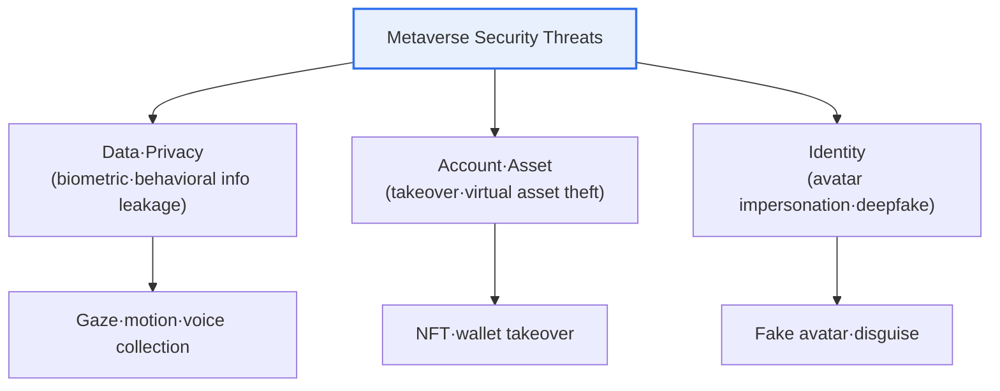
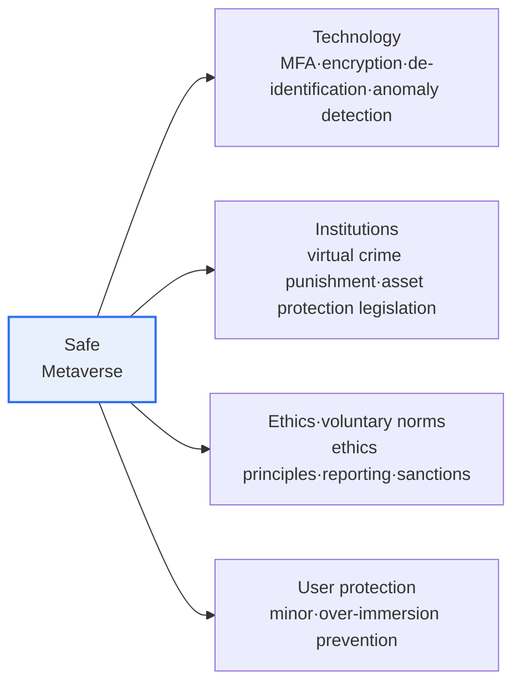

# Metaverse Security Threats and Social Problems

## 1. Overview

### A. Concept and Characteristics

> The **Metaverse** is a **three-dimensional immersive virtual space** in which the real world and the virtual world are fused, referring to a persistent, real-time internet environment in which users perform social, economic, and cultural activities through avatars. It is a compound of "meta," meaning "transcendence," and "universe," meaning "world."

The fundamental reason the metaverse breeds new threats along with convenience lies in the fact that "**the boundary between reality and the virtual collapses, and vast, sensitive personal and biometric data flow constantly for the sake of immersion**." The metaverse is not a mere game or video conference; it aims to be "another persistent reality" in which people meet as avatars to work, trade, and communicate. This immersion and presence is the source of value, but it is also the source of threat at the same time. Because it feels like reality, violence and harassment in the virtual space deliver real psychological shock, and if the biometric and behavioral data collected to realize immersion—gaze, head rotation, hand motion, facial expression, voice—leaks, it becomes an extremely sensitive privacy violation. On top of that, as virtual assets such as NFTs and virtual currency become linked to real monetary value, they become targets of financial attacks, and because one can hide or forge identity behind an avatar, impersonation and crime become easy.

Herein lies the reason metaverse security is not a simple extension of existing cybersecurity. While it inherits the threats of web services (account takeover, phishing, malware) as they are, a new layer of threats and social problems stemming from the unique characteristics of **virtuality, immersion, biometric data, and the virtual economy** overlaps with them. In particular, the data collected by VR/AR headsets is not simple profile information but biometric and behavioral signals that can re-identify an individual, which means that a leak can lead to irrecoverable harm (a password can be changed, but gait, iris, and gaze patterns cannot).

### B. Key Characteristics of the Metaverse

Because each of the metaverse's four characteristics is directly tied to a specific threat, one must first understand the characteristics to see the structure of the threats. **Immersion and presence** give a lifelike experience through 3D and VR/AR technology, but the sensors for this constantly collect sensitive data. **Avatars** enable free activity as a virtual self, but they hide identity behind anonymity and invite impersonation and evasion of accountability. **The virtual economy** opens new economic activity with NFTs and virtual currency, but it creates incentives for financial attacks. **Real-time multi-user interaction** enriches communication, but at the same time becomes a conduit for virtual violence and harassment.

| Characteristic | Content | Directly Linked Threat |
|---|---|---|
| **Immersion·Presence** | Lifelike experience via 3D·VR/AR | Collection·leakage of biometric·behavioral data |
| **Avatar** | Activity as a virtual self, anonymity | Impersonation·deepfake·evasion of accountability |
| **Virtual Economy** | Trading based on NFTs·virtual currency | Asset theft·smart-contract attacks |
| **Real-time Interaction** | Simultaneous multi-user communication | Virtual sex crime·harassment·hate |

## 2. Security Threats from the Information Systems Perspective

Metaverse threats can be broadly divided into three axes—data/privacy, account/asset, and identity—and the conceptual diagram below shows the overall structure.

**A. Personal and biometric information leakage** is the most serious threat unique to the metaverse. Immersive devices can collect a user's eye-tracking, head and hand movements, room size and furniture layout (spatial mapping), voice, and even facial expressions and heart rate. Researchers have reported that even such motion and gaze data alone can re-identify an individual with high accuracy, which means the real user behind a pseudonymized avatar can be identified. Since gaze data reveals what one pays attention to (implying advertising, political leaning, health status), leakage or misuse can lead beyond targeted advertising to psychological manipulation or discrimination. This data is qualitatively different from a password leak in that once it leaks it cannot be changed.

**B. Account takeover and virtual asset attacks** are threats that have grown as the virtual economy became linked to real value. An avatar account is bundled with purchased items, virtual real estate, NFTs, and linked payment methods, so losing the account is tantamount to financial loss. In particular, for blockchain-based assets, if the wallet private key is stolen the transaction cannot be reversed (irreversibility), and cases of theft targeting vulnerabilities in smart-contract code (reentrancy attacks and so on) have actually occurred. A representative technique is inducing wallet signatures through phishing via forged virtual shops and airdrop links.

**C. Avatar impersonation, deepfakes, and malware** destroy trust in identity and content. One can impersonate an acquaintance or celebrity with an avatar that forges another's appearance and voice to commit fraud (real-time disguise is also possible when combined with deepfakes), or infect victims by embedding malware in virtual items and links. The anonymity of avatars broadens freedom of expression while also serving as a shield for perpetrators to attack with their identity hidden and evade tracing.

Meanwhile, it is worth noting that the immersive environment **amplifies the effectiveness of social engineering attacks**. When a virtual branch bearing the logo of a trustworthy institution or an avatar indistinguishable from a real person speaks to you right before your eyes in a 3D space, it has far stronger persuasive power than text-based phishing. That is, the metaverse does not stop at inheriting existing threats but plays the role of an "amplifier" that raises the success rate of those threats through the characteristic of presence. This is why user education and platform-level identity-verification marks (official account badges and so on) are needed together.

| Threat | Content | Characteristic |
|---|---|---|
| **Personal·biometric info leakage** | Theft of sensitive data such as gaze·motion·voice | Re-identifiable·irrecoverable |
| **Account takeover** | Theft of virtual assets·identity | Directly tied to financial loss |
| **Virtual asset attack** | NFT·virtual currency theft, contract vulnerabilities | Irreversible·hard to trace |
| **Avatar impersonation·deepfake** | Forging another's avatar, fake identity | Collapse of trust |
| **Malware·phishing** | Infection via virtual items·links | Inheritance of existing threats |

## 3. Social Problems and Measures for a Safe Metaverse

### A. Social Problems

The social problems of the metaverse require a separate approach in that they are human and ethical problems that cannot be solved by technology alone. First, **identity confusion**. Moving among multiple selves as avatars widens the gap with the real self, and for youth in particular, who are in the period of identity formation, it can lead to confusion between reality and the virtual. Second, **virtual sex crime, violence, and harassment**. Reports continue that, due to immersion, sexual harassment, stalking, and violence in virtual space leave psychological trauma close to real-life on actual victims, and in fact reports of avatar sexual harassment in VR social spaces have come to the fore as a social problem. Third, **over-immersion and addiction**. A virtual reward system more attractive than reality can induce excessive immersion and erode daily life, studies, and interpersonal relationships. Fourth, **economic crime and fraud**, where investment fraud and pyramid schemes baited with virtual real estate and items spread by exploiting anonymity and regulatory gaps. Fifth, the problem of the **digital divide and accessibility**, where, given that expensive VR equipment and high-speed networks are prerequisites, the opportunity to participate is split by economic and physical conditions, and this can lead to the exclusion of marginalized groups as the metaverse increasingly becomes a venue for new social and economic activity.

These problems intertwine and amplify one another. For example, anonymity grows virtual violence and economic crime simultaneously, and over-immersion raises vulnerability to fraud and crime. Therefore, rather than responding to individual problems separately, an approach that integrates a minimum of accountability traceability for identity and behavior and user protection mechanisms into the platform design is required.

The common backdrop of these problems is the combination of **anonymity + immersion + lack of regulation**. The perpetrator can deliver a shock close to reality with their identity hidden, and because it is a virtual space that crosses borders, jurisdiction and punishment are ambiguous. In fact, at a large VR social platform, when reports of avatar sexual harassment followed one after another in the early stage of service, there was a case of introducing a "personal boundary" feature enforcing a minimum distance between users as a default afterward, which simultaneously shows that social problems can stem from flaws in technical design and can also be mitigated by design.

Another trend worth noting is the protection of children and youth. Since immersive virtual space is a structure in which adults and minors mix as avatars, there is a high risk that minors are exposed to inappropriate content and contact or interact with adults who lie about their age. For this reason, age assurance, strengthened default protection for minor accounts, and guardian control features have emerged as core issues of regulation and platform policy.

### B. Measures for a Safe Metaverse

A safe metaverse comes into being when technology, institutions, ethics, and user protection are equipped together. Any one alone is insufficient—for example, even with strong encryption (technology) one cannot prevent avatar sexual violence (a social problem), and punishment provisions (institutions) alone make it difficult to trace cross-border anonymous perpetrators. The conceptual diagram below shows the structure in which the four axes complement one another.

**Technical measures** include strong authentication (MFA, FIDO), encryption of data in transit and at rest, minimal data collection and de-identification, on-device (local) processing of gaze and biometric data, and anomalous-behavior detection (account takeover and bot detection). **Institutional measures** are legal reform to enable the punishment of crimes in virtual space and legislation to protect virtual asset users (such as the domestic Virtual Asset User Protection Act). **Ethics and voluntary norms** are platform-level metaverse ethics principles and effective reporting and sanction systems, and **user protection** refers to concrete mechanisms such as access control for minors, over-immersion prevention (usage-time notices), and personal safety boundaries (a "personal bubble" and other features that secure physical distance).

| Category | Measures |
|---|---|
| **Technology** | MFA·encryption, minimal data collection·de-identification, on-device processing, anomalous-behavior detection |
| **Institutions** | Virtual crime punishment·regulation, virtual asset user protection legislation |
| **Ethics·voluntary norms** | Metaverse ethics principles, reporting·sanction systems |
| **User protection** | Protection of minors, over-immersion prevention, safety features such as the personal bubble |

## 4. Deep Dive — Regulatory/Standardization Trends and Privacy by Design

Metaverse security is expanding beyond the efforts of individual platforms to the level of regulation and standards. On the data protection side, the EU GDPR treats gaze and biometric data as sensitive information (a special category) and requires strong protection, and domestically as well, the regulation of biometric and behavioral information under the Personal Information Protection Act applies to metaverse data. On the interoperability and standardization side, standardization discussions dealing with the movement of avatars and assets across multiple platforms (such as the Metaverse Standards Forum) are underway, and as interoperability expands, a vulnerability in one platform can spread to the whole connected set, so the importance of security standards grows. On the virtual asset side, the enforcement of the domestic "Virtual Asset User Protection Act" has established a legal basis for the regulation of asset custody and unfair trading.

As a design philosophy, **Privacy by Design** is central. From the service planning stage, one builds minimal data collection, purpose limitation, privacy protection by default, and local processing and immediate disposal of biometric data into the design. Since irrecoverable biometric data cannot be protected by after-the-fact response (responding after a leak), an upfront design that "does not collect it or does not send it outside the device in the first place" is the only effective defense. This also connects with the recent regulatory trend of "accountability by design." [[privacy-by-design]]

As a technical supplement, **differential privacy and data obfuscation** techniques—adding noise or lowering precision to raw signals such as gaze and motion before sending them to the server—and research on biometric-data processing that makes re-identification difficult are underway. However, such techniques can conflict with immersion quality (excessive obfuscation causes response latency and inaccuracy), so finding the balance point of "level of protection vs. immersion quality" per domain remains a practical challenge. In the end, metaverse security should be understood not as a finished-product feature but as a continuous process in which technology, policy, and user awareness must evolve together.

As anticipated exam directions, the strong candidates are: ▲an essay-type question that describes 3–5 threats unique to the metaverse and response measures, layered technically, institutionally, and ethically; ▲the re-identification risk of biometric and behavioral data and the application of Privacy by Design; ▲the positive and negative functions of avatar anonymity and the balance problem of real-name identification and accountability tracing. When composing an answer, developing it in the causal flow of "characteristic → threat derived from the characteristic → layered response → implication from the professional engineer perspective" is highly persuasive.

Also, recently the combination with generative AI has emerged as a new variable. If AI-generated avatars, voices, and content flow into the metaverse, deepfake impersonation and the spread of misinformation become even easier, so content provenance and labeling of AI-generated content have emerged as new challenges for maintaining trust. This again shows that metaverse security is not a fixed set of countermeasures but an area that must be continually updated as technology advances.

## 5. Considerations and Implications

1. **Privacy protection is the top priority.** Because the metaverse constantly collects re-identifiable and irrecoverable biometric and behavioral data—gaze, facial expression, motion—for the sake of immersion, one must make minimal collection, de-identification, on-device processing, and Privacy by Design the default. That this data cannot be protected by after-the-fact response is the decisive difference from other services. [[privacy-by-design]]

2. **A balance of technology, institutions, and ethics is needed.** Technical security alone, such as encryption and authentication, cannot prevent social problems such as avatar impersonation and virtual sexual violence. Given the nature of cross-border anonymous perpetration, punishment legislation and jurisdictional cooperation, and platform voluntary ethics norms and reporting systems must operate together to be effective. [[metaverse-ethics]]

3. **Trust is the premise of industry expansion.** If safety and privacy are not guaranteed, users leave, so security is not an obstacle to metaverse growth but an essential foundation for sustainability. In particular, a failure to protect minors is directly tied to social trust and regulatory risk.

4. **Interoperability and expansion create a new attack surface.** As the movement of avatars and assets between platforms expands, a vulnerability in one place propagates to the whole connected set, so security and identity verification must be built into interoperability standards from the start. When designing a metaverse architecture, the professional engineer must weigh the conflicting goals of immersion quality and data minimization together, and be able to prescribe governance that manages the lifecycle of biometric data (collection, processing, disposal). [[digital-twin-metaverse]]

## References

- Wikipedia, "Metaverse" — https://en.wikipedia.org/wiki/Metaverse
- Personal Information Protection Commission, Personal Information Protection Act (related to biometric·behavioral information) — https://www.pipc.go.kr
- Financial Services Commission, guide to the Virtual Asset User Protection Act — https://www.fsc.go.kr

---

> **In one line**: Because of its unique characteristics of *immersion·avatars·virtual economy*, the metaverse carries both security threats—such as leakage of re-identifiable biometric and behavioral information, theft of virtual assets and accounts, and avatar impersonation—and social problems such as identity confusion, virtual violence, and addiction; to protect irrecoverable data, a multi-layered response encompassing technology, institutions, ethics, and user protection with Privacy by Design at its axis is needed.
