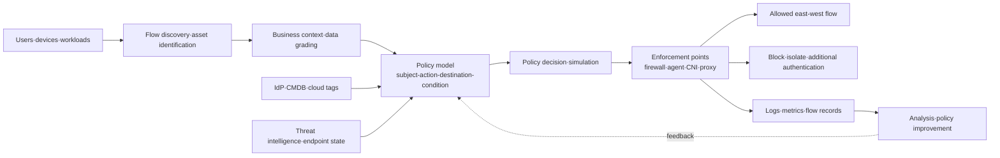
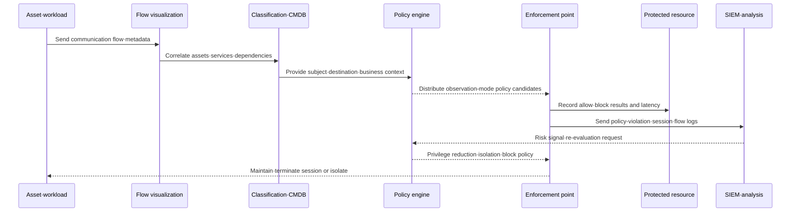

# Microsegmentation-Based East-West Traffic Control and Zero Trust Implementation

## 1. Overview

> **Microsegmentation** is a security design technique that divides users, applications, workloads, devices, and data flows into very small logical zones according to their business attributes and communication needs, and finely controls communication between zones with allow lists and policies.

Traditional network security evolved by placing a firewall at the boundary between the internet and the internal network and allowing relatively broad communication internally.

This structure was easy to operate in an era when the data center and business systems were in fixed locations and users connected from within the company building.

However, as cloud, containers, SaaS, remote work, and partner integrations spread, the physical location of users and servers became difficult to use as a protection criterion.

If an attacker who has seized one account or one server can move to other servers inside, the damage becomes far greater than at the initial breach point—this is called lateral movement.

Microsegmentation addresses this problem from the perspective of East-West traffic.

Unlike North-South traffic between users and the internet, East-West traffic refers to internal flows between server and server, service and service, and endpoint and endpoint.

Therefore, strengthening the perimeter firewall alone is not enough; one must verify whether every internal communication is a business-necessary flow and block unnecessary connections.

NIST SP 800-207 explains Zero Trust as a security paradigm that eliminates implicit trust based on network location and continuously evaluates access to resources, and presents logical microsegmentation as one of the approaches of Zero Trust architecture ([NIST SP 800-207](https://csrc.nist.gov/pubs/sp/800/207/final)).

Microsegmentation is not Zero Trust itself, but a means of enforcing Zero Trust's least privilege and assume-breach at the network and workload boundary.

That is, a policy system that makes access decisions based on identity and context, and enforcement points that actually block or allow packets, sessions, and service calls, must exist together.

### A. Background and Necessity

First, virtualization and containers have led to placing workloads of different businesses and customers simultaneously on a single physical server.

If all workloads can communicate with one another merely because they are in the same host or the same cluster, a single vulnerability can expand to multiple services.

Second, the microservices structure for increasing development speed has greatly increased API calls between services.

As the number of services increases, network connections also become complex, so the simple rule "internal services are trusted" instead becomes an attacker's movement path.

Third, in hybrid and multi-cloud environments, it is difficult to consistently manage all business flows with VLANs or physical firewalls alone.

Only by binding cloud security groups, host firewalls, service meshes, and container network policies into a policy model can the same control be maintained even when the location of assets changes.

Fourth, in ransomware and account-takeover incidents, how quickly one blocks the spread after initial penetration determines the scale of damage.

The smaller the segments and the more specific the policies, the smaller the range of paths and accessible resources an attacker can use.

## 2. Core Principles and Conceptual Structure

The core of microsegmentation is not in unconditionally dividing the network into small pieces.

The essence is to identify business flows, express each flow's subject, destination, action, and conditions, and then allow only necessary communication.

The unit of a policy does not stop at IP address and port, but can extend to user, device state, application name, workload label, service account, data grade, environment, and deployment version.

The following conceptual diagram shows the entire structure from asset discovery to policy enforcement and continuous observation.

### A. Protect Surface and Segments

The protect surface is the concept of first identifying data, applications, and services with high business impact instead of treating all assets as protection targets at once.

For example, a payment database, a customer personal-information store, an authentication service, and a production control server do not have the same security priority as an ordinary development server.

Defining the protect surface allows the boundaries of segments to be matched to business importance and communication relationships rather than the physical location of assets.

Segments can be divided by network address like VLANs, or by cloud security groups, host firewalls, container namespaces, and service-mesh workload identity.

One can make a single workload into one segment, but in real environments, considering management complexity and performance, one also groups assets that share the same policy.

If a segment is too large it cannot sufficiently limit lateral movement, and if it is too small the number of policies explodes and operators start overusing exceptions.

Therefore, the size of a segment should be decided not as "the smallest unit" but as "a unit that can independently manage risk and explain business flows."

### B. Subject, Destination, Action, and Condition

A policy can begin from a technical rule such as "allow TCP 443 from network A to network B."

However, in cloud and container environments, IPs are relocated and instances are frequently replaced, so if one maintains policies by IP alone, manual work is needed on every change.

Instead, one must express the meaning of the subject and destination, as in "the order service calls the payment-approval API of an approved deployment version of the payment service."

The subject can be a person, a service account, an application, a device, or a job scheduler.

The destination can be a protected resource such as a web service, message queue, database, file store, or management interface.

The action can be defined finely—not only connection but also API method, database command, file read/write, and management command.

The conditions include time, environment (dev·staging·production), deployment version, endpoint security state, data grade, request risk, and approval status.

Using these attributes, one can differentially control even the same service so that, for instance, broad test access is allowed in the development environment while only a read request from a specific service account is allowed in the production environment.

### C. Default Deny and Least Privilege

The general default of microsegmentation is to deny flows that are not explicitly allowed.

However, blocking everything before grasping the business flows causes outages, so initially one collects actual communication in observation mode and creates policy candidates.

A policy candidate must not automatically become an allow rule.

Operators and service owners must verify whether it is a normal business flow, a temporary debugging connection, or unnecessary communication from an outdated agent.

Least privilege is the process of narrowing not only the connection target but also the connection direction, port, called API, data type, and session time.

For example, just because the order service can make requests to the payment service does not mean it should be allowed access to the payment service's management port and operational shell.

Because a default-deny policy affects availability, an exception-approval procedure and an emergency-release procedure must be designed together.

An emergency release must automatically expire after a set time and record the reason, approver, and scope of impact so that it does not become a permanent bypass channel.

### D. Continuous Verification and Assume Breach

Microsegmentation is not a technology that permanently trusts a subject that has entered a segment.

If a service certificate expires, a device's security state deteriorates, or anomalous behavior is detected, one must be able to re-evaluate the privileges of an existing session.

Zero Trust's assume-breach means designing so that, even if one asset is already breached, it cannot automatically move to another asset.

Therefore, a policy must include how it shrinks not only in normal situations but also in situations of account takeover, malicious process execution, abnormal bulk requests, and supply-chain malware infiltration.

## 3. Implementation Architecture and Operating Procedure

The implementation method varies according to the type of asset and the communication layer.

For data-center servers one can apply a host agent or host firewall, and for the cloud one can use native security groups and network firewalls.

For containers one can combine the network policy of a CNI plugin with the sidecar or node proxy of a service mesh.

For assets where agent installation is difficult, such as OT and IoT, network-centric controls such as switches, firewalls, passive sensors, and identity-based NAC are needed.

The following sequence is the operating procedure from observation to policy enforcement and incident response.

### A. Asset Discovery and Flow Baseline

The first step is not to write firewall rules right away but to make the asset inventory and communication relationships trustworthy.

One connects IP address, hostname, cloud account, tags, container labels, service account, and owning organization into a single identification scheme as much as possible.

Collecting NetFlow, VPC Flow Logs, packet metadata, and application logs makes it possible to grasp who connects to which resource, on what port, and how frequently.

For encrypted traffic, even without decrypting the body, one can verify the basic flow with metadata such as both endpoints, time, port, byte count, and connection frequency.

For flows whose asset owner and business purpose cannot be verified, one should not delete them right away but mark their risk and impact and keep them as investigation targets.

The baseline must also include the time windows of batch jobs, the cycle of backup traffic, and the alternate paths used during failover.

Otherwise, one may misidentify a normal nightly backup as an attack, or omit a flow needed during a failure from the policy.

### B. Policy Model and Policy Lifecycle

The policy model is an intermediate representation that converts natural-language business rules into actual enforcement rules.

The minimum fields to include in a policy are subject, action, destination, protocol/port, condition, decision, expiration date, owner, and rationale.

Recording the rationale of a policy makes it possible to verify, during an audit or failure analysis, "who allowed this flow for what business need."

A policy must have a lifecycle of creation, review, simulation, approval, deployment, observation, revision, and retirement.

Even if a developer urgently requests a port to be opened, processing it as a permanent exception with no expiration accumulates security debt.

Using policy as code allows change history and peer review to be preserved, but one must verify the gap between the expressiveness of the policy language and the actual enforcer.

Policy simulation must verify whether existing allowed flows get blocked, whether the order of rules matches the intent, and whether a broader rule overwrites a narrower one.

### C. Policy Decision Point and Policy Enforcement Point

The policy decision point judges whether to allow or deny access, and the policy enforcement point enforces that decision on the actual communication path.

In the logical composition of NIST SP 800-207, the policy engine makes the decision and the policy administrator delivers session create/modify/terminate instructions to the enforcement point.

The enforcement point of microsegmentation can be implemented as a firewall, router, host agent, cloud security group, container network plugin, or service-mesh proxy.

Even if the policy engine normally returns "allow," if the resource is directly exposed via another bypass path, the control fails.

One must jointly adjust routing, security groups, and host firewalls so that a protected resource cannot be accessed except through an approved enforcement point.

The failure behavior of the enforcement point also matters.

When the authentication service or policy engine is temporarily unavailable, one decides according to business importance whether to maintain existing sessions, block only new sessions, or preferentially block only high-risk resources.

### D. Observability and Response Automation

Not every block can be considered a success.

If a policy is too broad it cannot prevent spread upon breach, and if it is too narrow it blocks normal calls and leads operators to create bypass policies.

Send allows, blocks, exceptions, policy-lookup failures, and enforcement-point errors all to a central log, and link them with asset, user, ticket, and deployment information.

As operational metrics one can use the ratio of unclassified assets, the observation-mode duration, the number of policy exceptions, the ratio of expired exceptions, the number of retries after a block, and the policy-change failure rate.

As security metrics one can track unauthorized connection attempts to critical assets, lateral-movement paths between segments, time to isolation, and the number of resources a breached asset accessed.

Since automatic isolation can cause business disruption in the case of a false positive, one applies a staged response of warning, additional authentication, read-only, and isolation according to importance and confidence.

## 4. Application Types and Comparison

### A. Data Center and Cloud

In a data-center environment, one can divide large zones with VLAN, VRF, and internal firewalls, and complement inter-server control with host firewalls or agents.

This method is easy to make compatible with existing equipment, but consistent operation is difficult due to IP address changes and per-device policy syntax.

In a cloud environment, one can utilize account, VPC, subnet, security group, network ACL, and workload tags as policy attributes.

Cloud-native functions have good scalability, but because the model and log format differ per cloud, the portability of multi-cloud policies can be poor.

Therefore, one places a common policy model and per-cloud conversion/verification layer, and re-verifies the actual enforcement result in each environment.

### B. Containers and Service Mesh

A container network policy restricts L3/L4 communication using namespaces, pod labels, service accounts, and the like.

A service-mesh proxy can utilize L7 information such as service identity, mTLS, request path, and method, which is advantageous for API-level policies.

On the other hand, if all traffic passes through a proxy, latency, resource usage, and operational complexity can increase.

Also, mesh policy alone cannot protect all non-application flows such as node management ports, external DNS, and storage paths.

Therefore, one combines L3/L4 baseline isolation and L7 fine-grained control in layers, and separately controls management paths outside the mesh.

### C. Agent-Based and Network-Based

The agent-based method makes it easy to reflect process, user, and workload information in policies and can perform fine-grained control within the host.

However, it is difficult to apply to OT/IoT where agent installation is impossible, performance-limited equipment, and external partner equipment.

The network-based method can protect a wide range of equipment with existing routers, switches, and firewalls, but it is difficult to grasp encrypted application semantics and process-level subjects.

The two methods are less an either-or relationship than one that should be used complementarily according to the protection target and communication layer.

| Category | Traditional Network Segmentation | Microsegmentation | ZTNA |
|---|---|---|---|
| Main goal | Perimeter separation of large zones | Limiting east-west flow and lateral movement | Controlling user/device access to applications |
| Policy unit | VLAN·subnet·IP | Workload·identity·tag·service | User·device·resource·context |
| Main flow | Traffic between zones | Internal flow among servers·services·devices | Between users·external subjects and resources |
| Enforcement point | Router·firewall | Host·CNI·firewall·proxy | Broker·gateway·agent |
| Advantage | Relatively simple to understand and operate | Reduces blast radius and policy scope | Connects to resources without exposing the whole network |
| Limitation | Excessive trust within a zone | Complexity of policy·asset·exception operation | Difficulty integrating with legacy·non-web protocols |

The three technologies do not replace one another.

A realistic layered design is to minimize external user access with ZTNA, control internal workload-to-workload communication with microsegmentation, and isolate large fault domains in the data center with traditional network segmentation.

## 5. Application Cases

### A. E-commerce Service Case

The following is an example assuming an e-commerce company operating web, order, payment, and data tiers.

Traffic entering the web tier from the internet passes through a WAF and API gateway, and the web tier is restricted so that it can only call the order API.

The order service can call the payment-approval API and the inventory-lookup API, but cannot access the management port of the payment database.

The payment service uses only the stored procedures needed for approval or specific read/write accounts, and separates the operator shell and bulk-export path under separate approval.

The flow in which a test service in the development environment calls the production payment tier is denied by default, and temporary access created during incident response records the ticket number and expiration time in the policy.

If the payment service account, unlike usual, bulk-queries multiple tables of the customer database, one can pass the SIEM's risk signal to the policy engine to switch the session to read-only or isolate it.

The effect of this structure lies in preventing an attacker from moving directly to the order, payment, and personal-information tiers even if they seize the web tier.

However, since blocking a normal order flow leads to lost sales, one must enforce the policy gradually after passing through observation mode and load testing.

### B. Manufacturing/OT Environment Case

In a manufacturing plant, the office IT network, production-management servers, control network, and equipment/sensor network must not be treated at the same security level.

The control protocols of production equipment are made to communicate only in limited directions with business-necessary servers, and the path of direct access from office endpoints to the control network is blocked.

When a partner performs remote maintenance, they are made to access only specific equipment through a relay server, from approved equipment at approved times.

For equipment where agents are difficult to install, such as old PLCs or sensors, control is composed of passive monitoring, industrial firewalls, switch ACLs, and jump servers.

Because in the control network a change to a security policy can affect availability and safety, one must go through simulation, change approval, and on-site safety procedures before deploying a block policy.

Grouping assets with similar functions and risks into zones and controlling communication paths between zones, as in the Zone·Conduit approach of ISA/IEC 62443, helps to reconcile the different availability requirements of IT and OT.

## 6. Deep Dive: Phased Adoption and Maturity Strategy

CISA released the first part of a guide for planning and applying microsegmentation from a Zero Trust perspective in 2025, describing it as the ability to divide the network according to the communication needs of the network pillar and apply security controls ([CISA Microsegmentation in Zero Trust, Part One](https://www.cisa.gov/resources-tools/resources/microsegmentation-zero-trust-part-one-introduction-and-planning)).

When applying this guidance flow in practice, it is important to first understand business assets and flows rather than to adopt a product.

Stage 1 is the preparation stage, which sets the protect surface, critical assets, owning organizations, regulatory requirements, and failure tolerance.

Stage 2 is the discovery stage, which observes flows for a certain period and normalizes asset, service, user, and data dependencies.

Stage 3 is the design stage, which expresses business flows as subject, action, destination, and condition, and simulates policy candidates.

Stage 4 is the limited enforcement stage, which applies default deny starting from low-impact, clearly owned development/test or part of critical assets.

Stage 5 is the expansion stage, which connects the different enforcement means of cloud, containers, data center, and OT with a common policy model and log scheme.

Stage 6 is the optimization stage, which embeds automatic isolation based on risk signals, policy expiration, exception reduction, and attack-path verification into operations.

Maturity must not be measured simply by the number of segments.

One must look together at the protection ratio of critical assets, the reduction of unclassified flows, the reduction of permanent exceptions, the policy-change failure rate, and the number of accessible resources and time to isolation upon breach.

One can use AI-based policy recommendation, but if the recommendation directly becomes an allow policy, there is a risk of automatically approving a wrong flow or an attacker's communication.

AI should be used as an aid for flow clustering and duplicate-policy detection, and high-risk resources and exception policies should be approved only after a human reviews the rationale.

## 7. Considerations and Implications

### A. Balance of Business Continuity and Security

Microsegmentation strengthens security, but a wrong block immediately becomes a business outage.

Rather than blocking everything from the start, one should keep to the stages of observation, simulation, partial enforcement, and expansion, and verify failover paths and emergency-release procedures in advance.

### B. Asset Identification and Policy Quality

If the asset inventory is inaccurate or owners are not assigned, the basis of policy also wavers.

One must connect the identifiers of the CMDB, cloud inventory, container orchestrator, and IdP, and automate so that when an asset's lifecycle ends, the policy is retired along with it.

### C. Policy Exceptions and Security Debt

If an exception made for the sake of urgent incident response does not expire, microsegmentation is left in name only.

One must record the reason, approver, scope of impact, expiration date, and compensating control for exceptions, and apply the principle that an exception is automatically removed if not re-approved before expiration.

### D. Encryption and Visibility

TLS and mTLS are advantageous for confidentiality and identity verification, but they can make it difficult for the observation system to fully understand business flows.

Rather than unconditionally expanding decryption, one must secure the necessary visibility by combining metadata, service logs, distributed tracing, certificate/service identity, and endpoint telemetry.

### E. Performance and Scalability

Because policy lookup and packet inspection can increase the latency of the request path, one must performance-test the cache, policy-distribution structure, capacity of enforcement points, and failure behavior.

The number of service-mesh proxies, the CPU/memory usage of agents, and the log volume and storage cost should also be managed as non-functional requirements of the overall design.

### F. Realism of Legacy/OT/IoT

The assumption that the latest agent or strong authentication can be applied to all equipment differs from reality.

For equipment with limited support, one applies compensating controls such as network-based isolation, virtual patching, jump servers, and passive detection, and reports the replacement plan and residual risk to management.

### G. Performance Measurement and Continuous Improvement

Having a large number of segments or block rules does not mean high security maturity.

One must verify whether lateral movement is actually blocked through attack-path verification and purple-team exercises that assume breach scenarios, and automate policy-impact analysis when a service changes.

## References

- NIST, "Zero Trust Architecture, SP 800-207": https://csrc.nist.gov/pubs/sp/800/207/final
- NIST NCCoE, "Implementing a Zero Trust Architecture, SP 1800-35": https://www.nist.gov/news-events/news/2025/06/nist-releases-cybersecurity-practice-guide-implementing-zero-trust
- CISA, "Microsegmentation in Zero Trust, Part One: Introduction and Planning": https://www.cisa.gov/resources-tools/resources/microsegmentation-zero-trust-part-one-introduction-and-planning
- CISA, "Zero Trust Maturity Model Version 2.0": https://www.cisa.gov/resources-tools/resources/zero-trust-maturity-model

---

> **In one line**: Microsegmentation is a means of implementing Zero Trust that divides assets and business flows into small logical boundaries and enforces least-privilege, default-deny policies on East-West traffic, thereby reducing lateral movement and the blast radius of damage after a breach.
