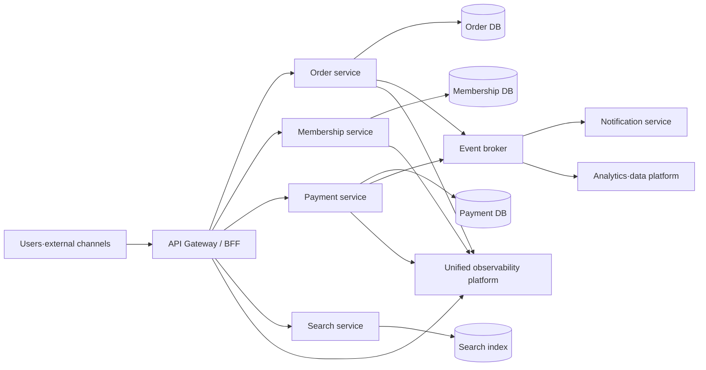
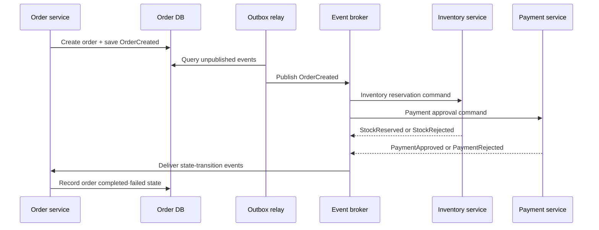

# Microservices Architecture (MSA)

## 1. Overview

> **Microservices Architecture (MSA)** is an architectural style that composes a single business system as a collection of small services that can be independently developed, deployed, and scaled, connecting the services with explicit contracts and network communication.

A traditional monolithic system is built and deployed as a single application unit. Early on, its call paths are simple and it is easy to process transactions in one database, so productivity is high. However, as the organization and functions grow, the scope of change widens, and even a small modification requires a full deployment and regression testing. The load of a particular function leads to scaling the entire application, and a coupling problem appears in which a failure propagates to other functions.

MSA is an approach that tries to solve this problem by decomposing into service boundaries at the unit of business capability. A service has its own code, deployment unit, and data ownership, and exposes only the necessary contracts externally. Therefore, an organization can choose different technologies and deployment cycles per service, and can horizontally scale only the services where traffic is concentrated.

However, MSA is not simply the work of splitting an application into multiple processes. Because network calls, distributed transactions, data consistency, observability, security, and operational automation are introduced together, the complexity of the whole system increases. The number of small services has grown, but if one cannot manage deployment, failure, and data flow, operation becomes even harder than a monolith.

Therefore, in a professional engineer answer, rather than claiming "decomposing is always good," one must explain, from an architectural perspective, why boundaries should be divided, what coupling to permit, and how to control failures in a distributed environment.

### 1.1 Background and Necessity

First, the speed of business change has accelerated. If one bundles functions with different change frequency and risk—such as payment, membership, order, and recommendation—into a single release, the entire schedule is set to the slowest part. Independent deployment per service reduces the scope of impact of a change and enables experimentation and gradual rollout.

Second, workload characteristics have diverged. Search is read-centric, payment values consistency and audit trails, and image processing may require a lot of CPU/GPU resources. It is difficult to efficiently reflect these differences with the same scaling policy of a single process.

Third, in a large organization, the cost of communication between organizations becomes a bottleneck more than the code. Clarifying service boundaries and API contracts makes each team's scope of responsibility clear, and enables teams to plan, develop, and operate independently. However, the organizational structure must not forcibly determine the service boundaries; one must first analyze the actual domain coupling and data ownership.

### 1.2 Core Characteristics

The first characteristic of MSA is the independence of services. Independence means not merely that the source repositories are separated, but that a service can be independently built, tested, and deployed. If one service depends on another service's internal tables or deployment order, it is operationally coupled even if it is logically separated.

The second characteristic is explicit contracts. Whatever communication method is used—REST, gRPC, message events—the request/response format, error semantics, version compatibility, and security requirements must be managed as a contract. If contracts are not maintained through documentation and automated verification, change conflicts grow as the number of services increases.

The third characteristic is data autonomy. Each service owns the data model it is responsible for and does not let other services directly query its internal schema. This principle forces one to accept data duplication and eventual consistency, but it reduces coupling between services and enables independent change.

## 2. Reference Structure and Service Decomposition

### 2.1 Overall Architecture Conceptual Diagram

In the structure above, the gateway handles authentication, routing, rate limiting, and common policies for external clients. However, putting all business logic in the gateway makes it a new monolith, so domain rules must remain in each service. If a combination specialized for mobile/web screens is needed, one places a separate BFF, but distinguishes the boundary so that the BFF does not become the owner of core data.

The order, membership, and payment services each own their own data store. Here, the storage technologies do not necessarily have to differ from one another. What matters is that other services do not directly modify or join the tables, but access through APIs or events defined by the owning service.

The event broker delivers asynchronous connections and state changes between services. When the order service publishes an order-created event, the notification and analytics services can process it each at their own pace. However, if one assumes event delivery happens only once, duplication or reprocessing failure occurs, so one must design idempotency keys, retries, retention periods, and ordering requirements.

The unified observability platform connects logs, metrics, and traces across service boundaries. Without a correlation ID for distributed traces, it is hard to grasp in which service a user's single request was delayed. In MSA, observability is not an add-on operational feature but a fundamental architectural component.

### 2.2 Principles for Deciding Service Boundaries

Service boundaries are decided based on domain business capability, not technical layer. If one splits by layer, as in "controller service" or "database service," one business request is called across multiple services, and inter-service traffic and coordination costs surge. Conversely, units with different business responsibilities and reasons for change—such as order, inventory, and shipping—become boundary candidates.

The bounded context of domain-driven design is a useful thinking framework for setting boundaries. Even the same word is modeled separately if its meaning differs by context. For example, a customer can be a segmentation target in marketing, a billing subject in payment, and a recipient in shipping. Integrating customer information from all contexts into one giant customer model makes the impact of changes large.

Cohesion and coupling are also evaluated together. Functions that must be changed together and deployed together are better kept in the same service, while functions with different teams, schedules, and failure characteristics become separation candidates. Separating based only on call frequency may cause excessive network round trips, so one first examines the boundaries of the business flow and the data-consistency requirements.

The decomposition result is not completed at once. Observing change points in the monolithic code and gradually extracting high-priority business capabilities first with the strangler pattern reduces risk. Before an extracted service stabilizes, one must prepare feature flags, parallel verification, and a rollback path.

### 2.3 Roles of Each Component

| Component | Main Role | Key Question in Design |
|---|---|---|
| Service | Implement business capability and own data | Are independent deployment and scope of responsibility clear? |
| API Gateway | External entry point, routing, common policy | Are policy and business logic not mixed? |
| Service mesh | Inter-service communication policy, security, observability | Does the proxy operational complexity not exceed the benefit? |
| Event broker | Asynchronous delivery and buffering | How are duplication·order·reprocessing guaranteed? |
| Per-service store | Data ownership and model optimization | Is direct access by other services blocked? |
| CI/CD | Build·test·deploy automation | Are there per-service pipelines and quality gates? |
| Observability platform | Integration of logs·metrics·traces | Can request correlation be traced? |

The components in the table are not a product list to be adopted independently. For example, even if one installs an event broker, without data ownership between services and a reprocessing policy, message processing only becomes complex. Conversely, observability is effective only when standard fields and trace-propagation rules are set before the number of services grows.

## 3. Communication and Data Management

### 3.1 Choosing Synchronous vs. Asynchronous Communication

Synchronous calls are suitable for queries that need an immediate response or short validations. The caller can decide the next processing after receiving the result, and the interface is intuitive. However, if the call target is delayed or fails, the caller's threads and resources are tied up as well. The longer the call chain, the more a partial failure propagates into a full request failure.

Asynchronous messages reduce temporal coupling between services. If a notification need not be completed immediately after order creation, the order service can publish an event and let the notification service process it later. In exchange, one must respond to duplicate delivery, reordering, consumer delay, and message loss.

In practice, one does not choose the communication type dichotomously. A core step that needs an immediate result, such as a user's payment approval, is handled with a synchronous call and a bounded timeout, while receipt sending, recommendation refresh, and analytics loading are separated into events. One must choose the communication method based on the definition of business completion and the compensation procedure on failure.

| Category | Synchronous API | Asynchronous Message |
|---|---|---|
| Responsiveness | Confirm result at call time | Confirm processing result later |
| Coupling | Large temporal coupling | Small temporal coupling |
| Failure propagation | Timeout chaining possible | Can buffer by loading into a queue |
| Consistency | Easy immediate validation | Eventual-consistency design needed |
| Operational difficulty | Call·retry centric | Broker·reprocessing·order management needed |

### 3.2 Data Consistency and Distributed Transactions

If one uses a per-service database in MSA, it is hard to bind multiple services in a single ACID transaction. For example, trying to handle order save, inventory decrement, and payment approval in one commit causes strong coupling between services and locking problems on failure. Therefore, one divides the business into local transactions and state transitions and designs a structure that compensates on failure.

A Saga is a pattern that composes distributed business into multiple local transactions and, when an intermediate step fails, performs compensating transactions that undo already-completed work. The orchestration method has a central coordinator that instructs the next step, so the flow and failure handling are clear. The choreography method has services react to events, so coupling is low, but it is hard to grasp the whole flow at a glance.

Compensation differs from the physical rollback of a database. If an external payment has already been approved, one cannot simply delete a row but must perform a separate business action called payment cancellation. Therefore, it is safer to define it as a state machine, including compensability, duplicate execution, time limits, and even manual operator action.

The outbox pattern reduces the mismatch between data change and event publication. The service saves the business data and the event to be published in the same local transaction, and a separate publisher delivers the outbox records to the broker. One can manage delivery success and duplicate publication, but one must also design idempotent handling on the consumer side.

### 3.3 Saga·Outbox Processing Flow

In this flow, if the order service saves the order and then publishes the event directly over the network, a gap arises between the success of the data commit and the success of the publication. The outbox relay reads and publishes the event saved in the same local transaction again, reducing this gap. If the relay fails after publishing, the same event may go out again, so one must guarantee consumer idempotency based on the event ID.

The results of inventory and payment can arrive independently. The order service does not assume that the arrival order of events is always fixed, but verifies state-transition rules and disallowed transitions. For example, even if the payment approval arrives first, if the inventory reservation fails, one must execute the payment-cancellation compensation and then transition the order to the failed state.

### 3.4 API Contracts and Version Management

A contract includes not only the normal response but also error codes, required/optional fields, time units, identifier formats, and whether personal information is included. Even if documentation exists, if it diverges from the actual implementation it is not a contract, so one connects schema-based contract tests and consumer-driven contract tests to CI.

Considering backward compatibility, one must not suddenly delete existing fields or change their meaning. When adding a new field, one makes it ignorable by the consumer, and field deprecation goes through the order of notice, parallel period, and removal after confirming usage. The choice among URI version, header version, and content negotiation is applied consistently according to the organization's standards and operational tools.

Contract management is not less important just because a service is internal. Rather, if there are many internal consumers and the deployment cycles differ, tracking the impact of changes is difficult. Managing the caller list, contract owner, planned expiration date, and schema change history as a catalog reduces informal dependencies.

## 4. Operations, Security, and Quality Management

### 4.1 Failure Isolation and Resilience

In a distributed system, one views failure not as an exception but as a normal design condition. A call without a timeout occupies resources until the failed service recovers, and eventually depletes even healthy services. Every remote call needs a business-appropriate time limit and an alternative path on failure.

A circuit breaker blocks calls and fails fast when consecutive failures exceed a set threshold. An isolated call pool or bulkhead prevents the resource depletion of one function from spreading to another. Retries are used only in a limited way for transient errors, with exponential backoff and jitter to prevent a retry storm.

A retriable operation must be idempotent. Applying a simple retry to a payment request may cause a duplicate payment, so a client request key and server-side storage of the processing result are needed. Failure-recovery design is not a matter of listing the names of technical patterns, but the work of defining the user experience and data outcome for each error type.

### 4.2 Deployment Strategy and Quality Gates

Independent deployment per service presupposes an automated build/test/deploy pipeline. One arranges static analysis, unit tests, contract tests, integration tests, and vulnerability checks according to the change risk, and secures a reversible artifact and a data-migration plan before production deployment.

Blue-green deployment switches between two environments to provide fast rollback. Canary deployment exposes the new version to some users or traffic and compares error rate, latency, and business metrics. Gradual deployment does not end with network routing alone; one must decide by which metrics to halt and the data-compatibility period.

A data schema change outlasts the application deployment. It is safer to use the expand-migrate-contract method: first add a new field so both versions can read it, then switch the application, and later remove the unused old field. Bundling a schema change and a code deployment at once can leave the rollback blocked by the data structure.

### 4.3 Security and Supply Chain

As the number of services grows, the number of authentication/authorization points and secrets grows together. One distinguishes external user authentication from inter-service authentication and reduces per-service-account privileges according to the least-privilege principle. Transport-segment encryption, central secret management, key rotation, and audit logging are placed as baseline controls.

Using a service mesh allows mutual TLS and policy to be standardized, but one must manage the privileges and updates of the proxy and control plane themselves. Trusting network location alone is insufficient; one makes fine-grained access decisions by verifying the calling subject, target, action, and data grade.

Vulnerability checks on each service's dependent libraries and container images are also needed. Connecting the software bill of materials, image signing, build provenance, and deployment approval history makes it possible to quickly find affected services when a problem is discovered.

### 4.4 Observability and Service Levels

Logs show the context of an event, metrics show trends and thresholds, and traces show the path of a request and its delay segments. Putting the same trace ID, service name, version, environment, and user-request identifier into all three signals reduces root-cause analysis time. Masking rules that keep personal information and secrets out of logs are also enforced in a common library or at the collection stage.

Service level objectives (SLOs) must connect technical metrics with business outcomes. Rather than looking only at the success rate of the order API, one looks together at user-perspective metrics such as order completion rate, payment failure rate, and processing latency. When per-service SLOs conflict, one adjusts priorities based on the goal of the higher-level business flow.

The error budget is an operational device for balancing stability and change velocity. When the allowed amount of failure is fully consumed, one temporarily adjusts new-feature deployment and invests in resilience improvement. However, if the number itself becomes the goal, one ends up gaming the metric, so one must examine the business impact of failures and the customer experience together.

## 5. Comparison and Cases

### 5.1 Comparison of Monolithic, SOA, and MSA

A monolith has a single deployment unit and process, so initial development and transaction processing are simple. In exchange, as code and data grow, change-impact analysis and selective scaling become difficult. MSA gains independence but bears network and operational complexity. SOA pursues service orientation and reuse, but if policy and transformation concentrate in a central ESB, a bottleneck and strong coupling can arise.

| Perspective | Monolithic | SOA | MSA |
|---|---|---|---|
| Deployment unit | Whole application | Service·ESB combination | Independent service |
| Integration method | In-process call | Central integration and standard contract | Lightweight API·event centric |
| Data | Integrated DB is common | Shared data possible | Per-service ownership principle |
| Scaling | Whole or large unit | Per-service possible | Precise per-function scaling |
| Operational complexity | Relatively low | Medium, depends on central integration | High, automation essential |
| Suitable situation | Small, stable domain | Cross-organization integration·reuse | Rapid change and large-scale operation |

The key point of the comparison is not to rank them as if MSA were an evolutionary stage of a higher concept. A transaction-centric small-scale system may be more economical as a monolith, and SOA's central policy may be advantageous for integrating heterogeneous systems across multiple organizations. One must choose by evaluating together the business change rate, team structure, operational capability, and regulatory requirements.

### 5.2 E-commerce Order Case

In e-commerce, order creation is connected in a chain of membership verification, inventory reservation, payment approval, shipping request, and notification sending. Bundling all of this into a single synchronous transaction lets a payment-system delay block the whole order, and connection resources can quickly deplete during a traffic surge.

The improved flow is one in which the order service saves the order in a "payment-pending" state and then publishes a payment-approval request. When payment is approved, a payment-approval event is published and the inventory service confirms the reservation. If inventory is insufficient, it raises a payment-cancellation compensation event and transitions the order state to "failed."

In this flow, the user should be able to see a processing-in-progress state instead of an immediate completion screen. Providing the state of each step, a reprocess button, and an operator-correction procedure lets one absorb eventual consistency into the user experience. The event must include order ID, event ID, timestamp, and schema version, and the consumer deduplicates by event ID.

### 5.3 Phased Transition Case

Decomposing an existing monolithic shopping mall into services all at once is risky. First, one separates the search function—which has high change frequency and failure impact—into a read-only service, and asynchronously builds the search index from existing data. After verifying quality by comparing the consistency of search results in parallel for a certain period, one gradually shifts traffic.

Next, when separating areas with high data consistency such as order and payment, one clearly defines the boundary and replaces the path where existing code directly queries the database with API calls. At this point one must measure performance degradation and failure propagation, and the goal is not simply to turn all calls into network calls.

The completion criteria of the transition should include independent deployability, failure isolation, team responsibility, and operational metrics rather than the amount of code moved. If a service has been extracted but is deployed together with the whole system every time, the effect of structural separation has not yet been realized.

## 6. Deep Dive: Organization·Platform·Exam Connections

The success of MSA depends on platform standardization and the team's operational responsibility more than on individual service code. Providing service templates, a common authentication library, log formats, deployment pipelines, and default dashboards saves teams from re-implementing foundational functions every time. However, if a common platform enforces all technical choices, autonomy disappears, so one must distinguish mandatory controls from selectable implementations.

A DevOps model in which the development team is responsible even for operation makes it quick to learn the cause of failures and the user impact. Conversely, delegating deployment wholesale to an operations team makes it hard to reflect per-service characteristics, and a deployment queue arises again. In organizational design, one must define service boundaries, code ownership, on-call responsibility, and cost allocation together.

In a professional engineer answer, after explaining MSA one must not merely repeat the advantages of microservices, but present the counterarguments of distributed transactions and operational complexity. The answer flow is logical when composed in the order of background and definition, decomposition principles, communication/data consistency, operational/security controls, and phased adoption and risk management.

Anticipated questions can be asked in forms such as "considerations when transitioning to MSA," "comparison of monolithic and MSA," "measures to secure data consistency between services," and "observability and failure response in an MSA environment." For each question, commonly connecting the rationale for service boundaries, independent deployment, contract management, saga/outbox, observability, security, and organizational change produces an answer that goes beyond simple term explanation.

## 7. Considerations and Implications

### 7.1 Adoption Feasibility

Not every system applies MSA. If the domain is small, changes are few, and there are only one or two teams, it is more economical to first verify boundaries with a modular monolith. If the network and operational cost exceed the independence gained from service separation, adoption feasibility is lacking.

### 7.2 Boundaries and Data Ownership

Service boundaries are set based on business capability and reason for change, not the org chart or the current table structure. Only by clarifying data owners and prohibiting direct DB access by other services does independent deployment persist. When duplicate data is needed, one documents the purpose of replication and the allowed consistency range.

### 7.3 Gradual Transition and Quality

One divides risk into small units with the strangler pattern, feature flags, canary, and parallel verification. One compares latency, error rate, and business success rate before and after the transition, and drills the rollback path and data-correction procedure. Successful adoption is measured not by the increase in the number of services but by the improvement in failure impact and change lead time.

### 7.4 Operational Automation

As the number of services grows, manual deployment and individual monitoring reach their limits. One provides standard pipelines, auto-scaling, policy-as-code, central logs/traces, and cost visibility as a platform. One also monitors failures of the automation itself and audits privileges and change history.

### 7.5 Security and Regulation

One sets per-service least privilege, mutual authentication, secret management, and vulnerability checks as baseline controls. Because personal information can be replicated through events and logs, one designs data grade, retention period, masking, and deletion propagation. For regulated data, one prioritizes access control and auditability over the convenience of service separation.

### 7.6 Performance·Cost·Sustainability

Network calls, serialization, proxies, and log storage increase the per-request cost and latency. Rather than unconditionally splitting calls into small pieces, one designs data-access patterns, caching, batching, and asynchronous processing together. One tracks per-service resource usage and carbon/cost metrics to evaluate whether independent scaling actually leads to business value.

---

> **In one line**: MSA provides independent deployment and scaling based on domain boundaries, but creates value only when data consistency, failure isolation, observability, security, and organizational operation are designed together.
