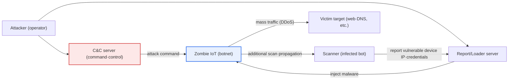
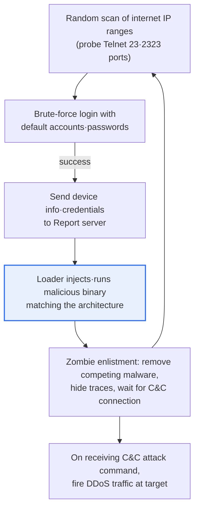

# Mirai Botnet

## 1. Overview

### A. Concept

> The **Mirai botnet** is **malware and a botnet that mass-infects security-weak IoT devices (IP cameras, routers, DVRs, etc.) by brute-forcing default accounts and passwords, turns them into remotely controlled zombie bots, and then exploits them for large-scale DDoS attacks according to the commands of a command-and-control (C&C) server**. It is a representative threat that caused a large-scale internet paralysis in the second half of 2016 and impressed the seriousness of IoT security on the whole world.

The fundamental reason Mirai sounded the alarm for IoT security lies in the fact that it demonstrated, at scale, that "**each carelessly neglected IoT device becomes a powerful weapon for attack**." Conventional botnets were mainly composed by infecting vulnerability-ridden PCs with malware, but PCs are protected to some degree by antivirus, firewalls, and regular patches, and it is also easy for a resident user to notice anomalies. IoT devices, on the other hand, are low-performance and hard to load security software onto, are left connected to the internet 24 hours a day for years without an administrator, and above all often retain the default credentials set at the factory. Mirai targeted this blind spot precisely.

Mirai's attack technique was rather shocking in that it was not a sophisticated zero-day vulnerability but an astonishingly simple method. Mirai randomly scans the internet address space to find devices with remote-access ports (Telnet 23, 2323) open, and sequentially brute-forces **dozens of default account/password entries** commonly used by manufacturers—`admin/admin`, `root/12345`, `root/xc3511`, and so on—and upon a successful login, immediately downloads and installs malware. Because hundreds of thousands of devices with unchanged passwords were scattered across the internet, infection spread exponentially.

As the zombies thus secured all poured traffic onto a specific target at a single command from the C&C server (DDoS), Mirai generated attacks of unprecedented scale for the time—hundreds of Gbps to 1 Tbps—in a short period. Mirai is a symbolic incident that showed that IoT security lags as much as its convenience, and that the trivial carelessness of individual devices, when aggregated, can threaten the entire internet infrastructure.

### B. Major Attack Cases and Impact

Mirai's danger was revealed not as an abstract worry but as an actual large-scale outage. In September 2016, an attack of about 600 Gbps against a security journalist's site (KrebsOnSecurity) and an attack reaching about 1 Tbps aimed at the French hosting company OVH followed one after another, and decisively, in October 2016, it **paralyzed Dyn, a major U.S. DNS service provider**, plunging numerous well-known services such as Twitter, Netflix, Reddit, and Spotify into a large-scale outage. Since DNS is the internet's phone book, when one DNS provider collapsed, even services that were normally alive became unreachable like dominoes. This left the lesson that targeting the internet's "common infrastructure service" rather than a specific site produces a far larger impact.

Also, at the end of 2016, Mirai's **source code was released on an online forum**, spawning numerous variants (lineages known as Satori, Okiru, Mozi, and others). In that the attack technique became popularized so that anyone could easily compose an IoT botnet, Mirai became not a one-off incident but the "standard blueprint" for subsequent IoT threats. The table below summarizes Mirai's key characteristics.

| Characteristic | Content |
|---|---|
| **Attack method** | Telnet scanning + brute-forcing default accounts/passwords to infect IoT |
| **Purpose** | Large-scale DDoS according to C&C commands (multi-vector: SYN·UDP·HTTP·GRE flooding, etc.) |
| **Scale** | Mobilizing up to hundreds of thousands of zombie IoT devices, attacks of hundreds of Gbps~1 Tbps |
| **Impact** | Many variants spread after source-code release, popularization of IoT botnets |

## 2. Mirai Botnet Infection and Attack Architecture

To understand Mirai's operation, one must separate the "process of expanding infection" from the "process of receiving commands and attacking." The overall structure diagram below shows how the botnet's components are connected.

The key in the structure above is that the botnet grows itself. An already-infected zombie IoT device again plays the role of a scanner, searching for new vulnerable devices, and when it sends the IP and cracked credentials of a discovered device to the report/loader server, the loader injects malware into that device and enlists it as a new zombie. Because infection self-propagates in this structure, if initial suppression fails the botnet grows to a large scale in an instant.

The following process detail diagram shows, in order, the steps from a single vulnerable device being infected to being mobilized for an attack.

### A. Infection Stage (Scan·Credential Brute-force)

The starting point of infection is indiscriminate scanning. A Mirai bot rapidly sweeps the internet address space to find devices with the remote-access Telnet port open. Telnet is an old protocol that provides remote login without encryption, and because it is often shipped enabled on IoT devices for convenience, it became Mirai's primary target. The core of defense at this stage is to "**close unnecessary services and ports**." If Telnet had not been exposed to the internet in the first place, the brute-force attempt itself would not even hold.

When it finds a device with the port open, Mirai sequentially tries dozens of built-in default account/password combinations. The decisive vulnerability here is not technology but "operational practice." Because manufacturers embed the same default password into mass products for convenience, users do not change it, and there was not even a procedure forcing a change on the device, login was breached with simple brute-forcing alone. In fact, the credential list Mirai used is analyzed to have included a substantial portion of hardcoded accounts of specific manufacturers' product lines.

The practical implication of this stage is clear. When adopting IoT, one must institutionalize "forced change of the default password immediately on installation," and where possible, assigning a unique default password to each device from the factory shipment stage. In fact, the subsequent introduction in several countries of IoT security regulations restricting the use of default and common passwords also originated from this very point of Mirai.

### B. Propagation·Zombification Stage (Malware Injection)

Upon a successful login, the bot reports the device's information and credentials to the report server, and the loader downloads and runs a malicious binary matching that device's CPU architecture (ARM, MIPS, x86, etc.). IoT devices are diverse, so their architectures also vary, and the fact that Mirai prepared binaries for multiple architectures and could infect broadly raised its propagation power.

A device enlisted as a zombie also performs actions to protect and hide itself. It terminates and blocks other competing malware or remote-management processes to "monopolize" the device, disguises the process name or erases traces to evade detection, and, because the infection is released on reboot (it mostly resides in memory), continuously attempts re-infection. The implication from a defense perspective at this point is that "**a simple reboot is only a stopgap; unless the password is changed and the firmware is updated, it will soon be re-infected**."

This stage also shows the importance of "continuous management during operation." Because it is hard for a user to notice infection, and a device can be mobilized for an attack behind the scenes even while appearing to operate normally, a constant monitoring system is needed—one that detects anomalous traffic at the network layer and blocks communication to known malicious C&C domains/IPs.

### C. Attack Stage (DDoS Execution)

When enough zombies are secured, the attacker specifies the target and attack type through the C&C server and issues a command, and the zombies fire traffic all at once. Mirai supported various attack vectors—SYN flooding, UDP flooding, HTTP flooding, GRE flooding—so it could attack by changing the type according to the target's defense method. This "multi-vector DDoS," which combines multiple types, makes response difficult because it bypasses defenses that block only a single type.

The essential difficulty of DDoS lies in the fact that each piece of traffic looks "like a normal request." Since unconditionally blocking requests coming from hundreds of thousands of different IPs would also block normal users, intelligent defense that analyzes traffic patterns to filter out bots is needed together with a CDN and scrubbing center that absorb and distribute volumetric attacks. As in the Dyn case, when common infrastructure such as DNS is targeted, it is also important to design with redundancy and anycast configuration so that the paralysis of a specific point does not spread to the entire service.

### D. Comparison with Traditional Botnets

To grasp the character of Mirai accurately, it is useful to contrast it with PC-based traditional botnets. The two botnets share the same framework of "controlling and exploiting many infected endpoints via C&C," but they have clear differences in infection target, method, and detection difficulty, and these differences precisely explain why Mirai spread so fast and so widely.

| Category | Traditional PC Botnet | Mirai (IoT Botnet) |
|---|---|---|
| **Infection target** | PC·server (partly protected by antivirus·patches) | IoT devices (hard to load security SW, neglected) |
| **Infection method** | Vulnerability exploit·phishing attachment, etc. | Brute-forcing Telnet default accounts·passwords |
| **Detection·response** | User·antivirus can recognize | Hard to recognize infection due to absent administrator |
| **Main use** | Multipurpose: spam·info theft·DDoS, etc. | Initially specialized in large-scale DDoS |

The practical implication of this comparison is that "IoT needs a different defense strategy from PCs." If PC security depends substantially on antivirus and user awareness, IoT has poor such defense means, so one must place weight on "safe defaults at the design/installation stage" and "anomaly detection and blocking at the network layer." The fundamental reason Mirai succeeded even with a simple technique lay in exactly this defense gap.

## 3. Security Threats and Responses by IoT Service Lifecycle Stage

IoT security is not a problem of a specific point in time but a task to be secured across the entire lifecycle of a device. Mirai precisely exploited the representative gaps of lifecycle management—"neglect of the default password at installation" and "absence of updates during operation." The table below summarizes threats and responses by stage; because each stage is connected front and back, safety is not secured by strengthening only one stage.

| Stage | Security Threat | Response |
|---|---|---|
| **Design·development** | Weak design, hardcoded accounts, unverified SW | Secure design·coding (Security by Design), built-in default security |
| **Deployment·installation** | Default·common passwords, unnecessary open ports (Telnet) | Forced initial password change, minimal exposure (reduce ports·services) |
| **Operation·use** | Unpatched vulnerabilities, malware infection, botnet enlistment | Regular firmware updates, anomaly detection·access control |
| **Disposal** | Leakage of residual data·credentials, re-exploitation of neglected devices | Complete data erasure, credential disposal, recovery·deactivation |

From the Mirai perspective in particular, the most vulnerable links are the "deployment·installation" and "operation·use" stages. No matter how much security is put in at the design stage, it is neutralized if the default password remains at installation, and even if a vulnerability is discovered during operation, the attack channel stays open unless a patch is deployed and applied. Therefore, lifecycle management must be approached not as a "one-time action" but as a "continuous management system."

## 4. The 7 Common Security Principles for IoT

The common security principles presented by domestic and international agencies to strengthen IoT security demand that security be embedded from design to disposal. It is good to understand these principles together in that they are direct countermeasures to the gaps Mirai exposed. For example, the "safe initial security settings" principle targets default-password brute-forcing, and the "latest security patch" principle targets neglect during operation.

| Principle (gist) | Content | Meaning from the Mirai Perspective |
|---|---|---|
| **1. Embed security at the design stage** | Reflect security from planning·design (Security by Design) | Starting point for removing hardcoded accounts |
| **2. Safe SW·hardware** | Verified development·secure coding | Block execution of vulnerable binaries |
| **3. Safe initial security settings** | Safe defaults such as changing the default password | Neutralize brute-forcing itself |
| **4. Apply authentication·encryption** | Mutual authentication, data·communication encryption | Replace cleartext access such as Telnet |
| **5. Latest security patches·updates** | Continuous vulnerability remediation | Prevent neglect during operation |
| **6. Safe operation·management** | Anomaly detection, access control | Early detection of botnet enlistment |
| **7. Breach response·recovery system** | Incident response·safe disposal | Block infection spread·recovery |

If one memorizes the principles only as a "list of items," they do not exert power in practice. What matters is understanding "which attack stage each principle cuts off." Because cutting off even one link in Mirai's infection chain (scan→brute-force→injection→attack) blocks botnetization, the principles operate as an overlapping defense in depth.

## 5. Deep Dive — Changes in Threats After Mirai and Regulatory Trends

The greatest legacy Mirai left is the "era of variants" caused by the source-code release. Reusing Mirai's basic framework (scan–brute-force–loader–C&C–DDoS), variants that raised infection power by **combining exploits of known device vulnerabilities (CVEs)** rather than stopping at default-password brute-forcing appeared one after another. Also, some IoT botnets tend to diversify their purpose beyond pure DDoS to cryptocurrency mining, proxy abuse, and information theft. That is, it is reasonable to understand that IoT botnets, taking Mirai as their archetype, have evolved in the direction of "infecting more diversely and making money more diversely."

On the regulatory and standardization side, Mirai was also a watershed. Several countries and agencies reorganized institutions in the direction of **restricting the use of default and common passwords on IoT devices** and requiring the operation of a vulnerability-reporting intake channel and the specification of a security-update provision period. Representatively, the UK showed a trend of legislating security requirements for consumer connected devices (prohibition of common default passwords, etc.), and the U.S. and EU have also pursued policies related to IoT security labeling and certification. Domestically as well, IoT security certification and common-security guides have been prepared, and policy is developing in the direction of inducing the market to choose "security-verified devices." (The names and enforcement timing of specific laws and institutions differ by country and are continuously revised, so it is advisable to check the latest original source when citing.)

Technical responses have also evolved. Telecom carriers and cloud operators have strengthened scrubbing infrastructure that absorbs large-scale volumetric DDoS and anycast-based distributed defense, and enterprises are adopting Zero Trust-oriented designs that isolate IoT devices into a separate segment (network segmentation) to limit internal spread and participation in external attacks even if infected. From the exam-answer perspective, one can demonstrate depth by contrasting "why Mirai's simplicity worked (the gap in operational practice)" with "how defense and regulation have since become multi-layered."

## 6. Considerations and Implications (Professional Engineer Perspective)

1. **Default-value security is the first line of defense.** As Mirai proved, the neglect of default/common accounts and passwords is the greatest vulnerability, so one must prioritize forced password change at installation, assignment of a unique initial password per device, and closure of unnecessary remote ports such as Telnet. This is an area where the simplest measure produces the greatest effect.

2. **Continuous management across the whole lifecycle is needed.** Because IoT is prone to being neglected for a long time after deployment, remote firmware updates (OTA), specification of the security-update provision period, and a rapid-deployment system upon vulnerability discovery are essential. For "install-and-forget" devices, automated management is the answer.

3. **A perspective of collective threat and ecosystem responsibility is important.** Individual IoT is trivial, but when massively aggregated it threatens internet infrastructure, so ecosystem-level security in which the manufacturer (safe design·updates), the user (initial setup·management), the carrier (anomalous-traffic blocking), and the government (regulation·certification) take responsibility together is required. It is a structural problem that cannot be eradicated by the effort of any single actor alone.

4. **Defense in depth and resilience must be reflected in the design.** One must approach it with a strategy that includes not "complete prevention" but "minimizing damage and rapid recovery," combining defense in depth that cuts off multiple links of the infection chain at once (port closure + strong authentication + patching + anomaly detection) with redundancy and anycast for common infrastructure such as DNS, DDoS scrubbing, and IoT network isolation (segmentation).

5. **Regulatory and certification trends must be reflected in business strategy.** Because IoT security regulation—such as prohibition of default passwords and security labeling—is being strengthened globally, an organization that develops and exports products is well served by recognizing regulatory compliance not as a cost but as a market-entry requirement and a trust asset, and responding proactively.

## References

- CISA, "Understanding and Responding to Distributed Denial-of-Service Attacks": https://www.cisa.gov/news-events/news/understanding-denial-service-attacks
- Cloudflare Learning, "What is the Mirai botnet?": https://www.cloudflare.com/learning/ddos/glossary/mirai-botnet/
- KrebsOnSecurity, "Source Code for IoT Botnet 'Mirai' Released": https://krebsonsecurity.com/2016/10/source-code-for-iot-botnet-mirai-released/
- Korea Internet & Security Agency (KISA) IoT security resource library: https://www.kisa.or.kr/

---

> **In one line**: The Mirai botnet is a representative IoT threat that *mass-infected IoT devices with open Telnet ports and neglected default passwords via brute-forcing and exploited them for large-scale DDoS according to C&C commands*; one must understand together the lifecycle-stage security and 7 common security principles that cut off the infection chain (scan→brute-force→injection→attack) in multiple layers, along with the spread of variants and the strengthening of default-password regulation after the source-code release.
