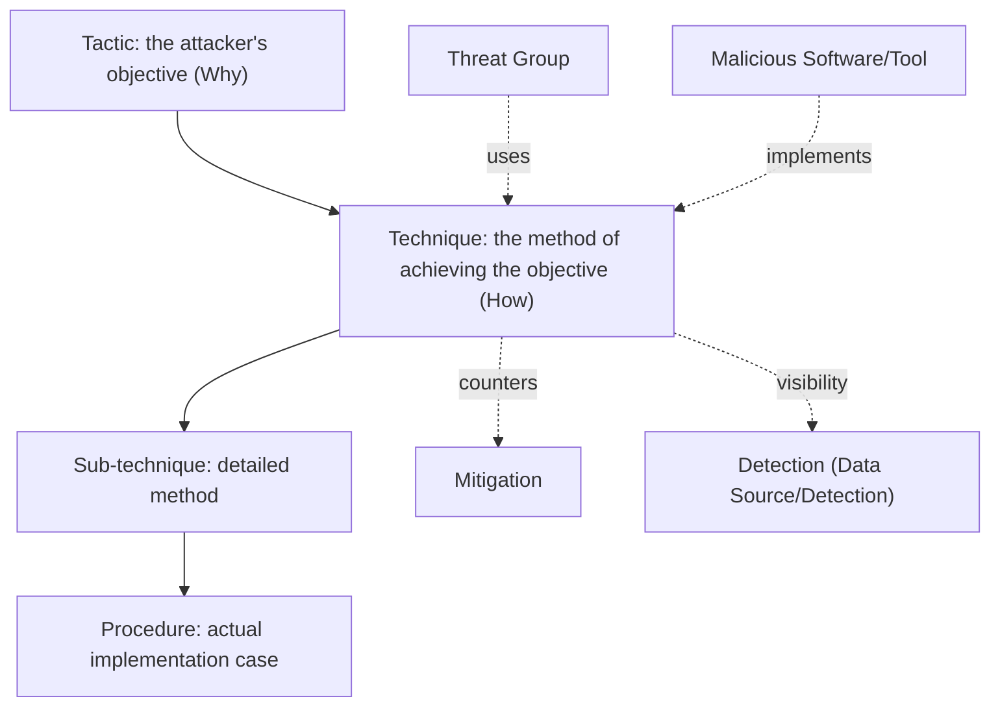
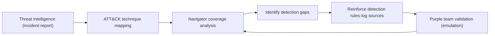

# MITRE ATT&CK (Knowledge Base of Cyber Attack Tactics and Techniques)

## 1. Overview

> **MITRE ATT&CK (Adversarial Tactics, Techniques, and Common Knowledge)** is a **knowledge base of attack behavior** built and published by MITRE, a U.S. non-profit research organization, that systematizes attacker behavior observed in actual breach incidents into **Tactics, Techniques, and Procedures (TTP)**.

Traditional security response has relied on **Indicators of Compromise (IoC)** such as malware hashes, signatures, and IPs. However, since attackers easily change hashes or IPs, indicator-based detection is effective for reruns of already-known attacks but is weak against modified or new attacks. Security practitioners noted that "**how the attacker behaves**"—the **behavioral patterns** of escalating privileges after penetration, moving internally, and exfiltrating data—is much harder to change than "what (file/address) the attacker used." ATT&CK organizes exactly this **observed behavior** into a common language, enabling an organization to review its own detection and defense capabilities from the attacker's perspective.

ATT&CK connects with the concept of the **Pyramid of Pain** presented by David Bianco. Hashes and IPs are easy for the attacker to change, so the "pain" they impose on the defender is small, but if one neutralizes tools and TTPs, the attacker must fundamentally redesign their operation, so the defensive effect is large. ATT&CK has significance in that, by cataloging this TTP layer with standard identifiers, it turned threat descriptions—which differed from organization to organization—into a form that can be mutually compared and shared.

Its main characteristics are as follows. First, it is **evidence-based**: it registers not theoretical threats but only behaviors confirmed in public threat intelligence and incident reports. Second, its **matrix structure** crosses tactics (columns) and techniques (rows) to survey the attack lifecycle at a glance. Third, it is **free and open**, so anyone can use it via web, API, or STIX. Fourth, it is extended into **domain-specific matrices** such as Enterprise, Mobile, and ICS, covering not only IT but also industrial control systems.

## 2. Overall Structure and Core Components

The foundation of ATT&CK is the three-layer model of **Tactics–Techniques–Procedures (TTP)**, to which Groups, Software, Mitigations, and Detection are connected.

A **Tactic** means the **objective** an attacker aims to achieve at a particular stage. The Enterprise matrix consists of 14 tactics: Reconnaissance, Resource Development, Initial Access, Execution, Persistence, Privilege Escalation, Defense Evasion, Credential Access, Discovery, Lateral Movement, Collection, Command & Control, Exfiltration, and Impact. Each tactic is a higher-level category indicating "Why" the behavior is performed.

A **Technique** is the **concrete method (How)** of achieving a tactic's objective and has an identifier in the `T####` format. For example, the Credential Access tactic includes techniques such as Credential Dumping (T1003) and Brute Force (T1110). It is important that a single technique can belong to multiple tactics simultaneously—for example, Valid Accounts (T1078) spans the four tactics of Initial Access, Persistence, Privilege Escalation, and Defense Evasion. This reflects that attack behavior can be interpreted differently depending on the objective.

A **Sub-technique** is a layer introduced in 2020, has the `T####.###` format, and further subdivides a technique. Credential Dumping (T1003) is divided into LSASS Memory (T1003.001), SAM (T1003.002), and so on. A **Procedure** is a case of how a specific threat group or tool actually **implemented** that technique, the most concrete level of information. Threat groups (APT29, Lazarus, etc.) and software (Mimikatz, Cobalt Strike, etc.) are tagged here, enabling one to cross-track "which group uses which technique with which tool."

| Category | Meaning | Identifier Example | Example |
|------|------|-----------|------|
| Tactic | Attack objective (Why) | TA0006 | Credential Access |
| Technique | Method of achievement (How) | T1003 | OS Credential Dumping |
| Sub-technique | Detailed method | T1003.001 | LSASS Memory |
| Procedure | Actual implementation case | — | Accessing LSASS with Mimikatz |

## 3. Matrix Domains and Comparison with Similar Frameworks

ATT&CK is divided into three main matrices according to the target environment. The **Enterprise matrix** is the most extensive domain, covering Windows, macOS, Linux, cloud (IaaS, SaaS, Office 365), containers, and network devices. The **Mobile matrix** deals with attack behavior in Android/iOS environments, and the **ICS matrix** deals with attacks unique to industrial control systems (OT) such as power generation and manufacturing (e.g., neutralizing safety instruments, manipulating physical processes). The reason for separating the domains like this is that the assets, vulnerabilities, and attack surfaces of each environment are fundamentally different, and in particular ICS differs from IT in defense priorities in that availability and safety are the top priorities.

A framework frequently compared with ATT&CK is Lockheed Martin's **Cyber Kill Chain**. The Kill Chain models an attack **linearly** in seven stages: Reconnaissance → Weaponization → Delivery → Exploitation → Installation → C2 → Actions on Objectives. ATT&CK, on the other hand, does not force a linear order of stages and expresses the **nonlinear, iterative** behavior that appears in actual attacks as a matrix—this is the key difference. In practice, one often uses them complementarily, grasping the big flow (strategic perspective) with the Kill Chain and mapping the detailed techniques within each stage (tactical perspective) with ATT&CK.

| Category | Cyber Kill Chain | MITRE ATT&CK |
|------|------------------|--------------|
| Perspective | Linear 7 stages (strategic) | Nonlinear matrix (tactical) |
| Focus | Attack progression flow | Concrete behavior (TTP) |
| Post-penetration detail | Relatively shallow | Very detailed (lateral movement·persistence, etc.) |
| Use | Designing the overall defense concept | Detection coverage·threat hunting |

That said, if the two frameworks deal with "what is being done," recently there is complementary discussion of approaches that model even the **attacker's goals, motives, and decision-making**. For example, **MITRE D3FEND**, a defender-perspective response knowledge base, and **MITRE Engage**, which deals with active deception and response, are sister projects that extend ATT&CK on the defense/deception side, and they are used together in mutual mapping with ATT&CK's attack techniques.

## 4. Practical Application Methods

ATT&CK's substantive value lies in the **visualization of detection capability**. A core tool that supports this is the **ATT&CK Navigator**, which colors in an organization's detection/defense status on top of the matrix to create a **coverage heatmap**. Since it becomes visible at a glance which techniques remain red (undetected), one can decide security investment priorities on a data basis.

First, it is used for **structuring threat intelligence (CTI)**. Mapping breach incidents or APT reports to ATT&CK techniques makes it possible to compare and aggregate threat information from different organizations in a common language. Second, it is for **gap analysis of detection**. Mapping an organization's EDR/SIEM detection rules to techniques identifies uncovered areas and reinforces the necessary log sources (e.g., process creation, PowerShell logs). Third, it is used as a basis for hypothesis-building in **threat hunting**. One performs active exploration starting from "if T1003 LSASS dumping occurs in our environment, in which logs would traces remain."

Fourth, it is for **adversary emulation** and **purple team** validation. MITRE's **CALDERA** and the open-source **Atomic Red Team** actually reproduce the TTPs of a specific threat group to verify whether detection rules work. For example, when a financial-sector CSIRT reproduced the Lazarus group's public TTPs (spear phishing → PowerShell execution → credential dumping → lateral movement) with Atomic Red Team, if three stages were detected but the lateral-movement (T1021) segment was not, concrete improvement such as immediately reinforcing the relevant log source and correlation rules is possible. In this way, ATT&CK becomes a central axis for improving SOC maturity in that it turns "what we cannot detect" into a **measurable metric**. Fifth, when adopting a security solution, one can perform an objective evaluation not swayed by marketing terms by requiring and comparing a vendor's detection coverage based on ATT&CK techniques. MITRE in fact performs **ATT&CK Evaluations** on commercial security products and publishes the detection results.

## 5. Considerations and Implications

First, one must guard against the **Coverage Illusion**. Coloring a specific technique as "detectable" in Navigator does not mean it catches all modified and evasion procedures. Because technique-level coverage and actual procedure-level detection capability are different, a threat-informed approach that focuses on the **priority techniques** of the groups that threaten the organization is preferable to aiming to "fill every cell green."

Second, there is a **trade-off in application**. ATT&CK mapping and maintenance of detection rules entail considerable specialized personnel, log storage, and analysis costs. If a low-maturity organization tries to handle all 14 tactics at once, it falls into overload, so a strategy of starting narrowly from a few tactics with large incident impact—such as Initial Access, Credential Access, and Lateral Movement—and gradually expanding is realistic. One must also keep in mind that without first securing log sources (visibility), any mapping is hollow.

Third, the outlook for **automation and standard integration** is important. ATT&CK is machine-readable based on STIX/TAXII and integrates with SIEM, SOAR, and TIP, and the trend of assigning ATT&CK tags to **Sigma** rules—the detection-rule standard—to automatically link rules and techniques is spreading. Furthermore, recently attempts to automatically extract ATT&CK techniques from threat reports or generate detection rules with generative AI are increasing, so it is expected to develop in a direction that eases the personnel burden. However, verification of the accuracy of automatic mapping (human review) is still needed.

Fourth, a perspective of **version management and governance** is needed. Because ATT&CK is revised on a semiannual basis and techniques are added, consolidated, and reclassified, an organization's detection rules and mappings must also be configuration-managed based on a specific version. Since the coverage metric can change drastically upon a framework revision, operational governance that clarifies the version-transition procedure and the responsible organization is the key to long-term use. Ultimately, ATT&CK is positioning itself not as a standalone tool but as a common language and maturity-measurement yardstick that connects **threat intelligence–detection–response–validation**, and its effect is maximized when organically combined with other security systems such as the Kill Chain, D3FEND, and Zero Trust.

## References

- MITRE ATT&CK official site — https://attack.mitre.org/
- MITRE ATT&CK Navigator — https://mitre-attack.github.io/attack-navigator/
- MITRE, "ATT&CK Design and Philosophy" — https://attack.mitre.org/resources/
- MITRE D3FEND — https://d3fend.mitre.org/

---
> **In one line**: MITRE ATT&CK is an open knowledge base that systematizes attack behavior observed in actual breach incidents into Tactics, Techniques, and Procedures (TTP); focusing on hard-to-change attacker behavior instead of easy-to-change IoCs, it is used as a common language for detection-gap analysis, threat hunting, adversary emulation, and solution evaluation.
