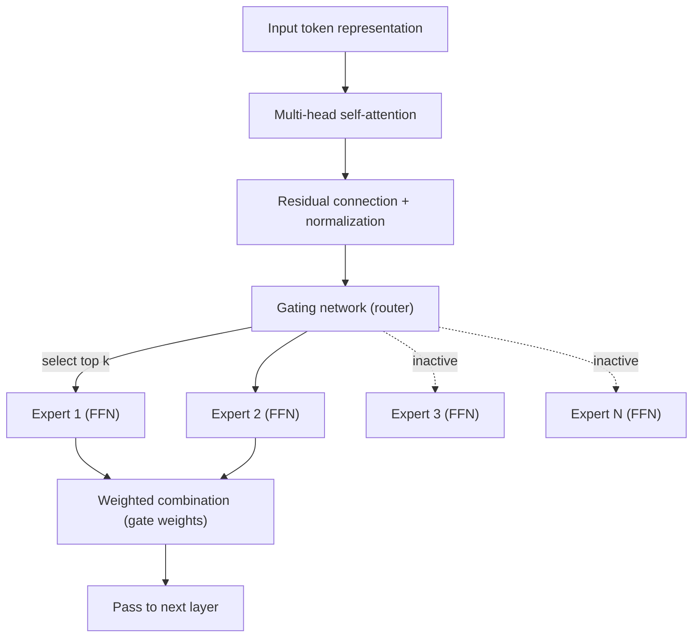
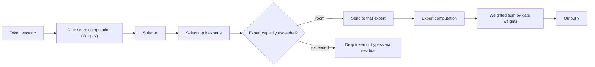

# Mixture of Experts (MoE)

## 1. Overview

> **Definition**: Mixture of Experts (MoE) is a conditional-computation-based architecture that divides a single huge neural network into multiple **Expert** subnetworks and, for each input token, has a **Gating Network (router)** selectively activate only a small number of experts (sparse activation) to perform computation.

The background to MoE's emergence lies in a fundamental tension that large language models (LLMs) faced: **"we want to increase parameters but cannot bear the computational cost."** Transformers follow the scaling law, in which performance predictably improves as parameters and data grow, but a conventional dense model computes the entire set of parameters exhaustively for every input. That is, doubling the parameters nearly doubles the training and inference cost, so once the parameter scale exceeds hundreds of billions, GPU memory and power costs balloon exponentially.

MoE solves this problem by **separating the "model's knowledge capacity (total parameters)" from the "actual computation per token (active parameters)."** For example, if there are 8 experts and only 2 are activated per token, the model holds 8× the knowledge while performing computation for only 2 experts' worth. This is the same principle as a human organization dividing labor among domain experts rather than having one person handle all work—the idea of "pulling out and using only the knowledge that is needed."

Thanks to this sparse activation, MoE secures a much larger effective capacity than a dense model at the same computational budget (FLOPs), and it has become a core design of the latest ultra-large models such as GPT-4, Mixtral, DeepSeek-V3, and Gemini. In an answer, it is appropriate to describe MoE not as a mere performance-improvement technique but as a **"scaling paradigm that redefined the trade-off between computational efficiency and model size."**

## 2. Overall MoE Architecture

MoE is generally implemented by replacing the **feed-forward network (FFN)** layer inside a transformer block with multiple expert FFNs and a router, instead of a single large FFN. The conceptual diagram below shows the overall skeleton in which an input token passes through the router, is distributed to the top-k experts, and its output is weighted-combined and passed to the next layer.

An **Expert** is an FFN each with its own independent parameters, and during training it naturally specializes in different types of patterns (e.g., a particular language, grammatical structure, domain knowledge). However, it is important that this specialization is not explicitly assigned by a person but forms **emergently** through the data distribution and routing learning. In fact, one observes phenomena where a particular expert is skewed toward code tokens and another toward formulas and punctuation.

The **router (gating network)** takes the input token vector, computes a score for each expert, and, through a softmax, selects the top-k experts. The router is usually a single linear layer, so it has very few parameters, but since the decision of "which token to send to which expert" governs model performance, it is the most sensitive part of MoE design.

In the **Combine** step, the outputs of the selected experts are weighted-summed by the gate weights the router assigned. Since experts that are not activated skip computation entirely, no matter how large the total parameters, the computation per token is fixed at k experts' worth.

## 3. Routing Mechanism and Operating Procedure

The success or failure of MoE hinges on routing. A representative method is **Top-k routing**; Google's Switch Transformer pursued extreme sparsity with k=1 (only the single strongest expert), while Mixtral 8x7B selects k=2 out of 8 experts. The diagram below shows the processing flow in which per-token routing and load balancing occur.

Looking at the operating procedure step by step: First, the router multiplies the token vector by the gate weight matrix to produce a preference score for each expert. Second, it probabilizes them with a softmax and picks the top k. Third, each expert has a **capacity factor**, an upper limit on the number of tokens it can process, so if tokens crowd into a particular expert and exceed its capacity, the overflow tokens are not processed and are dropped or bypassed via a residual connection. Fourth, the outputs of the selected experts are weighted-summed to produce the final output.

Here arises MoE's biggest challenge, **load imbalance**. If the router favors only a particular few experts, tokens flood into those experts and drops increase, while the remaining experts do not get trained and become "dead experts." To prevent this, an **auxiliary load-balancing loss** is added to the training loss to induce tokens to be evenly distributed across all experts. Recently, DeepSeek-V3 also introduced a technique that balances load with only a bias term and no auxiliary loss, to reduce the side effect of the auxiliary loss harming performance.

Also, routing decisions tend to be unstable early in training, so stabilization techniques are applied in parallel—such as suppressing divergence of the gate logits with a router z-loss, or securing routing consistency between training and inference.

## 4. Comparison with Dense Models and Application Cases

The difference between MoE and dense models goes beyond a mere structural difference and stems from a difference in the philosophy of resource allocation. A dense model uniformly invests the same computation in every token, whereas MoE performs **conditional computation** that allocates computation only to the experts needed for each token. As a result, the opposing characteristics below appear.

| Category | Dense Model | MoE Model |
|------|-----------|----------|
| Active parameters | Total parameters = active parameters | Active parameters ≪ total parameters |
| Computation (inference) | Large, proportional to parameters | Small, computing only the active experts |
| Memory (VRAM) | As much as the active parameters | Must load all total parameters |
| Training stability | Stable | Risk of load imbalance·routing collapse |
| Fine-tuning | Easy | Tricky due to overfitting·instability |

The key point in this comparison is that **MoE "saves computation but does not save memory."** Because one never knows when an unactivated expert will be selected, all parameters must be loaded into GPU memory. Therefore, MoE gives a big gain in environments where computation (FLOPs) is the bottleneck, but it can be disadvantageous in on-device/edge environments where memory is scarce. Here the distributed technique called "expert parallelism" becomes important; it distributes experts across multiple GPUs and sends tokens to the relevant GPU (all-to-all communication) to share the memory burden. However, this all-to-all communication becomes a new bottleneck, so communication bandwidth becomes a factor that governs MoE training speed.

As a concrete example, **Mixtral 8x7B** has about 46.7 billion total parameters but only about 12.9 billion active parameters per token, showing performance comparable to a 70-billion-class dense model at the inference cost of a 13-billion class. **Switch Transformer** scaled up to 1.6 trillion parameters while keeping the per-token computation at the level of the existing T5, and **DeepSeek-V3** greatly raised training efficiency with a fine-grained expert design that activates only about 37 billion per token out of 671 billion total parameters. In this way, MoE demonstrates numerically the practical gain of "greater knowledge capacity at the same computational budget."

## 5. Deep Dive: Latest Trends and Design Evolution

MoE design has recently been refined in several directions. First, the trend of **fine-grained experts**, placing many small experts instead of a few large ones to increase the diversity of combinations and promote knowledge specialization. Second, the introduction of a **shared expert**, placing an always-activated shared expert to handle common knowledge so that the remaining routing experts can concentrate on specialized knowledge, reducing knowledge duplication (DeepSeek-MoE). Third, the **auxiliary-loss-free** technique—removing the auxiliary loss that hampered training and balancing load with bias adjustment alone—is spreading.

Also actively researched are **upcycling**, which converts a dense model into an MoE; optimizations that lower serving cost by approximating and quantizing routing at inference time; and multimodal MoE, which assigns experts to multiple domains and modalities. This trend can be understood as a process of refining MoE's fundamental goal of "a larger model with less computation," and from a professional engineer perspective one should note that hardware (HBM capacity, interconnect bandwidth) and software (routing, parallelization) design evolve in tandem.

## 6. Considerations and Implications

First, a **clear recognition of the compute-memory trade-off** is needed. Because MoE reduces inference computation but must load all total parameters, before adoption one must first diagnose whether the target environment is compute-bottlenecked or memory-bottlenecked, and set an application strategy that distinguishes large-scale cloud serving (compute bottleneck) from edge/on-device (memory bottleneck).

Second, **routing stability and load balancing are operational risks**. Because load imbalance causes dead experts and performance degradation, one must tune with a combination of load-balancing loss, capacity factor, and router normalization, and equip an observability system that constantly monitors the per-expert token distribution during training and serving.

Third, one must consider the **difficulty of fine-tuning and domain adaptation**. Because MoE is more vulnerable to overfitting and routing collapse during fine-tuning than dense models, careful strategies—such as adjusting only some experts or freezing the router—and sufficient data are required.

Fourth, **total cost of ownership (TCO) estimation from an infrastructure/cost perspective** is important. If one adopts it looking only at the low inference cost based on active parameters, the cost can grow beyond expectation due to the investment in high-capacity GPUs and high-speed interconnects (NVLink, InfiniBand) needed to load all parameters, and the all-to-all communication overhead, so one must evaluate compute, memory, and communication costs comprehensively from a FinOps perspective.

Fifth, as an **outlook**, MoE is establishing itself as the de facto standard scaling technique for ultra-large models, and the principle of conditional computation is expected to be more widely used in future multimodal and agentic models. However, the limits of a "just scale up" approach are also being discussed together, so balanced development with data quality, alignment, and efficiency is required.

---

> **In one line**: MoE, through conditional computation in which the gating network selectively activates only a small number of experts per token, separates "total parameters (knowledge capacity)" from "active parameters (computation)," realizing a far larger model at the same computational budget—a core scaling architecture of large-scale AI.
