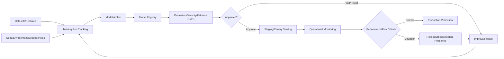
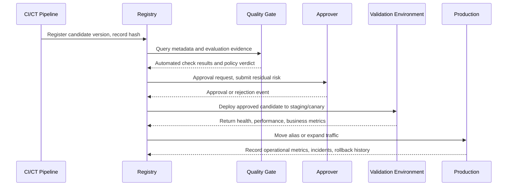

# Machine Learning Model Registry and Approval/Deployment Governance

## 1. Overview

> **Definition**: A Model Registry is a system that centrally manages machine learning models and their versions, training runs, data/code lineage, evaluation results, approval status, deployment references, and operational metadata to control a model from development through retirement.

When a machine learning project remains in the experimental stage, notebooks and file storage alone are enough to keep models.
However, when multiple teams operate dozens or more models, it is hard to explain which model is actually used in a service by file names and folders alone.
If model files with the same name exist in multiple buckets and the reference date of training data and code version are not recorded, results cannot be reproduced when an incident occurs.

A model registry solves this problem not as "a place to store model files" but as "the System of Record for operable model assets."
A model registered in the registry is not a mere binary but a managed object with a version, input/output signature, training run, evaluation metrics, dependent libraries, security scan results, owner, and approval history.
The registry therefore becomes the control point connecting the MLOps pipeline and model risk management.

The core of a model registry is not attaching version numbers per se.
What must be tracked is which candidate was registered and why, which validations it passed, who promoted it to which environment, and which version currently receives traffic and which was the previous one.
Only with this information can new models be deployed quickly while being rolled back under identical conditions if a problem arises.

### 1.1 Background and Need

First, as model artifacts proliferated, discoverability and duplication prevention became necessary.
If each team builds similar classification models separately, data and GPU costs are duplicated, and unvalidated models may be reused by other services.
A central registry provides name, owner, domain, purpose, and performance in searchable form, clarifying reuse and accountability.

Second, a model is not static software that is complete at the moment of deployment.
When the distribution of operational data and business rules change, performance changes, and when new training data arrives, risks different from the existing version arise.
Model versions must be linked with operational observations so that decisions on retraining, promotion, and rollback are data-driven.

Third, in finance, healthcare, and the public sector, explanations of model decisions and change history are important.
An approach that records only accuracy cannot explain the basis of training data, missing value handling, fairness metrics, approvers, or deployment environments.
The registry plays the role of binding such evidence to the model version's metadata and an immutable audit log.

### 1.2 Goals and Design Principles

The first goal of a model registry is reproducibility.
It must be possible to load the same model version with the same input contract and dependencies and re-examine past evaluation and operational results.

The second goal is promotion control.
Instead of developers copying files to production servers, only versions that have passed defined quality gates and approval procedures should become deployment references.

The third goal is safe change.
A new version should not immediately overwrite the existing version but should be registered as a candidate, with risk limited through offline evaluation, staging, canary, and gradual rollout.

The fourth goal is closed-loop operation.
Post-deployment latency, error rate, prediction distribution, actual performance, bias, and drift should be linked back to the registry and used in the next training and review.

In design, immutability, least privilege, automation, explainability, and auditability are the basic principles.
In particular, even if a model file is replaced, the content and history of an already approved version must not change; what can move is not the version itself but an approved alias or deployment pointer.

## 2. Composition of a Model Registry and the Overall Lifecycle

A model registry does not end with a single repository; it is connected with training tracking systems, artifact stores, data catalogs, evaluation engines, CI/CD/CT pipelines, and serving platforms.
Rather than replicating the originals of every system, the registry links identifiers and integrity hashes to trace from which artifacts a model version was created.

### 2.1 Core Objects of the Registry

The first object is the Registered Model.
A registered model is a logical name representing a business purpose and service boundary, such as "credit risk scoring model," and is the parent unit containing multiple model versions.

The second object is the Model Version.
A version points to an immutable artifact registered at a specific point in time and is linked to a training run identifier, artifact location, input/output contract, and evaluation results.
Since a version number is merely a convenient identifier, it is safer to record a global identifier traceable in other systems together with a content hash.

The third object is the Alias or deployment pointer.
Aliases representing roles such as `champion`, `challenger`, and `shadow` point to a specific version, but the history of alias movements must be kept separately.
Referencing an alias makes model replacement easy for services, but an alias alone cannot explain the exact version at a past point in time, so the hash and version are pinned in logs at deployment time.

The fourth object is tags and annotations.
Tags record, in structured form, the domain, whether personal data is included, approval status, deployment environment, evaluation policy version, and end-of-support date.
Free-form annotations provide human-readable context, but values that automated gates must judge should be managed with fixed keys and allowed values.

The fifth object is Lineage and evidence.
Lineage links from which data snapshot, feature definitions, code commit, run parameters, and environment the model was created.
The purpose of lineage is not to replicate every row of a database but to not lose the reference points and change relationships needed for reproduction.

|Object|Main Content|Operational Question|
|---|---|---|
|Registered Model|Business purpose, owner, model family, risk grade|Who is responsible for this model?|
|Model Version|Artifact, version, hash, input/output contract|How does the current version differ from the previous one?|
|Training Run|Data, code, parameters, run environment|Under what conditions was it created?|
|Evaluation Evidence|Accuracy, latency, fairness, security results|Did it pass the promotion criteria?|
|Alias/Deployment Pointer|champion, challenger, environment|Which version receives which traffic?|
|Audit Event|Registration, approval, promotion, rollback, retirement records|Who changed what and when?|

The objects in the table each look like independent tables, but in operation they must be treated as a single change graph.
If only a new model file is registered without recording that the input schema changed, version management is a mere formality.
Conversely, even a small hyperparameter change requires a new version and re-evaluation if it affects the model's risk grade and approval policy.

### 2.2 Lifecycle Stages

A model's lifecycle can be described as a cycle of problem definition, experimentation, registration, validation, approval, deployment, observation, retraining, and retirement.
Stage names may differ by tool, but "who can move it to the next stage" and "what evidence is needed" are more important.

In the problem definition stage, the model's purpose, input data, expected users, decision impact, and prohibited uses are declared.
Without this declaration, it is impossible to distinguish whether the same model is a recommendation aid or an automatic approver, so risk assessment and approval criteria waver.

In the experimentation stage, training runs and artifacts are tracked.
Experimental models must not have the same privileges as production models and should be safely validated with synthetic or restricted data before registration.

In the registration stage, the model artifact and metadata are stored together.
If the input/output schema, training data reference date, owner, license, dependencies, and baseline evaluation results are omitted at registration, they are hard to recover later.

In the validation stage, not only functional accuracy but also business cost, latency, stability, security, privacy, fairness, and explainability are evaluated according to the model's purpose.
Rather than forcing the same metrics on all models, mandatory and optional checks are distinguished according to risk grade and usage context.

In the approval stage, technical review and business/risk review can be separated.
Developers can explain the results but should not grant production approval alone, and approvers check the evaluation evidence and whether residual risk is acceptable.

In the deployment stage, rather than overwriting the model version itself, environment-specific aliases or deployment declarations are changed.
This allows traffic ratios and approval status to be adjusted while preserving the previous version's executable and records.

In the operation stage, performance and data quality are observed.
In business domains where ground-truth labels arrive late, performance cannot be computed immediately, so prediction distribution, input quality, latency, errors, and business proxy metrics are monitored first and later linked with post-hoc performance.

In the retirement stage, files are not deleted immediately just because they are no longer deployed.
Archiving, access restriction, or secure deletion is decided after checking retention periods, audit needs, personal data deletion policies, reproducibility, and license conditions together.

|Stage|Required Outputs|Example Pass Criteria|
|---|---|---|
|Problem definition|Purpose, users, risk grade, usage restrictions|Agreement with business owner on scope|
|Experimentation|Run ID, data/code references, parameters|Experiment reproducible|
|Registration|Version, hash, signature, model card|Metadata completeness|
|Validation|Performance, safety, fairness results|Meets policy-specific thresholds|
|Approval|Review opinions, residual risk, approver|Separated approval and audit record|
|Deployment|Environment, alias, traffic policy|Health check and rollback path secured|
|Operation|Monitoring, incident, retraining records|Compliance with SLOs and risk metrics|
|Retirement|Archive, retention, deletion evidence|Meets regulations and reproduction requirements|

## 3. Operational Design of Versioning, Lineage, Evaluation, and Promotion

### 3.1 Reproducible Version Management

A model version is not just a version of the weights file.
Even with the same weights, prediction results can differ if the preprocessing code, tokenizer, runtime libraries, or input schema differ.
Therefore, a model version links the model artifact together with pre/post-processing code, environment image, dependency lock file, configuration, signature, and hash.

Version increment rules must match the organization's change risk.
It is safe to register parameter tuning as a new version, and to mark changes to the input contract or output meaning as a separate model family or a compatibility break.
Reusing a version or replacing an existing file is prohibited, because past approvals and operational logs would then point to the current file.

Version numbers may use human-readable sequential numbers, but the basis of trust is content-addressed hashes and signatures.
If the registry and artifact store are separated, verify the hash on download, and block models that fail signature verification at the registration and deployment stages.

### 3.2 Lineage and Model Cards

Lineage considers data lineage and execution lineage together.
Data lineage links source events, cleansing rules, features, and training snapshots, while execution lineage links code commits, parameters, executor, environment, and model files.
Only when the two lineages are combined can one answer the question "which model built from which data and code was deployed to which service?"

A model card explains technical limitations and conditions of use in human-readable form.
Including purpose and non-purpose, training data scope, performance ranges, known biases, failure cases, privacy and license cautions, and contact information helps operators and users reduce misuse.

### 3.3 Quality Gates and Approval Workflow

A quality gate is not a single accuracy threshold but a multidimensional check according to the model's purpose.
For a classification model, beyond overall accuracy, precision, recall, calibration, per-group performance, and false-positive cost can be checked.
For a real-time model, latency, throughput, memory, and fallback paths in case of failure must be included in the criteria while maintaining the same performance.

Evaluation data is separated from training data, taking into account temporal order and the actual operational distribution.
Randomly shuffling historical data may include future information or fail to represent operational conditions, so time-series splits and a separate holdout are applied.

The approval workflow combines automated validation with human judgment.
Automated validation is strong at repeatable numerical, schema, and security checks, while humans judge business impact, explainability, exceptional situations, and whether residual risk is acceptable.
Using only one of them can either rapidly amplify automated errors or lead to unofficial deployments due to human approval bottlenecks.

### 3.4 Promotion, Canary, and Rollback

Promotion is environment movement through development, staging, canary, and production, and is not merely a task of renaming environments.
At each stage, data access, traffic volume, observability, and approving entity are set differently to limit the blast radius of failures.

A canary connects the new version to only part of the traffic to verify it in the real environment.
Rather than looking only at error rates, one must check performance by user group, region, product, and time slot, and the difference from the previous version, so as not to miss harm to specific groups.

Rollback is not "finding the previous version's file" but "reverting to a validated previous deployment pointer and preserving the cause."
Rollback commands are made idempotent, and compatibility of traffic switching, caches, feature schemas, and database changes is checked together.
If the new model has already made external decisions, rollback alone does not erase the impact, so response procedures such as reprocessing, customer notification, and manual review are also prepared.

## 4. Security, Authorization, Auditing, and Integration with Surrounding Systems

A model registry is both a knowledge repository and a high-value supply chain asset.
If a malicious model or tampered dependency is registered, it can be deployed to multiple services in a trusted state, so upload, approval, and deployment privileges must be separated.

Duties are separated such that developers can register candidate models but cannot move production aliases, and operators can deploy but cannot modify evaluation evidence.
Service accounts are given privileges only for the necessary projects, repositories, and environments, and short-lived credentials and audit logs are used instead of long-lived tokens for human accounts.

The process of deserializing model files can be linked to code execution vulnerabilities.
Untrusted files are not loaded directly in the production runtime; instead, allowed formats, sandboxes, scanning, signature verification, and an isolated conversion step are put in place.
Safety is not complete with the model registry's access control alone; the same controls must be applied to artifact stores, container images, pipelines, and serving clusters.

The audit log records the registrant, registration time, version/hash, evaluation policy, approver, alias changes, deployment target, and rollback reason.
Logs are sent to storage that is hard to delete or modify, and inputs and outputs that may contain personal data are minimized or masked.

|Control Area|Main Controls|Risk on Failure|
|---|---|---|
|Access|RBAC, service accounts, least privilege|Unauthorized model replacement, information leakage|
|Integrity|Hashes, signatures, artifact immutability|Deployment of tampered models|
|Supply chain|Dependency, image, and model scanning|Malicious code, vulnerable libraries|
|Approval|Separation of duties, 4-eyes, policy gates|Production promotion without validation|
|Audit|Immutable events, retention/query policies|Failure to trace root cause and accountability|
|Personal data|Metadata classification, masking, retention periods|Regulatory violations, excessive exposure|

## 5. Comparison and Application Cases

### 5.1 Comparison with Adjacent Concepts

An artifact store focuses on reliably storing and delivering files.
A model registry adds a layer that interprets and manages which version of which model a file is and what its validation and approval status is.

A feature store is a platform that consistently provides features used for training and inference.
Since a model registry manages models created by referencing those feature definitions and data snapshots, the two systems are not competitors but are in a lineage relationship leading from data to model.

A model catalog may place weight on search and listing functions for finding and describing the organization's models.
Since the registry handles execution controls such as registration, versioning, approval, deployment references, and rollback, a structure in which the catalog indexes the registry's metadata is also possible.

ModelOps is a broader practice concept of model governance and operating systems.
A model registry is one of the core systems for implementing ModelOps, but it does not replace organizational roles, policies, risk acceptance committees, or the entire operational process.

|Category|Main Concern|Relationship with Model Registry|
|---|---|---|
|Artifact store|File storage, delivery, replication|Physical storage layer for model files|
|Experiment tracking|Experiments, runs, parameters, metrics|Provides creation lineage for model versions|
|Feature store|Feature definitions, point-in-time consistency, serving|Provides training/inference data contracts|
|Model catalog|Model search, description, reuse|Can consume registry metadata|
|Model registry|Versioning, approval, deployment, rollback|System of record for production models|
|ModelOps|Organizational policy, risk, operational governance|Higher-level operating system that includes the registry|

Rather than simply memorizing differences, it is important to connect them as a flow.
Data and code are recorded in experiment tracking, model files are stored in the artifact store, the registry binds them into versions and approval states, and the serving platform reads the approved pointer and deploys.
Operational monitoring then records results back in the registry, creating the basis for the next promotion and retraining.

### 5.2 Case: Payment Fraud Detection Model

Assume an e-commerce operator calculates fraud scores for 1.5 million payments per day.
The existing model has high overall recall, but the false-positive cost of blocking legitimate payments has grown, and a recent pattern change in the mobile channel has been observed.

While training a new candidate model, the data team records the data reference date, feature version, code commit, hyperparameters, and run ID.
The candidate is registered as a new version of the `fraud-risk` registered model and is classified so that it references only approved identifiers and statistical features, not raw personal data such as card numbers.

The automated gate performs holdout recall, false-positive rate, per-group disparity, prediction latency, input missing rate, and model signature verification.
The business owner reviews blocked amounts together with customer inconvenience costs, and the security officer checks abnormal inputs and model extraction risk.

The approved candidate is deployed to staging with the `challenger` alias and receives 5% of actual traffic.
Even if average latency and error rate stay within criteria for an hour, expansion is halted if the false-positive rate rises in the new mobile customer segment.

Only when there are no problems is the `champion` alias moved to the new version, recording the exact version, hash, traffic ratio, and approver in the deployment event.
If false positives surge two days later due to a card issuer policy change, an automatic alert fires and the operator reverts the pointer to the previous champion version.

After rollback, the cause of the new version's errors and the impact scope of already blocked transactions are analyzed.
If necessary, the candidate data is revalidated, and the same version is not put back into production before retraining and re-approval.
In this case, the value of the registry lies not in an algorithm that raises the new model's accuracy but in an operating system that controls changes with evidence and safely reverts them.

## 6. Advanced: Expansion to Generative AI, Regulation, and Supply Chain

A registry for generative AI models is insufficient if it manages only weight versions.
The base model, fine-tuning data, system prompt, retrieval index version, tool permissions, safety policy, evaluation data, token cost, and latency must be linked together to explain changes to the actual service.

In LLM applications, even with the same model version, outputs change if the prompt template and retrieved documents change.
Therefore, the registry's scope can expand from models to AI system releases, and identifying the model, prompt, RAG index, and guardrails as a single deployment bundle is appropriate.

Evaluation also expands from a single accuracy metric to a combination of safety, harmfulness, hallucination, tool use, prompt injection resistance, cost, and latency.
Automated evaluation results should be kept together with human sample reviews, and contamination of the evaluation set itself and data usage rights must be checked.

For regulatory compliance, rather than unconditionally copying a specific law's checklist into the registry, required metadata and approval evidence are mapped by risk grade.
High-risk decision-making models may require stricter human oversight, explanation, appeal, performance/bias monitoring, and incident response.
Since the scope and effective dates of regulations differ by jurisdiction and service, legal/compliance review and checking the latest original texts must be carried out in parallel.

From a supply chain perspective, the model registry is linked with SBOM, ML-BOM, data lineage, and vulnerability management.
Knowing the libraries and base models included in a model version allows quickly finding affected deployments when a vulnerability or license change occurs.

## 7. Considerations and Implications

### 7.1 Balancing Central Control and Development Speed

If every experiment is put through heavy review, developers will bypass the registry or use personal repositories.
Conversely, allowing free registration even for production models neutralizes approval and audit functions.
A tiered policy that distinguishes experimental, low-risk, and high-risk models and strengthens metadata and approval levels as risk increases is realistic.

### 7.2 Trade-offs among Immutability, Reproducibility, and Cost

Permanently preserving all models and data increases reproducibility but raises storage, privacy, and license costs.
Design a retention strategy suited to regulations and business criticality by combining content hashes, snapshot references, retention periods, and the minimum metadata needed for reproduction.

### 7.3 Effectiveness of Quality Gates

If thresholds are not linked to actual business costs, high-scoring models can fail in the field.
Define metrics including false-positive/false-negative costs, processing latency, user impact, and manual fallback procedures in case of failure alongside accuracy, and clarify which gates are blocking conditions for each model.

### 7.4 Operational Observability and Rollback Readiness

Knowing only the model version cannot resolve incidents.
Make input quality, feature freshness, output distribution, latency, errors, actual label performance, and alias movement events queryable on a single time axis.
Rehearse rollback before deployment, and check schema compatibility, caches, database changes, and even external effects.

### 7.5 Security and Personal Data Minimization

Since the registry can reveal sensitive relationships between models and data, not everyone should be able to view all metadata.
Manage model risk grades and personal data classifications as tags, but do not put raw customer data or secret keys into the tags themselves.
Make signing, verification, separation of duties, and immutable logs the baseline for supply chain control.

### 7.6 Integration Strategy from a Professional Engineer's Perspective

The registry is not a matter of adopting an MLOps tool but an enterprise architecture task linked with data governance, DevSecOps, ITSM, and risk management.
Organizations should first organize model inventories and ownership, define common metadata and APIs, and then apply the approval-deployment-monitoring closed loop starting with high-risk business areas.
In the long run, it should evolve into an AI asset catalog that integrates the relationships among models, data, prompts, and policies, but open integration that does not make everything dependent on a single product is needed.

## References

1. MLflow, “ML Model Registry” — https://mlflow.org/docs/latest/ml/model-registry/
2. Google Cloud, “Introduction to Model Registry” — https://docs.cloud.google.com/gemini-enterprise-agent-platform/machine-learning/model-registry/introduction
3. NIST, “AI Risk Management Framework” — https://www.nist.gov/itl/ai-risk-management-framework
4. NIST AI RMF Playbook, “Secure” — https://airc.nist.gov/airmf-resources/airmf/5-secure

---

> **In one line**: A model registry is not a repository that collects model files but a system of record that links versioning, lineage, evaluation, approval, deployment, monitoring, and rollback to turn machine learning into a trustworthy operational asset.
