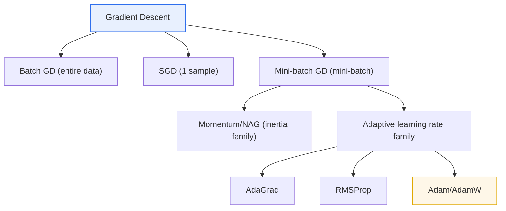

# Machine Learning Optimization Algorithms

## 1. Overview

### A. Definition

> A **machine learning optimization algorithm** is a procedure that **iteratively searches for the parameters (weights and biases) that minimize** a model's **Loss Function**. Most are based on Gradient Descent, which uses the gradient of the loss function to update parameters in the direction that reduces error.

The best intuition for understanding optimization algorithms is "**descending a foggy mountain to find the lowest valley**." The loss function is a terrain (loss landscape) that represents how large the prediction error is for given parameter values, and learning is the task of finding the lowest point (minimum error) in that terrain. At each point, the gradient indicates the direction of steepest "ascent," so stepping in the opposite direction one step at a time reduces the error.

What differs among algorithms here are three choices. First, "how large a step to take" (learning rate); second, "how much inertia of the previous descending direction to retain" (momentum); and third, "whether to give each parameter a different step size" (adaptive learning rate). How these three choices are combined determines convergence speed and stability. If the learning rate is too large, it overshoots the valley and oscillates or diverges; if too small, convergence is excessively slow; and if the terrain is bumpy, it may get stuck in shallow pits (local minima) or flat saddle points. The history of optimization algorithm development is precisely the history of how these three problems have been mitigated.

### B. Background and Need

Traditional statistical models could often obtain the optimal solution in one shot through a formula, such as the normal equation. However, deep learning models have millions to hundreds of billions of parameters, and their loss functions are highly nonlinear and non-convex, making it computationally impossible to obtain a closed-form solution. For example, large language models have billions to hundreds of billions of parameters, so a matrix-inversion approach is not even feasible. Therefore, **iterative optimization that starts from initial values and improves bit by bit** is the only realistic method, and its efficiency directly determines the time and cost of training and the final model performance.

In addition, as data scale grew, the approach of processing all data at once hit its limits. Since sweeping through millions to billions of training samples at every update is hard to afford in terms of memory and computation, **stochastic and mini-batch methods** that estimate gradients using only a sample of the data became the standard. Modern optimization algorithms are designed around how to handle the noise of this "sample-based estimation."

Ultimately, the optimization algorithm is the "engine" of learning. Even with the same model architecture and data, depending on which optimizer and learning rate strategy are used, training that took days may shrink to hours, may fail to converge at all, or conversely may reach much higher accuracy. That is how central optimization is to deep learning performance and cost.

## 2. Principles and Families of Gradient Descent

The update rule of gradient descent can essentially be summarized in one equation. The new weight is the current weight minus "learning rate × gradient of the loss function" (θ ← θ − η∇L). Here η (eta) is the learning rate and ∇L is the gradient. Families diverge depending on how this simple equation is extended and supplemented. Below is the overall structure of the gradient descent family.

Gradient descent is first divided by **how much data is used per update**. **Batch GD** computes the gradient over the entire data, so the direction is accurate and convergence is stable, but the larger the data, the more it must sweep the whole set at each step, making it very slow with a heavy memory burden. For example, with 1 million data points, all 1 million gradients must be averaged to update the parameters once, so the cost of taking a single step is excessive.

**SGD (Stochastic Gradient Descent)**, conversely, updates for each individual sample, making it very fast and enabling online learning (learning immediately as data flows in), but the gradient of a single sample is a very rough estimate of the full gradient, so the direction fluctuates wildly. This fluctuation is a drawback, yet paradoxically it also provides a regularization effect that shakes the model out of shallow local minima.

**Mini-batch GD** updates with moderately sized bundles (batches) such as 32, 64, or 256, balancing speed and stability, and is the de facto standard of today's deep learning. The gradient of one batch is an unbiased estimate of the whole with less noise than SGD, and above all, batch-level matrix operations match perfectly with the massive parallel processing of GPUs, yielding high hardware utilization. In other words, mini-batch became the standard for both statistical and hardware reasons.

### A. Momentum Family

**Momentum** emerged to mitigate the noise of mini-batches and the problem of curved terrain. Like physical inertia, it accumulates the previous update direction at a certain ratio (usually 0.9) and adds it to the current update. In this way, speed builds up and accelerates along the gentle direction of the valley, while oscillating side-to-side components cancel each other out and shrink. As a result, in narrow and long valley (ravine) terrain, it slides quickly toward the bottom without zigzagging.

A one-step improvement on momentum is **NAG (Nesterov Accelerated Gradient)**. NAG computes the gradient not at the current position but at the "expected position after moving first" by inertia. In other words, since it looks one step ahead and corrects its direction, it decelerates in advance when it seems about to overshoot the valley, better suppressing oscillation. Thanks to this "lookahead" property, it is known to have a faster theoretical convergence rate on convex problems.

The momentum family also helps escape local minima and saddle points. At a flat saddle point where the gradient is nearly 0, pure gradient descent stops, but with inertia, it can pass through that point at its previous speed and escape. However, excessive inertia can overshoot the minimum and cause oscillation again, so the momentum coefficient and learning rate must be tuned together.

As a real example, in training on ImageNet, the standard benchmark for image classification, ResNet-family models have long been trained with the combination "SGD + Momentum (coefficient 0.9) + step-wise learning rate decay." With pure SGD alone, convergence is slow and oscillation is large, but adding momentum accelerates stably along the narrow and long loss valley, speeding up convergence and also improving final accuracy. This is a representative example showing that inertia contributes not only as a simple speed-up technique but also to final generalization performance.

### B. Adaptive Learning Rate Family

Another axis of improvement is **adjusting the learning rate differently for each parameter**. **AdaGrad** divides the learning rate by the cumulative sum of squared gradients each parameter has received so far. Frequently updated parameters have their step size reduced, while rarely updated parameters (e.g., sparse word embeddings) maintain large step sizes. Thanks to this, it is particularly advantageous for sparse data. However, because the cumulative sum only keeps growing, the learning rate plummets toward 0 as training progresses, with the drawback that learning stops prematurely.

**RMSProp** solves this plummeting problem. Instead of accumulating squared gradients indefinitely, it applies an **exponentially weighted moving average to recent values**, gradually forgetting the past and adjusting the learning rate to the magnitude of recent gradients. As a result, it maintains an appropriate step size even late in training and operates stably on non-stationary and non-convex terrain, and was widely used for training recurrent neural networks and more.

**Adam (Adaptive Moment Estimation)** is the most widely used general-purpose optimizer today, **combining momentum (the first moment, the mean of gradients) and RMSProp (the second moment, the mean of squared gradients)**. In other words, it simultaneously takes directional inertia and per-parameter adaptive learning rates, and even has terms that correct the bias at the start of training. Even with default hyperparameters (η=0.001, β₁=0.9, β₂=0.999), it converges quickly and stably on most problems, becoming the default choice for deep learning. Meanwhile, Adam has the problem of applying weight decay inaccurately, and **AdamW**, which decouples and corrects this, has become the de facto standard for training transformers and large language models.

### C. Intuition behind Update Rules and Hyperparameters

Comparing the update rules of the three families side by side makes the differences clear. Pure gradient descent is `θ ← θ − η·g` (g is the gradient), looking only at the current gradient. Momentum is `v ← βv + g; θ ← θ − η·v`, accumulating the past direction v. The adaptive family places the gradient magnitude in the denominator, as in `θ ← θ − (η / √(accumulated squared gradients + ε))·g`, automatically adjusting the step size for each parameter. Adam can be seen as combining these two ideas into one equation.

The knobs practitioners turn in these equations are ultimately the learning rate η, the momentum coefficient β, and a small constant ε for numerical stability. η is the "step size" and thus the most sensitive; β usually works well around 0.9; and ε (e.g., 1e-8) is a safety device preventing division by zero, so it is not a major tuning target. Understanding what role each hyperparameter plays at which position in the update equation lets you diagnose what to adjust when training diverges or stalls.

In other words, choosing an optimizer reduces to the design decision: "Should we look only at the current gradient, add the past direction as inertia, divide the step size per parameter, or combine all three?" With this perspective, even when a new optimizer appears, you can quickly understand it in terms of which of these three axes it modified and how.

## 3. Comparison by Type

The table below summarizes the principles, advantages, and disadvantages of each family. However, the table is merely a summary, and actual selection comes from understanding "why such differences arise."

| Algorithm | Principle | Advantages | Disadvantages |
|---|---|---|---|
| **Batch GD** | Update with entire data | Accurate, stable convergence | Slow on large data, memory burden |
| **SGD** | Update one sample at a time | Fast, online learning | Severe directional oscillation |
| **Mini-batch GD** | Update per mini-batch | Balance of speed and stability (standard) | Batch size tuning required |
| **Momentum/NAG** | Inertia damps oscillation and accelerates | Faster convergence, saddle point escape | Additional momentum coefficient |
| **AdaGrad** | Adjust learning rate by accumulated squared gradients | Advantageous for sparse data | Learning rate plummets, premature stop |
| **RMSProp** | Adjust learning rate by recent gradients | Fixes AdaGrad's plummeting | Sensitive to default learning rate |
| **Adam / AdamW** | Momentum + RMSProp | **General-purpose, fast convergence** | Possible generalization degradation (mitigated by AdamW) |

The most practically important contrast in this comparison is **Adam vs. SGD+Momentum**. Adam converges quickly and is less sensitive to hyperparameters, making it advantageous for prototyping and research iteration. On the other hand, for tasks like image classification, **SGD+Momentum is known to often produce better final generalization (test accuracy)**. As the reason, a hypothesis has been proposed that SGD's large noise guides the model toward "flat and wide minima" in the loss landscape, which favors generalization, whereas Adam converges to narrow and steep minima, risking overfitting. In practice, the fact that combining SGD+Momentum with a learning rate schedule has long been the standard for large-scale ImageNet training, while AdamW is the standard for the transformer family, shows that "the optimal algorithm differs by problem type."

Another example that makes this contrast tangible is training the transformer family. Models such as BERT and GPT have extremely unstable parameters early in training, making them practically hard to converge with pure SGD; they train stably only when AdamW is combined with linear warmup (e.g., linearly increasing the learning rate from 0 to the target over the first 10,000 steps) followed by decay. Conversely, using the same AdamW settings as-is on a small CNN with strong residual connections sometimes yields test accuracy a few %p lower than SGD+Momentum. In this way, "the combination of architecture, data, and scale" determines the optimal algorithm, and the principle is to find the answer empirically through benchmark comparisons.

The second contrast worth noting is **the relationship between batch size and learning rate**. Increasing batch size makes gradient estimates more accurate and stabilizes training, but reduced noise can worsen generalization, while parallel efficiency improves. Empirically, it is known that when batch size is increased k times, the learning rate should also be increased roughly k times (linear scaling) or √k times, because as batches grow, the direction of each step becomes more reliable, allowing larger step sizes. In large-scale distributed training, when batches are greatly enlarged across thousands of GPUs, this rule is applied together with warmup.

## 4. Advanced: Learning Rate Scheduling and Latest Trends

In practice, the decisive factor separating optimization performance is **learning rate scheduling**, no less than algorithm choice. Rather than a fixed learning rate, a widely used approach combines **warmup**, which gradually increases the learning rate at the start, with **decay**, which gradually lowers it afterward. Warmup prevents divergence with large steps when parameters are unstable early in training, and late-stage decay such as cosine annealing helps converge precisely by reducing step size near the minimum. In transformer training, "linear warmup followed by cosine decay" has become an almost standard procedure.

As for recent trends, optimizers targeting large-model training are being actively researched. **LAMB** and **LARS** secure stability by adjusting per-layer learning rates in ultra-large distributed training with batch sizes scaled to tens of thousands, and are known for cases that greatly shortened BERT training time. In addition, to mitigate the problem that optimizer state (moment estimates) occupies several times the memory of the parameters, memory-efficient techniques such as **8-bit Adam**, which quantizes optimizer state to 8 bits, and **Adafactor**, which approximates state with a low-rank factorization, are used for training large language models. All of these stem from the practical need to "train larger models with limited resources," showing that optimization is a field that goes beyond pure theory and interlocks with systems and hardware.

Furthermore, optimization cannot be viewed separately from **regularization, initialization, and batch normalization**. Batch normalization (BatchNorm) and layer normalization (LayerNorm) smooth the loss landscape so that larger learning rates can be used safely, and proper weight initialization (He, Xavier) prevents early vanishing/exploding gradients, helping optimization start smoothly. In other words, good optimization results come not from a single algorithm but from the combination of these elements.

In practice, whether training is progressing well is diagnosed through the loss curve. If the loss diverges or spikes sharply, the learning rate is too large; if it decreases excessively slowly, the learning rate is too small or training has fallen into a local plateau. If training loss keeps decreasing but validation loss begins to rise again, it is a sign of overfitting, so early stopping is considered. In this way, optimization is not "set it and forget it" but an iterative tuning task of observing the training process and adjusting the learning rate, batch, and regularization through feedback. This sense of feedback is the key competency that turns knowledge of optimization algorithms into actual performance.

## 5. Considerations and Implications

1. **Adam/AdamW is the practical default, but consider the problem type.** Thanks to fast and stable convergence, it is the first choice for most deep learning, but for tasks where generalization is important, such as image classification, SGD+Momentum sometimes yields better test performance. For transformers and LLMs, AdamW is the de facto standard. From the perspective that "there is no universal optimizer," a strategy of selecting and comparing according to task and data characteristics is needed.

2. **Learning rate and scheduling are the most important hyperparameters.** In many cases, the magnitude of the learning rate and its adjustment over time (warmup, cosine decay, etc.) determine performance more than the type of optimizer. It is efficient to invest resources first in learning rate search (LR range test) and schedule design.

3. **Generalization is the core concern rather than local minima or saddle points.** In high-dimensional non-convex terrain, saddle points and the issue of "flat vs. sharp minima" are more fundamental than a perfect global minimum. Escape saddle points with inertia and adaptive learning rates, but never forget that the final goal is not minimizing training loss but validation/test performance (generalization), and tune together with early stopping and regularization.

4. **Consider resource constraints and optimization design together.** In large models, the memory usage of optimizer state, batch size and communication cost in distributed training, and interaction with mixed precision affect optimizer choice. Understanding memory-efficient techniques such as 8-bit Adam and Adafactor, as well as batch-learning rate scaling rules, determines the success of large-scale training.

5. **Secure reproducibility and experiment management.** Since optimization results vary with random initialization, data order, and batch composition, systematic management through fixed seeds, hyperparameter logging, and experiment tracking tools is essential. From a professional engineer's perspective, the ability to explain "why that algorithm suits that problem" in terms of trade-offs matters more than memorizing individual algorithms.

## References

- Kingma & Ba, "Adam: A Method for Stochastic Optimization" — https://arxiv.org/abs/1412.6980
- Loshchilov & Hutter, "Decoupled Weight Decay Regularization (AdamW)" — https://arxiv.org/abs/1711.05101
- Ruder, "An overview of gradient descent optimization algorithms" — https://arxiv.org/abs/1609.04747

---

> **In one line**: Machine learning optimization is the gradient descent family that iteratively searches for loss-minimizing parameters in the direction opposite to the gradient, with trade-offs among *data usage (Batch, SGD, Mini-batch), inertia (Momentum, NAG), and adaptive learning rates (AdaGrad, RMSProp, Adam/AdamW)*; Adam/AdamW is the general-purpose default, but the problem type and learning rate scheduling determine final performance.
