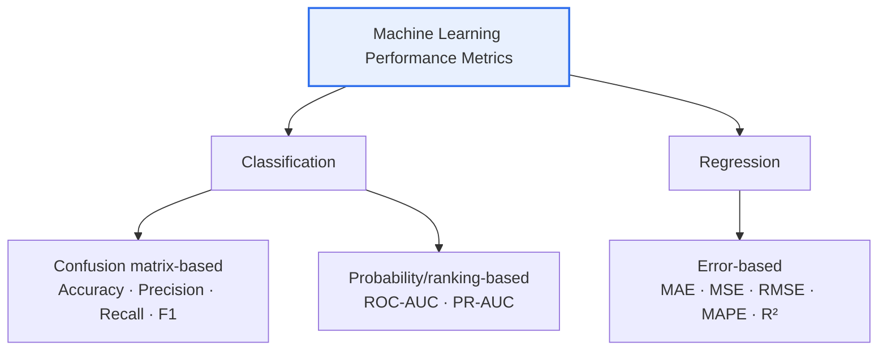

# Machine Learning Performance Metrics

## 1. Overview

### A. Definition
> Metrics for **quantitatively measuring and comparing the predictive performance** of a trained model; the appropriate metric must be chosen according to the problem type (classification/regression) and the business objective.

Performance metrics summarize "how well a model predicts" in a single number, providing a basis for judgment in training and selection. However, a single number always hides something while compressing information. For example, looking only at Accuracy can mask a model's actual incompetence when the data is imbalanced. Therefore, the key is to understand **why and when to use** a metric and to look at multiple metrics together.

### B. Background and Need
Model development is a continuous series of many decisions—training, hyperparameter tuning, and model selection—and comparing these objectively requires a common yardstick. Moreover, even the same misclassification **has different costs**. Just as missing a cancer (FN) and misdiagnosing a healthy person as a patient (FP) carry different prices, the metric to optimize differs depending on the business objective. Performance metrics make such objective-specific optimization possible, diagnose problems such as data imbalance and overfitting, and serve as the basis for judging a model's **generalization performance**.

## 2. Metric Classification Scheme



Performance metrics divide into **classification metrics** and **regression metrics** depending on whether the prediction target is a category (class) or a continuous value. Classification metrics are further divided into confusion matrix-based metrics, which count whether predictions were correct, and probability/ranking-based metrics, which assess the model's ranking ability independent of a threshold. Regression metrics aggregate the magnitude of error between predicted and actual values in various ways.

## 3. Confusion Matrix

Most classification metrics are derived from the confusion matrix. The confusion matrix is a 2×2 table dividing the combinations of prediction and actual into four cells, and understanding the relationships among the resulting TP, FP, FN, and TN allows every classification metric to be derived. Mapping FP to the statistical **Type I error** (wrongly judging a negative as positive) and FN to the **Type II error** (missing a positive) clarifies the nature of misclassification.

| Category | Actual Positive | Actual Negative |
|---|---|---|
| **Predicted Positive** | TP (True Positive) | FP (False Positive, Type I error) |
| **Predicted Negative** | FN (False Negative, Type II error) | TN (True Negative) |

## 4. Classification Performance Metrics

Each metric differs in which part of the confusion matrix it emphasizes. Precision looks at "true positives among those predicted positive," so it is important when **the cost of false positives (FP)** is high; Recall looks at "the proportion of actual positives not missed," so it is important when **the cost of misses (FN)** is high. F1 is the harmonic mean of the two, and since its value drops sharply if skewed toward either one, it is good for evaluating balance on imbalanced data.

| Metric | Formula | Meaning | Use Case |
|---|---|---|---|
| **Accuracy** | `(TP+TN) / Total` | Proportion of correct predictions overall | Class-balanced data |
| **Precision** | `TP / (TP+FP)` | Proportion of actual positives among positive predictions | High FP cost (spam classification) |
| **Recall** (Sensitivity) | `TP / (TP+FN)` | Proportion of actual positives not missed | High FN cost (cancer diagnosis) |
| **Specificity** | `TN / (TN+FP)` | Proportion of actual negatives correctly identified | When identifying normal cases matters |
| **F1 Score** | `2·(P·R) / (P+R)` | Harmonic mean of precision and recall | Imbalanced data, balancing P and R |
| **ROC-AUC** | Area under the ROC curve | Classification ability across thresholds (0.5–1) | Threshold-independent overall evaluation |
| **PR-AUC** | Area under the Precision-Recall curve | Minority class performance | Severely imbalanced data |

> **Precision-Recall Trade-off**: Lowering the classification threshold judges more cases as positive, so recall↑ and precision↓; raising it yields precision↑ and recall↓. Since the two metrics fundamentally conflict, determining a balance point (threshold) suited to the objective is the core of practice.

ROC-AUC and PR-AUC summarize performance not at a specific threshold but across **the entire range of thresholds** into a single value. ROC-AUC is useful for threshold-independent overall evaluation, but on **severely imbalanced** data where negatives overwhelmingly dominate, it can look optimistic, in which case PR-AUC becomes the more honest metric.

### ROC Curve (Example)

```chart
{
  "type": "line",
  "data": {
    "datasets": [
      {
        "label": "Model ROC (AUC ≈ 0.9)",
        "data": [{"x":0,"y":0},{"x":0.05,"y":0.55},{"x":0.1,"y":0.72},{"x":0.2,"y":0.85},{"x":0.4,"y":0.93},{"x":0.6,"y":0.97},{"x":1,"y":1}],
        "borderColor": "#2f6fed",
        "backgroundColor": "rgba(47,111,237,0.12)",
        "fill": true,
        "tension": 0.3
      },
      {
        "label": "Random baseline (AUC = 0.5)",
        "data": [{"x":0,"y":0},{"x":1,"y":1}],
        "borderColor": "#9aa4b2",
        "borderDash": [6, 4],
        "pointRadius": 0,
        "fill": false
      }
    ]
  },
  "options": {
    "plugins": { "legend": { "position": "bottom" }, "title": { "display": true, "text": "ROC Curve — the closer to the top-left, the better" } },
    "scales": {
      "x": { "type": "linear", "min": 0, "max": 1, "title": { "display": true, "text": "FPR (1 − Specificity)" } },
      "y": { "min": 0, "max": 1, "title": { "display": true, "text": "TPR (Recall)" } }
    }
  }
}
```

The ROC curve plots the relationship between recall (TPR) and false positive rate (FPR) as the threshold is varied continuously; the **closer the curve is to the top-left**, the better. An area under the curve (AUC) of 0.5 is the level of random guessing, and the closer to 1, the closer to perfect classification.

## 5. Regression Performance Metrics

Regression metrics differ in character depending on how they treat error. MAE averages the absolute values of errors, so it is robust to outliers and intuitive to interpret, whereas MSE and RMSE square the errors, giving **a larger penalty to large errors**, and are therefore sensitive to outliers. So if you especially want to avoid large errors, look at RMSE; if you want to reduce the influence of outliers, look at MAE.

| Metric | Formula (Concept) | Characteristics |
|---|---|---|
| **MAE** (Mean Absolute Error) | `mean(|y − ŷ|)` | Less sensitive to outliers, intuitive interpretation |
| **MSE** (Mean Squared Error) | `mean((y − ŷ)²)` | Large penalty for large errors, sensitive to outliers |
| **RMSE** (Root Mean Squared Error) | `√MSE` | Restored to original units, practical standard metric |
| **MAPE** (Mean Absolute Percentage Error) | `mean(|y − ŷ| / |y|)·100` | Comparison as a ratio (%), vulnerable to values near 0 |
| **R²** (Coefficient of Determination) | `1 − SS_res/SS_tot` | Explanatory power (0–1), the closer to 1 the better |

Since RMSE takes the square root and returns to the same unit as the prediction target, it is used as a de facto standard in practice, and R² expresses how much of the data's variance the model explains on a 0–1 scale, making it useful when comparing problems of different scales.

## 6. Considerations and Implications (Metric Selection Guide)

From a professional engineer's perspective, selecting performance metrics is the task of **translating the business cost structure into formulas**. Choosing the wrong metric leads to deploying a useless model that only appears to predict well.

1. With **data imbalance**, Accuracy is distorted, so use F1 and PR-AUC (e.g., fraud detection where 99% are normal).
2. **Domains with high FN cost** (healthcare, security) prioritize Recall to reduce misses.
3. **Domains with high FP cost** (spam, recommendation) prioritize Precision to reduce false alarms.
4. When a threshold-independent overall evaluation is needed, look at ROC-AUC.
5. For regression, look at RMSE (sensitive) and MAE (robust) together, and use R² and MAPE for comparisons across scales.
6. **Blind faith in a single metric must be avoided**; cross-check multiple metrics and confirm generalization performance through cross-validation.

---

> **In one line**: Performance metrics are divided into *classification (confusion matrix-based + probability/ranking-based)* and *regression (error-based)*, and the key is to choose metrics suited to the data characteristics and misclassification cost structure and to cross-check multiple metrics.
