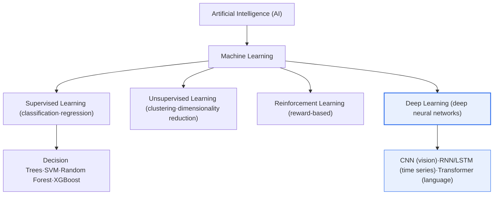

# Difference Between Machine Learning and Deep Learning

## 1. Overview

### A. Definition
> **Machine learning** is a collective term for AI techniques that perform prediction, classification, and clustering by **learning rules and patterns on their own from data**, rather than having humans explicitly program every rule.
>
> **Deep learning** is a **sub-field of machine learning** that uses **multi-layer artificial neural networks (deep neural networks, DNNs)** to automatically learn features hierarchically, from low-level to high-level, directly from raw data.

### B. Inclusion Relationship and the Essential Difference
The relationship between the two concepts follows the inclusion structure **AI ⊃ machine learning ⊃ deep learning**, with deep learning being a subset of machine learning. Therefore the question "which is superior, machine learning or deep learning?" does not hold; more precisely, one should ask "within the larger framework of machine learning, under what conditions are traditional techniques versus deep neural network techniques each advantageous?"

The single most decisive difference between the two is **"who creates the features?"** In traditional machine learning, humans must draw on domain knowledge to design "which variables are important for prediction." This is called **feature engineering**, and most of a model's performance hinges on the quality of this stage. For example, to classify a photo of a cat, humans used to have to numerically define features such as "ear shape, number of whiskers, position of the eyes." In other words, the success or failure of traditional machine learning depended on "how good the features a human extracts are."

By contrast, in deep learning, when you feed in the raw data (e.g., the pixels of an image) as-is, **the layers of the neural network discover features on their own**. The early layers learn low-level features such as lines and edges, the middle layers learn partial shapes such as eyes and ears, and the later layers learn high-level concepts such as a cat's face. This ability to learn the representation itself from data is called **representation learning**, and it is the fundamental principle behind the revolution deep learning brought to unstructured data such as images, speech, and natural language.

### C. Background and Necessity
The artificial neural networks and backpropagation concepts at the root of deep learning were already established in the 1980s, but they long failed to become practical. This was because (1) there was insufficient data to train on, (2) there were no computing resources to train multi-layer networks, and (3) as layers grew deeper, the **vanishing gradient** problem, in which gradients disappear, made training itself difficult.

These three barriers collapsed simultaneously in the 2010s, and deep learning exploded. First, **large volumes of data** accumulated through the internet, mobile, and sensors (e.g., the roughly 14 million labeled images of the ImageNet dataset); second, **GPU parallel computation** made large-scale matrix operations feasible; and third, **algorithmic innovations** (the ReLU activation function, Dropout, Batch Normalization, and the 2017 Transformer architecture) solved the vanishing gradient and overfitting problems. Starting from the 2012 ImageNet competition, where deep learning (AlexNet) dramatically lowered the error rate, this three-way combination produced human-level performance in images, speech, and natural language.

## 2. Layered Structure and the Technology Landscape

The concept map below shows the inclusion relationship of AI–machine learning–deep learning and the representative techniques of each layer. Machine learning is in turn divided by learning method into supervised, unsupervised, and reinforcement learning.

### A. The Traditional Machine Learning Pipeline
Traditional machine learning consists of clearly separated stages. It follows the flow of raw data collection → **preprocessing and feature engineering (human-driven)** → model training → evaluation → deployment, and among these, feature engineering is both the bottleneck and the core of performance. For example, in fraudulent-transaction detection, a human must design and inject derived variables such as "the number of payments in the previous hour, the distance from the usual payment location."

The strength of traditional machine learning is that it **works even with little data**, and because models such as decision trees and logistic regression take the form of rules, **humans can interpret the basis of decisions**. Also, since it can be trained on CPUs alone, the infrastructure burden is small. In domains centered on structured (tabular) data—finance, manufacturing quality control, demand forecasting, etc.—boosting families such as XGBoost and LightGBM are still often superior or comparable to deep learning.

### B. The Learning Principle of Deep Learning
Deep learning absorbs the feature-engineering stage into the interior of the neural network. The flow below shows how a deep neural network repeatedly performs forward propagation (prediction) and backpropagation (error-based weight updates) to learn feature representations on its own.

Learning in deep learning is the process of computing the difference between the prediction and the correct answer (the loss), sending that error back from the output layer toward the input layer (backpropagation), and adjusting the weights of each layer little by little via **gradient descent**, repeated millions to billions of times. The deeper and wider the layers, the greater the expressive power, but the more massive the data and computation required for training. For this reason, deep learning effectively presupposes high-performance hardware such as **GPUs and HBM (high-bandwidth memory)**.

### C. Representative Deep Learning Architectures and Their Applications
Deep learning uses specialized architectures depending on the form of the data. **CNNs** (convolutional neural networks) capture local patterns and are used for vision and medical image analysis; **RNNs/LSTMs** handle sequential information and are used for time series and speech; and **Transformers** use the attention mechanism to process the entire context in parallel and are used for natural language and large language models (LLMs). In particular, the Transformer, introduced in 2017, has become the common foundation of today's GPT and BERT families of large language models, making it the decisive architecture that ushered deep learning into the era of generative AI.

The reasons each architecture is strong on particular data can also be explained from the perspective of representation learning. Because a CNN shares filters (kernels) across the entire image, it automatically learns **translation invariance**—the principle that "the same pattern is the same feature regardless of position"—making it overwhelmingly superior to the old way of humans designing pixel features. RNNs/LSTMs feed the output of a previous time step back into the next time step's input to remember **temporal context**, but they had the limitation that the vanishing gradient recurred over long sequences; the Transformer's attention overcame this by computing the relationships among all word pairs in a sentence in parallel at once, simultaneously improving long-range dependency handling and training speed. In this way, the history of deep learning's development can be understood as the evolution of "how to make the neural network itself represent a given data structure well."

### D. Differences in Development and Operations
The two approaches also diverge in their development and operations (MLOps) methods. Traditional machine learning iterates feature engineering–model selection–hyperparameter tuning in relatively short cycles, and because training is light, reproduction and debugging are easy. Deep learning, by contrast, requires a far heavier pipeline: large-scale distributed training, GPU cluster scheduling, experiment tracking, versioning of large volumes of data, and so on. Therefore, adopting deep learning must consider not just the choice of algorithm but the overall readiness of data, infrastructure, and operational systems; if this preparation is insufficient, even good performance easily fails to stabilize into a real service.

## 3. Detailed Comparison and Cases

Machine learning and deep learning diverge not only in their feature-extraction methods but across data, resources, interpretability, and development methods overall. That difference is not one of simple superiority but of suitability depending on **the nature of the problem (type/volume of data, need for explanation)**. Below, for each item, we explain both "why the difference arises" and "what it means in practice."

### A. Differences in Data Volume and the Performance Curve
Traditional machine learning tends to plateau gently in performance once data exceeds a certain level, because the expressive power of human-made features has an upper bound. By contrast, deep learning exhibits the **scaling law**, whereby performance keeps improving as model size and data grow together, which is the theoretical basis for large language models developing in the direction of scaling up data and parameters. However, when data is scarce—on the order of a few thousand records—deep learning falls into overfitting and becomes inferior to traditional machine learning. Therefore, "the volume of available data" becomes the first-order criterion that distinguishes the two approaches.

### B. The Trade-off Between Resources/Cost and Interpretability
Deep learning's high performance is bought at the cost of GPUs, power, and training time. Training and serving millions to billions of parameters requires substantial infrastructure, which leads directly to a total cost of ownership (TCO) burden. At the same time, because the parameters are intricately entangled, the model becomes a black box whose decision basis is hard for humans to trace, which becomes a barrier to adoption in domains where regulation, audit, and accountability matter. Conversely, traditional machine learning has low cost and is easy to interpret in the form of rules, so it retains an advantage in areas that require "explainability, even at somewhat lower accuracy."

| Category | Traditional Machine Learning | Deep Learning |
|---|---|---|
| **Feature extraction** | Designed by humans (feature engineering) | Learned automatically by the model (representation learning) |
| **Data volume** | Feasible with relatively little (thousands to tens of thousands) | Large amounts needed (hundreds of thousands to hundreds of millions) |
| **Compute resources** | Low (CPU-feasible) | High (GPU/HBM effectively required) |
| **Training time** | Short | Long (hours to weeks) |
| **Representative models** | Decision Trees·SVM·Random Forest·XGBoost | CNN·RNN/LSTM·Transformer |
| **Interpretability** | Relatively high (rule form) | Low (black box) |
| **Suitable data** | Structured·small-scale | Unstructured (images·speech·natural language) |

Each item in this table is causally entangled with the others. The reason deep learning demands large volumes of data is that, instead of being given features by humans, it must statistically find features on its own from a vast number of examples. Because the parameters reach the millions to billions, the data and computation to support them grow, and as a result it becomes a **black box** whose reasoning "why it made a given decision" is hard for humans to trace. Conversely, traditional machine learning, since humans refine the features for it, can be trained with little data and is easy to interpret due to its simple model structure, but on unstructured data it runs into a performance ceiling because it is hard for humans to extract good features.

### C. Development Productivity and Maintenance Perspective
In traditional machine learning, the meaning of features is clear, so it is easy to pinpoint the cause of errors and easy to diagnose which variables are affected when the data distribution shifts. In deep learning, it is difficult to determine whether performance degradation lies in the data, the architecture, or the hyperparameters, so a great deal of time goes into experimental tuning. Therefore, the lower an organization's data-science maturity, the more practically valid it is to take a staged approach: quickly validate value with traditional machine learning first, then expand into deep learning once data and infrastructure are in place.

The selection criteria can be summarized with **three concrete cases**. First, bank credit scoring involves thousands to tens of thousands of structured records, and it must, for regulatory reasons, explain "why the loan was rejected," so traditional machine learning such as logistic regression and XGBoost is suitable. Second, the task of detecting lesions in hundreds of thousands of chest X-rays involves unstructured pixel data and is data-rich, so CNN-based deep learning is overwhelmingly superior. Third, automated response to customer inquiries hinges on understanding natural-language context, so a Transformer-based LLM is suitable. In other words, a practical decision rule emerges: if the data is structured and small in volume and explanation is needed, use traditional machine learning; if the data is unstructured and large in volume and performance is the top priority, use deep learning.

## 4. Deep Dive — Interpretability, Transfer Learning, and Foundation Models

The practical spread of deep learning is rapidly complementing its weaknesses through two recent trends, which should be addressed together from a professional-engineer perspective.

First is **explainable AI (XAI)**. In heavily regulated areas such as finance, healthcare, and the public sector, it is difficult to use "accurate but unexplainable" deep learning as-is. To compensate, techniques are used such as **LIME and SHAP**, which explain post hoc how much each input variable contributed to a particular prediction, and **Grad-CAM**, which visualizes the region of an image the model focused on. Coupled with the trend of regulations such as the EU AI Act imposing an explanation obligation on high-risk AI, interpretability is becoming an essential requirement for adopting deep learning.

Second are **transfer learning and foundation models**. The "large data and massive computation" problem that was once deep learning's barrier to entry has been greatly eased by the approach of taking a general-purpose model that has been pre-trained at large scale and **fine-tuning** it with a small amount of domain data. For example, a vision model pre-trained on hundreds of millions of images, or a large language model, can be retrained with only hundreds of records from a particular hospital to achieve practical performance. This is spreading deep learning from the exclusive province of a few big-tech firms to a technology that ordinary enterprises can also use, and together with **AutoML** (automated model search), it is blurring the boundary between the development methods of traditional machine learning and deep learning.

## 5. Considerations and Implications (Professional-Engineer Perspective)

1. **Problem-characteristics-based technology selection strategy**: One must guard against the misconception that deep learning is always superior. On structured, small-scale data, traditional machine learning (especially the boosting family) is faster and more accurate and even provides interpretation. The key is to select based on data type, volume, and the need for explanation.

2. **The trade-off between interpretability and regulatory compliance**: Performance (deep learning) and explainability (traditional ML) often conflict, so in high-risk, regulated areas one must explicitly manage the trade-off, for example by combining XAI techniques or prioritizing interpretable models.

3. **Data/infrastructure investment and TCO**: Deep learning has a large total cost of ownership (TCO)—GPU/HBM, power, MLOps pipelines, etc.—so a strategy of controlling cost through transfer learning, lightweighting (quantization, pruning), and cloud usage is needed.

4. **Data governance and bias management**: Both techniques learn the biases in the training data as-is, so a governance framework that includes data quality, representativeness, and privacy protection, plus continuous performance monitoring (responding to data drift), is essential.

5. **Related technologies and organizational capability**: The effectiveness of deep learning depends on MLOps (automated retraining and deployment), generative AI (LLM) utilization, and a collaboration framework between domain experts and data scientists, so beyond the choice of algorithm, securing organization-wide AI operations capability must also be considered.

## References
- Krizhevsky et al., "ImageNet Classification with Deep CNNs" (AlexNet, NeurIPS 2012): https://papers.nips.cc/paper_files/paper/2012/hash/c399862d3b9d6b76c8436e924a68c45b-Abstract.html
- Vaswani et al., "Attention Is All You Need" (Transformer, 2017): https://arxiv.org/abs/1706.03762
- EU AI Act (transparency and explanation obligations for high-risk AI): https://artificialintelligenceact.eu/

---

> **In one line**: Deep learning is a subset of machine learning; unlike traditional machine learning where humans design the features, *deep neural networks learn features hierarchically and automatically (representation learning)*, and while it demands large data and GPUs and has low interpretability, it excels on unstructured data—so it should be selected to fit problem characteristics such as data type, volume, and the need for explanation, and its weaknesses are being complemented by XAI and transfer learning.
