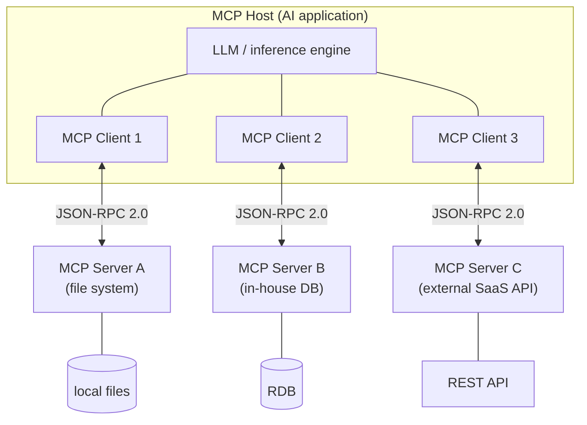
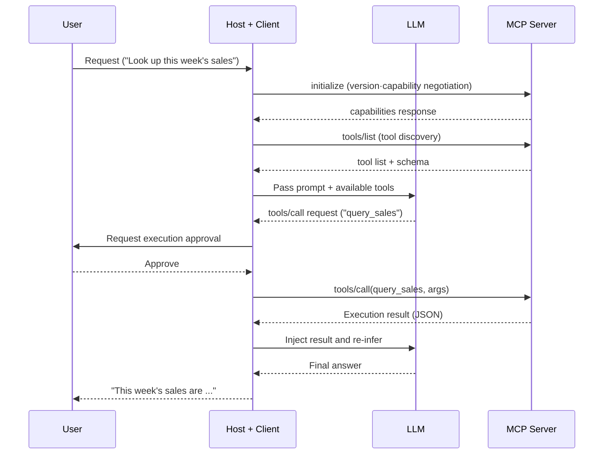

# MCP (Model Context Protocol)

## 1. Overview

> **Definition**: MCP (Model Context Protocol) is an open protocol proposed for connecting LLM-based AI applications to external context such as tools, data, and prompts in a **standardized way**. Operating on top of the JSON-RPC 2.0 message specification in a **Host–Client–Server** structure, it is a "unified interface for AI."

As generative AI has been put into real-world work, the biggest bottleneck has not been the performance of the model itself but **the absence of a way for the model to safely access an enterprise's internal data, systems, and tools**. An LLM does not know information after its training cutoff (a knowledge gap) and is isolated from in-house DBs, files, SaaS, and internal APIs, so on its own it cannot fulfill a request like "summarize the meeting minutes and create a ticket in Jira." Traditionally, to solve this, each application defined its own function-calling schema and implemented a separate connector for each data source, which gave rise to the so-called **M×N integration problem**. That is, to connect M AI applications with N tools, one must build M×N custom integrations from scratch every time, and when a single tool changes, every application using it must be fixed—a maintenance nightmare.

MCP solves this problem with a **"standard port," likened to USB-C**. A tool provider implements an MCP server just once, and every MCP-supporting AI application (Host) can reuse it; and an AI-application developer only needs to embed an MCP client to connect instantly to the ecosystem's many servers. As a result, integration complexity is reduced **from M×N to M+N**, and because the coupling between tools and models is loosened, each can evolve independently. Thanks to this openness, MCP is rapidly spreading not as a particular vendor's product but as a de facto integration standard commonly adopted by many IDEs, agent frameworks, and commercial assistants.

MCP's characteristics can be summarized as follows. First, it is an **open, model-agnostic standard** not tied to any specific LLM or vendor. Second, it guarantees interoperability through a clear message specification based on **JSON-RPC 2.0** and through capability negotiation. Third, it standardizes not only tools but all three elements of context—**resources (data) and prompts (templates)** as well. Fourth, it **separates the transport layer** into local (stdio) and remote (HTTP), making it flexible with respect to deployment form.

## 2. The Overall MCP Structure and Its Components

MCP consists of three layers: the **Host**, the AI application that faces the user; the **Client**, which maintains a 1:1 session with a single server inside the Host; and the **Server**, which exposes the actual tools and data. The Host creates multiple Clients and connects them in parallel to different Servers, and each Client-Server pair forms an independent security boundary.

**A. Host** — The Host is an **AI application that the end user interacts with directly**, such as Claude Desktop, an IDE like Cursor or VS Code, or an autonomous agent. It orchestrates LLM calls, provides the consent UI to the user, and manages the lifecycle of multiple Clients from creation to termination.

The Host's core responsibility lies in being the **Policy Enforcement Point** for security. To keep the model from indiscriminately invoking the tools a server exposes, it is the Host's role to obtain user confirmation before actual execution or to block it according to policy. For example, if the model tries to invoke a "delete file" tool, the Host asks the user for approval, and without approval the request is not forwarded to the server. This structure—placing servers and models outside the trust boundary and concentrating control in the Host—is the starting point of the MCP security model.

**B. Client** — The Client is an intermediary embedded inside the Host that **maintains a stateful session with a single Server**. At connection initialization, it performs **capability negotiation**, exchanging protocol version and supported features; it discovers the list of tools, resources, and prompts the server provides; and it forwards the tool calls the model decides on to the server, processing the results and notifications and returning them to the model.

The constraint that a Client and a Server must correspond 1:1 is not a mere implementation rule but an **isolation mechanism**. Because servers of different trust levels do not share the same session, it structurally blocks a low-trust external server from accessing the context or credentials of an in-house DB server. This forms the first line of defense against the confused-deputy risk that arises when combining multiple servers.

**C. Server** — The Server is an **independent process** that encapsulates specific functionality and exposes it through a standard interface. Anything—an in-house file system, a database, a Git repository, an external payment API—can be wrapped as a server; the server only needs to manage the authentication and authorization of the system it wraps, and it need not know which model attaches to it.

Thanks to this encapsulation, a server is reused and deployed independently of any particular AI application, and even if the tool logic changes, the consuming side need not be fixed as long as the interface (schema) is maintained. The server provides three categories of capabilities (primitives) to the client—**tools, resources, and prompts**—and because the distinction among these three elements is central to MCP's design, we elaborate on it separately below.

The responsibilities and controlling parties of MCP's elements can be summarized in a table as follows. Note, however, that the table is only a summary; the essence of why each element is separated this way is the explanation in the paragraphs above.

| Component | Role | Controlling party | Representative examples |
|---|---|---|---|
| Host | LLM orchestration·consent·session management | User | Claude Desktop, Cursor, autonomous agents |
| Client | 1:1 session with server·capability negotiation·message relay | Host | Connector module inside the Host |
| Server | Exposing tools·resources·prompts | Server developer | File-system/DB/GitHub server |

## 3. The Server's Three Primitives and the Communication Procedure

**A. Tools — model-controlled** — Tools are **executable functions** that the model invokes at its own judgment. Each tool has a name, a description, and an input schema (JSON Schema), and the model decides which tool to call with which arguments based only on this metadata. Therefore a tool's natural-language description is not merely documentation but closer to an **executable specification** that directly influences the model's choice.

Tools often entail side effects that change state, such as "send email," "run SQL," or "execute code." For this reason, MCP recommends the **human-in-the-loop (HITL)** pattern, which keeps the model from unilaterally committing tool execution and has the Host obtain user approval just before execution. For example, if a `create_issue(title, body)` tool is exposed, one can design it so that the model *proposes* creating an issue from a meeting summary, but the actual creation happens only when the user presses an approval button. This separation secures both the convenience of automation and controllability at once.

**B. Resources — application-controlled** — Resources are **data provided to the model as read context**, such as files, DB records, logs, and images. Each resource is identified by a URI and is fundamentally distinguished from tools in that it has no side effects. If a tool is an "action," a resource is "knowledge."

What matters is that which resources go into the context is decided not by the model but by the application (or the user). This is a design meant to **prevent unnecessary information exposure and context pollution** by having the application control the scope of data the model can access. For example, when a user selects a particular design document and attaches it to the conversation, the Host reads that resource from the server and inserts it into the prompt, while documents that were not selected do not enter the model's field of view. This approach also combines naturally with the retrieve-and-inject flow of RAG.

**C. Prompts — user-controlled** — Prompts are **reusable templates and workflows** predefined and provided by the server. Exposed to the user in the form of slash commands or buttons, they standardize complex and repetitive instructions. For example, a "code review" prompt provides a template containing the review perspectives (security, performance, readability) and the output format, inducing reviews of consistent quality every time.

In this way, **clearly dividing the controlling party (model/application/user) into three elements** is a core design that increases MCP's safety and predictability. The principle that high-side-effect actions are proposed by the model but approved by the user, that the scope of data exposure is controlled by the application, and that repetitive workflows are explicitly invoked by the user is embedded at the protocol level, so the balance between autonomy and control becomes part of the standard rather than a matter of individual implementation discretion.

Communication proceeds on top of JSON-RPC 2.0 in the order of initialize → discovery → execution. The sequence below is a representative flow of a tool call.

The transport layer is chosen according to the deployment form. **stdio** brings up the server as a local process on the same machine as the Host and communicates over standard input/output; with low latency and no network exposure, it is suitable for accessing local files and development tools. **HTTP-based transport** (with streaming support) is used when connecting to a remote server over the network, and the recent specification aims for a **stateless core** so that it scales even on ordinary HTTP infrastructure (load balancers, serverless) without maintaining separate state. The characteristics and control points of the two transports are as follows.

| Category | stdio (local) | HTTP (remote) |
|---|---|---|
| Placement | Same host as the Host, child process | A separate server across the network |
| Latency/exposure | Low / not network-exposed | Relatively high / public touchpoint |
| Authentication | Local process trust | OAuth 2.1/OIDC token |
| Suitable cases | File system·IDE·terminal | SaaS·shared in-house API |

For remote servers, an authorization scheme aligned with OAuth 2.1/OIDC is included in the specification, so token-based access control and standard credential flows can be applied. This is an attempt to converge on a standard the problem of each server implementing authentication and authorization differently in remote deployments, and it is directly linked to the remote-server security vulnerabilities addressed later.

## 4. Comparison with Similar Concepts and Application Cases

MCP is often confused with function calling, RAG, and traditional APIs, but the layer of the problem it solves is different. **Function calling** is a *model feature* that makes a particular model output its tool-call intent in a structured form, whereas MCP is a **protocol layer that standardizes how to discover, connect, and execute those tools**. In other words, MCP does not replace function calling; it standardizes the tool supply chain on top of it. **RAG** is a *technique* that augments knowledge by inserting retrieved documents into the prompt, and it is complementary in that MCP's resource primitive can become RAG's data-supply path. Compared with a **traditional REST API**, if REST is a general-purpose interface for humans and programs, then MCP is decisively different in being an interface **designed for the LLM to autonomously discover and use tools, with capability discovery and context semantics built in**.

| Category | MCP | Function Calling | Traditional API (REST) |
|---|---|---|---|
| Layer | Integration protocol (standard) | The model's tool-call feature | General-purpose service interface |
| Discovery | Runtime dynamic discovery | Predefined schema | Document-based, static |
| Target | LLM agents | A single model | Humans·programs |
| Reusability | M+N (high) | Per-app individual definition | Per-app individual integration |

In the comparison with REST APIs in particular, one more point should be noted. Even if a well-made REST API already exists, throwing it directly at an LLM means the model must interpret dozens of endpoints and the meaning of parameters in the prompt every time, and reliability suffers because authentication, pagination, and error handling are all inconsistent. An MCP server plays the role of an "adapter" that **reconstructs this REST API into a small number of meaningful tools that the model can easily understand** and standardizes the discovery, authentication, and error conventions. That is, it is accurate to understand that MCP does not replace an existing API but places an **LLM-friendly layer** on top of it.

The practical implication this difference creates is the **"reuse of a server built once."** For example, if an organization builds a single MCP server that exposes in-house policy documents, developers use **the very same server** in their IDE assistant, planners in a desktop chatbot, and the operations team in an automation agent. Representative concrete application cases include (1) **software development**, where an IDE agent connects to GitHub, file-system, and terminal MCP servers to perform everything from looking up issues to modifying code and running tests; (2) **enterprise knowledge search**, where an in-house wiki, tickets, and DB are each wrapped as servers so that a single assistant can cross-query multiple knowledge sources; and (3) **business automation**, where calendar, messenger, and CRM servers are combined to construct a multi-step workflow such as "schedule a customer meeting and record a summary in the CRM." All three cases share the benefit that servers are reused independently, keeping integration cost linear (M+N).

## 5. Deep Dive: Recent Trends, Security Threats, and the Standard's Response

Since MCP was released in late 2024, the specification has been revised rapidly, and elements **needed for enterprise operations**—remote-server authorization (OAuth 2.1-aligned), HTTP transport with streaming support, a stateless core, server-rendered UI (MCP Apps), and long-running Tasks extensions—are being continually reinforced. That said, because the specification is actively evolving, it is advisable to check the official spec for the details of specific-version features when applying them.

On the ecosystem side, a variety of reference servers—file system, Git, database, search, etc.—have been released, and as **registries** for registering and searching servers and client support in many IDEs and agent frameworks increase, a user experience of "attaching a tool as if installing a server" is taking hold. This has the potential to reproduce, in the domain of tool integration, a network effect similar to how package managers once explosively increased library reuse. However, the fact that unverified servers can easily circulate leads directly to security problems.

The point to note is **security**. Standardized tool connection creates a new attack surface in proportion to its convenience. The major threats raised in academia and industry are as follows.

- **Tool poisoning / prompt injection**: An attack in which a server plants malicious instructions in a tool's description or return value to hijack the model's behavior. Since the model trusts the description as-is, a seemingly normal tool can internally induce data exfiltration.
- **Excessive privilege and the confused deputy**: In the process of the model combining the capabilities of multiple servers, unintended privilege escalation or cross-server data leakage occurs. A representative approach is inducing a low-trust server to intercept another server's results.
- **Remote-server authentication and token-management vulnerabilities**: Cases of weak authentication, token exposure, and excessive scope have been observed in remote MCP servers actually deployed. If a token is stolen, the entire backend the server wraps is exposed to risk.

In response, the following are recommended: **user approval at the Host (HITL)**, restricting tool and resource scope according to the principle of least privilege, a whitelist of trusted servers verified by signature and provenance, audit logging, and minimizing OAuth-based token lifetime and scope. In other words, MCP merely provides "a standard for connection"; safety depends on the **zero-trust control design** of the Host and server operators.

## 6. Considerations and Implications (Professional-Engineer Perspective)

- **Standard-adoption strategy**: MCP has great adoption value as an open standard that reduces vendor lock-in, but because the specification is evolving, an organization should set **version-compatibility and backward-compatibility policies** and pursue controlled proliferation by establishing an internal standard server catalog and gateway.
- **Security/governance trade-off**: The productivity of automatic tool connection and the expansion of the attack surface conflict. One should take **least privilege, user approval, server-trust verification, and audit** as defaults and design the balance between convenience and safety to fit the organization's risk appetite, for example by enforcing an approval gate for sensitive tools.
- **Combination with related technologies**: MCP's effect is maximized when combined with RAG (resource supply), agent frameworks (tool orchestration), API gateways (authentication·rate limiting), and observability (call tracing). It should be positioned not as a standalone technology but as **the connection layer of AI platform architecture**.
- **Outlook and response**: Once tool and data integration is standardized, competitiveness shifts from "whether one is connected" to **how many high-quality servers (domain knowledge·control) one secures and operates**. Organizations need to turn their internal data and work into assets as MCP servers and to prepare registry and server quality/security certification schemes proactively.
- **Domestic public-sector/enterprise application perspective**: In network-segregation and privacy environments, the requirements for cross-border transfer, token management, and logging of remote servers may conflict with regulations (the Personal Information Protection Act, CSAP, etc.), so prioritizing on-premises stdio servers and combining it with controls on data export should be reviewed together.

## References
- Model Context Protocol, Architecture overview — https://modelcontextprotocol.io/docs/2026-07-28/learn/architecture
- Model Context Protocol Blog, "The 2026-07-28 Specification" — https://blog.modelcontextprotocol.io/posts/2026-07-28/
- CodiLime, "Model Context Protocol (MCP) explained" — https://codilime.com/blog/model-context-protocol-explained/
- MCPSecBench: A Systematic Security Benchmark for Model Context Protocols (arXiv:2508.13220) — https://arxiv.org/pdf/2508.13220

---
> **In one line**: MCP is an "USB-C for AI" open protocol that standardizes the connection between LLM applications and external tools, data, and prompts via a Host–Client–Server structure and JSON-RPC 2.0, reducing the M×N integration problem to M+N; its safety depends on the control design of the Host and servers, such as least privilege and user approval.
