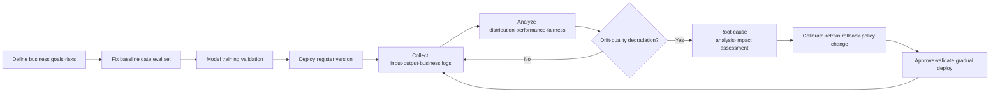
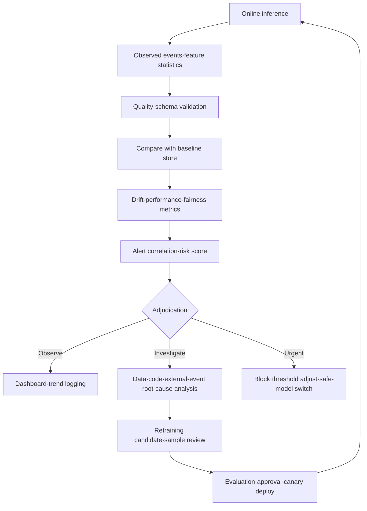

# AI Model Drift and Data Drift Management

## 1. Overview

> **Definition:** AI model-drift management is a whole-lifecycle management activity that continuously observes the data drift, concept drift, prediction drift, and model-performance degradation that occur when the inputs, ground truth, predictions, and business context of the operating environment diverge from those at training time, analyzes their causes, and responds through retraining, calibration, rollback, or changes to business policy.

A machine learning model applies statistical relationships extracted from past data to present work. However, customer behavior, seasonality, sensor environments, policy, competitive situations, and attack patterns keep changing. Even if the training data was representative at the time, once time passes after deployment, the input distribution may shift or the relationship between input and ground truth may change, so the model's decisions can become stale.

Drift differs from a mere fault. Even if the server responds normally and latency is within thresholds, a recommendation model may keep recommending only old products, or a fraud-detection model's miss rate may rise. In other words, a separate observation layer is needed between the system state that traditional APM measures and the state of AI quality.

Also, the mere fact that the input distribution has changed must not be taken to mean that model performance has degraded. It may be a normal seasonal change, or the model may generalize well even under the new distribution. Conversely, even if the input distribution stays nearly the same, performance can drop if fraud methods or policy change and thus the input-to-ground-truth relationship changes.

Therefore, a professional-engineer answer should treat drift not as a single-threshold problem but should connect the definitions of baseline data and observed data, label delay, statistical tests, business impact, and response authority and approval procedures. The goal is not to generate many alerts but to identify meaningful changes and execute appropriate actions.

## 2. Background of Occurrence and Objects of Management

Operational data enters through a different path than training data. Whereas training data is a cleaned, labeled, reviewed snapshot of the past, operational data includes real-time events, missing values, new categories, and strategic user behavior. A schema change in the data-collection system or a change in feature-computation logic alone can shift the distribution.

The causes of drift can be divided into natural changes, system changes, and adversarial changes. Natural changes include seasonality, demographic shifts, and economic fluctuations. System changes include sensor replacement, app UI changes, ETL errors, and changes to feature definitions. Adversarial changes include a fraud attacker's change of strategy and input manipulation to bypass the model.

The objects of management are not limited to input features. Only by looking together at labels and prediction results, performance by fairness group, user feedback, cost and latency, policy-violation rate, and the rate at which humans corrected the model's output can one explain actual business quality.

| Object of observation | Verification question | Representative signals | When data is available |
|---|---|---|---|
| Input data | Has the distribution diverged from training/baseline data? | Mean, variance, category ratios, missing rate | Just before/after inference |
| Feature relationships | Have relationships and correlation structure among features changed? | Correlation coefficients, covariance, embedding clusters | Batch·streaming |
| Ground-truth labels | Have the ratios and distribution of actual outcomes changed? | Class ratios, delayed-label quality | After work completes |
| Prediction results | Has the distribution of model outputs shifted? | Score·class·rejection rate | At inference time |
| Performance | Is quality against actual ground truth maintained? | Accuracy, F1, AUC, RMSE | After labels arrive |
| Business context | Do the model's decisions fit the objective? | Conversion rate, loss, complaints, manual-intervention rate | Linked to business systems |

The items in the table above are not interchangeable. Performance may be maintained even as input data changes, and the label relationship may change even as inputs are maintained. Also, high AUC does not guarantee recall for a particular customer segment, so overall metrics and per-group metrics must be recorded together.

## 3. Drift Types and How They Work

### 3.1 Data Drift and Covariate Drift

Data drift is the phenomenon in which the marginal distribution of input variables diverges from the baseline period. Covariate drift specifically refers to the case where the input distribution \(P(X)\) changes but the conditional distribution \(P(Y|X)\) does not. For example, if the age range of visitors to an online shopping mall has changed but the relationship between age and purchase remains the same, it can be viewed as covariate drift.

This change may be a risk to the model or an opportunity. If a new customer segment has flowed in and it is a category the model was not trained on, performance may worsen; but if the model generalized sufficiently, a simple alert only increases the operations team's fatigue. Therefore, distributional differences and validation-label-based performance must be analyzed together.

For continuous variables, one can apply mean, variance, quantiles, the Wasserstein distance, the KS test, and so on. For categorical variables, one can use frequency comparison and the chi-square test, and for the overall distribution, PSI or Jensen-Shannon divergence. When the sample size is very large, even small differences become statistically significant, so effect size and business thresholds should be set together.

### 3.2 Concept Drift

Concept drift is the phenomenon in which the relationship between input and ground truth changes; the essence is that \(P(Y|X)\) changes. A payment with the same transaction characteristics may have been legitimate in the past and be a stolen card now. A change in fraudsters' behavior or a change in regulatory policy rapidly invalidates the relationships the model learned.

Concept drift is easy to confirm directly when ground-truth labels exist. However, in many cases—financial approval outcomes, actual customer churn, equipment failure—labels arrive late or are not observed. In such cases, one combines proxy metrics with lagging labels and, once labels are secured, retrospectively evaluates the accuracy of past alerts.

The early signals of concept drift appear in the prediction-outcome relationship rather than in the input distribution. If prediction scores are normal but actual losses or complaints increase, or if the positive ratio in the same score band changes, the conditional relationship may have changed. Do not always fix the baseline period at training time only; also compare against a recent normal operating period.

### 3.3 Prediction Drift and Label Drift

Prediction drift is the phenomenon in which the distribution of model outputs changes. Examples are the positive-decision rate of a classification model, the prediction-value quantiles of a regression model, and the rejection rate, response length, and topic ratios of a generative model. Prediction drift can be computed quickly, but output change alone cannot conclusively determine the cause of accuracy degradation.

Label drift, or prior-probability drift, is the phenomenon in which \(P(Y)\) changes. Examples include the actual positive ratio rising in epidemic-disease prediction, or the purchase ratio increasing during a discount period at a shopping mall. A change in label ratio may appear together with a change in input representativeness, so each drift should be observed independently.

Drift types are not a mutually exclusive classification. Input distribution and label distribution may change simultaneously, or a change in output distribution may originate in a feature-computation error. An operations center should not execute retraining based on the alert name alone but should investigate data lineage, code deployments, policy changes, and external events together as candidate causes.

| Type | What changes | Label required | Representative causes | Priority response |
|---|---|---:|---|---|
| Data drift | Input \(P(X)\) | No | Customer-segment·season·sensor changes | Distribution check·sample validation |
| Covariate drift | Input; relationship assumed maintained | No | Change in inflowing population | Check generalization performance |
| Concept drift | Relationship \(P(Y|X)\) | Usually required | Attack·policy·business change | Label analysis·retraining |
| Prediction drift | Output \(P(\hat{Y})\) | No | Input change·threshold change | Output·threshold check |
| Label drift | Actual outcome \(P(Y)\) | Yes | Event frequency·market change | Base-rate·calibration check |
| Schema drift | Data structure·type | No | ETL·API-contract change | Pipeline block·recovery |

## 4. Lifecycle and Baseline Design

Drift management is not an add-on feature that begins after a model is deployed. One must define the tolerable performance degradation and label delay at the requirements stage, fix the baseline data and evaluation set at the training stage, and connect the observation fields at the deployment stage. Only when operational-stage alerts lead to retraining and approval does it become closed-loop management.

A baseline is not a single number but a bundle of comparison rules. Store, along with the version, the feature distribution of the training data, the performance on validation data, the output distribution of the recent normal operating period, per-group quality, and business KPIs. If the baseline period is chosen wrongly, one may mistake seasonality for drift or train on already-contaminated operational data as if it were normal.

A baseline also needs an expiration period. If a long-operating model keeps being compared only against its initial training data, even a normal long-term trend will always trigger an alert. Run a training baseline and a recent-normal baseline in parallel, and use seasonal baselines or a rolling window—but keep a record of approval for baseline updates.

The collection logs should include the model version, feature version, input time, prediction time, prediction value, probability or confidence, inference path, business outcome, and label-arrival time. Do not unconditionally store the raw text of personal or sensitive information; protect it with tokenization, aggregation, and access control. One must consider that as observability increases, privacy risk increases along with it.

## 5. Detection Metrics and Analysis Methods

### 5.1 Statistical Distribution Comparison

PSI summarizes distribution shift by summing, per bin, the difference between the baseline ratio and the observed ratio together with the log ratio. It is easy to implement and explain, so it is widely used in operational dashboards, but it is sensitive to the binning method and the baseline distribution, and the same alert criterion cannot be applied across all business cases.

Jensen-Shannon divergence measures the symmetric difference between two distributions and can be used for comparing probability distributions. The Wasserstein distance is easy to interpret for changes in continuous variables from the perspective of the cost of moving the mass of a distribution. The KS test checks whether two continuous samples come from the same distribution, but it can judge even trivial differences as significant in large samples.

For categorical features, one uses the chi-square test and per-category ratio differences. When a new category appears or missing categories spike, it should be handled as a data-contract violation before statistical testing. When testing many features simultaneously, to reduce false positives from multiple comparisons, decide on effect size, correction method, and prioritization of important features.

### 5.2 Performance·Fairness·Business Metrics

Once labels are secured, compute not just accuracy but metrics that fit the business objective. For imbalanced classification, check precision·recall·F1·PR-AUC, and for errors with different costs, use expected loss and the confusion matrix. When probabilities are used for decisions, one should also examine the Brier score and calibration.

Even if the model's overall performance is maintained, per-group recall or false-positive rate may worsen. For groups requiring legal and ethical consideration—gender, age, region, disability status—review a minimum number of samples together with privacy protection, and do not over-segment groups so as to create re-identification risk.

Business metrics must be linked to model metrics. For a recommendation model, look not only at click-through rate but also at long-term retention and customer complaints; for a fraud model, look not only at detection rate but also at the blocking of legitimate customers and the cost of investigation. Defining the path by which a technical alert leads to business loss lets one rationally set retraining priorities.

| Measurement layer | Example metrics | Advantages | Cautions |
|---|---|---|---|
| Data | PSI, KS, JS, Wasserstein, missing rate | Fast monitoring without labels | Does not directly prove performance degradation |
| Model output | Class ratio, score distribution, entropy | Computable right after inference | Affected by thresholds·traffic changes |
| Model performance | F1, PR-AUC, RMSE, Brier | Directly evaluates quality | Label delay·cost |
| Fairness | Per-group TPR/FPR, gaps | Identifies affected groups | Requires group samples·legal criteria |
| Business | Loss, conversion, complaints, manual intervention | Explains management impact | External factors intermixed |
| Operations | Latency, error rate, cost, resources | Isolates system causes | Not the same as AI quality |

## 6. Detection·Adjudication·Response Architecture

Drift monitoring is composed of a combination of a collector, a baseline store, a statistics calculator, an alert engine, an analytics dashboard, and a response orchestrator. Batch models compute per time window, and real-time models use streaming aggregation and sampling. Even without keeping the raw text of every request, keeping the key statistics and trace IDs can reduce cost and privacy risk.

The alert engine must combine multiple signals rather than a single threshold. For example, if input PSI has risen but performance and business metrics are maintained, leave it in an observe state; if input change and per-group recall degradation appear simultaneously, escalate to an investigate state. In work with long label delay, separate leading and lagging indicators and mark the certainty of the alert.

Adjudication can be designed in four stages: notify, investigate, mitigate, and stop. Notify is the stage of logging trends and delivering them to the person in charge. Investigate is the stage of checking data quality, code changes, and external events. Mitigate is the stage of applying threshold adjustment, conservative policy, human review, and a switch to a safe model, and Stop is the stage of blocking high-risk automated decisions and rolling back to a previous version.

Response automation needs authority boundaries. It is one thing for a low-risk statistical alert to be automatically logged to a dashboard, and quite another for a high-risk model to be automatically retrained and put into customer-approval work. Separate the approver of retraining data, the model-release owner, and the rollback authority, and leave a rationale and result for every action.

## 7. Retraining·Calibration·Rollback Strategy

Retraining seems like the default response to drift, but it is not always the right answer. If the cause is a feature-pipeline error or a label error, retraining can re-inject the problem into a new model. First check the data contract, code changes, source systems, and label-generation rules, then evaluate the representativeness and quality of the training data.

Retraining data is not a binary choice between collecting only recent data or keeping only past data. Weight recency, seasonality, rare cases, and safety cases, and use a time-ordered split so that future information does not leak into past training. Determine the mixing ratio of new and existing data through validation of performance, fairness, and stability.

Online learning can adapt quickly but carries the risk of immediately learning contaminated data and anomalous events. In high-risk work, prioritize approved batch retraining and canary models, and if online updates are needed, place a data-quality gate and rollback-capable checkpoints.

Model calibration is a method of quickly reducing business risk by adjusting thresholds, calibration, and rule layers. However, changing a threshold changes precision and recall, per-group errors, and customer experience together, so before-and-after must be compared. Also specify whether the calibration is a temporary measure or a permanent policy, along with its expiration point.

Rollback is not the task of reverting the model file alone. Feature code, schema, baseline, model, policy, indexes, and deployment settings must be restored as a compatible release bundle. Before recovery, check what risk the previous version carries against current data, and re-confirm anomalies after recovery through staged traffic switching.

## 8. Comparison: Drift and Adjacent Concepts

Data-quality degradation often means a violation of the expected conditions of the data itself, such as missing values, format, range, or duplicates. Drift is the phenomenon in which the baseline distribution or relationship changes over time even though the data is formally valid. Quality validation is a prerequisite for drift monitoring, but the two are not the same metric.

Data skew emphasizes the mismatch between training and serving, while drift focuses on change according to time or operating conditions. If feature-computation code differs between training and serving, it is skew and can simultaneously create a subsequent distribution change. Therefore, in MLOps one places both skew checks and time-based drift checks.

Concept drift and data poisoning must also be distinguished. Concept drift is a phenomenon in which real-world relationships change without any attack intent, whereas data poisoning is when an attacker deliberately compromises the integrity of training/retrieval data. Because successful poisoning can look like drift, investigate security logs and data lineage together.

| Category | Perspective on change | Representative question | Response focus |
|---|---|---|---|
| Data-quality degradation | Validity·completeness | Do values obey the rules? | Pipeline block·cleaning |
| Data skew | Training-serving difference | Is the same feature computation used? | Code·schema consistency |
| Data drift | Input distribution change over time | Has the population changed? | Baseline·sample validation |
| Concept drift | Input-to-ground-truth relationship change | Does the same input yield a different outcome? | Label·retraining |
| Prediction drift | Output distribution change | Has the decision ratio changed? | Threshold·root-cause analysis |
| Data poisoning | Deliberate integrity attack | Who contaminated what? | Isolate·forensics·reproduce |

## 9. Case: A Hypothetical Online Payment Fraud-Detection Model

Suppose a hypothetical e-commerce company operates a model that computes fraud probability at the point of payment approval. At training time it detected mainly card-number theft, overseas IPs, and repeated-payment patterns, and it observes input and output distributions using the most recent 30 days of normal operating data. Fraud labels arrive about 14 days later, after card-issuer disputes and investigation results are reflected.

One month into operation, the ratio of overseas transactions rose from 8% to 18%, and the ratio of new mobile fingerprints also changed from 12% to 31%. An input-distribution alert was raised, but the overall approval rate and customer complaints were within the baseline range. In this case, first check the possibility of normal seasonality—an increase in overseas transactions during the vacation season—and do not immediately swap out the model.

When labels flowed in 14 days later, recall for a particular mobile-fingerprint group dropped from 92% to 71%, and losses due to misses turned out to have increased 18% over one week. At the same time, the actual fraud ratio in the same score band changed, making it a concept-drift candidate. The security team checks recent attack patterns and the change history of feature computation.

The investigation assumes that attackers were using split payments that look like normal payments combined with new devices, and that the model had not sufficiently learned the interaction of those features. First, switch the high-risk score band to additional human review, and temporarily apply the safe threshold of the existing model. This measure is a mitigation that reduces losses before retraining is complete; it is not evidence of performance improvement.

Retraining includes recent attack cases, past normal cases, seasonal validation sets, and the new mobile-fingerprint group. Block future information with time-ordered validation, and compare not only overall PR-AUC but also the recall of overseas, mobile, and new-customer groups and the blocking rate of legitimate customers. Process 10% first in canary traffic, then confirm business loss and complaints before full deployment.

| Stage | Observation·decision | Evidence | Control |
|---|---|---|---|
| 1. Detect | Distribution change in overseas-transaction·device features | Feature ratios·PSI trend | Seasonality comparison |
| 2. Confirm | Per-group recall degradation after labels arrive | Confusion matrix·loss | Concept-drift adjudication |
| 3. Mitigate | Switch high-risk cases to human review | Approval·rejection logs | Temporary threshold·safe policy |
| 4. Improve | Retrain including recent attack patterns | Time-ordered validation results | Data approval·model registration |
| 5. Deploy | Expand after 10% canary | Business KPIs·error rate | Approval·rollback plan |
| 6. Retrospective | Analyze detection delay and cost | MTTD·MTTR·loss | Baseline·feature improvement |

The important point in this case is that there was a 14-day label delay between the day the input alert occurred and the day the actual performance degradation was confirmed. The professional engineer must separate the alert time, adjudication time, mitigation time, and retraining-completion time, and manage the delays as service-level objectives.

## 10. Deep Dive: MLOps·LLMOps and the Latest Monitoring Perspective

NIST's discussion of post-deployment AI-system monitoring distinguishes among observing functionality, operability, and human factors, and holds that a feedback loop connecting pre-deployment evaluation and post-deployment observation is needed. This means moving away from putting only model metrics on a dashboard, toward also examining the usage context, user impact, and long-term change and uncertainty.

Google's machine learning operations guide emphasizes observing, per pipeline stage, the skew/drift of serving data relative to training data, prediction quality, and logs and alerts. Therefore, rather than merely keeping versions in the model store, a design that connects the traceability of data collection, serving, and business outcomes is important.

Cloud model-monitoring services usually compute a baseline distribution, then compare it against the operational distribution using a statistical distance or test result, and raise an alert when a threshold is exceeded. This function is useful for a quick start, but the organization must separately validate the representativeness of the baseline data, the sample size, label delay, and the business meaning of the thresholds.

In LLMOps, it is hard to explain answer quality by the drift of traditional input features alone. Observe together the topic and freshness of retrieved documents, retrieval hit rate, citation-of-evidence rate, response-rejection rate, response length, user feedback, tool-call failures, and cost and latency. Because generated results can be non-deterministic, combine a fixed evaluation set, model-based evaluation, human evaluation, and business outcomes.

Monitoring results must be linked to AI governance. Record baselines, limitations, and re-evaluation cycles in model cards and data cards, and place change-approval and incident-reporting procedures for high-impact systems. Operations that receive a drift alert yet take no action create the same risk as having no alert at all.

For expected exam questions, one can connect "causes of AI model performance degradation and MLOps monitoring measures," "data quality·AI trustworthiness·retraining governance," and "drift and evaluation in generative-AI operations." An answer is logical if it is structured in the order of type definitions, baselines·metrics, a concept map, a case, automation and human approval, and privacy·fairness·security implications.

## 11. Considerations and Implications

### 11.1 Balancing Statistical Significance and Business Significance

With many samples, even a small distributional difference becomes a significant result. Conversely, with few samples, a genuinely important change may not surface in a test. Do not take automatic action based on the statistic alone; use effect size, duration, business impact, and confidence intervals together.

### 11.2 Separating Baseline from Seasonality

Using a recent normal period as the baseline lets one adapt to seasonality, but it carries the risk of adopting an already-degraded period as normal. Store the training baseline, the recent-normal baseline, and the seasonal baseline together, and place update-approval and expiration policies.

### 11.3 Label Delay and Early-Warning Design

For work where ground-truth labels arrive late, look first at input·output·business proxies and validate alert accuracy with lagging labels. Do not express an early warning as if it were a confirmed-performance alert; distinguish states such as "investigation needed," "performance confirmation," and "urgent mitigation."

### 11.4 Safeguards for Automatic Retraining

Automatic retraining responds quickly to change but can amplify contaminated data and mislabels. Make an approved dataset, a reproducible pipeline, an independent validation set, a model registry, canary deployment, and immediate rollback mandatory conditions.

### 11.5 Simultaneous Protection of Privacy and Fairness

The more detailed the per-feature and per-group performance one stores, the more sensitive information may remain. Apply minimal collection, pseudonymization, aggregation, access rights, retention periods, and re-identification-risk assessment. Fairness evaluation, too, is not simply matching numbers but explaining in accordance with the business objective and legal and ethical criteria.

### 11.6 Distinguishing Security Attacks from Natural Change

If an attacker behaves like the normal distribution to evade the detector or manipulates feedback, a drift alert can become part of a security incident. Correlate data lineage, account activity, pipeline changes, external threat intelligence, and model metrics, and isolate suspicious data while preserving evidence.

### 11.7 Recoverability and Accountability

The versions of the model, data, feature code, and policy must be recoverable together, and it must be recorded which person approved mitigation and retraining on what grounds. Manage not only RTO and RPO but also alert-detection time, root-cause-analysis time, normalization time, and recurrence rate as AI operations performance indicators.

## 12. Strategy for Structuring the Exam Answer in One Line

Structure the exam answer in the flow of "definition and necessity → data·concept·prediction drift types → baseline and lifecycle concept map → statistical·performance·fairness·business metrics → detection·adjudication·response architecture → retraining·calibration·rollback → fraud-detection case → MLOps·LLMOps and governance → professional-engineer considerations."

## References

1. NIST, *Challenges to the monitoring of deployed AI systems*, https://nvlpubs.nist.gov/nistpubs/ai/NIST.AI.800-4.pdf
2. Google for Developers, *Productionization | Machine Learning*, https://developers.google.com/machine-learning/managing-ml-projects/production
3. Microsoft Learn, *Model monitoring in production - Azure Machine Learning*, https://learn.microsoft.com/en-us/azure/machine-learning/concept-model-monitoring?view=azureml-api-2
4. Google Cloud, *Introduction to Vertex AI Model Monitoring*, https://docs.cloud.google.com/gemini-enterprise-agent-platform/machine-learning/model-monitoring/overview

---

> **In one line**: AI drift management is whole-lifecycle governance that detects changes in inputs, relationships, outputs, and business context—accounting even for baselines and label delay—and connects them to verifiable retraining, calibration, and rollback.
