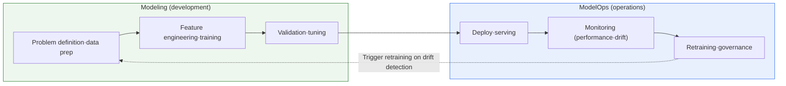
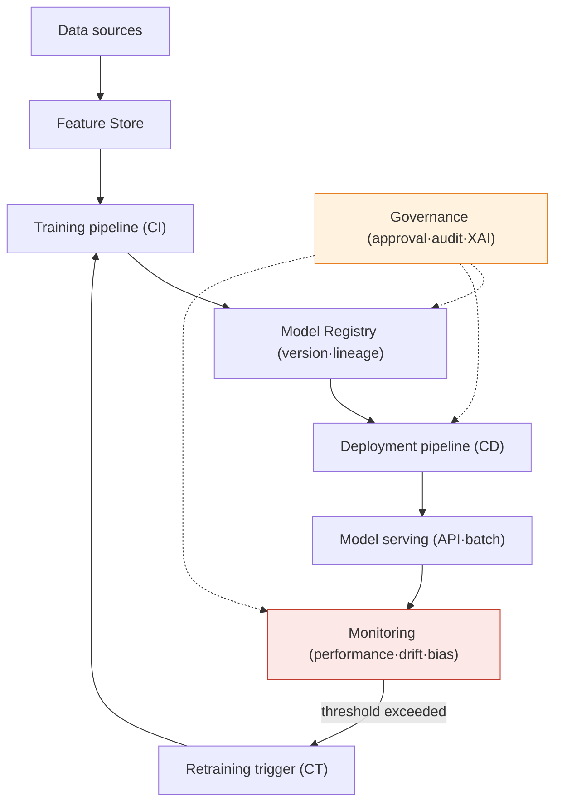

# Machine Learning Modeling and ModelOps

## 1. Overview

### A. Definition
> **Modeling** is a **build activity** that defines a problem from data, designs features, and selects, trains, validates, and tunes algorithms to secure predictive performance; **ModelOps** is an **operate and control framework** that **deploys** the completed model into the operating environment and continuously **monitors, retrains, and governs** it to reliably realize business value.

The key to understanding the two concepts together lies in the fact that **building a model and operating it are fundamentally different problems**. A data scientist building a model with 95% accuracy on a lab dataset (modeling) is only half the journey. For that model to continuously deliver value in a real service, it must be deployed into an operational system, its performance on real data must be monitored, it must be retrained when the data distribution changes, and it must respond to regulatory audit and demands for explanation. In reality, a significant number of analytical models are only developed and never deployed (the so-called "model shelved in a drawer"), or, even after deployment, are neglected and quietly collapse in performance. ModelOps is precisely the framework that emerged to bridge this development-operations gap, **standardizing, automating, and governing** the entire model lifecycle.

ModelOps is often used interchangeably with MLOps, but its emphasis differs. Whereas MLOps places weight on the **technical automation (CI/CD/CT)** of data and model pipelines, ModelOps is a broader concept that additionally encompasses **model governance from a business, risk, and regulatory perspective**, aiming to control all decision models an organization operates (not just machine learning but also rule-based, statistical, and optimization models) under consistent principles. Gartner's spread of this term also came from the problem awareness that, beyond the success of individual data-science projects, an organizational capability of **enterprise-wide model-asset management** is needed.

### B. Background and Necessity
The background to why ModelOps became necessary can be explained by the overlap of three pressures. First is the **pressure of scale**. Initially there were one or two models per organization, but as AI spread across the enterprise, dozens to hundreds of models began to be operated simultaneously. A method of manually tending to each model's performance by hand collapses at this scale. Second is the **pressure of trust**. A model begins to degrade the moment it is deployed. When drift—a divergence between the data distribution at training time and the real-data distribution at operation time—occurs, accuracy drops imperceptibly and wrong decisions accumulate. Third is the **pressure of regulation**. As the EU AI Act, model-risk management in the financial sector (SR 11-7), and privacy and fairness regulations are strengthened, a service itself can become unlawful if it cannot prove a model's rationale, bias, and audit history.

In sum, ModelOps is the operational discipline of **keeping an already-built model alive and continuously trustworthy as an asset**, and it is essential infrastructure for the era in which AI has entered mission-critical work beyond experiments.

## 2. The Relationship Between Modeling and ModelOps — The Whole Lifecycle

Modeling and ModelOps are not two disconnected stages but interlock and cycle as a single closed loop. Modeling handles the "development" semicircle of this loop and ModelOps the "operations" semicircle, and the essence is a feedback structure in which drift detected in operations becomes the input for modeling (retraining) again. The diagram below shows how the two areas connect and cycle.

Two things are worth noting in the figure above. One is that the output of modeling (the validated model) becomes the input to ModelOps, so **responsibility is handed off**; the other is that anomalies detected during operation are fed back into development, so **the loop closes (closed loop)**. If this feedback is severed, the model only degrades and dies right after deployment. The very reason ModelOps exists is to keep this loop running automatically and controllably.

The difference in character between the two areas is organized in the following table, but before the table one must understand *why* the difference arises. Modeling is **exploratory**. One cannot know in advance which features and algorithms are best, so one iterates through many experiments, and the criterion of success is a technical metric such as accuracy on a validation set. ModelOps, by contrast, is **deterministic and control-oriented**. In the operating environment, reproducibility, stability, and auditability matter as much as accuracy, and the criterion of success expands to service latency, availability, business KPIs, and regulatory compliance. This difference in character creates the differences in activities, actors, and perspectives below.

| Category | Modeling (development) | ModelOps (operations) |
|---|---|---|
| **Focus** | Securing predictive performance (accuracy) | Stable operation·governance |
| **Character** | Exploratory·iterative experimentation | Deterministic·controlled·automated |
| **Main activities** | Data prep·feature engineering·training·validation·tuning | Deploy·monitor·retrain·audit |
| **Actors** | Data scientists·ML engineers | Operations (SRE)·governance·risk organizations |
| **Success metrics** | Technical metrics such as accuracy·AUC·F1 | Latency·availability·business KPIs·regulatory compliance |
| **Core perspective** | Technical performance | Business·risk·regulation |

## 3. ModelOps Architecture and Components

The reference architecture that actually implements ModelOps takes the form of data, training, deployment, monitoring, and governance layers connected as a pipeline. The diagram below shows in detail how the three automation axes of CI (code integration), CD (deployment), and CT (continuous training) cycle by way of the registry and monitoring.

**A. Deployment & Serving.** The stage of providing the validated model in a form consumable in the operating environment. It is divided into online API serving for real-time inference and batch serving for bulk prediction, and it is common to place it on top of containers and Kubernetes so that it auto-scales with traffic. The core principle of deployment is to "release by dividing risk." Because replacing the entire model at once means the whole thing takes a hit when a problem arises, one first exposes only a small amount of traffic via a **canary deployment**, or compares predictions only—without affecting the live service—via a **shadow deployment**, and expands gradually when there are no problems. This gradualness decisively lowers operational risk.

**B. Monitoring.** The heart of ModelOps. Unlike software monitoring, which looks at system metrics such as latency and error rate, model monitoring looks at **the quality of the predictions themselves**. This includes monitoring for (1) **data drift**, in which the distribution of the input data diverges from that at training time; (2) **concept drift**, in which the input-output relationship itself changes; (3) **performance degradation** measured after the actual ground truth arrives; and (4) **bias** that disadvantages a particular group. The reason performance degradation is dangerous is that it is "quiet." The system operates normally and the API returns 200, but only the predictions gradually go wrong. That is why a design that catches early warnings with proxy metrics (input drift, prediction-distribution change) that account for label delay is important.

**C. Retraining (CT, Continuous Training).** When monitoring detects degradation that exceeds a threshold, the pipeline automatically retrains on the latest data, validates, and redeploys. Retraining triggers are defined by policy: a regular schedule (e.g., weekly), a drift threshold being exceeded, a drop in a performance metric, and so on. The principle that must be observed here is that **automatic retraining does not mean automatic trust**. Because there is no guarantee that a retrained model is necessarily better than the existing one, one places champion-challenger comparison and a validation gate before promotion to prevent the accident of a degraded model actually being deployed.

**D. Model Registry & Governance.** The model registry is the "configuration-management warehouse for models" that records the version, training data, hyperparameters, performance, and lineage of every model. On top of it, governance makes it possible to trace and audit who approved and deployed which model on what grounds, and why a prediction came out as it did (explainability, XAI).

The reason the registry is especially important is model reproducibility. If, when an incident occurs, one cannot precisely reconstruct "which version of the model, trained on what data at that point in time, received which input and made that decision," then neither root-cause analysis nor improvement is possible. Therefore the registry must pin the four axes of code, data, model, and environment together, so that any particular prediction can be reproduced exactly at any time. In regulated industries, without this lineage and audit history, accountability and justification are impossible when an incident occurs, so governance is not optional but a prerequisite.

## 4. Maturity and Practical Application — Linkage with MLOps Levels

The practical level of ModelOps is often distinguished by automation maturity.

**Level 0 (manual process)** is the stage where a data scientist manually hands a model trained in a notebook to the operations team as scripts and files. Development and operations are disconnected, so deployment is rare (quarterly or yearly), degradation is left unaddressed because there is no post-deployment monitoring, and reproducibility is not secured.

**Level 1 (ML pipeline automation)** is the stage where data validation, training, validation, and deployment are automated into a single pipeline, so that when drift is detected, retraining (CT) on the latest data runs automatically. A feature store and a model registry are introduced, securing the reproducibility and consistency of experiments.

**Level 2 (CI/CD pipeline automation)** is the mature stage where not only the model but also changes to the pipeline itself are managed, tested, and deployed as code (CI/CD), enabling fast and stable repeated updates of many models. At this stage an organization can operate dozens to hundreds of models simultaneously in a controllable state.

Looking at concrete industry applications makes the necessity clear.

Finance's credit-scoring and fraud-detection (FDS) models: because fraud patterns keep evolving (concept drift), detection rates collapse within weeks without retraining, and at the same time they are subject to regulation (model-risk management, SR 11-7) that requires explaining and auditing the grounds for a loan rejection. In this area, ModelOps functions as the infrastructure that simultaneously supports the two goals of "maintaining detection rate" and "regulatory justification."

E-commerce's recommendation and demand-forecasting models: because data drift constantly occurs due to seasonal, trend, and promotional changes, the cycle and quality of continuous retraining are directly tied to revenue. For example, right after a new-product launch or a particular event, the representativeness of past data drops sharply, so a policy adjustment—lowering the drift threshold to increase retraining frequency—is needed.

Manufacturing's predictive-maintenance models: because the distribution of sensor signals gradually shifts as equipment ages, the sensitivity of drift monitoring determines the cost balance between false positives (unnecessary maintenance) and misses (equipment failure). What these cases have in common is that value comes not from "a model built well once" but from **a model that keeps being maintained well**, and ModelOps is precisely the standardization and automation of that maintenance activity.

## 5. Deep Dive — Recent Trends and Expansion into LLMOps

Recently the center of gravity of the ModelOps discussion has been expanding from traditional machine learning to the operation of generative AI / large language models (LLMs), the so-called **LLMOps**. LLM operations share the same principles as existing ModelOps, but the objects of management differ. First, performance metrics shift from accuracy to qualitative, hard-to-evaluate axes such as **hallucination, toxicity, and response quality**, so human evaluation and LLM-as-a-judge-based automatic evaluation pipelines become new monitoring elements. Second, instead of retraining (fine-tuning), configuration-managing and versioning **prompts, retrieval augmentation (RAG), and context** becomes the core object of control. Third, because of the token-based billing structure, **cost (FinOps) monitoring** becomes as important as performance monitoring.

On the governance side, regulation is pulling technology forward. The EU AI Act mandates risk management, data governance, record-keeping, transparency, and human oversight for high-risk AI, which is effectively the same as legally requiring ModelOps's monitoring, registry, and audit functions. In other words, ModelOps's status is shifting from "operational efficiency that is nice to have" to "compliance infrastructure whose absence can be unlawful." (Specific regulatory clauses and enforcement timing are continually being revised, so the latest source text should be checked when applying them.)

## 6. Considerations and Implications

From a professional-engineer perspective, the following must be considered comprehensively when judging ModelOps adoption.

1. **The drift-detection and retraining policy determines success or failure of operations.** A model is a "decaying asset" that degrades from the moment of deployment. Therefore, the policy design of what to monitor (which metric—input, prediction, or performance) at what threshold and when (schedule/event) to trigger retraining determines the effectiveness of ModelOps. Designing proxy metrics that account for label delay is especially important.

2. **The governance perspective is the decisive difference from MLOps.** Beyond mere technical automation, it must include approval workflows, audit trails, explainability (XAI), and bias control, and the more heavily regulated the industry—finance, healthcare, public sector—the more this governance capability must be the primary goal of adoption. A strategy of pre-reflecting regulation (the EU AI Act, etc.) as a design requirement rather than a risk is advantageous.

3. **Organization/culture and R&R redesign must proceed in parallel.** ModelOps is not completed by introducing tools alone. The responsibility boundaries and collaboration processes among data-science, engineering, operations, and risk organizations (model handoff, promotion-approval authority) must be defined together, and without this organizational alignment even the latest platform stays at Level 0.

4. **The trade-offs of automation must be controlled.** Automatic retraining and automatic deployment give speed, but automation without a validation gate leads to the accident of self-deploying a degraded model. One must secure the benefits and stability of automation in balance through champion-challenger comparison, canary deployment, and a rollback strategy.

5. **One must have a roadmap for expanding into enterprise-wide integrated management.** Only by integrating not just ML models but also rule-based, statistical, and LLM models into a single registry and governance can the trustworthiness of the entire model-asset portfolio be secured. A strategy for a staged transition from fragmented per-project operation to an enterprise ModelOps platform is needed.

---

> **In one line**: Modeling is the activity of *developing a model from data (training·validation)*, and ModelOps is the operate framework that *continuously manages a model as a trustworthy asset through deployment·monitoring·retraining (CT)·governance*; through drift detection, retraining policy, validation gates, and audit trails it underpins AI operations in the era of regulation, and it is recently expanding into LLMOps.
