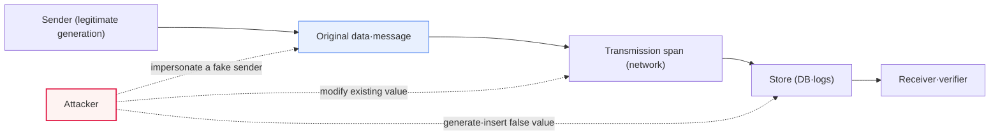
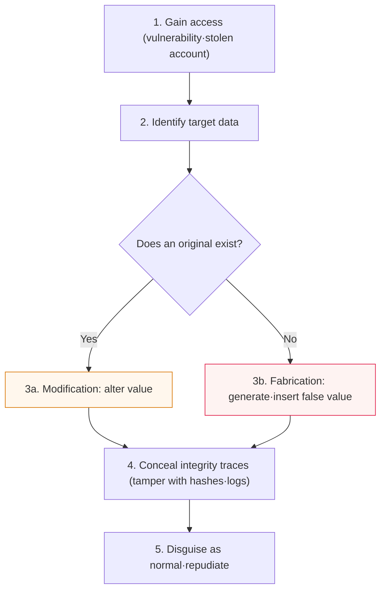

# Modification and Fabrication

## 1. Overview

### A. Definition
> **Modification** is an attack that **illegally alters or changes** legitimately existing data or messages, while **Fabrication** is an attack that **falsely creates and inserts** new data or messages that did not exist. Both threaten the **integrity** and **authenticity** of information.

The key question distinguishing the two concepts is **"whether an original exists or not."** Modification is the act of secretly changing legitimately existing data, with typical cases being altering the amount on a remittance instruction from 1 million won to 10 million won, or raising a grade upward in a grades database. Fabrication, by contrast, is the act of inventing something that never existed and slipping it into the system, such as creating a transaction record for a transaction that never occurred and inserting it into a ledger, or elaborately imitating a certificate or employment verification that was never issued and submitting it. They may look similar at a glance, but from a defense perspective this distinction is decisive. Modification can be countered to a large extent by **integrity verification** alone, which detects "what has changed," but fabrication can only be blocked when **origin authentication**, which confirms "was this really created by a legitimate party," is also present.

These two form the most basic classification axis for understanding information-security threats. Classically, security threats are divided into four: **interception (a confidentiality threat), modification (an integrity threat), fabrication (an integrity and authentication threat), and interruption (an availability threat)** (Stallings's classification of security threats), among which modification and fabrication constitute the integrity family. What happens when integrity is broken is well illustrated by real incidents. When a message is modified over a communication link, the receiver trusts the manipulated content as genuine and makes a wrong decision; and when a fabricated message is inserted, the receiver mistakenly believes it received an instruction that was never sent, and transfers funds or grants privileges. Representatively, **BEC (Business Email Compromise)** attacks combine fabricated email impersonating a CEO with modification that changes the remittance account, causing cumulative damage in the tens of billions of dollars by FBI IC3 reporting. That is why blocking modification and fabrication is the very body of integrity security, and it becomes the top control target in every domain—finance, healthcare, e-government, supply chain—where the authenticity of data is itself trust.

### B. Background and Necessity
Behind the establishment of modification and fabrication as a distinct threat category lies the digitalization of communication and transactions. In the era of paper documents, the physical differences between an original and a copy (seals, handwriting, paper stock) were the basis for judging authenticity, but digital data can be perfectly copied and modified without a trace, so one cannot guarantee by physical properties that "this bit string is the original and has not been forged or altered." As remote transactions mediated by networks became universal, the need arose to prove data integrity and sender authenticity with **cryptographic evidence** in situations where the counterparty cannot be verified face to face. The Digital Signature Act and the E-Commerce Act granting electronic signatures the same legal effect as handwritten signatures is also because prevention of forgery and alteration is not merely a technical matter but the foundation of transaction safety and legal accountability.

### C. Position in the Classification of Security Threats
The table below organizes the four classic threats by the property they violate. The table is an auxiliary means for seeing the positional relationships at a glance; why each threat violates that property is as explained in the prose above.

| Threat | Property violated | Content | Representative case |
|---|---|---|---|
| **Interception** | Confidentiality | Secretly peeking at information | Packet sniffing, eavesdropping |
| **Modification** | Integrity | Illegally altering the original | Altering remittance amount·logs·firmware |
| **Fabrication** | Integrity·authentication | Falsely creating and inserting something that did not exist | Fake transactions·forged certificates·deepfakes |
| **Interruption** | Availability | Obstructing service·delivery | DoS/DDoS, line cutting |

## 2. Structural Understanding of Modification and Fabrication

### A. Points and Flow of Attack Occurrence
Modification and fabrication can occur throughout the whole span where data is created (generation), flows (transmission), and rests (storage). The overall structure diagram below shows where the two attacks intervene on the normal data flow.

In this figure, modification is represented as a dashed line that intervenes on the already-flowing solid line (the original) and changes the value, while fabrication is represented as a dashed line that pushes a new value into the store or channel independently of the flow. In practice, modification in the transmission span materializes as a **man-in-the-middle (MITM) attack**, and modification/fabrication at the store materializes as **data manipulation after privilege escalation** or **record insertion via SQL injection**. Because different attack points mean different control points, channel protection (TLS) and storage integrity (hashes·signatures·audit logs) must be placed together layer by layer.

### B. The Attacker's Procedure from the Attacker's Perspective
For an attacker to carry out modification or fabrication, several stages must be passed. The detailed process diagram below represents the progression of a typical integrity attack.

The point to note is the **trace concealment** in stage 4. After changing the data, the attacker tries to also touch the corresponding integrity value (checksum·hash) and even the access logs. If the integrity value is in a place the attacker cannot access (a MAC protected by a separate key, a signature-verification key, a write-once-read-many (WORM) log immutable after writing), concealment fails and the attack is detected. In other words, the crux of defense is **"separating the integrity evidence from the data so that the attacker cannot manipulate them together."** This principle is the common foundation of the MAC, digital-signature, and immutable-log designs explained later.

### C. Comparison of Modification and Fabrication
| Category | Modification | Fabrication |
|---|---|---|
| **Original** | Exists (altered) | None (newly created) |
| **Core act** | Changing existing data | Inserting false data·impersonation |
| **Primary violation** | Integrity | Integrity + authenticity |
| **Representative examples** | Altering remittance amount·grades·firmware·logs | Fake transactions·forged certificates·deepfakes |
| **Detection technology** | Hash·MAC·checksum | Digital signature·certificate verification·proof of origin |
| **Additional control needed** | Change detection | Origin authentication·non-repudiation |

The last two rows of the table are the most important in practice. For modification, it suffices to notice the fact that "it changed," so integrity verification such as hashes and MACs is often enough. But for fabrication, one must ask "is the party who created this genuine?", so a symmetric-key-based MAC alone is insufficient (if the verifier and the creator share the same key, they cannot repudiate each other); a **digital signature** signed with a private key held only by the sender and a **PKI** that vouches for the trust of that public key are needed. The reason the difference arises lies in the trust model. A MAC guarantees "integrity between two parties who share a key," whereas a signature guarantees "sender attribution that can be proven to anyone."

## 3. Countermeasures

### A. Integrity Verification Technology — Hashes and MACs
The first line of defense for detecting modification is the **cryptographic hash function**. A hash such as SHA-256 has the **avalanche effect**, whereby the result changes entirely if even a single bit of the data changes, so by safely keeping the hash value of the original and comparing it with the hash at the time of receipt/verification, one can conclusively determine whether modification occurred. However, since a plain hash is neutralized if the attacker changes both the data and the hash together, one uses a **MAC (HMAC, etc.)** that mixes in a secret key, making it so that "an attacker who does not know the key cannot create a valid integrity value." For example, if you attach an `HMAC-SHA256` signature header to a REST API request, the server immediately rejects it even if a parameter is changed in transit. However, a MAC has the limitation that, being a key-sharing scheme, it cannot "prove the sender to a third party," and it is at this point that digital signatures become necessary.

### B. Origin Authentication and Non-repudiation — Digital Signatures and PKI
To block fabrication as well, **digital signatures** are the answer. The sender encrypts (signs) the message hash with their own **private key**, and the verifier decrypts it with the sender's **public key** and compares the hash. Since only the sender holds the private key, when a signature verifies, "this data was not forged or altered (integrity) + it really was created by that person (authentication) + they cannot later repudiate it (non-repudiation)" all hold at once. The chain of trust that vouches for whether a public key really belongs to that person is **PKI (public-key infrastructure)** and the **certificate**. A browser verifying a HTTPS site's server certificate via the CA chain, and requiring an accredited/joint-certificate signature on an electronic tax invoice or electronic contract, are all real-world applications of origin authentication for preventing fabrication.

### C. Prevention·Detection·Tracing Controls
Technical integrity verification alone is insufficient; **access control, audit logs, and immutable storage** must operate together. Narrow the very authority to modify data with the principle of least privilege, and record all changes in an immutable (WORM·append-only) log to secure after-the-fact traceability. Blockchain and distributed ledgers push this principle to the extreme, chaining the hash of the previous block into the next block (hash chaining) to make after-the-fact modification of past records effectively impossible—a forgery-and-alteration-prevention structure. The table below organizes the countermeasure technologies by layer.

| Layer | Countermeasure technology | Defense target |
|---|---|---|
| **Detection (integrity)** | Hash (SHA-256)·HMAC·checksum | Modification |
| **Authentication·non-repudiation** | Digital signature·PKI·certificates | Fabrication |
| **Prevention (access)** | Access control·least privilege·MFA | Unauthorized modification·insertion |
| **Tracing·immutability** | Audit logs (WORM)·blockchain | After-the-fact concealment |
| **Content authenticity** | Digital watermarking·C2PA proof of provenance | AI forgery (deepfakes) |

## 4. Deep Dive — The Sophistication of Fabrication in the AI Era and the Standards to Counter It

Whereas traditional fabrication was at the level of "inventing a document that did not exist," generative AI is fundamentally changing the nature of fabrication. **Deepfakes** learn the faces and voices of real people to produce videos and audio hard to distinguish from the real thing. In 2024 in Hong Kong, an incident was reported in which about USD 25 million was transferred via a deepfake video conference impersonating a CFO, a case in which a "fabricated identity" extended even to real-time interaction. Document and image forgery, too, are being mass-produced and refined by AI, making it hard to tell authenticity by the naked eye or a simple filter.

In response, standards are emerging to **cryptographically prove content provenance and authenticity**. **C2PA (Coalition for Content Provenance and Authenticity)** attaches the creation and editing history of content as digitally signed metadata (Content Credentials), leaving a verifiable record of when, by whom, and how an image or video was created. With Adobe, Microsoft, and others participating, the insertion of signatures into cameras and generative-AI tools is spreading. To this, **digital watermarking** (inserting a provenance mark invisible to the naked eye) and **AI-generated-content detection models** are combined complementarily. However, these technologies can be vulnerable to watermark-removal and re-encoding attacks, so they are not a panacea; and since standardization and interoperability are still in progress, it is appropriate to view them as "one axis of layered defense" rather than to trust them categorically. From an information-management professional-engineer perspective, this area is naturally connected when understood as an extension of existing integrity controls (signatures·PKI) to content-authenticity verification.

## 5. Considerations and Implications

1. **Importance-based differential application of integrity controls** is needed. Applying digital signatures to all data imposes excessive performance and operating cost, so a trade-off design is required that layers by using hashes/MACs for data where simple modification detection suffices, and digital signatures/PKI for transaction, contract, and authentication data that require sender attribution and non-repudiation.

2. **Fabrication defense must be combined with authentication and non-repudiation.** Fabrication—inventing something that did not exist—cannot be blocked without asking "was this created by a legitimate party," so the core is asymmetric-signature-based origin authentication rather than a symmetric-key MAC that guarantees only integrity; and here private-key custody (HSM·key-lifecycle management) becomes the real weak point of overall trust.

3. **Separation and immutable storage of integrity evidence** is the crux of defense. To neutralize the attacker's trace concealment (stage 4), integrity values and audit logs must be placed in a different trust boundary from the data (a separate key·WORM·distributed ledger), and if this principle is not observed, no algorithm is meaningful.

4. **One must expand to a content-provenance-proof scheme to prepare for AI forgery.** The more sophisticated deepfakes and generative forgery become, the more after-the-fact detection alone has limits, so one should shift the center of gravity to preemptive control based on "signing at the moment of creation (provenance)," such as C2PA and watermarking—while designing for layered defense that accounts for the possibility of removal attacks.

5. **One must secure the alignment of law/institutions with technology.** The legal effect of digital signatures, authenticity requirements for electronic documents, and the evidentiary capacity of logs are the points where technical controls connect to legal accountability, so when designing an integrity architecture, governance that also considers relevant laws (the Digital Signature Act·the Electronic Documents Act) and audit/forensic requirements must underpin it.

## References
- NIST, "Secure Hash Standard (SHS)", FIPS PUB 180-4
- NIST, "Digital Signature Standard (DSS)", FIPS PUB 186-5
- C2PA, "Content Credentials: Technical Specification" — https://c2pa.org/specifications/
- FBI IC3, "Business Email Compromise" — https://www.ic3.gov/

---

> **In one line**: Modification is an attack that *illegally alters the original* (violating integrity), and fabrication is an attack that *falsely creates or impersonates something that did not exist* (violating integrity + authentication); one detects modification with hashes/MACs, prevents fabrication with digital signatures/PKI, and extends the defense with the separation and immutable storage of integrity evidence and with C2PA and proof-of-provenance schemes that counter deepfakes in the AI era.
