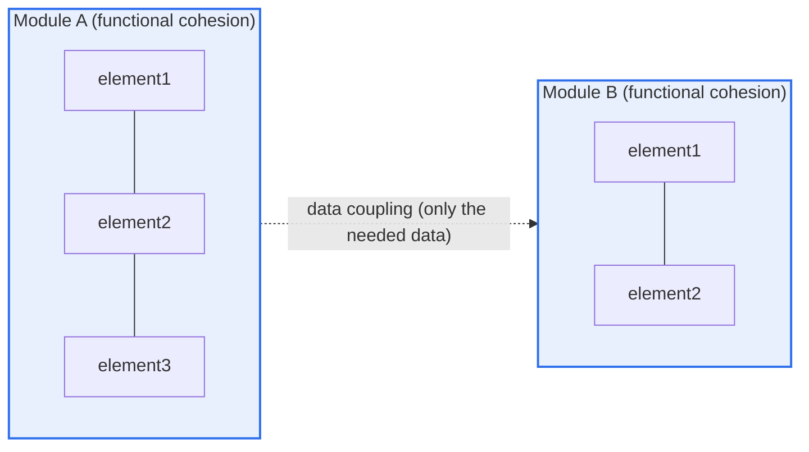
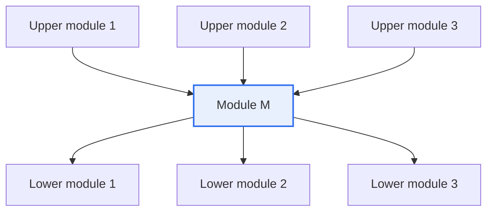

# Software Modules — Cohesion·Coupling, Fan-in·Fan-out

## 1. Overview

### A. Definition

> A **module** is a functional unit of software that can be independently compiled and reused, and the two axes for judging its design quality quantitatively and qualitatively are **cohesion (the relatedness of the elements inside a module)** and **coupling (the dependency between modules)**. Good design, without exception, aims for **"strong cohesion and loose coupling."**

The reason module design is the foundation of software quality is that it determines **"the ripple effect—how far a change in one module spreads across the whole system."** Software costs far more to fix and reuse than to build (60–80% of the total lifecycle cost is maintenance), and most of the maintenance cost hinges on "how many modules a single change forces one to touch together." If modules are well divided, each module is independent, so understanding, modification, reuse, and unit testing all finish locally; but if they are poorly divided, a trivial requirement change invites cascading modifications and regression defects. The two measures that judge this "goodness or badness of division" are precisely cohesion and coupling.

The two measures are not independent concepts but are linked **like two sides of a coin**. If you properly gather related functionality into one module (cohesion↑), that module becomes self-complete and thus references other modules less (coupling↓), naturally raising its independence. Conversely, if you cram miscellaneous functions of differing character into one module (cohesion↓), those functions each pull in outside data and state, so references extend all over (coupling↑) and the module becomes entangled in the system. In other words, in many cases **the act of raising cohesion is itself the act of lowering coupling**. This is why, in structured design, L. Constantine and E. Yourdon presented the two concepts as a pair.

### B. Background and Necessity

Before the structured methodology emerged in the 1970s, programs were written as one giant flow (a monolithic procedure), and "spaghetti code"—where you cannot predict what breaks when you fix something—was common. To overcome this, Constantine and Yourdon proposed dividing (decomposing) a program into functional units, while proposing cohesion and coupling as **the yardstick for objectively evaluating the quality of that division**. The larger and longer-maintained software becomes, the higher the frequency of change; these two measures are like the laws of physics of a design that makes a "structure resistant to change." Today, object orientation's SRP (single-responsibility principle), microservices' service-boundary setting, and information hiding and encapsulation are all, in the end, restatements of "high cohesion and low coupling" in a different language.

## 2. The Two Axes of Module Independence — Cohesion and Coupling

If you bundle the goodness or badness of a module into a single concept, it becomes **module independence**, which is a function of cohesion and coupling. The figure below represents the ideal state—two modules each tightly clustered internally (high cohesion) and exchanging only the minimum data with each other (low coupling).

### A. Cohesion — "Let one module do one thing well"

Cohesion indicates "how much the elements (statements·functions·data) inside one module are clustered for a single purpose." High cohesion means you can explain "what that module does" in one sentence. For example, if the single purpose is clear, as in `calculateAccountBalance()`, it is functional cohesion. Conversely, if `commonUtil()` has logging, encryption, and date conversion mixed together, its very name means "this and that," so its cohesion is low.

Cohesion is divided into **7 levels**, from coincidental (worst) to functional (best). More important than memorizing this order is the principle of "why it gets better going up." Going down, the basis for grouping elements is as weak as "they happen to be in the same file"; going up, logical necessity strengthens, as in "because they sequentially process the same data" or "because they form a single function." The stronger the necessity, the more the module is a single lump for a reason, so there is no need to split it and there is only one reason to change (exactly matching SRP).

| Cohesion (low→high) | Basis for grouping | Example |
|---|---|---|
| Coincidental | No relation at all | A `Util` class collecting miscellaneous functions |
| Logical | Similar only in character; execution selected by a flag | Branching by type inside `process(type)` |
| Temporal | Executed at the same time | Setting up logs·DB·cache in `initialize()` |
| Procedural | Executed in a fixed order | Only order is shared; data is unrelated |
| Communicational | Uses the same data | Producing several results from the same input |
| Sequential | The prior output is the next input | A parse→validate→transform pipeline |
| **Functional (best)** | Completes a single function | `calculateInterest()` |

### B. Coupling — "Modules should be entangled with each other as little as possible"

Coupling is "how deeply modules depend on each other." The stronger the coupling, the more an internal change on one side forces the other to be fixed along with it. The worst is **content coupling**, where one module directly touches another module's internal code or local variables. In this case, the moment you change the other's implementation, this side breaks silently. The best is **data coupling**, where only the needed values are exchanged as parameters. As long as the interface (what is exchanged) is kept, the internal implementation can change freely, so changes are localized.

Coupling has **6 levels**, from strongest (content) to weakest (data). What frequently causes problems in practice in particular are **control coupling**—passing a flag that governs the internal logic of the other module (the `true` in `sort(data, true)` dictating ascending/descending)—and **common coupling**—several modules sharing a global variable so that it becomes impossible to trace who changed the value. This is why the abuse of global state most greatly worsens maintenance.

| Coupling (strong→weak) | Form of dependency | Problem |
|---|---|---|
| Content | Direct access to the other's internals·local variables | Encapsulation collapse; guaranteed breakage on change |
| Common | Sharing a global variable | Change untraceable; side effects spread |
| External | Sharing an external format·protocol·device | Co-vulnerable to external changes |
| Control | Passing a control flag | The caller knows the callee's internals |
| Stamp | Passing an entire struct (using only part) | Affected by changes to unnecessary fields |
| **Data (best)** | Passing only the needed values as parameters | Minimal dependency; localized change |

Summarized in one line, cohesion is coincidental < logical < temporal < procedural < communicational < sequential < **functional** (best), and coupling is content > common > external > control > stamp > **data** (best); the design goal is to push cohesion **from the bottom up and coupling from the left to the right**.

### C. Practical Techniques for Lowering Coupling

Coupling does not lower on its own; it is lowered by deliberate design techniques. The first is **minimizing the interface**. Instead of stamp coupling that passes an entire struct, passing only the truly needed values as parameters brings it down to data coupling. For example, changing `calculateDiscount(entireOrderObject)` to `calculateDiscount(amount, tier)` means this function is unaffected even if unrelated fields of the order object change. The second is **removing control flags**. Instead of passing a flag that governs internal branching, as in `process(data, isAdmin)`, splitting it into `processAdmin(data)`·`processNormal(data)` (polymorphism·strategy pattern) means the caller need not know the callee's internals, so control coupling disappears.

The third is **excluding global state**. A global variable shared by several modules is a source of common coupling, so localize state or exchange it via explicit dependency injection (DI) to make "who changed the value when" traceable. The fourth is **information hiding**. Hiding a module's internal data structures and algorithms and communicating only through a public interface means that even if the internal implementation changes, other modules are unaffected as long as the interface is maintained, so coupling weakens fundamentally. All four techniques converge on the single principle of "reducing what one module knows about another module's internals."

## 3. Fan-in and Fan-out — Measuring Structural Reusability and Complexity

If cohesion and coupling look at "the quality of a single module," fan-in and fan-out diagnose **the shape of the whole structure (the structure chart) by the call relationships among modules**. **Fan-in** is the number of higher-level modules that call a particular module (= how widely it is reused), and **Fan-out** is the number of lower-level modules that a particular module calls (= how many things it depends on).

In the figure above, module M has **Fan-in = 3, Fan-out = 3**. High fan-in means that module is used in common by several higher-level modules, a **metric of reusability** that reduces duplicated code. A well-designed common library function (e.g., `formatDate()`, `writeLog()`) naturally has high fan-in. Conversely, high fan-out means that module depends on too many lower-level modules to do its job, indicating excessive responsibility (a signal of SRP violation) and high complexity, making it vulnerable to change. Therefore a good structure aims for **high fan-in and low fan-out**.

| Metric | Meaning | Desirable direction | Design implication |
|---|---|---|---|
| **Fan-in** | Number of upper modules that call me | **Higher is better** | Reusability↑, but stability management essential |
| **Fan-out** | Number of lower modules I call | **Lower is better** | Dependency·complexity↓, commonly recommended ≤7 |

However, a module with high fan-in is "a vital spot on which many places depend," so it has the double-edged property that changing it wrongly has a large ripple. That is why the higher the fan-in of a common module, the more its interface must be stably fixed (not changed often) and thoroughly tested. Conversely, a module with excessively large fan-out (e.g., fan-out 10 or more) is likely a "control-tower-type over-responsibility module," so it becomes a refactoring target for distributing responsibility (factoring) by introducing an intermediate layer.

## 4. Application Seen Through a Case — From Bad Design to Good Design

Understanding it through a concrete case makes it clear. Suppose the initial `processOrder()` module of some commerce system performed inventory deduction, payment approval, email sending, log loading, and statistics updating all inside one function. Because this module has five different reasons to change (inventory-policy change, PG replacement, mail-template modification, log-format change, statistics-item addition), its cohesion is low (at the logical-to-temporal level), and each time one had to touch the entire function, so the regression risk was large. In fact, a one-line modification of the mail template led to an incident that broke the payment logic.

If you separate this into **functional-cohesion** units—`deductInventory()`·`approvePayment()`·`sendNotification()`·`recordHistory()`—and change the upper `processOrder()` to call them with data coupling (passing only the needed order data as parameters), each module's reason to change is narrowed to one. Then common functions such as `recordHistory()`·`sendNotification()` are reused by several upper modules (order·refund·shipping), so their fan-in rises to 3–4, while `processOrder()`'s fan-out stays at a manageable level of 4. As a result, in one team's experience, regression defects after deployment noticeably decreased, and because unit tests can be written independently per module, it becomes easy to raise test coverage. In this way, cohesion, coupling, and fan-in/fan-out are not separate; **a single good division moves all three metrics in an improving direction together**.

## 5. Deep Dive — Extension to Object Orientation·MSA and Quantitative Measurement

These concepts, born in traditional structured design, are reinterpreted today in a broader context. In **object orientation (OOP)**, cohesion appears as a class's single responsibility (SRP) and the relatedness of its methods and fields, quantified by metrics such as LCOM (Lack of Cohesion of Methods)—if a class's methods hardly use shared fields, LCOM is high, becoming a signal to "split it." Coupling is managed with the Law of Demeter and the dependency-inversion principle (DIP), lowered close to data coupling through interfaces and dependency injection (DI). Widely used static-analysis tools (e.g., the SonarQube family) automatically measure cyclomatic complexity and coupling metrics (e.g., efferent/afferent coupling CE·CA) to reveal "bad modules" early.

When you move to **microservices architecture (MSA)**, this principle becomes service-boundary setting itself. Domain-driven design (DDD)'s bounded context is the work of drawing a "high-cohesion" boundary, and loosely connecting services via REST/gRPC/message queues is lowering coupling to the data-coupling level. Conversely, several services directly referencing one shared database is a "common coupling" in a distributed environment, a representative anti-pattern (Shared Database) that undermines MSA's benefits. In other words, the "high cohesion and low coupling" learned at the module level repeats as-is at the service level, only scaled up.

## 6. Considerations and Implications (Professional-Engineer Perspective)

1. **High cohesion and low coupling are the golden rule of design and another name for SRP·information hiding.** Gathering related functionality into one module to raise cohesion reduces references and thus lowers coupling together. Rather than trying to manage the two measures separately, if you first establish "what does this module do in one sentence," both metrics improve at once.

2. **Fan-in/out should be used as an early warning for structural diagnosis.** A module with excessive fan-out (over the recommended line of 7) should have its responsibility divided (factoring), and a common module with high fan-in should have its interface stably fixed and its regression tests strengthened to control the ripple of change. Measure regularly with static analysis and structure charts to prioritize refactoring.

3. **A boundary against over-division that recognizes trade-offs** is needed. If you chase only cohesion and split modules too finely, the number of modules and call paths explodes, making the whole harder to understand (cognitive coupling increases) and creating performance overhead. In MSA especially, excessive service decomposition inflates distributed transactions, network latency, and operational complexity. "As large as possible, as small as necessary" is the practical balance point.

4. **One must not forget that quantitative metrics are a means, not an end.** LCOM and coupling figures are only signals pointing to bad smells; refactoring that merely matches the numbers without domain context is meaningless. Judging together with architecture strategy, change frequency, and organizational structure (Conway's law), and converging on the principle of "what changes together often, keep together; what changes separately, keep separate," is the design judgment from a professional-engineer perspective.

---

> **In one line**: Good module design aims for *high cohesion (functional)·low coupling (data)* and localizes the impact of change with a *high-fan-in (reuse)·low-fan-out (minimal dependency)* structure; this principle runs through, only scaled, from SRP·information hiding to object orientation and to MSA service-boundary setting.
