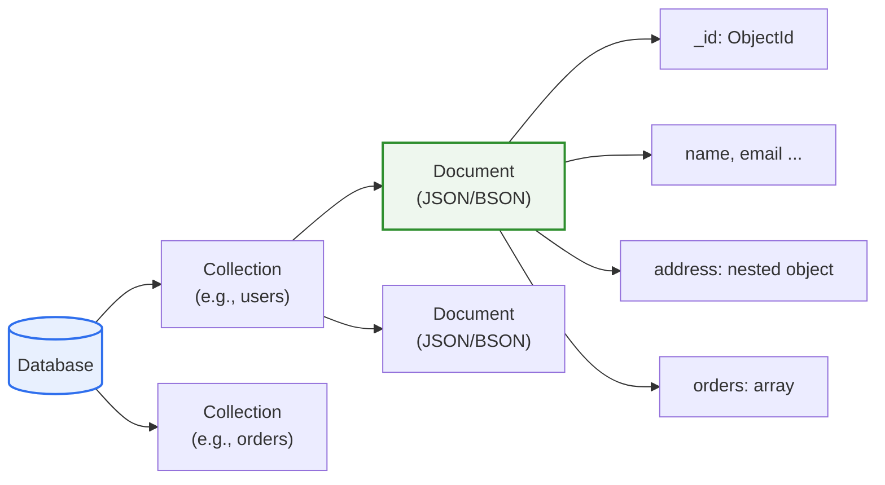
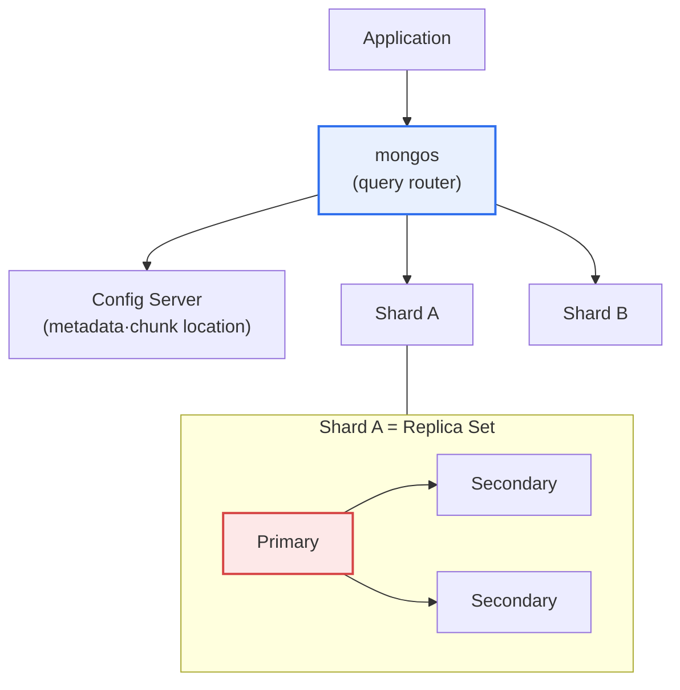

# MongoDB

## 1. Overview

### A. Definition

> **MongoDB** is a representative document-oriented NoSQL database that stores data in the form of **JSON-like documents (with BSON as the internal storage format)**; it handles data flexibly without a fixed schema and provides horizontal scaling through sharding and high availability through replica sets by default.

MongoDB's core idea is to **"treat data not as rows of a table but as self-complete documents."** A relational database (RDB) normalizes data by splitting it across multiple tables and connecting them with joins; this approach is strong on consistency and deduplication but has the limitations of a rigid schema and difficulty with large-scale horizontal scaling. MongoDB, by contrast, aims to hold related data wholesale inside a single document. For example, instead of splitting a user and their addresses and order history into separate tables, it stores them nested as arrays and objects inside one user document. Then it can be queried in a single read without joins, so it is fast; fields can be freely added and changed, so it is flexible (schema-less); and data can be split and stored across many servers (sharding), so it is easy to scale at large volume.

These characteristics contribute especially to development productivity in that they reduce the gap between the data model and application objects, the so-called "impedance mismatch." Because the nested-object structures handled in object-oriented languages map directly onto the document form, one can store and query exactly what the application code handles, without complex ORM mapping or multi-stage join queries. Thanks to this, it is widely adopted in web/mobile/IoT services that handle frequently changing requirements and large-volume, semi-structured data, as well as in real-time analytics and content management. However, one must clearly recognize that it is relatively less suitable for work such as accounting and settlement, where strong consistency across multiple documents (complex joins·multi-table transactions) is central.

### B. Background and Necessity

MongoDB appeared in 2009, and behind it was the explosive growth of web services in the late 2000s. As traffic and data exceeded the limits of vertical scaling (scale-up), the demand grew to bundle many cheap commodity servers for horizontal scaling (scale-out). At the same time, as agile development spread, the rigidity of the relational model, which requires migrating the schema every time, was pinpointed as a bottleneck slowing development speed. In other words, MongoDB's necessity stems from the simultaneous rise of three demands: **"a flexible schema + large-scale horizontal scaling + development productivity."** From the perspective of the CAP theorem, MongoDB basically prioritizes consistency (C) and partition tolerance (P) but takes a flexible compromise in which the level of availability and consistency can be adjusted by configuration.

## 2. Data Model and Storage Structure

MongoDB's logical structure is clear when understood in correspondence with the relational one. A database is the top-level unit that holds several collections, and a collection corresponds to a relational table but does not enforce a schema. A collection holds several documents, and a document corresponds to a relational row. Each document is a set of field-value pairs, stored internally in the BSON (Binary JSON) format. BSON is a binarized form of JSON that supports, in addition to strings, integers, and booleans, additional types such as Date, binary data, and `ObjectId`, and it improves parsing speed and storage efficiency.

Every document must have an `_id` field, and if it is not specified, MongoDB automatically generates a 12-byte `ObjectId` (timestamp + machine identifier + counter) to guarantee global uniqueness. A default index is automatically placed on this `_id`. The maximum size of a single document is limited to 16MB, and larger files (images, videos, etc.) are split into chunks and stored via a separate specification called GridFS. The document-size limit also acts as a design guide that prevents unbounded arrays that grow without limit.

The strength of the document-oriented model is the "locality of related data." If the data read together at once is physically gathered in one document, disk I/O decreases and queries are fast. Conversely, if you forcibly embed data that is frequently updated or shared in many places, the document becomes bloated and the update cost grows. That is why the choice between embedding and referencing, discussed later, becomes the core decision of MongoDB modeling.

### A. Key Characteristics

| Characteristic | Content | Principle·effect |
|---|---|---|
| **Document-oriented** | Stored as JSON/BSON documents, expressing nesting·arrays | Reduces object-document impedance mismatch |
| **Schema-flexible** | No fixed schema (free field addition) | Copes with agile development·frequent change |
| **Horizontal scaling** | Distributed storage·scaling via sharding | Handles large volume via scale-out |
| **High availability** | Redundancy via replica sets | Automatic failover |
| **Indexes·aggregation** | Various indexes, aggregation pipeline | Handles complex queries·analysis within the DB |

Rather than merely listing characteristics, if you look at "why such characteristics are possible," their root is all in the document model. Schema flexibility comes because the collection does not enforce a document structure; horizontal scaling is possible because you can attach a shard key to a document and distribute it to servers by range or hash; and high availability is easy to automate because document-level replication is relatively simple. In other words, MongoDB's characteristics are not independent features but results derived from the single design choice of the document model.

## 3. Architecture: Replica Sets and Sharding

MongoDB's operational architecture consists broadly of two axes: the replica set responsible for high availability and sharding responsible for horizontal scaling. These two are used together; in actual production, the standard structure is one in which each shard is itself a replica set.

### A. Replica Set and High Availability

A replica set is a structure that replicates the same data across several nodes, composed of one primary that receives writes and several secondaries that replicate it. A client's writes are handled at the primary, and the changes are recorded in a special collection called the oplog (operation log) and asynchronously propagated to the secondaries. If the primary fails to respond due to a fault, the remaining nodes elect a new primary via an election algorithm. This automatic failover usually completes within seconds to tens of seconds, minimizing service interruption.

Important concepts in a replica set are "Write Concern" and "Read Preference." Write Concern determines how many nodes must acknowledge a write for it to be considered a success. For example, `w:1` requires only the primary to acknowledge, while `w:majority` requires a majority of nodes to acknowledge, which is safer but has higher latency. In other words, the application directly adjusts the compromise between consistency and performance. Read Preference determines whether reads happen only at the primary or are also allowed at secondaries, distributing the read load. However, because a secondary may return slightly stale data due to replication lag, queries where recency matters should be read from the primary.

### B. Sharding and Horizontal Scaling

Sharding is a technique that splits one large collection across several shards by a shard key. It breaks data into chunks and distributes them to each shard, and if chunks pile up on a particular shard, the balancer automatically redistributes them. The application need not be aware of this distribution; a router called `mongos` forwards queries to the appropriate shard, and the Config Server manages the metadata of which chunk is on which shard.

The success or failure of sharding depends on the choice of shard key. If you use a monotonically increasing key (e.g., a timestamp) as the shard key, the latest writes always pile onto one shard, creating a "hotspot" and eliminating the scaling effect. That is why you must choose a key with high cardinality, evenly distributed values, and alignment with the query pattern. To mitigate this, MongoDB provides hashed sharding, compound shard keys that bundle several fields, and hash-based distribution that scatters a rapidly increasing key. Because it is very hard to fix later if you choose the shard key wrongly, it is important to sufficiently analyze the access pattern early in design.

## 4. Indexes and the Aggregation Pipeline

The reason MongoDB is powerful beyond a simple key-value store lies in its rich indexing and aggregation functionality. Without an index, a query performs a collection scan that sweeps the entire collection, becoming rapidly slower as data grows. MongoDB supports not only single-field indexes but also compound indexes that bundle several fields, multikey indexes that index each element of an array, indexes for text search, geospatial (2dsphere) indexes for location-based queries, and TTL indexes that automatically delete a document after a certain time. TTL indexes are useful for automatically expiring data with a fixed lifespan, such as sessions, logs, and caches.

The aggregation pipeline is a framework that transforms and aggregates data by sequentially connecting several stages. It processes complex analytical queries inside the DB by filtering with `$match`, group-aggregating with `$group`, sorting with `$sort`, and joining with another collection using `$lookup` (corresponding to a relational join). Because the output of a prior stage becomes the input of the next stage, like a Unix pipe, it processes large volumes of data on the server side without pulling it into the application, reducing network cost.

## 5. Comparison with Relational DBs: Why the Difference Arises

For comparing the two models, understanding "why the difference arises" is more important than listing items. The fundamental difference starts from the data model. The relational model normalizes data to eliminate duplication and combines it with joins, favoring consistency but incurring join cost and schema rigidity. MongoDB gathers related data in a document to reduce joins, allowing some duplication instead and delegating consistency management more to the application.

| Category | Relational (RDB) | MongoDB | Reason for the difference |
|---|---|---|---|
| **Data model** | Tables·rows (structured) | Documents (flexible) | Normalization vs. locality priority |
| **Schema** | Fixed in advance (schema-on-write) | Flexible (schema-on-read) | The collection does not enforce structure |
| **Relationships** | Joins | In-document nesting·reference ($lookup) | Store together what is read together |
| **Scaling** | Mainly vertical (scale-up) | Horizontal (sharding) | Can distribute by shard key on documents |
| **Consistency** | Strong ACID | Document-level atomicity + multi-document transactions (4.0+) | Consistency relaxed early for scalability |
| **Query** | Standard SQL | MQL·aggregation pipeline | A query language fitted to the document structure |

The practical implication is not "which is better" but "which fits which workload." For example, in e-commerce, data such as a product catalog, whose attributes differ per item and change frequently, benefits from MongoDB's flexible schema; but work such as payment/settlement, which must atomically update several account balances, is safer with the relational model's strong transactions. MongoDB, too, came to support multi-document transactions on replica sets from 4.0 and distributed transactions in sharded environments from 4.2, narrowing this gap; but because abusing transactions loses the performance advantage of the document model, the principle is to use them "only where needed."

### A. Embedding vs. Referencing (Concrete Case)

Let us look at the core modeling choice of embedding and referencing through a blog-service case. In the relationship of a post and comments, if the number of comments is small and they are always queried together with the post, embedding the comments as an array inside the post document is advantageous. It is read at once without a join, and document-level atomic updates are also guaranteed. Conversely, if a popular post could have tens of thousands of comments, it hits the 16MB document limit and the document becomes bloated, requiring the large document to be rewritten on every update. In this case, referencing—separating the comments into a distinct collection and referring to them by the post's `_id`—is better. In other words, the access pattern of "is it read together, how large can it grow, how often is it updated" is the selection criterion, and this judgment can swing performance by up to tens of times.

## 6. Deep Dive: Recent Trends and Practical Application

MongoDB has evolved beyond its early pure-NoSQL image into a general-purpose data platform, strengthening consistency and analytical functionality. The aforementioned support for multi-document ACID transactions (4.0/4.2) is a representative turning point that broke the notion that "NoSQL has no transactions." Later versions introduced Time Series collections to efficiently store and compress IoT and monitoring data, and strengthened field-level encryption (Client-Side Field Level Encryption, Queryable Encryption) to store and query sensitive information while encrypted on the client. The storage engine also changed its standard from the old MMAPv1 to WiredTiger, which supports document-level concurrency control and compression, improving write performance and storage efficiency.

On the cloud side, the managed service MongoDB Atlas has become mainstream. In addition to automatic backup, scaling, and monitoring, Atlas has integrated Atlas Search (Lucene-based) for full-text search and vector search (Atlas Vector Search). Vector search in particular has drawn attention for use in storing embeddings and performing similarity search in the RAG (retrieval-augmented generation) pipeline of generative AI, creating the trend of "handling operational data and vectors in one DB." As practical cases, large media, gaming, and e-commerce companies have adopted MongoDB for data that is diverse in schema and large in scale, such as user profiles, real-time sessions, and product catalogs, with building a Single View or a real-time personalized-recommendation backend being representative usage patterns. Meanwhile, the license changed to SSPL (Server Side Public License) in 2018, creating restrictions on cloud reselling, and this is a point to note in practice in that a license review is needed at adoption.

## 7. Considerations and Implications

From a professional-engineer perspective, adopting MongoDB should be an architectural decision that comprehensively judges workload characteristics and consistency requirements, beyond the perception of "a fast and flexible DB."

1. **Data modeling determines performance.** Rather than applying normalization rules as-is like the relational model, one must first analyze the application's actual access patterns (what is read and written together) and decide on embedding and referencing. Being schema-less does not mean design is unnecessary; rather, access-pattern-based design becomes more important. Wrong modeling leads to document bloat and query inefficiency, which are hard to compensate for even with hardware.

2. **The choice of shard key is a hard-to-reverse decision.** One must carefully choose early, comprehensively considering cardinality, distribution, and alignment with query patterns, and avoid hotspots caused by a monotonically increasing key. Because changing the shard key after scaling becomes necessary entails a large-scale data migration, a system expecting large volume should establish a sharding strategy at the design stage.

3. **Tune the consistency level to the workload.** Through Write Concern, Read Preference, and transactions, one can finely trade off consistency against performance and availability. A differential policy by data grade is desirable: secure safety for financial/settlement data with `w:majority` and transactions, and take performance for data that tolerates slight delay, such as logs and statistics, with relaxed settings.

4. **Approach it with polyglot persistence.** Rather than solving everything with a single DB, the modern approach combines to fit data characteristics—MongoDB for flexible, large-volume, semi-structured data; an RDB for strong consistency and complex joins; Redis for cache and sessions, and so on. MongoDB's time-series and vector-search extensions broaden the range of this combination, but the core is the design capability to combine each store's strengths on the premise that it is not a panacea.

5. **Review operations·security·license risks together.** Because replica-set/sharding operations involve more nodes than the relational model and thus have higher operational complexity, consider using a managed service such as Atlas; protect sensitive information with field-level encryption and access control; and check in advance the impact of the SSPL license on the company's business model (especially SaaS reselling).

## References

- MongoDB official documentation: https://www.mongodb.com/docs/manual/
- MongoDB Data Modeling: https://www.mongodb.com/docs/manual/data-modeling/
- MongoDB Sharding: https://www.mongodb.com/docs/manual/sharding/
- MongoDB Transactions: https://www.mongodb.com/docs/manual/core/transactions/

---

> **In one line**: MongoDB is a document-type NoSQL that *stores data as JSON-like documents (BSON)*; its strengths are schema flexibility, sharding horizontal scaling, and replica-set high availability, embedding/referencing modeling and shard-key choice determine performance, and it evolves with multi-document transactions·time series·vector search—but for strong-consistency work it is desirable to run it in parallel with a relational DB in a polyglot fashion.
