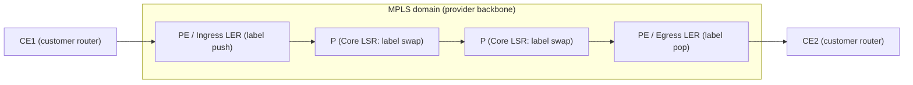
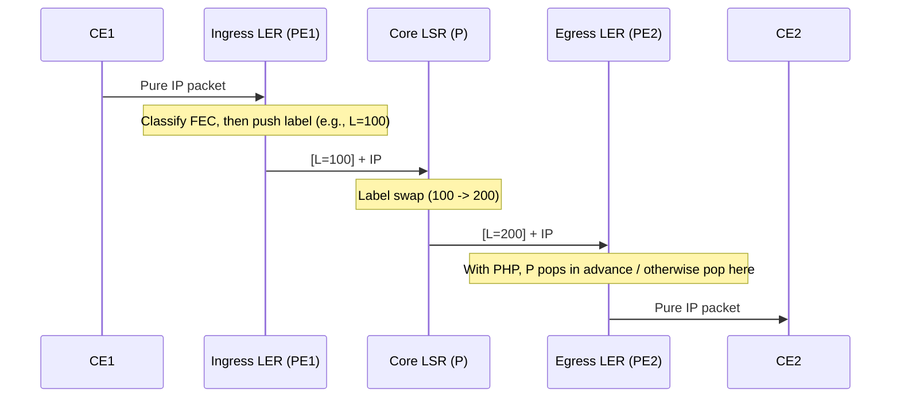

# MPLS (Multi-Protocol Label Switching)

## 1. Overview

> **MPLS (Multi-Protocol Label Switching)** is a **label-based packet forwarding (Label Switching) technology** that attaches a fixed-length **Label** to IP packets so that routers perform high-speed switching and path decisions using only the label value instead of Longest Prefix Match on the destination IP address. Because it operates between L2 and L3, it is often called a **"Layer 2.5"** technology.

The background for MPLS lies in **three structural limitations of traditional IP routing** that became apparent with the surge in Internet traffic in the late 1990s. The first is the **performance problem**. The method of having each router look up its routing table hop by hop via longest prefix match was difficult to hardware-accelerate because prefixes have variable length, and it became a bottleneck in early routers. MPLS looks up a 20-bit fixed label with exact match, making ASIC-based line-rate switching easy. Of course, today TCAM-based hardware forwarding has become universal, diluting the pure "speed advantage" itself, but the second and third motivations below remain valid.

The second is **the absence of Traffic Engineering**. IGPs (OSPF, IS-IS) always choose only the shortest path, so even when traffic concentrates on a particular link and causes congestion, spare detour paths cannot be utilized. MPLS can explicitly place traffic per **path (LSP)** rather than per destination, enabling path assignment that reflects bandwidth, latency, and hop constraints. The third is **the need for scalable VPN services**. For a carrier to isolate and accommodate many customers' private networks on a single backbone, per-customer routing separation is required, and MPLS/BGP L3VPN achieves this without overlay tunnels while minimizing state in the backbone core. Of these three motivations, what actually made MPLS the dominant backbone technology was **VPN and TE**.

The characteristics of MPLS are summarized as follows. These characteristics form the foundation on which the VPN, TE, and CoS services discussed later are all built.

- **Protocol independence (Multi-Protocol)**: It encapsulates and forwards with labels regardless of the upper (IPv4/IPv6) and lower (Ethernet, PPP, Frame Relay, ATM) layers. This is the basis for the name "Multi-Protocol."
- **Connection-Oriented forwarding**: Unlike connectionless IP, a logical path called an LSP is set up in advance before entry, and forwarding occurs only along that path.
- **Minimized core state**: Policy and classification are concentrated at the edge (PE/LER) and the core (P/LSR) only performs label switching, so the core burden does not grow linearly even as the number of customers increases.
- **Built-in carrier-grade functions**: It provides as standard the functions needed for carrier backbones, such as CoS/QoS (TC/EXP bits), traffic engineering, and FRR (50ms recovery).

## 2. MPLS Structure and Core Concepts

An MPLS domain consists of customer networks (CE) and the provider backbone (PE, P); traffic has a label attached (push) upon entering the domain, passes through the core via label replacement (swap), and has it removed (pop) just before exiting. The overall structure is as follows.

**A. Components — LER and LSR.** Nodes in an MPLS network are divided by role. An **LER (Label Edge Router)** is located at the domain boundary; at the entrance (Ingress) it classifies IP packets and attaches labels, and at the exit (Egress) it strips labels and forwards again via pure IP routing. From a carrier network perspective, the LER corresponds to the **PE (Provider Edge)** router that directly faces customer equipment (CE). An **LSR (Label Switching Router)** is a **P (Provider) router** located in the core, responsible only for swapping the incoming label for an outgoing label and forwarding without opening the IP header. This **edge-core separation** philosophy—"complex decisions are made once at the edge, the core does simple switching"—is the key to MPLS scalability.

**B. FEC (Forwarding Equivalence Class).** An FEC means "a set of packets that must be forwarded in the same way (same LSP, same treatment)." The Ingress LER classifies arriving packets into a specific FEC according to policy such as destination prefix, VPN membership, and CoS, and attaches the label mapped to that FEC. In other words, **classification happens only once at the entrance**, and thereafter the core looks only at labels. For example, if "gold-class traffic destined for 10.1.0.0/16" is defined as one FEC, all packets meeting that condition receive the same path and the same queuing.

**C. Label and Label Stack.** An MPLS label is a 32-bit **Shim header** inserted between the L2 header and the L3 header, with the structure shown in the table below. In particular, the **label stack** allows multiple labels to be nested (pushed), enabling a **tunnel-in-tunnel** structure layered so that the outer label is for backbone forwarding (transport) and the inner label is for service identification (VPN, pseudowire). This is the foundation of MPLS VPN.

| Field | Size | Description |
|------|------|------|
| Label | 20 bit | Label value (0–1,048,575). 0–15 are reserved labels (e.g., 0=IPv4 Explicit NULL, 3=Implicit NULL) |
| TC(EXP) | 3 bit | Traffic Class — indicates CoS/QoS priority (DiffServ mapping) |
| S(Bottom of Stack) | 1 bit | 1 if this is the bottom label in the stack |
| TTL | 8 bit | Time To Live — loop prevention and hop count |

**D. LSP (Label Switched Path).** An LSP is a **unidirectional logical path** followed by packets of a specific FEC from the Ingress LER to the Egress LER. Two LSPs are needed for bidirectional communication. LSPs are divided into the **hop-by-hop (LDP-based)** method, which follows the IGP shortest path, and the **explicit path (RSVP-TE-based)** method, which is explicitly set up reflecting constraints.

## 3. MPLS Operating Principles and Label Distribution

The core operations of the MPLS data plane are three: **push (attach), swap (replace), and pop (remove)**. The sequence below shows how the label changes as a single packet traverses the domain.

**A. Forwarding Procedure and PHP.** The Ingress LER pushes the label mapped to the FEC, and each core LSR looks up its **LFIB (Label Forwarding Information Base)** to swap the incoming label for the outgoing label. The Egress LER pops the last label and returns to IP routing. Here the **PHP (Penultimate Hop Popping)** technique is commonly applied, in which the second-to-last (penultimate) LSR removes the label in advance so that the Egress LER does not have to do a double lookup of "pop, then IP lookup again." The Egress instructs its neighbor "strip the label and send pure IP" by advertising the reserved label **3 (Implicit NULL)**.

Each LSR's switching decision is made with a simple lookup table called the **LFIB**. For example, if a core LSR's LFIB is as below, when label 100 arrives on the input interface, it is swapped to 200 and sent out interface If2, and label 300 is popped and forwarded as IP. Because only an exact-match lookup of "input label → (operation, output label, output port)" is performed, hardware acceleration and line-rate processing are easy.

| Input Label | Operation | Output Label | Output Interface |
|-------------|------|-------------|------------------|
| 100 | swap | 200 | If2 |
| 150 | swap | 250 | If3 |
| 300 | pop | (none, IP forwarding) | If1 |

**C. TTL and Loop Prevention.** MPLS labels also have an 8-bit TTL, which is decremented by 1 at each hop, similar to the IP TTL, to prevent loops. At Ingress, the IP TTL can be copied to the label TTL (uniform mode) or handled independently (pipe mode), and when the TTL reaches 0, the packet is discarded. This is a safety mechanism that prevents packets from circulating endlessly in cases of misconfigured LSPs or temporary path inconsistencies.

**D. Label Distribution Protocols.** Exchanging label-FEC mapping information between routers requires a separate signaling protocol. Three are typically used. **LDP (Label Distribution Protocol)** distributes labels hop by hop following the paths computed by the IGP; it is simple to configure and widely used for basic transport networks, but cannot support bandwidth reservation or TE. **RSVP-TE** (an extension of RSVP) sets up LSPs reflecting bandwidth, priority, and explicit path constraints, and is the foundation of TE and **FRR (Fast ReRoute)**. **MP-BGP (Multiprotocol BGP)** plays the role of carrying VPN labels with customer routes and propagating them between PEs in L3VPN. In summary, roles are divided as **"transport labels via LDP/RSVP-TE, service (VPN) labels via MP-BGP."**

**E. Separation of Control Plane and Data Plane.** MPLS separates the control plane (IGP+LDP/RSVP-TE/BGP), which computes and distributes paths and labels, from the data plane (LFIB-based push/swap/pop), which actually switches packets. Thanks to this separation, the data plane stays simple and fast, and diverse services (VPN, TE, CoS) can be layered on by changing only control plane policy. Segment routing and SDN integration, described later, are precisely trends toward simplifying and centralizing this control plane.

## 4. Major Applications: MPLS VPN and Traffic Engineering

**A. MPLS L3VPN (BGP/MPLS IP VPN, RFC 4364).** This is the most successful MPLS application. The carrier places a per-customer **VRF (Virtual Routing and Forwarding)** table on the PE router to logically isolate customer routing within one physical device. So that different customers do not conflict even when using the same private IP range (e.g., 10.0.0.0/8), an **RD (Route Distinguisher)** is prepended to the prefix to create a globally unique VPNv4 route, and an **RT (Route Target)** controls which VRF imports that route (import/export policy). Forwarding uses a **two-level label stack**—the outer (transport) label specifies the LSP to the destination PE, and the inner (VPN) label specifies which VRF and which customer that PE should send it to. Thanks to this structure, **core P routers do not need to know customer routes at all** (they switch only the outer label), so core state does not explode even when accommodating thousands of customers. This is MPLS VPN's decisive scalability advantage over IPSec overlays.

Looking at a concrete forwarding flow with numbers makes it clearer. Suppose customer A (Seoul branch, 10.1.0.0/24) sends a packet to the same customer A (Busan branch, 10.2.0.0/24). ① The Seoul CE sends the packet destined for 10.2.0.1 to its attached PE1. ② PE1 looks up the destination in the relevant VRF, pushes the **VPN label (e.g., inner L=50)** advertised by remote PE2, and then pushes on top of it the **transport label (e.g., outer L=100)** for reaching PE2 (stack `[100][50]`). ③ Core P routers look only at outer label 100, swap it (100→200→…) and forward it, knowing nothing about the customer route 10.2.0.0/24. ④ The P router just before PE2 pops the outer label via PHP, leaving only `[50]`. ⑤ PE2 uses inner label 50 to identify that "this packet is bound for customer A's Busan VRF" and delivers it to the Busan CE via IP routing. In this way, since **the outer label handles location (which PE) and the inner label handles membership (which customer/VRF)**, thousands of customer VPNs can be accommodated without increasing core state.

**B. MPLS L2VPN (Pseudowire).** This is a service that forwards L2 frames (Ethernet, etc.) rather than L3 intact across the backbone. It is divided into **VPWS (Virtual Private Wire Service)**, a point-to-point method connecting two sites, and **VPLS (Virtual Private LAN Service)**, a multipoint method connecting multiple sites as if they were a single broadcast domain. It is used when enterprises require the same L2 segment between branches (e.g., data center extension, DCI).

**C. Traffic Engineering (MPLS-TE) and FRR.** RSVP-TE uses **CSPF (Constrained Shortest Path First)** to compute a path that satisfies constraints such as "at least 50Mbps spare, avoid a particular link" and sets up an explicit LSP. This avoids congestion on specific links caused by IGP shortest paths and increases backbone utilization. In addition, **FRR (Fast ReRoute)** locally detours traffic to a precomputed backup LSP upon link or node failure, typically achieving recovery **within 50ms**. This is much faster than IGP reconvergence (hundreds of ms to several seconds), meeting the carrier-grade availability (99.999%) requirements of real-time traffic such as voice and video.

| Application | Signaling | Core Mechanism | Typical Use |
|------|----------|---------------|-----------|
| L3VPN | MP-BGP (VPNv4) | VRF, RD, RT, two-level label | Private WAN between enterprise branches |
| L2VPN (VPWS/VPLS) | LDP/BGP | Pseudowire, MAC learning (VPLS) | DCI, L2 extension |
| MPLS-TE | RSVP-TE | CSPF, bandwidth reservation, FRR | Backbone congestion avoidance, high availability |
| Basic forwarding | LDP | Hop-by-hop LSP | Simple core switching |

## 5. Comparison — Differences from Adjacent Technologies and Implications

**A. Traditional IP Routing vs. MPLS.** IP routing is a connectionless method in which each hop independently decides via **longest prefix match** on the destination address, making path control impossible. MPLS is a connection-oriented method that classifies once at the entrance and then follows a path (LSP) via **label exact match**, enabling TE, VPN, and CoS. The fundamental reason for the difference lies in "where the decision is made"—in IP every hop decides, while in MPLS the edge decides and the core only executes. This delegation structure produces both core simplification and service diversity at the same time.

| Category | Traditional IP Routing | MPLS |
|------|------------------|------|
| Forwarding decision | Destination IP lookup at every hop | Classified once at entrance, core looks only at labels |
| Lookup method | Longest prefix match (variable) | Label exact match (fixed 20 bits) |
| Connection nature | Connectionless | Connection-oriented (LSP) |
| Path control (TE) | Not possible (always shortest path) | Possible (explicit path, bandwidth reservation) |
| VPN, CoS | Separate overlay required | Built in via label stack |
| Failure recovery | IGP reconvergence (hundreds of ms to seconds) | FRR within 50ms |

**B. LDP vs. RSVP-TE.** Both distribute labels, but LDP is policy-free distribution that "follows IGP paths as-is," so it is easy to configure with little state, but cannot do bandwidth awareness or explicit paths. RSVP-TE maintains per-link state (soft state) and establishes constrained paths, providing TE and FRR, but state accumulates in the core in proportion to the number of LSPs, and **state explosion** becomes a burden in large-scale networks. This state burden is the direct motivation for the emergence of segment routing.

**C. MPLS VPN vs. IPSec VPN.** MPLS VPN is a **trust-based** method that isolates with labels inside the carrier backbone; since there is no encryption in the core, it is fast and combines naturally with QoS and TE, but it does not extend to Internet segments and is dependent on the carrier. IPSec VPN establishes encrypted tunnels over the public Internet; it works anywhere and is inexpensive, but has large latency and performance variability and makes QoS guarantees difficult. Actual enterprise WANs often mix "MPLS for core sites, IPSec for Internet breakout and small branches," and SD-WAN is what makes this mix intelligent through software.

**D. MPLS vs. SD-WAN.** SD-WAN is an **overlay** that dynamically selects among heterogeneous circuits—MPLS, Internet, LTE/5G—with application-aware policies, lowering costs by leveraging inexpensive Internet circuits. However, since SD-WAN fundamentally depends on underlay quality, the MPLS underlay is still preferred for traffic where latency and loss guarantees are absolute. In other words, the two are converging not as substitutes but as a complementary relationship of **MPLS (quality-guaranteed underlay) + SD-WAN (policy- and cost-optimized overlay)**.

## 6. Advanced — Evolution to Segment Routing (SR) and Latest Trends

MPLS's long-standing weakness was that **separate label distribution protocols**, LDP and RSVP-TE, had to be **operated and synchronized**, and that using TE caused per-hop state to accumulate in the core. **Segment Routing (SR)** aims to resolve this. SR advertises a **SID (Segment Identifier)** for each node and link via IGP (IS-IS/OSPF) extensions, and the Ingress specifies the path in the packet header as a **SID list (source routing)**. As a result, the core need not maintain separate state, **LDP and RSVP-TE can be eliminated**, and the control plane is greatly simplified.

SR has two data planes. **SR-MPLS** reuses the existing MPLS label stack as its data plane, making it a **practical upgrade path** for carriers already operating MPLS to adopt by changing only the control plane without replacing hardware. By contrast, **SRv6** discards MPLS labels altogether and carries SIDs in the IPv6 extension header (SRH), operating over native IPv6 and eliminating MPLS entirely. According to industry sources, migrations today generally tend to **go through SR-MPLS first** and gradually proceed to SRv6, and SRv6 is presented as preferred in 5G transport, edge, and large-scale cloud (however, adoption speed and share vary by carrier, so definitive statements are avoided). In fact, Rakuten Mobile is cited as a case of simplifying its transport network with an SRv6-based overlay together with Cisco and implementing cloud SD-WAN.

In addition, SR combines well with central controllers (SDN) to program paths as **SR-TE**, and it is developing in the direction of simultaneously taking "MPLS's carrier-grade functions + SDN's central control and automation." As expected exam directions, comparison/outlook questions that tie together ① MPLS basic structure and operation (label stack, push/swap/pop, PHP), ② the principles of L3VPN RD/RT and two-level labels, ③ 50ms recovery with TE and FRR, and ④ **the comparison and evolutionary relationship of MPLS with SD-WAN and segment routing** are likely.

## 7. Considerations and Implications (Professional Engineer's Perspective)

- **Application strategy — Hierarchical service design**: A dual approach of keeping the transport network on simple LDP and selectively applying RSVP-TE (or SR-TE) only to segments requiring TE and high availability reduces state burden and operational complexity. VPN and CoS policies must be concentrated at the edge (PE) to keep the core lightweight and secure scalability.

- **Trade-off — Quality guarantee vs. cost/flexibility**: MPLS guarantees SLA, QoS, and low latency, but circuit unit prices are high, provisioning is slow, and carrier dependency is significant. Conversely, Internet + SD-WAN is inexpensive and agile but has quality variability. Tiering circuits according to traffic importance (real-time/core business systems vs. Internet/backup) in a hybrid WAN is the realistic optimum.

- **Security perspective — Isolation ≠ encryption**: The "isolation" of MPLS VPN is label-based logical separation, not encryption. In regulated and financial environments that do not trust the carrier backbone, IPSec should be layered on top of MPLS, or end-to-end encryption should be designed separately from a zero trust/SASE perspective.

- **Transition and outlook — SR/SRv6 and SDN integration**: For new and expanding backbones, SR-MPLS should be considered first instead of LDP/RSVP-TE, and if there is a roadmap for full IPv6 adoption, 5G transport, and edge expansion, SRv6 should be incorporated in stages. However, since SRv6 has issues with header overhead and the maturity of hardware support, it should be adopted gradually after validation.

- **Related technologies**: MPLS is closely linked with QoS (DiffServ, EXP mapping), SD-WAN, SASE/ZTNA, 5G private networks and network slicing, and Data Center Interconnect (DCI). In a professional engineer's answer, it is desirable to position and describe it not as a single technology but as **one layer of an end-to-end WAN architecture**.

## References

- IETF RFC 3031, *Multiprotocol Label Switching Architecture* — https://datatracker.ietf.org/doc/html/rfc3031
- IETF RFC 3032, *MPLS Label Stack Encoding* — https://datatracker.ietf.org/doc/html/rfc3032
- IETF RFC 4364, *BGP/MPLS IP Virtual Private Networks (VPNs)* — https://datatracker.ietf.org/doc/html/rfc4364
- IETF RFC 8402, *Segment Routing Architecture* — https://datatracker.ietf.org/doc/html/rfc8402
- Segment Routing community, SR-MPLS/SRv6 trends — https://www.segment-routing.net/
- WWT, *Segment Routing: The Future of MPLS* — https://www.wwt.com/article/segment-routing-the-future-of-mpls

---
> **In one line**: MPLS is an L2.5 connection-oriented technology that attaches a 20-bit label to IP packets so they pass through the core via exact-match switching; based on edge-core separation, it provides carrier-grade services such as L3/L2 VPN, traffic engineering, and FRR, and today it is evolving and being complemented by segment routing (SR-MPLS, SRv6), which relieves the state burden of LDP/RSVP-TE, and by SD-WAN.
