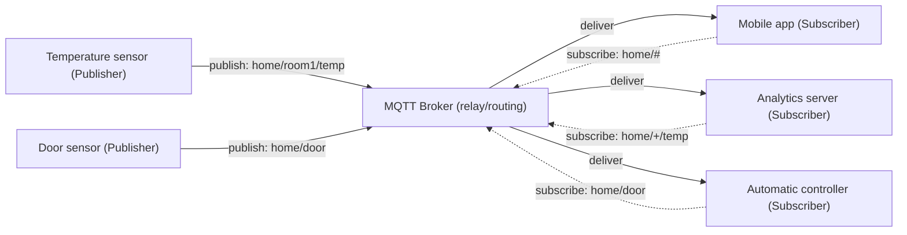
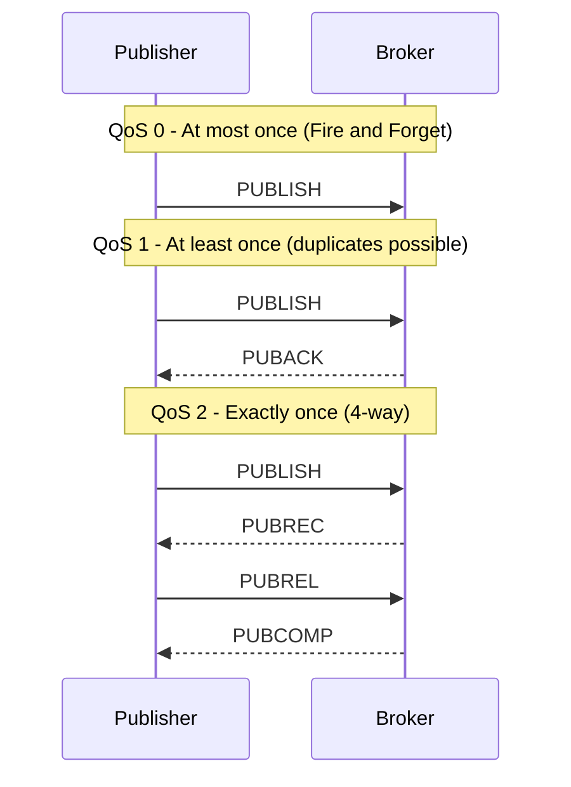
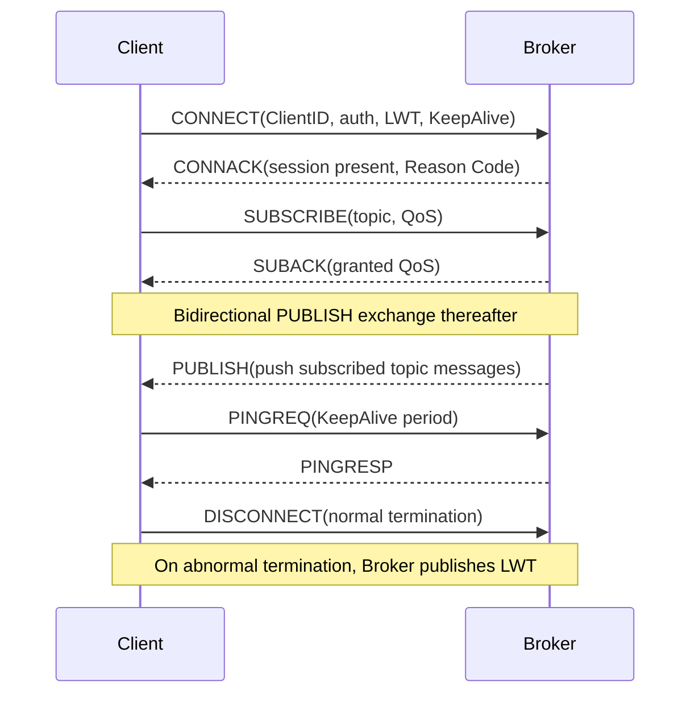

# MQTT (Message Queuing Telemetry Transport)

## 1. Overview

> **Definition**: MQTT is a **lightweight messaging protocol** based on the Publish/Subscribe model; it is an application-layer protocol designed so that many devices communicate asynchronously through a Broker in environments with limited bandwidth, power, and computing resources. It was standardized as OASIS MQTT 3.1.1 (2014), the same specification was adopted as ISO/IEC 20922:2016, and its functionality was greatly expanded with OASIS MQTT 5.0 in 2019.

MQTT emerged from the industrial reality that in 1999 IBM and Arcom (now Eurotech) needed to collect sensor data reliably for remote monitoring of oil pipelines (SCADA) even over **links with narrow bandwidth and frequent latency and disconnection, such as satellite links**. HTTP, the standard at the time, had heavy headers due to its Request/Response structure, could not let the server actively push data to clients (polling required), and incurred a high cost to re-establish the connection for every request, making it unsuitable for handling thousands of low-spec nodes in real time. MQTT solves these problems with **extreme lightweighting of a 2-byte fixed header**, **connection-oriented persistent sessions**, and **broker-centric publish/subscribe decoupling**.

The core value of the publish/subscribe model lies in **decoupling the temporal, spatial, and synchronization coupling of senders and receivers**. The publisher does not need to know who the receivers are, how many there are, or whether they are currently connected. The publisher throws a message onto a specific **Topic**, and every client that has subscribed to that topic receives the message through the broker. Thanks to this structure, adding or removing new sensors or analysis servers requires no changes to existing nodes' code, and MQTT has established itself as the de facto standard protocol for IoT, smart factory, and connected car environments that scale to hundreds of thousands of devices.

Its characteristics can be summarized as: ① ultra-lightweight (minimum fixed header of 2 bytes, binary frames without text overhead), ② asynchronous many-to-many communication based on publish/subscribe, ③ reliability adjustable via three levels of quality of service (QoS 0/1/2), ④ support for server push over persistent TCP connections, and ⑤ session management features for unstable links such as Last Will messages (LWT), Retained messages, and Keep Alive.

The combination of these characteristics is important because the constraints of IoT environments are not just one but **compound constraints in which bandwidth, power, computation, and connection stability are all lacking at once**. A protocol that merely shrinks headers or merely increases reliability cannot satisfy these compound constraints. By providing lightweightness (bandwidth, power), QoS choice (reliability), publish/subscribe decoupling (scalability), and session management (connection stability) in balance within a single protocol, MQTT has become a practical solution connecting low-spec endpoints to the cloud ingestion layer. This balance is the fundamental reason MQTT has maintained its status as an IoT standard for some 20 years.

## 2. MQTT Architecture and the Publish/Subscribe Model

MQTT communication consists of the **Publisher**, which produces messages; the **Subscriber**, which receives messages; and the **Broker**, which relays between the two and is responsible for routing, sessions, and QoS. Publishers and subscribers are collectively called clients, and a single client can be both a publisher and a subscriber at the same time. Since every message must pass through the broker, the broker is the backbone of the system and can become a single point of failure (SPOF), so broker clustering and redundancy are essential in practice.

In the structure above, publishers and subscribers do not know each other at all and meet only through topic names. For example, the temperature sensor merely publishes 25.3℃ to `home/room1/temp`, and the broker consults the subscription table to decide to whom among the mobile app, analytics server, and controller, and how many copies, this value is delivered. This point—**the center of relationships is the topic, not the node**—is fundamentally different from the endpoint-centric thinking of REST APIs, and combines naturally with Event-Driven Architecture (EDA).

### A. Topics and Wildcards

A topic is both the address and the classification scheme of a message, a string with hierarchy levels separated by slashes (`/`) (e.g., `factory/line2/machine5/vibration`). Topics are created dynamically at publish time without needing to be defined or registered in advance, which is flexible, but conversely, **if naming conventions are not standardized at the organizational level, topics proliferate uncontrollably** and operations become difficult. In practice, a hierarchical design narrowing from top to bottom, such as `country/factory/line/equipment/measurement`, and conventions such as prohibiting leading slashes (`/`) and spaces are documented.

Subscribers subscribe to multiple topics at once using two wildcards. The single-level wildcard `+` replaces only one level, so `home/+/temp` matches `home/room1/temp` and `home/room2/temp`; the multi-level wildcard `#` covers all levels below it, so `home/#` subscribes to everything under `home` (it must be placed at the end of the topic). Wildcards can be used only for subscriptions and not in publish topics. For example, a factory monitoring dashboard can selectively collect only the vibration values of all lines and equipment with `factory/+/+/vibration`, so topic design itself becomes data filtering design.

### B. Three Levels of QoS (Quality of Service)

MQTT's most distinctive feature is QoS, which selects the reliability level per message. Although TCP itself provides reliability, the protocol layer adds separate acknowledgement procedures to guarantee even **reconnection, duplication, and loss scenarios** from the application's perspective. Since reliability and overhead are exactly inversely proportional at each level, designers must decide the trade-off according to the nature of the data.

**QoS 0 (At most once)** sends once without a response and forgets, allowing loss in exchange for the smallest overhead. It suits high-frequency telemetry where missing one or two messages is harmless, such as temperature or illuminance updated dozens of times per second. **QoS 1 (At least once)** retransmits until it receives the receiver's PUBACK, so there is no loss, but **duplicate reception** can occur during retransmission, so the application must guarantee idempotency. **QoS 2 (Exactly once)** eliminates both duplication and loss with the 4-way handshake PUBLISH→PUBREC→PUBREL→PUBCOMP, but requires two round trips, so latency and load are the greatest. It is used restrictively only where a single accurate delivery is essential, such as payment, billing, and command delivery. For example, a typical practical design mixes levels, such as using QoS 2 for a smart meter's 15-minute reading, which is directly tied to billing, and QoS 0 for a real-time power monitoring graph.

### C. Session Management Features: LWT · Retain · Keep Alive

Premised on unstable wireless and mobile environments, MQTT has three mechanisms for managing connection state. First, the **Last Will and Testament (LWT)** is a message the client registers in advance upon connecting; if that client's connection drops abnormally, the broker publishes it on its behalf. For example, if a sensor registers `status/sensor7 = offline` as its last will, the monitoring system can immediately recognize a failure even if the sensor suddenly disappears due to battery depletion. Second, the **Retained Message** is a feature in which the broker stores the latest single message per topic and **immediately delivers it to newly subscribing clients**, so that nodes connecting later can immediately know the last state value without polling. Third, with **Keep Alive**, the client sends PINGREQ within the specified period to signal that the connection is alive, and if the broker receives no signal within 1.5 times that period, it considers the connection lost and publishes the LWT if necessary. Combining these three features, MQTT maintains state consistency even in environments where tens of thousands of nodes connect and disconnect frequently.

## 3. Communication Procedure and Protocol Stack

MQTT operates on top of TCP/IP, using default port 1883 for plaintext and 8883 when TLS-encrypted. Communication always begins with connection establishment, in which the client sends **CONNECT** to the broker and the broker responds with **CONNACK**. The CONNECT packet contains the Client ID, authentication information (username/password), Keep Alive period, Clean Session flag, and LWT settings. Afterward, the client freely exchanges SUBSCRIBE/PUBLISH and sends DISCONNECT when terminating.

Viewing the entire connection lifecycle as a sequence gives the following. You can see the structure in which subscriptions and publications interleave after connection establishment, while Keep Alive sustains the connection in the background.

Viewing the MQTT command flow together with the layers gives the following.

| Layer | Protocol/Technology | Role |
|------|--------------|------|
| Application | MQTT | Publish/subscribe, QoS, session management |
| Security | TLS/SSL | Confidentiality, integrity, server/client authentication |
| Transport | TCP (1883/8883) | Reliable, ordered stream |
| Network | IP | Routing, addressing |

The Clean Session (3.1.1) / Clean Start and Session Expiry (5.0) flags determine whether to continue the previous session upon reconnection. If Clean Session is set to false, the broker queues QoS 1 and 2 messages during the offline period and delivers them upon reconnection, so intermittently connected mobile and low-power nodes do not miss messages. Conversely, if set to true, each connection starts as a new session and leaves no state.

Meanwhile, for ultra-low-power sensor networks for which even TCP is burdensome, a variant called **MQTT-SN (MQTT for Sensor Networks)** exists. MQTT-SN operates over non-TCP media such as UDP and ZigBee, uses 2-byte topic IDs instead of long string topics, and a gateway translates between MQTT-SN and standard MQTT. This is a design reflecting the practical constraints of wireless sensor nodes that must last for years on batteries.

Looking concretely at MQTT's lightweightness from the packet structure perspective, every control packet begins with a **Fixed Header** of at least 2 bytes. The upper 4 bits of the first byte indicate the packet type (14 types such as CONNECT and PUBLISH), the lower 4 bits indicate flags (DUP, QoS, RETAIN), and the following variable-length field encodes the remaining length. After that, a variable header and payload are attached only when necessary. Unlike HTTP, which consumes hundreds of bytes of text headers per request, the overhead of an MQTT PUBLISH is only a few bytes precisely because of this extremely compressed binary frame design. In environments where hundreds of thousands of nodes publish thousands of messages per second, this difference leads to large gaps in bandwidth, power, and cloud ingestion costs.

## 4. Comparison with Similar Protocols

To understand MQTT's position, one must look at the differences from competing and complementary protocols together with **the reasons the differences arise**. Compared with HTTP, HTTP is request/response-based, making it hard for the server to actively push data to clients, and its large headers consume battery and bandwidth, whereas MQTT secures real-time responsiveness and efficiency with persistent connections and server push. However, HTTP leads in firewall traversal, caching, and ecosystem maturity, so HTTP/REST remains advantageous for large file transfers and public APIs.

CoAP (Constrained Application Protocol) is a UDP-based request/response REST style that is strong at direct node-to-node communication without a broker and has even smaller overhead, but MQTT has the edge in scenarios requiring many-to-many publish/subscribe and state maintenance. AMQP is a heavy enterprise messaging standard providing financial-grade transactions, routing, and queuing; its reliability is high, but it is too heavy for IoT endpoints. Kafka, on the other hand, specializes in persisting and replaying log and event streams of millions per second on disk, so the **MQTT+Kafka hybrid**, in which endpoint data collected by MQTT is handed off from a gateway to Kafka and connected to a large-scale analytics pipeline, is the standard practice.

| Category | MQTT | CoAP | HTTP | AMQP |
|------|------|------|------|------|
| Communication model | Pub/Sub | Req/Resp (REST) | Req/Resp | Pub/Sub, queues |
| Transport | TCP | UDP | TCP | TCP |
| Header overhead | Very small (2B~) | Small (4B~) | Large | Medium |
| QoS | 0/1/2 | Confirmable/Non | None | Transactions |
| Broker | Required | Not required | Not required | Required |
| Main use | Real-time IoT collection | REST for constrained nodes | Web, public APIs | Enterprise, finance |

Looking at actual industrial applications, AWS IoT Core, Azure IoT Hub, and Google Cloud IoT all adopted MQTT as the default protocol for device connectivity; connected cars use MQTT extensively for vehicle-to-cloud telemetry, and smart factories for equipment data collection combined with OPC-UA. For example, the case of early versions of Facebook Messenger adopting MQTT to save mobile battery shows that this protocol is valid not only for IoT but also for real-time mobile communication.

Looking at the quantitative benefits with an example, suppose a battery-powered remote sensor reports its status to a server every 30 seconds. An HTTPS polling approach must repeat the TCP 3-way handshake, TLS negotiation, and hundreds of bytes of request/response headers every cycle, whereas MQTT establishes the connection only once initially and then sends only a few-byte PUBLISH over the persistent session. In measured cases from several vendors, this approach is reported to reduce network traffic and power consumption by several times or more for the same data transmitted, which translates directly into differences in total cost of ownership (TCO)—communication charges and battery replacement cycles—at the scale of tens of thousands of devices. However, since the exact savings vary with payload size, period, and link quality, caution is needed in generalizing.

## 5. Advanced: The Evolution of MQTT 5.0 and Latest Trends

MQTT 5.0, standardized in 2019, introduced a large number of enterprise features while addressing the limitations of 3.1.1 revealed in large-scale IoT operations. First, by introducing **Reason Codes and User Properties**, it returns finer-grained causes of connection and publish failures and allows arbitrary metadata (key-value) to be carried in messages, separating into the protocol header the context that had been forced into the application payload. Second, **Shared Subscription**, in the form `$share/group/topic`, lets multiple subscribers in the same group share the messages, solving the problem of load concentrating on a single subscriber and supporting **consumer-side horizontal scaling (load balancing)** at the protocol level. Third, **Topic Alias** replaces long topic strings with 2-byte integers to save bandwidth on repeated transmission, and **Message Expiry Interval** prevents old commands from being delivered late and causing malfunctions. Fourth, it officially supports the **request/response pattern (Response Topic, Correlation Data)**, standardizing RPC-style interaction over publish/subscribe, and with **flow control (Receive Maximum)** it keeps slow subscribers from being overwhelmed by the broker.

As for recent trends, industrial standardization bodies have adopted the **Sparkplug B** specification, which layers data structure and state management conventions on top of MQTT, raising interoperability in smart factories; MQTT over WebSocket (direct browser connection) and ultra-large-scale expansion through broker clustering and edge-cloud bridging are also being actively applied. In Korea as well, MQTT is used as the de facto standard for the data collection layer in smart city, digital twin, and power AMI (Advanced Metering Infrastructure) infrastructure, so from the perspective of an Information Management Professional Engineer, it must be understood not as a mere protocol but as **the data collection and integration backbone of IoT platform architecture**.

## 6. Considerations and Implications

When applying MQTT to real systems, a professional engineer must comprehensively consider the following perspectives.

First, **strengthening security is mandatory, not optional**. Since MQTT itself is a plaintext protocol, the transport segment must be encrypted with TLS (8883), and in addition to Client ID and username/password-based authentication, mutual authentication based on X.509 certificates and OAuth tokens should be applied. Also, unless per-topic access control (ACL) restricts the topics a particular client can publish and subscribe to, a single compromised node can eavesdrop on and pollute all topics. Omitting security for the sake of lightweightness is the most common cause of incidents.

Second, **broker availability and scalability** must be secured early in design. Since all traffic passes through the broker, the broker becomes both a SPOF and a performance bottleneck, so horizontal scaling must be planned with broker clustering and redundancy, consumer scaling via shared subscriptions, and a bridging topology connecting edge brokers and central brokers.

Third, **careful selection of QoS and session policies** determines cost and reliability. Indiscriminately using QoS 2 and Clean Session=false for every message causes the broker's storage and retransmission load to explode. A policy-based design is needed that classifies data by importance and loss tolerance, applies QoS 0 to telemetry and QoS 1–2 to state and commands differentially, and decides whether to maintain sessions according to node characteristics.

Fourth, **topic naming standardization and governance** determine long-term operability. The flexibility of freely created topics ends in unmanageable chaos without standards, so hierarchical naming rules, namespaces, and versioning must be documented at the organizational level and linked with the data governance framework.

Fifth, **an integration strategy with related technologies** must be drawn up together. Since MQTT is a protocol optimized for endpoint collection, real value can be created only by designing the architecture from an end-to-end data pipeline perspective, including integration with post-collection stream processing (Kafka), time-series storage (TSDB), real-time analytics, and digital twins.

In sum, MQTT must be understood beyond a simple communication protocol as **the ingestion layer standard** of IoT data architecture, and one must not overlook that the protocol's advantage of lightweightness is always intertwined with the operational challenges of security, availability, and governance. In particular, as the number of devices grows exponentially in the era of hyper-connectivity, **the maturity of large-scale operating systems (scaling, security, observability)** determines project success more than protocol choice. In the future, it is expected to expand into ultra-low-latency control combined with 5G and edge computing, and bidirectional intelligent control leveraging MQTT 5.0's request/response and shared subscription features is expected to spread; within this trend, a professional engineer must be able to quantitatively judge the trade-offs among required reliability, cost, and scalability to present the optimal architecture.

## References
- OASIS, "MQTT Version 5.0 Specification" (2019). https://docs.oasis-open.org/mqtt/mqtt/v5.0/mqtt-v5.0.html
- OASIS, "MQTT Version 3.1.1" / ISO/IEC 20922:2016. https://docs.oasis-open.org/mqtt/mqtt/v3.1.1/mqtt-v3.1.1.html
- MQTT.org, "MQTT: The Standard for IoT Messaging". https://mqtt.org/
- HiveMQ, "MQTT Essentials" series. https://www.hivemq.com/mqtt-essentials/

---

> **In one line**: MQTT is an IoT messaging standard that provides lightweight, reliable communication in constrained environments through broker-based publish/subscribe with QoS 0/1/2, LWT, and Retain, and with 5.0's shared subscriptions and User Properties it is a data collection backbone equipped with enterprise scalability.
