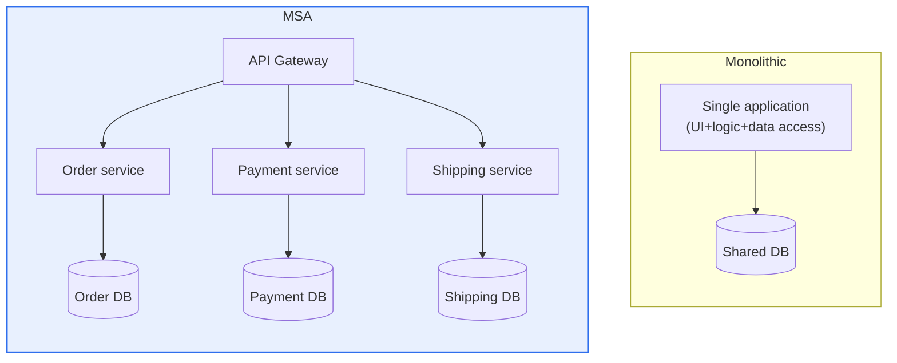
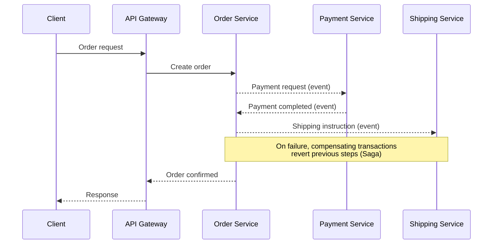

# Microservice Architecture (MSA, Micro Service Architecture)

## 1. Overview

### A. Definition and Characteristics
> **MSA** is an architectural style that composes a single application as **a collection of small services that can be independently developed, deployed, and scaled**. Each service is responsible for one business capability, has its own database, communicates through lightweight APIs (mainly HTTP/REST and messaging), and operates autonomously.

The core idea of MSA is "**split one giant thing into many small things and make each independent**." In a traditional Monolith, the UI, business logic, and data access are bundled into one large deployment unit. When the scale is small, this structure is simple and efficient, but as the application grows, three chronic problems appear. First, even small modifications require rebuilding and redeploying the whole, slowing the deployment cycle. Second, specific features cannot be scaled partially, so even when traffic concentrates on one feature, the entire application must be replicated. Third, a memory leak or failure in one module paralyzes the whole process, spreading the failure across the board.

MSA solves these problems by decomposing into independent services by capability (e.g., membership, order, payment, shipping). Since each service has its own storage and is deployed independently, you can fix only the payment logic and deploy only the payment service (**fast deployment**), scale out only the order service when orders surge (**efficient scaling**), and keep membership and order working even if the shipping service dies (**fault isolation**). From an organizational perspective as well, autonomy arises for small teams to have full authority to develop and operate each service. This autonomy is MSA's greatest benefit, but it must be understood together that the price is taking on problems of an entirely different level of difficulty called "distributed systems"—network latency, partial failure, data consistency, and operational complexity.

### B. Background
Three trends are intertwined in the rise of MSA. The first is **business speed**. As competition among web and mobile services intensified, the agility to "deploy dozens of times a day" became a condition for survival, and a monolith that deploys everything at once could not deliver this speed. The second is **the maturation of cloud and containers**. With the emergence of elastic infrastructure that can instantly add and remove servers as needed, and containers (Docker) and orchestration (Kubernetes) that lightly package and deploy services, the foundation for actually operating numerous small services was laid. The third is **organizational theory (Conway's Law)**. From the insight that "the structure of a system resembles the communication structure of the organization that builds it," attempts to align small autonomous team structures with small autonomous service structures led to MSA.

### C. Implementation Principles
| Principle | Content |
|---|---|
| **Single responsibility** | A service focuses on one business capability (domain) |
| **Autonomy and independent deployment** | Independent development, deployment, and scaling per service |
| **Decentralized data** | Each service has its own database (no DB sharing) |
| **Fault isolation** | Designed so that one service's failure does not propagate to the whole |
| **API communication and loose coupling** | Communicate only through standard interfaces (REST/messaging) |
| **Automation** | Offset operational burden with CI/CD, monitoring, and infrastructure automation |

Among these principles, the one that most frequently collapses in practice is "**decentralized data**." If multiple services share a single database for convenience, deployments are separated but data is tied together, so changing just one schema requires multiple services to be deployed together, degenerating into a "**distributed monolith**." This is the worst form, taking on both the coupling of a monolith and the complexity of MSA, so maintaining per-service data ownership is the key discipline for MSA success.

## 2. Monolithic vs. MSA Structure

The structural diagram below shows the differences in deployment and data ownership between the two architectures. A monolith is one process and one DB, while MSA consists of multiple services and per-service DBs connected via APIs.

The difference between the two structures is not simply "one lump or split pieces" but **where complexity is located**. In a monolith, complexity is inside the code (a huge codebase), while in MSA, complexity moves between services (network, communication, data consistency). Therefore, MSA has high initial complexity and actually becomes over-engineering for small, simple services. The "Suitable for" row in the table below is the criterion for this judgment.

| Category | Monolithic | MSA |
|---|---|---|
| **Structure** | Single integrated | Collection of independent services |
| **Deployment** | All at once | Independent per service |
| **Scaling** | Horizontal scaling of the whole | Selective scaling of needed services only |
| **Failure** | Affects the whole | Isolated (partial failure) |
| **Data** | Shared DB (strong consistency easy) | Distributed DB (eventual consistency) |
| **Initial complexity** | Low | High (distributed system) |
| **Suitable for** | Small-scale, simple, early startups | Large-scale, complex, frequent changes, large organizations |

As practical cases, it is widely known that large e-commerce and streaming services converted from monoliths to MSA because they could not cope with traffic surges and frequent feature additions. Conversely, it is also common for early startups that followed the trend and split into dozens of services from the start to fail to cope without operations staff and automation and revert to a monolith (the so-called "MSA rollback"). The lesson from these contrasting cases is clear—**MSA is not a goal but a means chosen when the scale to handle and the organizational and automation capabilities are in place**.

## 3. Inter-Service Communication and Data Consistency

When services are split, "work that must succeed together or fail together" must be processed across multiple services. For example, "create order → approve payment → deduct inventory" is one logical transaction but is scattered across three services. In a monolith, it would be processed atomically with a single DB transaction, but in MSA where each service has a separate DB, traditional distributed transactions (2PC) do not fit well due to performance and availability issues.

So MSA gives up strong consistency (immediate agreement) and accepts **eventual consistency**, instead aligning data integrity by reverting failures. The representative pattern is the **Saga**. A saga executes local transactions of multiple services sequentially, and if it fails midway, it executes "**compensating transactions**" that cancel already completed steps to revert the whole. In the sequence above, if the shipping instruction fails, the payment is refunded (compensated) and the order is canceled. Sagas are further divided into the orchestration method, in which one service directs the flow, and the choreography method, in which each service subscribes to events and reacts autonomously.

Another axis for dealing with partial failure is **resilience patterns**. To prevent calls from waiting indefinitely and spreading into cascading failure when a particular service slows down or dies, a **circuit breaker** blocks calls to the failed service for a period of time, and **timeouts, retries, and bulkheads (resource isolation)** contain failures. Without these patterns, MSA's fault isolation benefit—"one service's failure does not spread to the whole"—remains theoretical. In other words, fault isolation in MSA is not obtained automatically but is a design outcome realized only by explicitly implementing these patterns.

## 4. Service Mesh

When services in MSA grow to dozens or hundreds, implementing the aforementioned retries, circuit breakers, authentication, and monitoring in code for each service becomes unrealistic. If languages and frameworks vary, the same logic must be rewritten several times, and every service must be redeployed whenever a policy changes. A **service mesh** is an approach that separates these "common concerns of inter-service communication" from application code and handles them collectively at the infrastructure layer (sidecar proxy).

The core idea is to attach a **sidecar proxy (Envoy, etc.)** next to each service so that all traffic the service sends and receives passes through this proxy. The proxy then handles traffic routing, retries, circuit breaking, mTLS encryption, authentication, and monitoring on the service's behalf, and developers can focus solely on business logic. Policies are set declaratively at the center (control plane) and applied to all services at once without code modification or redeployment.

| Element | Content | Effect |
|---|---|---|
| **Sidecar proxy** | Handles communication next to each service (Envoy) | Separates communication logic from code |
| **Traffic management** | Routing, retries, circuit breakers, canary | Zero-downtime deployment, resilience |
| **Security** | mTLS mutual authentication, inter-service encryption | Zero trust internal network |
| **Observability** | Distributed tracing, metrics, log collection | Easy tracing of failure causes |

The representative implementation is **Istio**, consisting of a data plane (Envoy proxies) and a control plane. However, a service mesh is not free either. As sidecars increase, resource consumption and latency rise and operational difficulty increases, so when the number of services is small, the practical benefit of adoption is not large. Recently, a lightweight trend (ambient mesh) that uses node-level proxies instead of sidecars has also appeared, so it should be noted that the service mesh, too, is something to be chosen according to scale and need, not a mandatory accessory of MSA.

## 5. Advanced — MSA Transition Strategy and Recent Trends

The most realistic cause of failure in adopting MSA is not technology but "**how you start**." A principle widely accepted as a rule of thumb is "**Monolith First**": when domain boundaries are uncertain in the early stages, it is safe to start with a well-structured monolith, learn the business and its boundaries, and then gradually transition by separating out services starting with parts that change frequently or need independent scaling. The representative technique used here is the **Strangler Fig pattern**, which does not tear out the existing monolith all at once but gradually replaces new and separated features with new services behind a gateway, progressively "strangling" the old system out of existence. Most real MSA transitions of large services also followed this gradual path.

**Domain-Driven Design (DDD)**'s "Bounded Context" provides the theoretical criterion for how to divide service boundaries. That is, services should be divided along boundaries of business meaning, not technical layers (screen, logic, data), to achieve decomposition with high cohesion and low coupling. Dividing too finely (excessive nano-service-ization) causes communication overhead and operational burden to explode, while dividing too coarsely eliminates MSA's benefits, so setting these boundaries is the core competency of an architect.

As recent trends, first, with **the standardization of cloud native**, Kubernetes has become the de facto standard platform for MSA deployment and operation; second, **Observability** has been integrated around distributed tracing (OpenTelemetry, etc.) and established as an essential competency for MSA operations. Third, as a reflection on the side effects of excessive microservice-ization, "**macroservices**," which aim for appropriately sized services, and the "**modular monolith**," which preserves modularity but deploys as a single unit, are being re-examined as alternatives. This can be read as the result of industry learning that MSA is not a panacea but a choice involving trade-offs.

## 6. Considerations and Implications

1. **The complexity of distributed systems is the fundamental price**. In exchange for scalability, independence, and fault isolation, MSA takes on network latency, partial failure, data consistency, and operational burden. This complexity must be managed constantly with patterns and tools such as circuit breakers, sagas, API gateways, and distributed tracing, and without the automation (CI/CD) and observability capabilities to handle it as a prerequisite, MSA actually becomes a poison.
2. **Proper service decomposition determines success or failure**. Services must be divided according to business boundaries, using DDD's bounded contexts as the criterion. Excessive granularity invites communication and management costs, while under-decomposition leads to loss of benefits, so finding the "right size" is the architect's key judgment.
3. **Gradual transition is realistic**. Rather than aiming for complete MSA from the start, starting with a monolith and separating out needed parts via the strangler pattern reduces risk. Whether to adopt MSA should be a decision integrating organization size, change frequency, and operational capability, not a technology trend.
4. **Alignment with organizational structure (Conway's Law)** is essential. Autonomous services presuppose autonomous teams. If services are split but decision-making and deployment authority remain centralized, MSA's agility benefit disappears. An architectural transition is an organizational transition.
5. **Observability and security must be designed from the start**. When services are scattered, tracing failure causes becomes difficult, so distributed tracing, centralized logging, and metrics must be in place from the beginning, and internal inter-service communication must also be protected from a zero trust perspective, such as with mTLS. These are foundational capabilities that are hard to bolt on later.

## References
- Martin Fowler, "Microservices": https://martinfowler.com/articles/microservices.html
- Istio official documentation: https://istio.io/latest/docs/
- microservices.io (Chris Richardson, pattern catalog): https://microservices.io/

---

> **In one line**: MSA is an architecture that *decomposes an application into small services that can be independently deployed and scaled*; it gains fast deployment, efficient scaling, and fault isolation at the price of distributed complexity (eventual consistency, partial failure, operational burden), and succeeds only by taming that complexity with **DDD-based boundary setting, sagas/circuit breakers, service mesh, Kubernetes, and gradual transition**.
