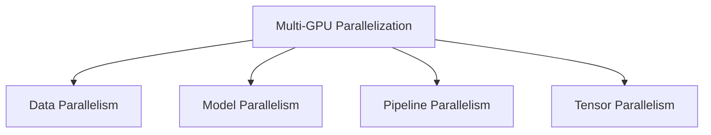

# Multi-GPU Technology (Large-Scale Neural Network Training)

## 1. Overview

### A. Definition
> A technology that **distributes computation and data across multiple GPUs to train large-scale neural networks in parallel**, serving as the core technique of Distributed Training to overcome the memory and compute limits of a single GPU.

There are two fundamental reasons multi-GPU is needed. One is that **the model does not fit into a single GPU's memory** (e.g., LLMs with tens of billions to hundreds of billions of parameters), and the other is that **training takes too long on a single GPU**. The former is addressed by splitting the model (model/tensor parallelism), and the latter by splitting the data so that multiple GPUs process it in parallel (data parallelism); in practice, large-scale training solves the problem by combining these approaches.

### B. Advantages and Background
As gigantic models such as GPT and LLaMA emerged, training became outright impossible on a single GPU, which is the backdrop that made multi-GPU essential. The benefit of parallelization is not merely speed. By combining the memory of multiple GPUs, one can hold a **large model that exceeds a single GPU**, one can **scale out** throughput by adding GPUs, and one can train with large batches to stabilize convergence. However, attaching N GPUs does not make training N times faster, because of the **communication overhead** discussed later. How much this loss is reduced is precisely the scaling efficiency.

| Advantage | Description |
|---|---|
| **Training speed** | Shortens training time through parallel computation |
| **Large-scale models** | Combines multiple GPU memories to train models exceeding a single GPU |
| **Scalability** | Scales out throughput by adding GPUs |
| **Large batches** | Stabilizes convergence with large batches |

## 2. Parallelization Methods

Parallelization methods are distinguished by **"what is being split."** **Data Parallelism** replicates the model across all GPUs and splits only the batch (data) for processing, then synchronizes the gradients each GPU computes by averaging them via **AllReduce**. It is easy to implement and the most widely used, but it presupposes that the model fits on a single GPU. When this premise breaks, **Model Parallelism** places the model itself split across multiple GPUs. Model parallelism is further subdivided into two: **pipeline parallelism** splits the layers into stages and streams data through them like a conveyor belt (though an idle "bubble" arises because a later stage cannot start until the earlier one finishes), while **tensor parallelism** splits a single large matrix operation itself into fragments computed simultaneously across GPUs. Because tensor parallelism communicates frequently in the middle of operations and thus demands very high inter-GPU bandwidth, it is usually used within a single node (NVLink).

| Method | What is split | Description |
|---|---|---|
| **Data parallelism** | Batch (data) | Replicate model, split batch, synchronize gradients via AllReduce |
| **Model parallelism** | Model (parameters) | Split a large model across multiple GPUs |
| **Pipeline parallelism** | Layers (depth) | Split layers into stages for pipelined processing (bubble exists) |
| **Tensor parallelism** | Individual operation (matrix) | Split a single matrix operation across GPUs, frequent communication |

## 3. Considerations When Building the Environment

What ultimately determines the success or failure of a multi-GPU environment is **how much communication is reduced and how much memory is saved**. As the number of GPUs grows, gradient synchronization traffic increases and becomes a bottleneck, so latency is reduced with ultra-fast interconnects such as NVLink between GPUs and InfiniBand/RoCE between nodes, together with the NCCL communication library. Also, data parallelism wastes memory by replicating the model on every GPU; **ZeRO** solves this by distributing the storage of optimizer states, gradients, and parameters across the GPUs. On top of this, **mixed precision (AMP)**, which uses 16-bit instead of 32-bit, and **gradient checkpointing**, which discards and recomputes forward-pass intermediate values, save even more memory. Because training becomes unstable as the batch grows, the learning rate is scaled up in proportion to batch size (scaling) and gradually raised at the start via warmup; the choice between synchronous SGD (accurate but held back by the slowest GPU) and asynchronous SGD (fast but imprecise) must also be considered.

| Consideration | Description |
|---|---|
| **Communication overhead** | Gradient synchronization bottleneck → mitigated by NVLink/NCCL/InfiniBand |
| **Load balancing** | Balance compute and memory across GPUs (minimize pipeline bubbles) |
| **Batch/learning rate** | Learning-rate scaling and warmup for large batches |
| **Memory management** | ZeRO, mixed precision (AMP), gradient checkpointing |
| **Synchronization method** | Synchronous (accurate/slow) vs. asynchronous (fast/imprecise) SGD |
| **Power/cooling/cost** | Heat and power management for dense GPUs, infrastructure cost |

## 4. Related Technologies and Frameworks

Most of this parallelization and optimization is abstracted away by mature frameworks, so there is little need to implement it directly. PyTorch's **DDP** provides data parallelism, **FSDP** and Microsoft's **DeepSpeed (ZeRO)** add memory distribution, and NVIDIA's **Megatron-LM** provides tensor and pipeline parallelism. Beneath these, collective communication between GPUs is handled by **NCCL**, and the hardware layer by NVLink/NVSwitch and InfiniBand/RoCE.

| Category | Examples |
|---|---|
| **Communication libraries** | NCCL, MPI |
| **Distributed frameworks** | PyTorch DDP/FSDP, DeepSpeed (ZeRO), Megatron-LM |
| **Interconnects** | NVLink/NVSwitch, InfiniBand, RoCE |

## 5. Considerations and Implications (Professional Engineer's Perspective)
- **Communication optimization is the key to scaling efficiency**: Even if GPUs are added, linear scaling collapses when the communication bottleneck is large. Interconnects and communication overlap (overlapping computation and communication) determine scaling efficiency.
- **Combining 3D parallelism**: Gigantic models are trained with **3D parallelism** that jointly uses data + pipeline + tensor parallelism, optimizing intra-node/inter-node placement according to each parallelism's communication characteristics. For example, tensor parallelism, which communicates frequently, is placed within a node linked by NVLink, while data parallelism, which communicates little, is placed across nodes.
- **Cost/power trade-off**: Dense GPU clusters incur high power and cooling costs, so a design that lowers cost per target performance through mixed precision and efficient parallelism combinations is important.
- **Expansion into AI data centers**: Large-scale GPU clusters combined with HBM and ultra-fast networks are becoming the core infrastructure of the foundation model era, and the co-optimization of software (frameworks) and hardware (interconnects) determines competitiveness.

---

> **In one line**: Multi-GPU distributes the training of large-scale neural networks depending on what is split via *data/model/pipeline/tensor parallelism*, and for the loss to remain small even as GPUs are added, optimization of **communication overhead, memory (ZeRO/AMP), and synchronization** together with infrastructure such as NCCL, DDP, and InfiniBand governs performance.
