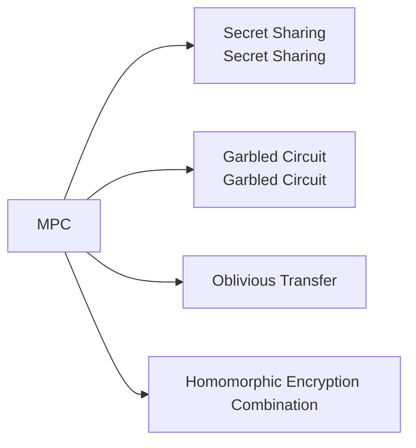
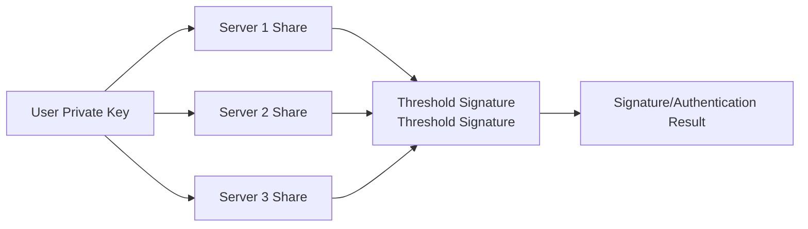

# Multi-Party Computation (MPC)

## 1. Overview

### A. Definition
> A cryptographic protocol in which **multiple mutually distrusting participants keep their respective inputs private** while jointly computing and obtaining **only the result value** of a pre-agreed function. In short, "hide the inputs, share only the result."

The thought experiment behind MPC is often explained as the "**Millionaires' Problem**." Two wealthy people want to find out only who is richer without revealing their respective net worth to each other; MPC is used when one must obtain only the computed result over data without exposing the original data to a third party or even to the counterpart. Unlike the traditional approach of gathering data in one place to compute, MPC is fundamentally different in that it **computes together without gathering the data**.

### B. Principle
The core idea is to split the input into **shares** and distribute them. A participant divides their input into several shares distributed to one another, designed so that a single individual share reveals nothing about the original (e.g., splitting a secret s by a random r into s−r and r). The participants then **perform addition and multiplication operations directly on the shares**, and at the end combine the result shares to reconstruct only the final result. Addition is easy because each participant simply adds their shares, whereas multiplication requires additional communication (Beaver triples, etc.) and is costly—this multiplication cost is the key variable of MPC performance.

### C. Characteristics and Security Models
MPC's safety is expressed in terms of resistance to collusion. Even if fewer than the **threshold (t)** of participants pool their shares, they must be unable to reconstruct the original, and the security strength varies with the adversary model.

| Item | Description |
|---|---|
| Input privacy | Cannot learn other participants' inputs |
| Correctness | Honest participants obtain the correct result |
| Collusion resistance | Secure against collusion of fewer than the threshold (t) |
| Security model | Semi-honest (honest-but-curious) vs. Malicious |

Here, the **Semi-honest** model assumes participants honestly follow the protocol but try to peek at others' inputs from the exchanged information, and is relatively lightweight. By contrast, the **Malicious** model assumes participants violate and manipulate the protocol itself, so verification steps are added and it is much heavier. This difference in assumptions is the starting point of the performance-security trade-off.

## 2. Types of MPC Techniques

The techniques for implementing MPC are divided by how the computation is expressed. **Secret sharing** splits a value into several shares and handles them with arithmetic operations, making it strong for multi-party (n-party) computation and large-scale numerical operations. **Garbled circuits** express the computation as a logic circuit and then encrypt the entire circuit to evaluate it securely between two parties. **OT** is a basic building block in which the sender transfers one of several values without knowing which one the receiver took, and it forms the foundation of garbled circuits. **Homomorphic encryption combination** is a hybrid that mixes HE—capable of operating on ciphertext—with MPC to reduce communication.

| Technique | Description | Representative |
|---|---|---|
| Secret Sharing | Fragment via Shamir threshold sharing, then arithmetic operations | SPDZ, BGW |
| Garbled Circuit | Encrypt the circuit for secure two-party computation | Yao's GC |
| Oblivious Transfer (OT) | Selective transfer where the giver does not know what was given | Foundation of GC |
| Homomorphic encryption combination | Hybrid with ciphertext operations to cut communication | FHE+MPC |

## 3. MPC-Based Authentication Services

A representative practical use of MPC is the **distributed management of keys**. In traditional authentication, the private key is stored in one place, and if that point is breached, everything is compromised (single point of failure). MPC-based authentication **generates the private key from the outset as shares that are never combined into one (DKG)**, and when a signature is needed, t/n servers cooperate in partial computation each using their own share to produce a signature **without reconstructing the complete private key anywhere** (threshold signature). Therefore, even if one or two servers are leaked, the key remains safe as long as it is below the threshold.

| Category | Description |
|---|---|
| Distributed Key Generation (DKG) | Generate and store the private key distributed without a single point |
| Threshold Signature | t/n servers must cooperate to sign → safe against single leakage |
| Applications | MPC wallets (crypto assets), distributed authentication/PKI, passwordless authentication |

For example, a crypto **MPC wallet** does not store the private key (seed) itself, structurally lowering the loss/theft risk of conventional hardware wallets.

## 4. Considerations and Implications
The greatest practical barrier to MPC is **performance**. Communication passes between participants for every multiplication, and in the Malicious model the verification burden is added, so computation and communication overhead are large. Therefore, the key is to reduce online latency through operation circuit optimization and preprocessing (pre-generating random shares in an offline phase). Nevertheless, MPC is a core pillar of **PET (Privacy-Enhancing Technologies)**, used in scenarios where multiple institutions jointly analyze without sharing the originals—joint **fraud detection** across financial institutions, **medical data collaboration** between hospitals, and AI that learns while protecting personal information. Furthermore, it complements **homomorphic encryption, differential privacy, and federated learning**, evolving toward reconciling data utilization and protection.

---

> **In one line**: MPC is a cryptographic technology in which *multiple participants jointly compute only the result while keeping their inputs private*, implemented via secret sharing, garbled circuits, and OT, and used in distributed authentication and MPC wallets—which distribute the private key to create threshold signatures without a single point of failure—and in privacy-preserving joint analysis.
