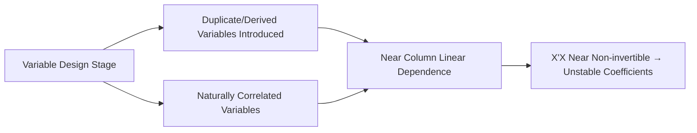

# Multicollinearity

## 1. Overview

### A. Definition
> A phenomenon in multiple regression in which **strong linear correlations exist among the independent (explanatory) variables**, making the estimation of individual regression coefficients unstable.

Multiple regression estimates as coefficients the "**pure, unique effect**" that each independent variable has on the dependent variable. For this separation to hold, the independent variables must be sufficiently independent of one another. But when two variables move in almost the same direction, the regression equation loses the basis to distinguish "whether it is A or B that explains the change in the dependent variable." Mathematically, the columns of the design matrix X become nearly linearly dependent, so X'X **approaches a singular (non-invertible) matrix**, and as the elements of its inverse blow up, the coefficient estimates fluctuate. In other words, multicollinearity is not an error in the data itself but an **identification problem arising from the variable structure**.

### B. Problems and Necessity
When multicollinearity is severe, the coefficients' **standard errors grow (variance inflation)**, so t-tests come out non-significant, and estimates may even be **flipped to a sign opposite to theory or take unrealistically large values**. For instance, entering income and consumption together causes the two coefficients to offset each other and their signs to waver. Interestingly, even in such situations **the overall predictive power of the model (R²) can be maintained**. This is because it merely fails to partition the individual variables' contributions, while the prediction the two variables jointly produce is still valid. Therefore, for the purpose of "interpreting/inferring the influence of variables" it must be addressed, but if the purpose is "prediction only," there are cases where it can be left alone. This distinction of purpose is the starting point of the response strategy.

## 2. Causes

There are roughly three sets of causes. First, **duplicate variables** that enter the same information merely in different units (entering height in both cm and inches) are perfectly correlated and thus most severe. Second, **derived/synthetic variables** made from existing variables (sums, ratios) are structurally entangled with the source variables. Third, **natural correlations** in the world of data itself (income-consumption, house area-number of rooms) are hard to remove and are the most common in practice. The table below gives examples by type.

| Cause | Example | Nature |
|---|---|---|
| **Duplicate variables** | Entering height (cm) and height (inches) together | Perfect collinearity (resolved by removal) |
| **Derived/synthetic variables** | Sum/ratio variables | Structural dependence |
| **Natural correlation** | Income-consumption, area-number of rooms | Approximate collinearity (judgment needed) |

## 3. Diagnostic Methods

The core of diagnosis is to quantify "how well a given variable is explained by a combination of the other variables." Its representative measure is **VIF (Variance Inflation Factor)**, defined for the coefficient of determination Rᵢ² obtained when regressing the i-th variable on the remaining variables as VIFᵢ = 1/(1−Rᵢ²). If Rᵢ² is 0.9, then VIF=10, meaning the variance of that variable's coefficient is inflated tenfold compared to when there is no collinearity. Because the correlation matrix examines only pairs of two variables, collinearity involving three or more can be missed, so it is supplemented with VIF and the condition index.

| Method | Judgment Criterion | Principle |
|---|---|---|
| **Correlation coefficient** | Correlation among independent variables ±0.8↑ | Captures only pairwise linear relationships |
| **VIF/Tolerance** | VIF ≥ 10 (strict 5), Tolerance = 1/VIF | Degree to which one variable is explained by the rest |
| **Condition index** | Serious when 30↑ | Square root of the ratio of max to min eigenvalue of X'X |

## 4. Solutions

Solutions vary by purpose and cause. When interpretation matters, **removing variables** is the most direct, but removing a domain-required variable can introduce bias (omitted-variable bias), so it requires caution. To avoid information loss, correlated variables are reconstructed into uncorrelated components via **Principal Component Analysis (PCA)**. However, in that case the axes lose interpretability. When prediction is the goal, **regularized regression**, which shrinks coefficients toward 0, is practical. Ridge (L2) stabilizes by lowering coefficient variance even under collinearity, and Lasso (L1) produces an automatic selection effect by driving some coefficients among correlated variables to 0.

| Solution | Description | Suitable Situation |
|---|---|---|
| **Variable removal** | Remove one of the highly correlated variables | Duplication/interpretation purpose |
| **Dimensionality reduction** | Turn into components via PCA/factor analysis | Information preservation/many correlations |
| **Regularized regression** | Ridge (L2)/Lasso (L1) | Prediction purpose/coefficient stabilization |
| **Data augmentation** | Expand sample, centering | Insufficient sample/interaction terms |

## 5. Considerations and Implications
From a professional engineer's perspective, multicollinearity should be approached not as a "statistical defect" but as a **choice problem dependent on the analysis purpose**. For services needing only predictive accuracy (recommendation, demand forecasting), it is reasonable to tolerate collinearity and manage it with regularization, but for analyses requiring policy/causal interpretation (identifying factor effects), it must be removed or reconstructed. In machine learning, tree-based models are relatively insensitive to collinearity, and regularization and feature selection become natural lines of defense. Ultimately, **preventing it in advance through domain-knowledge-based variable design** is more effective than treating it after the fact, and this connects to data governance and feature-store standardization.

---

> **In one line**: Multicollinearity is an identification problem in which *strong linear correlation among independent variables drives X'X near non-invertibility, destabilizing regression coefficient estimation*; it is diagnosed with VIF (≥10) and the condition index and resolved—depending on the purpose—via variable removal, PCA, or Ridge/Lasso.
