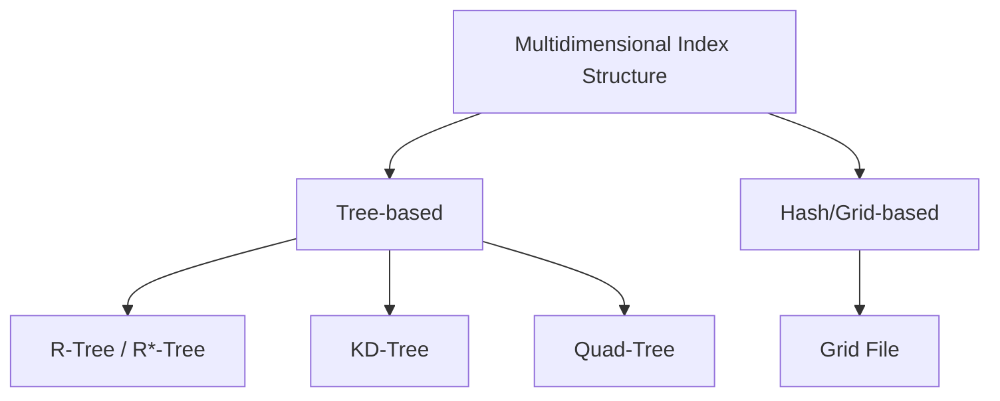

# Multidimensional Index Structure

## 1. Overview

### A. Definition
> An index structure for **efficiently searching multidimensional data of two or more dimensions**, such as location, space, and multiple attributes. It quickly processes range queries, nearest-neighbor (NN) queries, and spatial containment/overlap queries.

### B. Background and Necessity
Traditional indexes such as the B-Tree sort values along a single axis (one dimension) and search by magnitude comparison, so they are fundamentally unsuited to queries that must **simultaneously satisfy multiple axes**, like "find points whose latitude and longitude both fall within a certain range." Applying two one-dimensional indexes separately is also inefficient because you narrow down along one axis and then must exhaustively scan the rest. Since spatial data defines relationships like "near/contains" by the proximity of multidimensional coordinates from the outset, an index is needed that reflects this proximity itself and **hierarchically partitions and clusters space**. As map services, image feature-vector search, and AI embedding search have exploded, multidimensional indexes have become essential infrastructure.

## 2. Types

Index structures are divided by how they partition space. **R-Tree/R*-Tree** builds a tree by hierarchically grouping the **Minimum Bounding Rectangles (MBRs)** that enclose objects, and reduces the search scope by descending only into MBRs that overlap the query region. Strong for spatial objects with area (buildings, roads) and for range queries, it is the de facto standard of spatial DBs, but when MBRs overlap each other performance degrades, so R*-Tree improved this by minimizing such overlap. **KD-Tree** is a structure that binary-partitions space by alternating axes and is efficient for NN search of point data, but its partitioning effectiveness plummets as dimensionality rises. **Quad-Tree** recursively partitions 2D space into four quadrants and is advantageous when data is sparse and uneven, such as maps and images. **Grid File** divides space into grid buckets, approaching constant-time access for uniformly distributed data.

| Type | Partitioning Method | Characteristics/Suitability |
|---|---|---|
| **R-Tree/R*-Tree** | MBR hierarchical grouping | Spatial objects/range queries, spatial DB standard |
| **KD-Tree** | Alternating-axis binary partitioning | Point data/NN, performance drops in high dimensions |
| **Quad-Tree** | Recursive quadrant partitioning | 2D images/maps, sparse data |
| **Grid File** | Multidimensional grid buckets | Efficient for uniformly distributed data |

## 3. Selection Criteria

Which structure is optimal depends on the nature of the data and the queries, and a wrong choice makes the index itself a burden. If the **data type** is points with only coordinates, KD-Tree is natural; if the data are region objects with area/volume, the MBR-based R-Tree is natural. Which structure is advantageous also diverges by **query type**—range query, nearest neighbor, or spatial containment. The **number of dimensions** is especially important; beyond tens to hundreds of dimensions, the curse of dimensionality explained later renders tree indexes powerless, forcing a turn toward approximation (ANN). If the **data distribution** is uniform, Grid File is better, while if it is skewed, a tree structure that adapts to density is better.

| Criterion | Consideration |
|---|---|
| **Data type** | Point (KD) vs. region/object (R-Tree) |
| **Query type** | Range/NN/spatial containment |
| **Number of dimensions** | Consider approximation (ANN) for high dimensions |
| **Distribution** | Uniform (Grid) vs. skewed (tree) |

## 4. Use Cases

Multidimensional indexes underlie every service that "quickly finds nearby things." In **spatial DBs/GIS**, "restaurants within 1 km of me" or "buildings contained in this administrative district" are found instantly with R-Tree. In **multimedia** search, images are converted into feature vectors and similar images are found by NN, and in **OLAP**, range aggregations over multidimensional cubes are accelerated. Especially, the largest application today is **AI vector search**, which converts text and images into high-dimensional embeddings and searches semantically similar items by approximate nearest neighbor (ANN); this is the core of RAG and recommendation systems.

| Field | Application |
|---|---|
| **Spatial DB/GIS** | Proximity search/region queries (location services) |
| **Multimedia** | Image/feature-vector similarity (NN) search |
| **OLAP** | Range aggregation over multidimensional cubes |
| **AI vector search** | Based on approximate nearest neighbor (ANN) over high-dimensional embeddings |

## 5. Considerations and Implications
- **Curse of Dimensionality**: As dimensionality grows, all points become similarly far from one another, so the concept of "near" becomes meaningless and the pruning effect of trees disappears. Therefore, in high dimensions one combines dimensionality reduction such as PCA, or switches to **approximate nearest neighbor (ANN)**, which sacrifices a little accuracy to gain speed.
- **Distribution/query suitability governs performance**: Even for the same data, structure choice can make a difference of tens of times in performance, so one must first analyze the data distribution and the primary query patterns before deciding on an index.
- **Evolution into vector search**: Traditional tree indexes evolved into ANN algorithms such as **HNSW (graph-based) and IVF (cluster-based)**, which have become the core infrastructure supporting RAG, recommendation, and semantic search.

---

> **In one line**: A multidimensional index structure hierarchically partitions space via *R-Tree, KD-Tree, Quad-Tree, Grid File*, and so on to accelerate range/NN queries on multidimensional data; it is chosen to match the data/query type and the number of dimensions, and because of the curse of dimensionality it evolves in high dimensions into vector search (ANN) such as HNSW and IVF.
