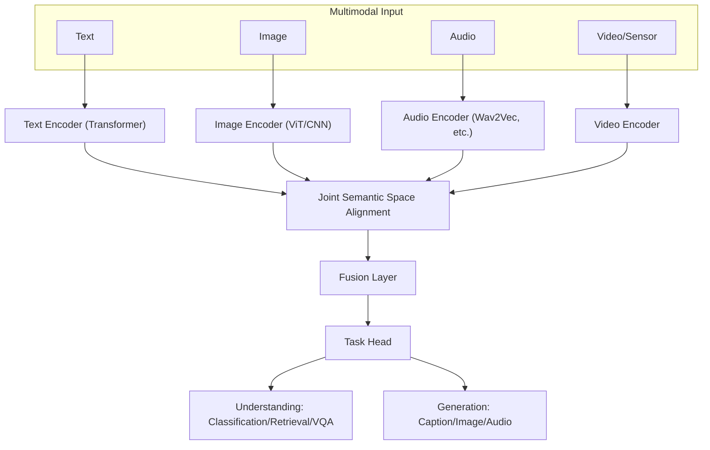
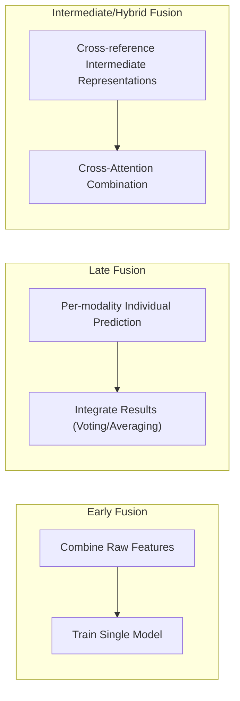

# Multimodal AI

## 1. Overview

> **Definition**: Multimodal AI is an artificial intelligence technology that **simultaneously inputs, processes, and fuses data of different forms (modalities)**—text, images, audio, video, sensor signals, and so on—to secure integrated understanding and generation capabilities that are hard to obtain from a single modality alone. Its core principle is to align and fuse the representations of each modality into a **Joint Embedding Space**.

The background to the rise of multimodal AI touches on the very nature of human cognition. People do not understand the world through language alone. When we understand the sentence "the cat sleeps on the sofa," we together summon the cat's visual form, the sound of its meow, and the memory of its soft touch. That is, human concepts are essentially formed by a **combination of multiple senses**, and therefore a language model trained only on text has the limitation of being a half-formed intelligence lacking grounding in the physical world. Multimodal AI is an attempt to bridge this gap and expand AI into **intelligence grounded in the real world**.

The second driver is **the advancement of large language models (LLMs) and the limits of data**. Text corpora have already been largely consumed in training, so performance improvements are slowing with pure language data alone. In contrast, images, video, and audio exist in vast quantities on the internet and hold spatial, temporal, and emotional information that language cannot capture. Because different modalities provide complementary information, combining them can compensate for the weaknesses of individual modalities and enable predictions robust to noise. For example, even if speech recognition accuracy drops in a very noisy environment, viewing lip movements (video) together can restore recognition accuracy.

The third driver is **application demand**. Autonomous driving must fuse camera, LiDAR, and radar; medical diagnosis must synthesize images (CT/MRI), numbers (blood tests), and text (reading findings); and a robot can act only when it understands both visual perception and language instructions. The convergence of the latest foundation models such as GPT-4o, Gemini, and Claude toward processing text, images, and audio within a single model reflects such practical demands. In an exam answer, it is reasonable to define multimodal AI not as a mere feature extension but as **"an essential path toward AGI (Artificial General Intelligence) and the standard form of foundation models."**

## 2. The Overall Architecture of Multimodal AI

Multimodal AI has a hierarchical structure that independently encodes each modality, aligns them into a common representation space, and fuses them to perform the final task (understanding/generation). The conceptual diagram below shows the overall skeleton from input to output.

The hardest problem in this architecture is the **modality heterogeneity gap**. Text is a discrete token sequence, an image is a continuous pixel grid, and audio is a waveform along a time axis. Because the dimensionality, distribution, and semantic density of the data all differ, making them comparable in a single vector space—**alignment**—becomes the technical core of multimodality. When alignment is done well, "a photo of a dog" and the text "a photo of a dog" come to sit close together in the embedding space, enabling cross-modal tasks such as searching images by text or describing an image in language.

A representative case of alignment is OpenAI's **CLIP (Contrastive Language-Image Pre-training)**. CLIP is trained via contrastive learning on 400 million (image, text) pairs so that the embeddings of matching image-text pairs are placed close and non-matching pairs far apart. Thanks to this learned joint space, CLIP can perform **zero-shot classification** over an arbitrary label set without separate retraining, and it was subsequently widely used as the text-conditioning backbone of generative models such as Stable Diffusion and DALL-E.

## 3. Types and Procedures of Modality Fusion Strategies

Performance and computational cost vary greatly depending on when and how the information of multiple modalities is combined. It is common to distinguish early, late, and intermediate (hybrid) fusion based on the timing of fusion, and the diagram below shows the difference in data flow among the three approaches.

**Early Fusion** concatenates the raw features of each modality into one at the input stage and trains a single model. It can learn low-level interactions among modalities from the start, which is advantageous for capturing fine-grained correlations, but it has the drawbacks that dimensionality surges sharply and the whole becomes vulnerable if one modality is missing. **Late Fusion** has independent models per modality each produce predictions and then integrate the results by voting/weighted averaging; it has high modularity and is robust to missing data, but it cannot learn interactions among modalities. The compromise between these two is **intermediate/hybrid fusion**, and the approach of using the transformer's **cross-attention** so that one modality's representation references another modality's representation has become the mainstream of modern multimodal models. For example, in image-text question answering (VQA), a structure in which the text-question tokens query the image patches via attention to find the answer corresponds to this.

The processing procedure of an actual large multimodal LLM (MLLM) is as follows. ① Encode the image with a ViT (Vision Transformer) to obtain a sequence of visual tokens. ② An **alignment module (e.g., Q-Former, MLP Projector)** projects the visual tokens into an embedding space the language model can understand. ③ Concatenate the projected visual tokens together with text tokens into a single sequence and feed it to the LLM. ④ The LLM generates a response autoregressively over the integrated sequence. This approach adds visual understanding while leveraging the reasoning ability of an already well-trained language model as is, and because it is highly training-efficient, many models such as LLaVA, BLIP-2, and Flamingo adopt it.

## 4. Major Applications and Comparison of Representative Models

The tasks of multimodal AI are broadly divided into **cross-modal understanding** and **cross-modal generation**. Understanding tasks include image captioning, visual question answering (VQA), text-image retrieval, and document understanding (OCR + layout); generation tasks include text→image (DALL-E, Stable Diffusion), text→video (Sora), text→speech (TTS), and image→text (caption). The table below compares the characteristics of representative technologies, but it is important to also understand why each model chose a different design philosophy.

| Model/Technology | Modality Combination | Core Technique | Characteristics |
|---|---|---|---|
| CLIP | Image↔Text | Contrastive learning, joint embedding | Zero-shot classification, retrieval backbone |
| Stable Diffusion | Text→Image | Latent Diffusion | Text-conditioned image generation |
| BLIP-2 / LLaVA | Image+Text | Q-Former/Projection + LLM | Visual dialogue/VQA, training efficiency |
| GPT-4o / Gemini | Text/Image/Audio | Unified foundation model | Real-time multimodal dialogue |

Whereas CLIP focused on **building an alignment space via contrastive learning**, Stable Diffusion uses that alignment space as a **condition for generation**. That is, the text embedding guides the direction of the diffusion process to produce the desired image. This is a case demonstrating that understanding and generation are not separate but **share the same joint representation space**. Meanwhile, the unified type, in which a single model natively processes multiple modalities like GPT-4o, unlike the previous generation that placed per-modality encoders separately and combined them afterward, handles multiple modality tokens together from the input stage, reducing latency and reflecting even the emotion and intonation of spoken dialogue.

As a concrete achievement, in the medical imaging field many studies have reported that multimodal models jointly trained on chest X-ray images and reading-finding text improved diagnostic-assistance performance compared to single-image models. In autonomous driving, Tesla and Waymo fuse camera, radar, and LiDAR to mutually compensate for the blind spots of a single sensor (camera degradation in bad weather, close-range limits of radar). Such cases empirically demonstrate that the essential value of multimodality lies in **securing robustness through mutual complementarity among modalities**.

## 5. Deep Dive: Latest Trends and Challenges

Recently, multimodal AI is evolving into **native multimodal (Any-to-Any) foundation models**. Early on, pretrained vision encoders and language models were bridged afterward, but the latest models learn multiple modalities as unified tokens from the start, breaking down modality boundaries. Furthermore, **Vision-Language-Action (VLA)** models, which handle not only text, images, and audio but also **action**, are being applied to robotics, and research into **Embodied AI**—which directly converts language instructions and visual perception into robot control signals—is active.

At the same time, the challenges to be solved are clear. First, **modality bias**—a phenomenon where training is skewed toward a particular modality (mainly text) and fails to sufficiently utilize visual information. Second, **hallucination**—errors such as answering that an object not in the image is present, relying on language prior knowledge without visual grounding, appear in multimodality as well. Third, **securing alignment data and computational cost**—building high-quality (image, text) pairs and large-scale contrastive learning require enormous resources. Fourth, **the difficulty of evaluation**—standard metrics for quantitatively evaluating the quality of generated results and cross-modal consistency are still immature. These are good points to present in an answer as multimodality's limitations and future research directions.

## 6. Considerations and Implications

From a professional engineer's perspective, the strategies and implications to consider when adopting and using multimodal AI are as follows.

- **Application strategy — choose a fusion method suited to the task's characteristics**: If low-level correlations among modalities matter (lip-speech synchronization), choose early/cross fusion; if modalities are independent and missing data is frequent, choose late fusion. A unified large model is not always the answer, and a design that also considers cost, latency, and data availability is needed.
- **Trade-off — performance vs. resources**: Native multimodal models are powerful but incur high training/inference costs. In practice, reduce cost with a lightweight alignment model such as CLIP + retrieval, or a projection approach that reuses pretrained encoders, and consider a lightweight multimodal (sMLLM) in on-device environments.
- **Reliability/safety — hallucination and evidence presentation**: In high-risk domains such as medicine and autonomous driving, to control multimodal hallucination one must present visual grounding together and combine XAI and human-in-the-loop verification procedures. An erroneous cross-modal judgment can directly lead to physical harm.
- **Data/governance — bias and copyright**: Large-scale image-text pairs contain copyright, personal information, and social bias, so an AI governance framework must be established alongside—managing the provenance of training data, mitigating bias, and responding to copyright issues and deepfake misuse of generated content.
- **Outlook — the path to AGI and standardization**: Multimodality is converging into the standard form of foundation models and is expected to expand into VLA and Embodied AI, developing into intelligence that interacts with the physical world. It is advisable for organizations to proactively prepare data pipelines and evaluation frameworks that can integrate and align data assets cross-modally.

## References

- Radford et al., "Learning Transferable Visual Models From Natural Language Supervision (CLIP)", 2021 — https://arxiv.org/abs/2103.00020
- Li et al., "BLIP-2: Bootstrapping Language-Image Pre-training", 2023 — https://arxiv.org/abs/2301.12597
- Liu et al., "Visual Instruction Tuning (LLaVA)", 2023 — https://arxiv.org/abs/2304.08485

---
> **In one line**: Multimodal AI is a technology that aligns and fuses heterogeneous modalities such as text, images, and audio into a joint semantic space to realize complementary understanding and generation; built on CLIP's contrastive-learning alignment and cross-attention fusion, it is the standard form of foundation models and a core path toward AGI and embodied intelligence.
