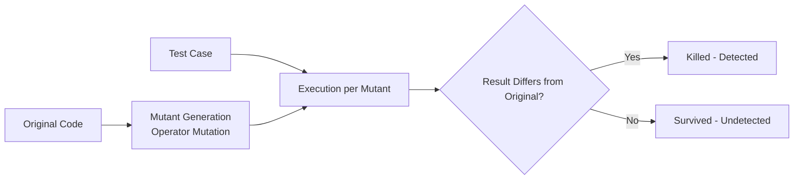

# Mutation Testing (Mutation Test)

## 1. Overview

### A. Definition
> A white-box technique that **injects artificial faults (mutants) into the program source** and then measures whether the existing test suite **detects (kills)** those faults, quantitatively evaluating the **fault-detection capability (effectiveness) of the test cases themselves**.

Whereas ordinary testing asks "is the program correct," mutation testing reverses the direction and asks "**is the test strict enough**." That is, its essence is that the subject of verification is not the production code but **the test itself**. A mutant mimics mistakes developers commonly make (flipping a sign, an error in a comparison operator, etc.), and it rests on the assumption that a good test must catch such subtle variations.

### B. Background and Necessity
**Code coverage**, widely used in the field as a metric of test quality, has a fundamental blind spot. Coverage only shows "was that line of code executed," not "was the execution result correctly **asserted**." So even an empty test with not a single assertion can achieve 100% coverage. To strip away this **false sense of safety**—where the coverage figure is high but in reality no fault is caught—a method was needed that plants actual faults (mutants) and verifies whether the tests catch them. This is where mutation testing supplements the limits of coverage.

## 2. How It Works

The core logic of the operation is as follows. Multiple mutants are created by mutating the original code one place at a time, and **the entire existing test suite is run against each mutant.** If a test fails on some mutant, that test has the ability to detect that fault, so the mutant is considered "**killed**." Conversely, if all tests still pass even though a mutant was planted, no one caught that fault, so the mutant "**survived**"—a signal that there is a hole in the tests. Surviving mutants become a to-do list of tests that need reinforcement.

## 3. Mutation Operators and Metrics

Mutants are generated mechanically by rules called **mutation operators**. Because these operators are designed to imitate the types that frequently appear in actual bug statistics, the ability to kill mutants becomes a proxy metric for the ability to catch real bugs.

| Mutation Operator | Example |
|---|---|
| Arithmetic | `a+b` → `a-b` |
| Relational | `a>b` → `a<b` |
| Logical | `&&` → `\|\|` |
| Constant/variable replacement | `x=1` → `x=0` |
| Statement deletion | Remove a specific line |

The effectiveness of tests is quantified by the **mutation score**. Here, subtracting equivalent mutants from the denominator is important, because equivalent mutants can in principle never be killed, so including them would unfairly lower the score.

| Metric | Description |
|---|---|
| Mutation Score | Killed / (Total Mutants − Equivalent) × 100 |
| Killed | Mutants the tests detected (good) |
| Survived | Undetected mutants → targets for test reinforcement |
| Equivalent Mutant | A mutant that never dies because the mutation keeps the meaning identical (limitation) |

For example, a mutant that changes `if (x >= 1)` to `if (x > 0)` makes the two conditions completely identical if x is an integer, so no input can create a difference. Such an **equivalent mutant** survives but is not a defect of the tests, and having a human determine each one is a representative hard problem of mutation testing.

## 4. Advantages and Disadvantages

The greatest strength of mutation testing is that it reveals even the **weakness of assertions** that coverage misses and thereby quantifies test quality, but the price for this is that the **computational load is enormous**. Because the entire test suite must be run for each mutant, thousands of mutants means repeating the tests thousands of times.

| Advantages | Disadvantages |
|---|---|
| Quantitatively evaluates test quality (supplements coverage's blind spot) | Excessive computation from mutant × test combinations |
| Concretely identifies and guides deficient tests | Determining equivalent mutants is difficult |
| High reliability since based on actual fault types | Requires automation tools for execution and judgment |

## 5. Considerations and Implications
Since the performance problem is the biggest obstacle to practical adoption, the burden is reduced with **mutant sampling** (generating only a subset rather than all), **selective mutation** (using only high-impact operators), **parallel execution**, and **incremental mutation** applied only to changed code. In practice, it is integrated into the CI pipeline with tools such as PIT (Java) so that a warning is issued when the mutation score drops upon a code change. In particular, in **safety-critical systems** such as aviation, medicine, and automotive, one must empirically demonstrate that the tests truly catch faults, so mutation testing is used as objective evidence of test reliability.

---

> **In one line**: Mutation testing is a technique that quantitatively evaluates a test's fault-detection capability by *planting artificial faults (mutants) in code and checking whether the tests detect (kill) them*; it supplements coverage's blind spot, but computational load and equivalent mutants are challenges, and it is made practical through sampling, parallelization, and CI integration.
