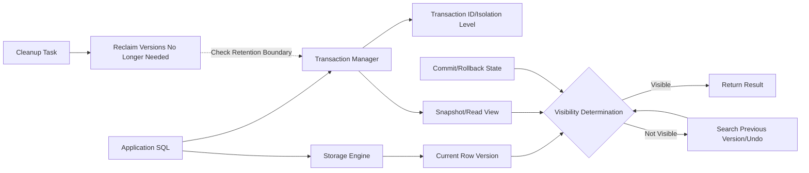
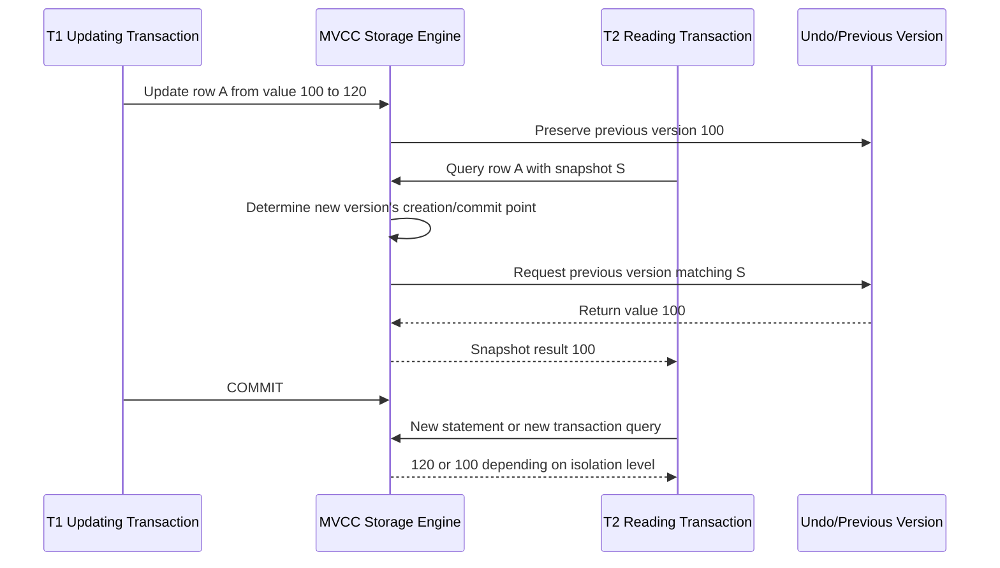

# MVCC (Multi-Version Concurrency Control) and Snapshot-Based Transactions

## 1. Overview

> **Definition**: MVCC (Multi-Version Concurrency Control) is a concurrency control technique that, when updating a row, preserves the existing value as multiple versions rather than immediately overwriting it, and has each transaction determine which version it can see from its own snapshot, thereby reducing conflicts between reads and writes.

The database of an online service has concurrently running transactions that read and modify the same rows. Using simple locking alone makes write consistency easy to preserve, but read requests waiting on update locks increase latency, and analytical queries block business transactions. MVCC separates this conflict in the manner that "a reading transaction reads a past version it can see, and a writing transaction creates a new version."

The core of MVCC lies in not viewing data as a single current value. Logically it is one row, but physically several records can exist together with the creating transaction, the expiring transaction, and previous-version linkage information. A read request does not return a record merely because it is the latest; it selects the version that is committed and visible in its own snapshot. This determination process creates isolation and non-blocking reads.

However, MVCC is not a technique that eliminates locks. Update conflicts, unique constraints, explicit lock reads, and serializable-level verification still require locks or conflict detection. Also, if a long-open transaction blocks the cleanup of past versions, storage grows and index/table performance degrades. Therefore, MVCC works effectively only when the storage engine's internal implementation and the transaction operating policy are designed together.

In a professional engineer's answer, it is insufficient to explain MVCC merely as "a database feature with fast performance." One must connect it all the way to which snapshot is chosen, how versions look before and after commit, which phenomena are permitted per isolation level, and when past versions are reclaimed. In particular, since PostgreSQL's tuple visibility/VACUUM and InnoDB's undo log/Read View differ in implementation, distinguish the common principles from the per-product differences.

### 1.1 Background and Necessity

Traditional 2PL (Two-Phase Locking) locks the data a transaction reads or updates to control access by other transactions. Strong consistency is easy to obtain, but when shared locks and exclusive locks overlap, reads and writes wait on each other. In large-scale web services, a single short order update can be delayed because of a long-running report query.

MVCC assigns a logical point-in-time of the data to read operations. While transaction A updates a row, if transaction B queries it, B reads not the new value A has not yet committed but the previous version included in its snapshot. As a result, it avoids "dirty reads" while not unnecessarily blocking simple reads against one another.

This approach is especially advantageous for read-heavy OLTP, concurrent processing of orders/payments, analytics using replicas, and long-running report queries. Conversely, in environments with very many update conflicts, frequent long-running transactions, or limited storage, one must evaluate the cost of version creation and cleanup.

### 1.2 Core Goals

The first goal is to let a transaction obtain a consistent point of observation. A transaction does not arbitrarily see values that other transactions write in the middle, but determines rows based on the set of commit points it permits.

The second goal is to reduce read-write contention. A typical non-locking read utilizes past versions, so even if an updater holds a write lock, reads do not necessarily wait. However, this property does not apply as is to business that needs the latest confirmed value or a strong lock.

The third goal is to widen the range of choices between isolation level and performance. READ COMMITTED can take a new point of observation per statement, and REPEATABLE READ can maintain the same snapshot throughout the transaction. SERIALIZABLE aims, through additional conflict verification, for a result equivalent to serial execution.

## 2. Components of MVCC and the Visibility Principle

### 2.1 Overall Operating Structure

MVCC is a structure combining the application, the transaction manager, the storage engine, the version storage area, and the cleanup task. When the application executes SQL, the transaction manager makes a snapshot matching the current transaction's ID and isolation level. The storage engine follows the previous versions linked to the current row to find the value visible in the snapshot.

The transaction ID is the criterion for identifying the subject that creates/modifies a version. Depending on the implementation, the row header, transaction table, undo log, and timeline information are used together. The important point is that the version value alone cannot determine visibility. One must also confirm from which transaction the version was created and whether that transaction was committed at the snapshot point.

A snapshot is a read criterion that distinguishes "visible transactions" from "not-yet-visible transactions" at a particular point. Even if the current row was modified by a later transaction, if that modifying transaction is not visible in the snapshot, the storage engine follows the previous version and returns it. For this reason, a version that is not physically the latest becomes the logically correct result.

### 2.2 Versions and Visibility Determination

A row version generally has metadata about its creation point and expiration point. If the creating transaction of a new version is committed and the expiring transaction of that version is not visible in the snapshot, that version becomes the read target. Conversely, if the creating transaction is still in progress, that version is excluded from other transactions' normal reads.

Whether a transaction can read a value it modified itself is included in the engine's visibility rules. Changes made in one's own earlier statements can be seen as the logical work result of the same transaction regardless of external commit status. Without this rule, natural flows such as INSERT followed by SELECT within one transaction would break.

Deletion, too, can be handled not by immediate physical removal but by a delete mark or new version creation. If the deleting transaction is not visible in the snapshot, the previous version can still be read; if the deleting transaction is visible, that row is excluded from the result. Afterward, when there is no longer any possibility that all active transactions would see that previous version, the cleanup task actually reclaims the space.

| Component | Role | Design/Operation Points |
|---|---|---|
| Transaction ID | Identify the subject creating/modifying versions | Consider ID exhaustion/wraparound and state tracking |
| Snapshot/Read View | Distinguish visible commits from in-progress transactions | Creation timing differs by isolation level |
| Row version | Preserve logical past/current values | Manage version chain length and storage |
| Undo/previous-version area | Provide past values for reads and rollback info | Monitor retention time, I/O, cleanup lag |
| Visibility determiner | Select the version matching the snapshot | Check per-engine header/transaction state |
| Cleanup task | Reclaim versions no longer needed | Operate so as not to conflict with long-running transactions |

The components in the table are not an independent list of functions but a single lifecycle. A transaction creates a version, a snapshot reads that version, and only after active transactions finish can the cleanup task safely remove past versions. If any one stage is delayed, cascading effects arise on storage and response time.

### 2.3 Logical Flow of Reads and Writes

A reading transaction first secures a snapshot matching its isolation level. It then finds candidate rows in an index or table and compares the candidate versions' creation/deletion metadata with the snapshot. If a candidate is not visible, it moves to the previous-version storage area, and determines either a visible version or that the row does not exist in the snapshot.

A writing transaction, even when changing an existing row, preserves the past state that reading transactions can reference. Depending on the storage engine, it either places the new version as a separate record or keeps the current record and records the previous value in the undo area. This difference affects index update cost, cleanup method, and failure-recovery procedures.

A commit is the boundary that makes a version visible in other transactions' snapshots. A rollback invalidates the new version or restores the logically previous state using undo information. Therefore, MVCC is not a data-file-only feature but operates together with WAL/redo/undo/transaction state management.

## 3. Isolation Levels and Concurrency Anomalies

### 3.1 The Meaning of Isolation Levels

An isolation level defines to what extent concurrently executing transactions can observe the results of other transactions. Even with the same name, the per-product implementation and default value can differ, so the design document should record both the standard terminology and the actual engine settings.

READ UNCOMMITTED can read even uncommitted changes and is the weakest isolation. Since an MVCC engine may not permit this as is in normal queries or may handle it specially, do not conclude that "MVCC always has no dirty reads"; check the product documentation.

READ COMMITTED is a model that takes a new snapshot when each SQL statement starts or at execution time. If you query twice within the same transaction, the second query can see changes another transaction committed in between. Freshness on business screens is high, but business rules combining multiple statements may need additional locks or condition verification.

REPEATABLE READ is a model that maintains a transaction's consistent point of observation. The same logical query in the same transaction easily obtains a consistent result, but a long-open transaction requires long retention of past versions. MySQL InnoDB and PostgreSQL can differ in detailed phenomena and implementation even at levels of the same name.

SERIALIZABLE is the strongest level, constraining concurrent execution results to be identical to some serial execution. There are implementations like MVCC-based SSI (Serializable Snapshot Isolation) that detect dangerous dependencies while minimizing locks, and implementations that combine range locks. Since retries are required on conflict, the application's idempotency and retry policy are essential.

| Isolation Level | Possibly Permitted Phenomena | MVCC-Perspective Characteristics | Application Example |
|---|---|---|---|
| READ UNCOMMITTED | Dirty reads, etc. | Weakest consistency, per-engine handling differences | Fast reference queries over accuracy |
| READ COMMITTED | Non-repeatable reads, some phantoms | Per-statement snapshot | General web requests/OLTP |
| REPEATABLE READ | Phantoms/write conflicts depending on implementation | Transaction or consistent-read snapshot | Consistent queries per business unit |
| SERIALIZABLE | Does not permit serializability violations | Conflict detection/range protection/retry | Inventory/settlement/core rules |

When memorizing this table, do not just memorize the phenomenon names but connect them to the differences in snapshot creation timing and write-conflict handling. For example, two SELECTs under READ COMMITTED reading different values may not be an error but because the point of observation was newly created per statement. Conversely, business that combines multiple read results to make a judgment, such as a payment limit, needs a single snapshot or an explicit lock.

### 3.2 Representative Concurrency Anomalies

A dirty read is a phenomenon of reading a value another transaction has not yet committed. MVCC's basic snapshot visibility reduces this by excluding in-progress transactions' versions. However, if an external cache or read replica has separate consistency rules, a similar illusion can occur on the user's screen even when there is no dirty read inside the database.

A non-repeatable read is a phenomenon where, within one transaction, a read with the same condition yields a different value because of another transaction's commit. It can naturally appear under READ COMMITTED, which uses per-statement snapshots. If you must read and compare a sum/balance/permission multiple times, you should read them at once or choose a stronger isolation level.

A phantom read is a phenomenon where, upon repeating a range query with the same condition, the result row set differs because of newly inserted or deleted rows. Managing only single-row versions cannot prevent changes to the entire range. Range protection suited to the business is needed—serializability level, range locks, predicate locking, unique constraints, and so on.

A write skew is a phenomenon where two transactions read different rows and each modifies them, but the result of combining the two changes breaks a business invariant. For example, under a rule that at least one of two on-duty doctors must remain, if two transactions each mark a different doctor as off-duty, the result can be that all leave. This is not resolved by simple MVCC's consistent read alone, and it requires SERIALIZABLE, explicit locks, or atomic conditional updates.

## 4. Major Implementations and Operating Mechanisms

### 4.1 Tuple Versions and VACUUM in the PostgreSQL Family

PostgreSQL processes an UPDATE not by overwriting only the existing tuple's value but by creating a new tuple version. It compares the tuple header's transaction information with the snapshot to decide which version is visible, and the previous tuple becomes a cleanup target when no active transaction needs it.

This structure reduces read-write conflicts but can accumulate dead tuples in the table. VACUUM marks tuples no longer visible as reusable and manages transaction metadata. If VACUUM is too late, table bloat, index bloat, and increased scan cost occur.

Autovacuum performs cleanup based on per-table change volume and thresholds. Rather than trusting only the defaults, do per-table tuning by observing update frequency, row size, number of indexes, long-running transactions, and replication slots together. If a long-running transaction holds a past snapshot, VACUUM cannot reclaim space, so the application connection pool and batch jobs must also be inspected.

Transaction ID wraparound is not merely a storage problem but relates to the safety of visibility determination. The database appropriately freezes old transaction IDs so that the meaning of past versions does not change. Operators should periodically monitor autovacuum lag, oldest xmin, dead tuples, and table/index bloat.

### 4.2 InnoDB's Undo Log and Read View

InnoDB preserves the pre-change value in the undo log and, when a consistent read is needed, uses the Read View and undo chain to reconstruct the version matching the snapshot. If the value on the current page is too new for its Read View, it follows the undo log to make the past value.

Under REPEATABLE READ, the behavior in which a transaction's consistent read maintains the same point of observation is important. Under READ COMMITTED, a more recent Read View can be made per statement, so query results can differ even within the same transaction. This difference must not be confused with the word "transaction" in the application.

Undo log cleanup is performed at a point when no active Read View needs it any longer. Long-open transactions, large batches, and failure to return connections can enlarge undo space and purge lag. Therefore, version cleanup is a problem of background tasks and at the same time a problem of application design that keeps transaction boundaries short.

### 4.3 Distinguishing Non-Locking Reads from Locking Reads

A normal SELECT can perform a non-locking read matching the snapshot, but a read that checks the latest version and acquires a lock, such as SELECT ... FOR UPDATE or SELECT ... FOR SHARE, has a different purpose. When protecting the quantity just before inventory decrement, or when monopolizing one row of a work queue, a locking read is needed.

A non-locking read can return a past version, so it may be unsuitable for business that always needs "the most recent confirmed value." Conversely, turning all queries into locking reads makes the concurrency MVCC saved disappear again into lock contention. Define the meaning of the query first, then decide whether to lock.

The flow above shows that the result differs depending on when T2 created its snapshot. If it is before T1 commits, T2 cannot see 120, and even after T1 commits, if T2's isolation level maintains the previous snapshot, T2 can keep seeing 100. Therefore, when analyzing incidents, do not record only the SQL execution time but also record the transaction start, snapshot, and commit points together.

### 4.4 The Relationship Between Indexes and Version Cleanup

MVCC connects not only to the table body but also to index access. If the tuple an index points to is not visible in the current snapshot, the storage engine performs a visibility check and, if necessary, finds the previous version. Poor index design increases candidate rows, so version determination and random I/O increase together.

Some engines utilize separate metadata or a visibility map so that visibility can be confirmed by reading only the index. For this optimization to work properly, cleanup tasks and statistics updates must be normal. Therefore, rather than "adding an index makes MVCC cost disappear," evaluate index selectivity, covering, and cleanup state together.

## 5. Comparison and Industry Application Cases

### 5.1 Comparison with 2PL and Optimistic Control

2PL locks data with potential conflicts to directly restrict access by executing transactions. It is easy to express strong rules, but lock waits and deadlocks must be managed. MVCC handles the read path via version selection to reduce read waits, but requires storing old versions and retrying write conflicts.

Optimistic concurrency control works without locks under the assumption that conflicts are rare, and verifies version numbers or timestamps at commit. It can be used with MVCC but is not the same concept. MVCC is a mechanism that provides the version to read, while optimistic verification is a policy that judges commit feasibility.

| Category | MVCC | 2PL | Optimistic Verification |
|---|---|---|---|
| Read method | Select the appropriate version from the snapshot | Read after acquiring lock | Read current value and verify later |
| Read-write contention | Low for normal reads | Wait depending on lock type | Usually low but commit can fail |
| Main cost | Versions/undo/cleanup | Lock wait/deadlock | Retry/rollback on conflict |
| Strength | Read scaling and consistent snapshots | Rule expression and latest-value protection | Short transactions/low conflict |
| Caution | Long transactions/bloat | Wait surges/deadlock | Retry idempotency/starvation |

The three methods are targets of combination rather than competitors. A practical database uses MVCC for normal queries while applying row locks to update conflicts, serializability verification to range invariants, and optimistic version checks at the application layer. A professional engineer's design proposal should not end at "adopt MVCC" but should present supplementary means per path where conflicts arise.

### 5.2 Case 1 — Order/Inventory Service

Product listings and order queries are read-heavy, so MVCC-based non-locking reads reduce latency. While a customer queries order status and an operator updates the status, the customer receives a committed consistent version, and normal queries do not wait a long time on locks.

On the other hand, inventory decrement must not allow two orders that read the same last stock to both succeed. This path should be designed with an atomic conditional update such as `UPDATE ... SET stock = stock - 1 WHERE product_id = ? AND stock > 0` or with a latest-row lock. One must not claim that the inventory invariant is guaranteed by MVCC snapshot reads alone.

### 5.3 Case 2 — Long-Running Reports and Operational Transactions

In an environment where a monthly sales report runs for several minutes, MVCC lets the report read consistent data at its chosen point while operators process new orders. This reduces the problem of the report locking the entire table and blocking order entry.

However, if the report transaction is maintained for a long time, versions prior to its point cannot be cleaned up. The solution is to separate load onto a read-only replica or analytical store, split the report into short page-unit transactions, and agree with the business on whether snapshot consistency is truly necessary.

### 5.4 Case 3 — Financial Settlement and Serializability Requirements

Financial settlement values preventing duplication/omission/write skew over the non-blocking nature of simple queries. Logic that reads and updates balance and withdrawal limits from different rows may not be safe under READ COMMITTED alone. Core rules are defended in multiple layers via SERIALIZABLE, explicit locks, atomic conditional updates, and post-settlement reconciliation.

Since transactions may be retried due to serializability conflicts, the settlement API must use request identifiers and idempotency keys. If an external payment approval or message publication is handled in one bundle with database retries, external side effects can be duplicated, so design an outbox pattern and deduplication keys together.

## 6. Deep Dive — MVCC in Distributed/Cloud Environments

A distributed database has difficulty representing a whole snapshot with a single node's transaction ID alone. It uses mechanisms such as logical timestamps, hybrid logical clocks, per-range leaders, and commit-wait to coordinate the read points of multiple nodes. Because network latency leads to a trade-off between snapshot consistency and write availability, one must examine CAP and consistency models together.

The serializable snapshot of a distributed SQL system is not simply merging "the latest value visible at each node." One must determine the read timestamp the query needs, confirm whether data at that point exists across multiple replicas, and coordinate commit conflicts and retries. If the inter-region round-trip time is long, strongly consistent reads/writes can increase user latency.

In a cloud managed database, one may not be able to directly control all internal MVCC parameters. Instead, turn long-running transactions, idle sessions in the connection pool, cleanup lag, undo/WAL/storage usage, and lock waits and retry rates into observable service metrics. Since auto-scaling can hide storage problems, track cost and performance together.

In an HTAP environment, OLTP's MVCC version cleanup and the snapshot lifetime of analytical scans can conflict. Separating the analytical workload into a separate column store, replication stream, or lakehouse can lower the version-retention burden of operational transactions. However, data freshness lag and schema conversion cost arise, so reflect them in the SLA.

Recent time-travel queries and audit trails resemble MVCC's past-version concept but have a different purpose. MVCC's past versions may be internal data for concurrency control and rollback, whereas history for regulatory audit requires long-term retention, reasons for change, access control, and legal evidentiary value. Do not regard internal versions as an audit ledger; instead maintain a separate immutable event/audit log design.

## 7. Considerations and Implications

### 7.1 Transaction Lifetime Management

Keep a transaction only as long as needed to guarantee the business unit, and do not put user-input waits or external API calls inside a database transaction. Long-running transactions hinder past-version cleanup and schema changes and enlarge the rollback scope on failure.

Apply automatic rollback and timeouts so that a connection is not reused with transaction state left over in the connection pool. On the operations dashboard, separately display the oldest transaction, idle transactions, snapshot retention time, and cleanup lag.

### 7.2 Mapping Consistency Requirements to Isolation Levels

Applying SERIALIZABLE to all business or unifying all business to READ COMMITTED is dangerous. Define the permissible latency and anomalies for each flow with different business meaning, such as order query, inventory decrement, settlement, and audit query.

In requirements, instead of the expression "latest," write the reference point and the permissible lag. For example, a search listing may permit a few seconds of lag, but payment-completion confirmation may need to immediately confirm a result just committed in the same session. Connect read routing, session pinning, locking reads, and retries to this policy.

### 7.3 Observing Cleanup/Storage/Performance

Version creation volume varies with UPDATE/DELETE frequency, row size, and number of indexes. Collect engine metrics such as dead tuples, undo history length, purge lag, table/index bloat, and WAL growth, and connect them to storage thresholds.

Running cleanup unconditionally often can increase I/O contention, and running it too late worsens query performance and cost. Tune auto-cleanup parameters considering business peaks and batch times, and verify configuration changes with load tests on representative tables.

### 7.4 Failure/Retry/Idempotency

MVCC serializability conflicts or deadlocks can occur as a result of normal concurrency control. The application should not unconditionally return errors as user failures or retry infinitely, but should classify retryable errors and set exponential backoff and a maximum count.

Transactions targeted for retry must have idempotency keys, an outbox, duplicate-receipt prevention, and compensation procedures so that external side effects are not duplicated. Considering the case where the database commit succeeded but the response was lost, ensure the result is reflected only once even if the client resends the same request.

### 7.5 Security/Audit/Operational Control

The fact that a snapshot reads past data does not mean access control is bypassed. Row-level security, tenant conditions, and permission checks must apply equally to past versions, and the retention policy of deleted personal information and the possibility of residue in undo/backups must be examined.

When an operator forcibly terminates a long-running transaction to resolve a performance problem, confirm the business impact and rollback cost. Record session/query/cleanup metrics before and after the forced termination to make the cause and the effect of the action auditable.

### 7.6 Comprehensive Implications from a Professional Engineer's Perspective

MVCC is a database engine feature, but its actual quality is determined by the combination of transaction boundaries, isolation levels, indexes, cleanup policy, monitoring, and retry design. Emphasizing only the advantage of "non-blocking reads" misses version bloat and business-invariant violations.

When selecting an architecture, measure not only TPS and average latency but also P99 latency, update conflict rate, proportion of long-running transactions, cleanup lag, storage cost, and reprocessing volume during failure recovery. Even for the same MVCC, the optimal isolation level and tuning values differ by engine and workload.

The answer's conclusion is better organized not as "apply MVCC" but as "define per-business consistency grades, combine snapshot reads with locks/serializability/idempotent retries, and observe and control the version lifecycle."

## References

- PostgreSQL, "Introduction to MVCC": https://www.postgresql.org/docs/current/mvcc-intro.html
- PostgreSQL, "Concurrency Control": https://www.postgresql.org/docs/current/mvcc.html
- MySQL, "Consistent Nonlocking Reads": https://dev.mysql.com/doc/refman/8.4/en/innodb-consistent-read.html
- MySQL, "InnoDB Multi-Versioning": https://dev.mysql.com/doc/refman/8.4/en/innodb-multi-versioning.html
- PostgreSQL, "Transaction Isolation": https://www.postgresql.org/docs/current/transaction-iso.html

---

> **In one line**: MVCC reduces read-write contention with per-transaction snapshots and multiple versions, but only by designing isolation levels, conflict retries, long-running transactions, and version cleanup together can it achieve both consistency and performance.
