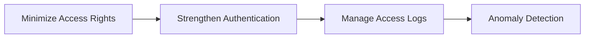

# MyData Transfer Security (MyData Transfer Security Guide, 2023.09)

## 1. Overview

### A. Definition and Background
> A guide that compiles the **safeguard standards for controlling the risks that arise when personal (credit) information is transferred between institutions at the request of the data subject** in MyData (the business of managing one's own credit information); it requires the designation of protection officers, access management, and administrative safeguards on both the sender and receiver sides.

The essence of MyData is to gather and utilize in one place my information scattered across multiple institutions, based on the **data subject's right to request transfer**. In this process, the key risk is that a large volume of sensitive personal information **constantly flows via APIs** between information providers such as banks, card companies, and telecoms and the MyData operator. Because the moment data moves is precisely the risk zone for leakage, forgery/alteration, and misdelivery, safely controlling the entire transfer path is the premise of MyData trust.

### B. Necessity
As MyData spread, the volume of transferred information and the number of participating institutions surged, creating a structure where one institution's security hole can collapse the trust of the entire ecosystem. Since the targets are **wealth-related sensitive information** such as assets, income, and credit, the damage upon leakage is direct and hard to recover from. Accordingly, through a guide that concretizes the safeguard obligations of the Credit Information Act and the Personal Information Protection Act to the MyData transfer context, the Personal Information Protection Commission unified the standards so that senders and receivers bear **the same level of protection responsibility**.

## 2. Designation of the Chief Privacy Officer (CPO) for Transferred Personal Information

Safeguards ultimately start from "who takes responsibility for management." No matter how many technical controls are in place, if there is no entity to oversee and inspect them, incident response drifts when something happens. The guide requires clearly designating a **Chief Privacy Officer (CPO)** who oversees the transfer operations so as to take charge of establishing the transfer security policy, inspecting its implementation, and overseeing breach response. Here, the CPO must have effective authority and **independence** and be able to report directly to management, because being subordinate to a business department makes it hard to resist pressure to loosen security controls for convenience.

| Item | Description |
|---|---|
| **CPO designation** | Designate a protection officer overseeing transfer operations, clarify responsibility |
| **Role** | Establish transfer security policy, inspect implementation, oversee breach response |
| **Independence** | Grant substantive authority/independence, direct-reporting line to management |

## 3. Access Management of the Personal Information Processing System for Transferred Data

The principle of access management is summarized as **"the necessary people, only as much as necessary, leaving traces."** The reason for granting the least possible privileges to the personal information processing system and separating duties (separating developers and operators, etc.) is to narrow the scope of accessible information even if one account is compromised, thereby confining the damage. On top of this, since single-factor password authentication is vulnerable to theft, **multi-factor authentication (MFA)** lowers the account-takeover risk, and all access/processing actions are **kept as access logs with forgery/alteration-prevention measures**. Access logs are not only the basis for after-the-fact tracing but also become the input for **real-time detection of anomalies** such as bulk queries in the middle of the night, cutting off incidents early. For example, if one account sends transfer requests hundreds of times its usual level, automatic blocking/alerting is designed to trigger.

| Item | Description |
|---|---|
| **Access rights** | Least privilege/separation of duties, periodic review of grant/revocation |
| **Authentication** | Secure authentication means such as multi-factor authentication, account/session management |
| **Access logs** | Retain access/processing logs and prevent forgery/alteration |
| **Control/detection** | Access control system, anomaly monitoring/automatic blocking |

## 4. Personal Information Management and Disaster/Catastrophe Preparedness

The safety of transferred data is completed only by protecting both **in transit and at rest**. The transfer segment is protected with TLS and stored data is encrypted, protecting the content even against man-in-the-middle attacks or theft of storage media. Furthermore, one places **integrity verification** that guarantees the data was not altered during transfer, and DLP-type controls that detect and block leakage attempts. Meanwhile, since MyData is a service with many institutions connected in real time, **availability itself becomes a security requirement**. If a particular institution's system halts due to a disaster, the entire transfer chain is affected, so service continuity is secured with a backup/recovery framework (BCP/DRS) and redundancy, and prompt response/reporting procedures are prepared in advance for when a breach occurs.

| Item | Description |
|---|---|
| **Encryption** | Encrypt the transfer segment (TLS) and stored data |
| **Integrity/leak prevention** | Prevent forgery/alteration of transferred data, detect/block leakage (DLP) |
| **Disaster/catastrophe preparedness** | Backup/recovery (BCP/DRS), system redundancy to secure continuity |
| **Incident response** | Establish breach response procedures/reporting framework |

## 5. Considerations and Implications (Professional Engineer's Perspective)
- **Chain of trust over the entire transfer path**: If any one of authentication, encryption, or access control is weak, the whole collapses, so secure end-to-end trust in combination with mutual-authentication (mTLS)-based API security.
- **Alignment of standard APIs and security**: One must satisfy both the MyData standard APIs (functional-conformance/security-conformance review) and this guide's safeguards, and designing access tokens with least privilege and short validity is the practical key.
- **Legal/institutional compliance**: Align with the safety-assurance measure standards of the Credit Information Act and the Personal Information Protection Act, and maintain the effectiveness of administrative controls through periodic inspection and staff training.
- **Ecosystem trust is competitiveness**: Since all participating institutions must maintain the same level of security, a certification/supervision framework that screens out weak participants is the premise for MyData's expansion.

---

> **In one line**: The MyData Transfer Security Guide requires securing the chain of trust for sensitive information transferred between institutions through *designation of a Chief Privacy Officer (CPO), access management of the processing system (least privilege/multi-factor authentication/access logs), and personal information management/disaster preparedness (encryption/integrity/backup/incident response)*.
