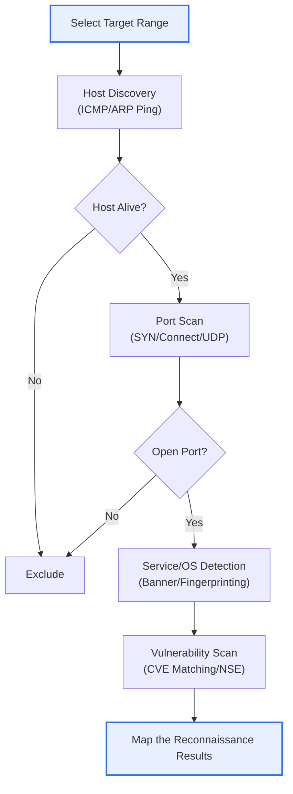
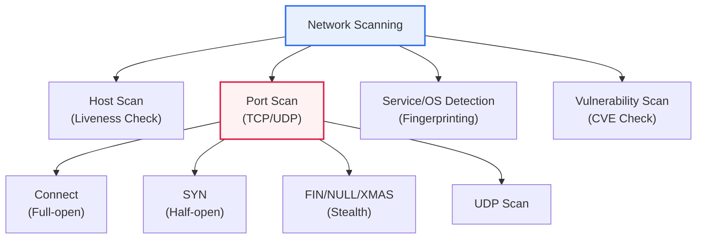

# Network Scanning

## 1. Overview

### A. Definition

> **Network Scanning** is a technology that **actively probes and collects information on hosts, ports, services, and vulnerabilities** connected to a network. It has a dual nature: for an attacker, it is a core means of pre-intrusion reconnaissance, and for a defender, a tool for asset identification and vulnerability assessment.

The reason network scanning is important in security lies in its two-sidedness as "**the first step of attack and the first step of defense**." The first of the seven stages of the Cyber Kill Chain is precisely Reconnaissance—an attacker must grasp the target's terrain before intruding. Only by sequentially determining which hosts are alive (host discovery), which ports are open (port scan), which services/OS run on those ports at which versions (service/OS fingerprinting), and whether that version has a known vulnerability (CVE) (vulnerability scan) can the actual attack (Exploitation) path be confirmed. Scanning is exactly this "map-drawing" activity.

Yet defenders use precisely the same technology. A security administrator scans their own network to find unnecessarily open ports, services started without the administrator's knowledge (Shadow IT), and unpatched vulnerable versions, and blocks them preemptively. For this reason, the representative tool **Nmap (Network Mapper)** has become an essential tool for both attackers and defenders alike, and unlike passive reconnaissance, it is **active reconnaissance** that sends packets directly to the target, thus leaving traces (logs/traffic). Therefore, from the defense perspective, one simultaneously needs ① the ability to detect and block others' scans and ② the capability to scan oneself to reduce the attack surface.

### B. Passive Reconnaissance and Active Reconnaissance

Reconnaissance is divided into **passive reconnaissance**, which gathers information using only public data (WHOIS, DNS, search engines, Shodan, etc.) without sending packets to the target, and **active reconnaissance**, which actually throws packets and observes the reaction. Network scanning falls into the latter and, in exchange for inducing a reaction, accepts the risk of detection. An attacker usually uses a two-stage strategy of narrowing the rough asset scope with passive reconnaissance, then completing a precise map with active scanning.

| Purpose | Description | Representative Techniques/Tools |
|---|---|---|
| **Host discovery** | Identify live hosts (liveness check) | Ping/ICMP, ARP scan, TCP Ping |
| **Port scan** | Identify open ports/services | SYN, Connect, UDP scan |
| **Service/OS detection** | Identify version/OS (fingerprinting) | Nmap `-sV`, `-O`, banner grabbing |
| **Vulnerability scan** | Presence of known vulnerabilities (CVE) | Nessus, OpenVAS, Nmap NSE |

## 2. The Overall Scanning Process and Types

### A. Scanning Process

Scanning is not blindly knocking on all ports but narrows down in a funnel shape of **host discovery → port scan → service/OS detection → vulnerability scan**. Efficiency and stealth both rise when you port-scan only hosts confirmed alive in the earlier stage and detect services only on ports confirmed open. For instance, port-scanning a /24 range (254 hosts) across all ports (65,535) requires about 16 million probes, but first narrowing to the 20 live machines via host discovery and looking at only the top 1,000 ports reduces it to 20,000.

### B. Classification of Scanning

**Host scan** first sifts out which IPs in the target range actually respond. Traditionally ICMP Echo (Ping) is used, but since many environments block ICMP with firewalls, in practice TCP SYN Ping (SYN sent to port 80/443), TCP ACK Ping, and UDP Ping are used together. Within the same broadcast domain, **ARP scan**, which is hard to block even with a firewall, is the most reliable. Nmap's `-sn` option is the mode that performs only host discovery without a port scan.

**Service/OS detection** sends actual probes to open ports and matches the response's characteristics (banner strings, subtle implementation differences in the TCP/IP stack) like a fingerprint to infer the software type/version and operating system. For example, if port 22 returns the banner `SSH-2.0-OpenSSH_7.4`, it is pinned to OpenSSH 7.4, and CVEs affecting that version can be looked up immediately. OS detection (`-O`) combines stack characteristics such as the initial TTL value, TCP window size, and option order to distinguish Windows/Linux families.

### C. The Principle of Port Scan Techniques

The core of a port scan lies in reverse-exploiting the operating principle of the **TCP 3-way handshake (SYN → SYN/ACK → ACK)**. An open port responds to a SYN with SYN/ACK, a closed port responds with RST, and if a firewall silently drops it there is no response at all. The port state (open/closed/filtered) is determined by reading the difference among these three reactions.

**TCP Connect (Full-open)** scan uses the OS's `connect()` system call as is to complete the handshake to the end. It can run without privileges and gives certain results, but since the connection is fully established, the connection record remains intact in the server application log and is easily detected. **SYN (Half-open)** scan sends only a SYN and, upon receiving SYN/ACK, judges "open" and then immediately sends RST instead of ACK to tear down the connection. Because it does not complete the 3-way handshake, it does not remain in many application logs and is thus called a "stealth scan"; fast and covert, it is used as Nmap's default scan (`-sS`, though administrator privileges are required).

**FIN·NULL·XMAS** scans throw abnormal flag combinations unrelated to the handshake. According to RFC 793, a closed port answers such packets with RST while an open port ignores them, so it reverse-determines "no response = open or filtered." There is room to bypass stateless simple firewalls/ACLs, but Windows families do not follow the RFC, so it often does not work. **UDP scan** is slow and ambiguous to judge because, given the connectionless nature, it may be open even with no response; it infers the state from the presence/absence of the ICMP Port Unreachable (Type 3, Code 3) a closed port returns. It is indispensable for checking important UDP services such as DNS (53), SNMP (161), and NTP (123).

| Technique | Operating Principle | Characteristics |
|---|---|---|
| **TCP Connect** | Completes 3-way handshake | Certain, no privileges needed, leaves logs |
| **SYN (Half-open)** | SYN then abort with RST | Covert, fast, default scan |
| **FIN/NULL/XMAS** | Reverse-determination via abnormal flags | Bypasses simple firewalls, ineffective on Windows |
| **UDP scan** | Presence/absence of ICMP Unreachable | Slow, ambiguous, essential for DNS/SNMP checks |

### D. Practical Scan Examples (Nmap)

In actual assessments and penetration tests, options are combined according to the purpose. Below are representative scan scenarios, where the "sweep broadly and dig narrowly" funnel strategy appears at the option level as well.

- `nmap -sn 10.0.0.0/24` — Host discovery only, without a port scan (liveness check). First narrows the range to live assets.
- `nmap -sS -p- 10.0.0.5` — SYN (Half-open) scan checking all ports (1–65535). A covert, fast default precision scan.
- `nmap -sV -sC 10.0.0.5` — Service version detection (`-sV`) + default scripts (`-sC`) to check banners and basic vulnerabilities.
- `nmap -O 10.0.0.5` — Infer OS/version from the TCP/IP stack fingerprint.
- `nmap -sU --top-ports 50 10.0.0.5` — Check major UDP ports (DNS, SNMP, NTP, etc.).
- `nmap -T2 -f -D RND:10 <target>` — Lower the speed (`-T2`) and test IDS evasion with packet fragmentation/decoys (`-D`) (penetration-test only).
- `nmap --script vuln 10.0.0.5` — Automatically check known vulnerabilities with NSE (Nmap Scripting Engine).

Thus, a scan varies its technique, speed, and evasion options according to the purpose of "what information, and how covertly." The difference that defenders prefer `-sV -sC` for asset assessment while attackers prefer `-T2 -f -D` for detection evasion becomes a clue for designing detection rules.

## 3. Detection and Response

Since scanning is active reconnaissance, it necessarily leaves traces. Representative signs include a pattern where **one source attempts connections to many ports/many hosts in a short time**, a surge of incomplete half-open connections, and abnormal-flag packets. Defense divides into an axis of detecting these signs and an axis of reducing what is visible in the first place.

First, **IDS/IPS and SIEM** detect and block scans on a threshold basis (e.g., N port connections per second) or signature basis, and firewalls block unnecessary ports at the source to reduce the very surface that would respond to a scan. Actively, one may also use **honeypots and port knocking** to lure and identify scanners. However, the fundamental countermeasure is **minimizing the attack surface**. If you turn off unused services and close ports, a scan turns up nothing. In fact, the 2017 WannaCry incident spread by mass-scanning the SMB (445) port exposed to the internet, and the point that blocking/patching port 445 alone could have prevented most of it demonstrates the importance of surface reduction.

| Response | Description |
|---|---|
| **IDS/IPS** | Detect/block scan patterns (mass connections/half-open) |
| **Firewall/ACL** | Block unnecessary ports, principle of minimal exposure |
| **Port/service minimization** | Close unused services, hardening |
| **SIEM/SOAR integration** | Log correlation analysis/automated response (playbooks) |

## 4. Deep Dive — Defensive Use and Latest Trends

Scanning is both "a threat to block" and "a security process to actively utilize." A mature organization makes scanning the core engine of **Vulnerability Management (VM)** and **Attack Surface Management (ASM)**. It regularly (e.g., weekly) auto-scans internal/external assets to gather newly opened ports, newly appearing services, and new CVE exposures into a SIEM, and automates even ticket issuance and isolation with SOAR playbooks. In cloud environments, instances are created and destroyed frequently, so a static asset ledger becomes meaningless, making **continuous scanning** and cloud-API-integrated asset discovery essential.

Attack tools are evolving too. If Nmap is the standard for precise scanning, **Masscan and ZMap** are ultra-fast scanners that sweep the entire internet (about 4.3 billion IPv4) in minutes to tens of minutes, used for surveying large-scale exposed assets. **Shodan and Censys** constantly accumulate such scan results and provide them like a search engine, and since an attacker can immediately pick out targets exposing a specific vulnerable version, a "commoditization of reconnaissance" has occurred. Defenders too are encouraged to reverse the idea and search their own organization's assets on Shodan to check for unintended exposure. Meanwhile, IPv6 proliferation makes brute-force scanning difficult because the address space is vast (2^128), but it gives rise to a new phase of targeted reconnaissance via leakage of DNS/configuration-management information.

From the perspective of past and similar exam topics, network scanning is broadly examined in connection with **the Cyber Kill Chain, penetration testing methodology, vulnerability management, IDS/IPS, and SOAR**. In an answer, rather than merely enumerating techniques, a structure that presents both the two-sidedness of "attack reconnaissance and defense assessment" and the defense strategy of surface minimization plus active use is advantageous for a high score.

## 5. Considerations and Implications

1. **Legality is an absolute prerequisite.** Performing scanning against a target without authorization may constitute a violation of the Information and Communications Network Act (intrusion/causing disruption), so it must be performed only within the scope of legitimate authority and **prior written consent (Scope of Work)**, such as penetration testing and asset assessment. Without a contract specifying the target IPs, times, and techniques, one bears legal risk even for defensive purposes.

2. **Minimizing the attack surface is the fundamental defense.** Reducing open ports and unnecessary services is more effective than detection/blocking; the approach of "removing what is visible itself" by tracking exposure-surface changes through regular self-scans and applying hardening standards (CIS Benchmark, etc.) takes priority.

3. **Utilize it actively from the defense perspective.** Continuously incorporate scanning into vulnerability management and asset management to preemptively address new CVE exposures, and link scan-detection events with SIEM/SOAR to execute an "early cutoff" strategy that breaks the kill chain at the reconnaissance stage.

4. **Consider the balance of evasion and false positives.** Since attackers evade detection with speed control (slow scans), distributed sources, and decoys, simple threshold detection is easily bypassed. Establish policies that distinguish legitimate vulnerability-scanner traffic from malicious reconnaissance (whitelisting, behavior-based analysis) to lower both false positives and false negatives.

5. **Prepare for the transition to cloud/IPv6 environments.** Dynamic assets and a vast address space reduce the effectiveness of traditional periodic scans, so the paradigm must shift to API-integrated continuous scanning and Attack Surface Management (ASM) solutions.

## 6. References

- Nmap Official Documentation (Reference Guide): https://nmap.org/book/man.html
- MITRE ATT&CK, Active Scanning (T1595): https://attack.mitre.org/techniques/T1595/
- Lockheed Martin, Cyber Kill Chain: https://www.lockheedmartin.com/en-us/capabilities/cyber/cyber-kill-chain.html
- CISA, Reducing the Significant Risk of Known Exploited Vulnerabilities: https://www.cisa.gov/known-exploited-vulnerabilities-catalog

---

> **In one line**: Network scanning is a technology that *actively probes hosts, ports, services, and vulnerabilities*, with the two-sidedness of being the first reconnaissance of attack and the first assessment of defense; it has techniques such as SYN, FIN, and UDP that reverse-exploit the 3-way handshake, and *attack-surface minimization, IDS/IPS detection, SIEM/SOAR integration, and legal execution* are the core of defense.
