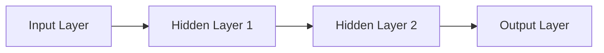
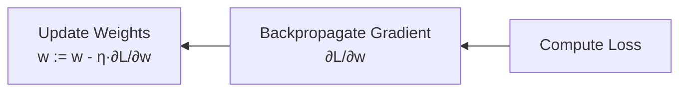

# Artificial Neural Network

## 1. Overview

### A. Definition
> A model that imitates the neuron structure of the human brain by connecting, in layers, nodes that **apply an activation function to the weighted sum of inputs**, and **learns the weights** to recognize and predict patterns. It is the foundation of deep learning.

The core insight of artificial neural networks is that "**a complex function is approximated by stacking simple computational units (neurons) in layers**." A single neuron performs only the simple operation of multiplying inputs by weights, summing, and passing through an activation function, but stacking such neurons in multiple layers can approximate any continuous function to a desired precision (the universal approximation theorem). Rather than a human hand-crafting rules one by one, **having the model find rules on its own by adjusting weights from data** is the fundamental difference from conventional programming.

### B. Components and Their Roles

A neural network consists of an input layer, hidden layers, and an output layer, each with a different role. The **input layer** is the gateway that takes in features, and the **hidden layers** transform the input nonlinearly, creating increasingly abstract representations. This is why the deeper the layers (= the more hidden layers), the greater the expressive power, and it is the basis for the name "deep" learning. The **output layer** produces the final prediction. Each neuron computes the weighted sum `z = Σwᵢxᵢ + b` and then applies the activation function `f(z)`, and at this point **if the activation function is not nonlinear, no matter how many layers are stacked, they collapse into a single linear transformation**. In other words, a nonlinear activation function is the key that actually brings the expressive power of a deep structure to life.

| Component | Role |
|---|---|
| Neuron (node) | Compute weighted sum z=Σwᵢxᵢ+b then activate |
| Weight (w)/bias (b) | Parameters adjusted through learning |
| Input layer | Feature input |
| Hidden layer | Nonlinear feature extraction/transformation (depth = expressive power) |
| Output layer | Produce prediction (classification/regression) |
| Activation function | Impart nonlinearity (without it, identical to a linear model) |

## 2. Feedforward Neural Network (FFNN)

> A basic neural network (MLP) in which the signal propagates in only one direction, **input→hidden→output**, with no cycles.

FFNN is the basic form of **inference (forward propagation)** that performs prediction. Since there are no cycles, computation flows through in layer order in one pass, and at each layer the previous layer's output is received as input, repeating the weighted sum and activation. The procedure is: ① compute the weighted sum `z = Wx + b` at each layer, ② apply the activation function `a = f(z)`, ③ pass the result as input to the next layer, and ④ produce the final prediction at the output layer. For example, when a handwritten-digit image is input, the hidden layers progressively combine features such as strokes and curves, and the output layer produces the probability of each digit 0–9. Here no learning has yet occurred; forward propagation is the stage of "**producing an answer with the current weights**."

## 3. Backpropagation

> A learning algorithm that **backpropagates the output error (Loss) in the output→input direction** and uses the **chain rule** to obtain the gradient of each weight, then updates via gradient descent.

The essence of learning is "**shifting weights little by little in the direction that reduces the error**," and to do so one must know how much each weight contributed to the error (∂L/∂w). The problem is that computing the gradients of millions of weights one by one causes the cost to explode. Backpropagation uses the **chain rule** to send the error signal computed at the output layer back toward the input, **reusing and propagating** the per-layer gradients, thereby obtaining them efficiently in a single backward pass. The procedure is: forward propagation to predict → compute loss (MSE/cross-entropy) → backpropagate the error to obtain per-layer gradients → update via gradient descent `w := w - η·∂L/∂w`, repeated in epoch units. If the learning rate η is too large it diverges, and if too small learning is slow, so an appropriate setting is important.

| Procedure | Description |
|---|---|
| 1. Forward propagation | Compute prediction with current weights |
| 2. Compute loss | Loss(prediction, ground truth) — MSE/Cross-Entropy |
| 3. Backpropagate error | Obtain per-layer gradient via the chain rule |
| 4. Update weights | Adjust via gradient descent (η: learning rate), repeat epochs |

In deep networks, the gradient is continuously multiplied as it passes through layers, causing it to **vanish toward 0 or explode**. Vanishing is a cause of learning stalling; ReLU, which passes the gradient through as is, batch normalization, which stabilizes the layer-input distribution, and residual connections (ResNet), which let the signal skip layers, greatly mitigated this. Only with the advent of these techniques did training of very deep neural networks become practical.

## 4. Types of Activation Functions

Activation functions do more than merely inject nonlinearity; they directly affect **gradient vanishing, computational load, and output interpretation**. Sigmoid squashes the output to 0–1, which is good for interpretation as a probability, but its gradient approaches 0 at both ends, causing vanishing in deep networks. So the mainstay of hidden layers has become **ReLU**, which is simple to compute and keeps a gradient of 1 in the positive region. However, ReLU has the drawback of neurons dying (Dying ReLU) on negative input, which Leaky ReLU and ELU supplement, and transformer-family models favor the smooth GELU. In the output layer, multi-class classification uses **Softmax**, which turns several values into a probability distribution summing to 1. That is, "hidden layer = ReLU family, multi-class output layer = Softmax" is the typical combination.

| Function | Output Range | Characteristics/Use |
|---|---|---|
| Sigmoid | 0~1 | Probability interpretation, gradient vanishing |
| Tanh | -1~1 | Zero-centered, vanishing remains |
| ReLU | 0~∞ | Simple/fast to compute, hidden-layer mainstay |
| Leaky ReLU/ELU | Allows negatives | Mitigates Dying ReLU |
| GELU | ≈ReLU (smooth) | Used in transformers |
| Softmax | Sum=1 | Multi-class probability output (output layer) |

## 5. Considerations and Implications
- **Overfitting management**: With many parameters, it easily memorizes the training data, so generalization performance is secured with dropout, which randomly turns off neurons, regularization, which constrains weight magnitude, and data augmentation.
- **Specialization of architecture**: It evolved into CNN for spatial patterns (images), RNN/LSTM for order/time series, and attention-based **Transformer** for long-range context. Choosing an architecture suited to the problem structure governs performance.
- **The foundation of AI**: Today's generative AI and LLMs also ultimately stand on large-scale neural networks and backpropagation learning, so the basic principles of neural networks are the starting point for understanding the latest AI.

---

> **In one line**: An artificial neural network is a model that approximates complex functions by *stacking neurons of weighted sum + nonlinear activation in layers*; FFNN predicts in the forward direction and backpropagation efficiently obtains the error gradient via the chain rule to update the weights, and the choice of activation function such as ReLU and Softmax governs learning stability and performance.
